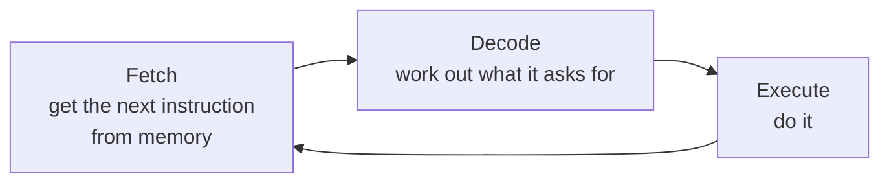
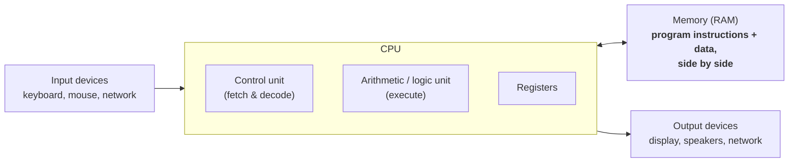

# 0.1 What is a computer, really

Every mysterious thing a computer seems to do — recognising your face,
streaming a film, running the code in this book — reduces to one machine
repeating one tiny cycle at unimaginable speed. Once you can picture that
machine, programming stops being magic and becomes engineering: you are
writing instructions for a device you understand. This section gives you
that picture.

## The parts you can point to

Open up any computer — laptop, phone, games console — and you find the same
four kinds of hardware. **Hardware** means the physical parts you could
touch; **software** means the instructions that run on them.

| Part | What it is | What it does |
| --- | --- | --- |
| **CPU** (central processing unit) | A chip the size of a fingernail | Executes instructions: arithmetic, comparisons, moving data around |
| **RAM** (random-access memory, or just *memory*) | Chips that hold data *while the power is on* | The CPU's short-term workspace — fast, but forgets everything at power-off |
| **Storage** (SSD or hard disk) | A drive that keeps data *without power* | Long-term filing cabinet: your files, apps, and the operating system |
| **Input / output (I/O)** | Keyboard, mouse, touchscreen, display, speakers, network | How data gets in and results get out |

The word *memory* deserves a closer look, because it is where beginners get
tripped up by everyday language. RAM is organised as a huge row of numbered
cells, each holding one **byte** (a small unit of data we will define
precisely in [section 0.2](02-binary.md)). The number of a cell is called
its **address**.

When the CPU wants a value, it asks for it *by address* — "give me whatever
is in cell 4,982,113" — the way you would ask for a hotel room by its
number, not by describing the guest.

We can model that idea in Python right now. A Python **list** is a numbered
sequence of slots, so it makes a fine miniature RAM:

```python
memory = [0] * 8       # a tiny "RAM" with 8 cells, all starting at 0
memory[0] = 42         # store 42 at address 0
memory[3] = 7          # store 7 at address 3

for address in range(8):
    print(f"address {address}: {memory[address]}")
```

Run it. Each line of output is one cell: its address on the left, its
contents on the right. Real RAM works the same way, just with billions of
cells instead of eight. Notice that addresses start at 0, not 1 — a
convention you will meet constantly in programming.

## The CPU's heartbeat: fetch, decode, execute

The CPU cannot "read a program" the way you read a page. It knows only a
fixed menu of primitive **instructions** — add two numbers, copy a value,
compare, jump to another instruction — and it processes them one at a time
in a loop called the **fetch–decode–execute cycle**:



1. **Fetch** — read the next instruction from memory. A special counter
   inside the CPU, the **program counter**, remembers which address is next.
2. **Decode** — figure out which operation the instruction encodes and what
   data it needs.
3. **Execute** — actually do it, often storing the result in a **register**:
   one of a handful of ultra-fast storage slots built directly into the CPU.

Then it fetches the next instruction, and the next, billions of times per
second. A "3 GHz" processor ticks through roughly three billion cycles every
second.

The best way to believe this is to *build* a toy CPU. The program below is a
list of instructions; the loop plays the role of the CPU, fetching one
instruction at a time and executing it:

```python
# A toy CPU with one register (the "accumulator") and four instructions
program = [
    ("LOAD", 5),        # put 5 into the accumulator
    ("ADD", 3),         # add 3 to it
    ("ADD", 10),        # add 10 more
    ("PRINT", None),    # display the accumulator
]

accumulator = 0         # a register: one tiny, ultra-fast storage slot
pc = 0                  # the program counter: which instruction is next

while pc < len(program):
    op, arg = program[pc]        # FETCH the instruction at address pc
    if op == "LOAD":             # DECODE which operation it is ...
        accumulator = arg        # ... and EXECUTE it
    elif op == "ADD":
        accumulator += arg
    elif op == "PRINT":
        print("accumulator =", accumulator)
    pc += 1                      # advance to the next instruction

print("program finished")
```

The output is `accumulator = 18` — the machine loaded 5, added 3, added 10,
and printed the result, exactly one instruction per trip around the loop.
Real CPUs differ only in scale: more registers, hundreds of instruction
types, and billions of cycles per second instead of four.

## The von Neumann architecture: a program is data too

Look again at the toy CPU. The `program` is just a Python list — *data*,
sitting in memory next to the `accumulator` and `pc` variables. That is not
a shortcut we took; it is the single most important idea in computer
design, proposed in the 1940s and named after the mathematician John von
Neumann. In a **von Neumann machine**, instructions and data live in the
*same* memory, and the CPU fetches both from it:



Because a stored program is just bytes in memory, programs can be loaded,
copied, saved to disk — and even *inspected or changed* by other programs.
Every tool you will ever use rests on this:

- an **editor** treats your program as text data;
- a **compiler** reads it as input and writes another file out;
- an **operating system** loads it into RAM like any other file.

Watch it happen to our toy program:

```python
program = [("LOAD", 2), ("ADD", 40), ("PRINT", None)]

print("the program has", len(program), "instructions")
print("instruction 1 is:", program[1])

program[1] = ("ADD", 5)          # edit the program like any other data
print("after editing:", program)
```

We just measured a program's length and rewrote one of its instructions,
using ordinary data operations. *A program is data too.*

## RAM versus storage: fast and forgetful, slow and permanent

Beginners often say "my laptop has 512 GB of memory" when they mean
*storage*. The distinction matters because the two behave completely
differently:

- **RAM is volatile**: it needs power to hold its contents. Pull the plug
  and everything in RAM vanishes. That is why unsaved work is lost in a
  power cut — it existed only in RAM.
- **Storage is persistent**: an SSD or hard disk keeps its contents with
  the power off. "Saving a file" means copying data from RAM to storage.

!!! note "The consequence for every program you write"
    While a program runs, its variables live in RAM. To keep anything beyond
    the end of the program, you must write it to a file.

Python can show the contrast (this page's runner has its own miniature file
system, so this is safe to play with):

```python
message = "kept in RAM"              # a variable: lives in memory only

with open("note.txt", "w") as f:     # write to "storage"
    f.write("kept in storage")

with open("note.txt") as f:          # read it back
    print(f.read())

print(message)
```

When this program ends, `message` is gone — but `note.txt` would still be
there for the next program to read. (Files get a whole chapter of their own:
[Chapter 11](../ch11-files/index.md).)

## The speed hierarchy: why distance costs time

Registers, RAM, and storage form a **memory hierarchy**: each level is
bigger and cheaper than the one above, but dramatically slower. Between the
registers and RAM sits **cache** — a small amount of very fast memory on the
CPU chip that keeps copies of recently used data.

The gaps are hard to grasp in nanoseconds (a **nanosecond**, ns, is one
billionth of a second), so let's slow time down: pretend one nanosecond
lasts one second. Then:

| Level | Real access time (rough) | In slowed-down time | Feels like |
| --- | --- | --- | --- |
| Register | ~1 ns | 1 second | a number already in your head |
| CPU cache | ~1–10 ns | seconds | a note on your desk |
| RAM | ~100 ns | a couple of minutes | walking to a bookshelf across the room |
| SSD | ~100 000 ns (0.1 ms) | about a day | driving to a library in the next town |
| Hard disk | ~10 000 000 ns (10 ms) | months | ordering a book from overseas |
| Internet round trip | ~100 ms | years | exchanging letters with a pen pal |

These numbers are rough, but the *shape* is universal: each step down is
orders of magnitude slower, which is why so much of computing — and later
chapters of this book — is about keeping the data you need close to the CPU.

You can measure your own machine right now. A million additions sounds like
a lot; let's time it:

```python
import time

n = 1_000_000
start = time.perf_counter()      # a high-precision stopwatch

total = 0
for i in range(n):
    total += 1                   # one addition, a million times

elapsed = time.perf_counter() - start
print(f"{n:,} additions took {elapsed:.3f} seconds")
print(f"about {elapsed / n * 1e9:.0f} nanoseconds per addition")
```

A million of *anything*, done in a blink. Notice, though, that one addition
takes far longer than the single nanosecond the table promises for raw CPU
work. That is because each trip around a Python loop triggers many machine
instructions behind the scenes — Python trades some speed for enormous
convenience, a bargain we examine in
[section 0.3](03-programs.md).

## How big is a value?

One last question for the tour: how much memory does a single value occupy?
Python can tell us, with `sys.getsizeof` (the `sys` module gives access to
Python's own internals — `import` just makes a module's tools available):

```python
import sys

for value in [0, 1, 2 ** 30, 2 ** 1000, 3.14, "", "a", "hello"]:
    label = repr(value)
    if len(label) > 12:
        label = label[:9] + "..."
    print(f"{label:>12}  takes  {sys.getsizeof(value):>4} bytes")
```

Exact numbers vary between machines and Python builds, but two patterns
should jump out:

- **Even the humble `0` costs far more than the byte or two you might
  expect.** A Python value is a full object carrying bookkeeping information
  (its type, a reference count), not a bare number in a memory cell.
- **Bigger values take more room.** A 1000-bit number needs more bytes than
  `1`, and `"hello"` more than `"a"`.

Memory is real, finite, and measurable — a fact that becomes very practical
from [Chapter 9](../ch09-collections/index.md) onwards.

!!! warning "Common mistakes"

    - **Confusing RAM with storage.** "512 GB of memory" on a spec sheet
      almost always means *storage*. RAM is the small, fast, forgetful one
      (typically 8–32 GB); storage is the big, slow, permanent one.
    - **Thinking the CPU understands Python.** It does not. The CPU knows
      only its own primitive machine instructions; Python code must be
      translated and orchestrated by other software (section 0.3).
    - **Assuming saved = safe the moment you type.** Until a program writes
      to storage, your data exists only in volatile RAM.
    - **Believing a faster clock alone means a faster computer.** Cycles per
      second matter, but so do cache sizes, memory speed, and — above all —
      how much work the software asks for. A better algorithm routinely
      beats a faster chip.

## Check your understanding

1. A power cut hits while you are typing an essay you have never saved.
   What survives, and why?

    ??? success "Answer"
        Nothing of the essay survives. The text existed only in RAM, which
        is volatile — it loses its contents without power. Only data that
        had been written to storage (an SSD or disk) would remain.

2. Put these in order from fastest to slowest: RAM, registers, SSD, cache.

    ??? success "Answer"
        Registers → cache → RAM → SSD. Each level is roughly one or more
        orders of magnitude slower than the previous one, and bigger.

3. In the toy CPU example, what is the job of the variable `pc`, and what
   is its real-world counterpart?

    ??? success "Answer"
        `pc` holds the position of the *next* instruction to run, and the
        loop increases it after every instruction. It plays the role of the
        CPU's program counter, the register that tracks where in memory the
        next instruction lives.

4. The timing demo measured far more than one nanosecond per addition, yet
   a CPU cycle takes about a nanosecond. What explains the gap?

    ??? success "Answer"
        Each Python addition triggers many machine-level instructions: the
        interpreter must fetch the next piece of bytecode, look up the
        variables, check their types, create the result object, and so on.
        The CPU is running at full speed — it is simply doing much more
        than one addition's worth of work per loop iteration.
