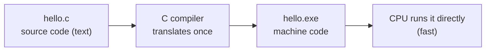
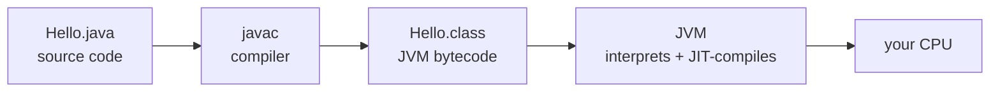
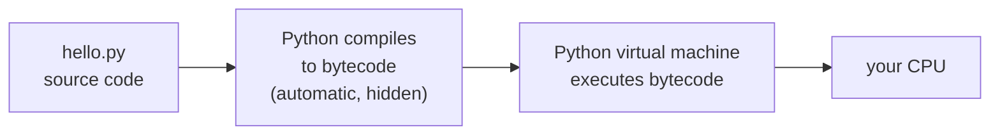

# 0.3 What is a program — compilers and interpreters

You now know two facts that do not obviously fit together: the CPU executes
only primitive machine instructions encoded as bits, and yet you write
programs as human-readable text. Something has to bridge that gap, and *how*
it is bridged is the main practical difference between languages like C,
Java, and Python. Understanding the bridge tells you what actually happens
when you press Run, what error messages are really saying, and why your Java
course makes you "compile" while Python seems to just go.

## What is a program?

A **program** is a precise, ordered list of instructions for a computer.
The text you write is called **source code** — it is written in a
**programming language**, a notation designed to be readable by humans but
strict enough to translate mechanically. Here is a complete program, three
lines long:

```python
price = 4.50                 # remember a value under the name "price"
total = price * 3            # compute with it
print("3 coffees cost", total)
```

Run it. Three instructions, executed top to bottom, one result. Two things
distinguish this from a recipe for a human cook. First, the vocabulary and
grammar are fixed and tiny — you cannot improvise. Second, the machine
follows instructions *exactly* and *literally*: it never guesses what you
meant, only what you wrote. Most of learning to program is learning to say
precisely what you mean in this small language.

But the CPU cannot execute this text. Its native language — **machine
code** — is patterns of bits encoding its primitive instructions, and every
CPU family (Intel/AMD's x86, Apple's and phones' ARM) has a different one.
Source code must be translated. There are two broad strategies.

## Two strategies: compile ahead of time, or interpret as you go

A **compiler** translates your entire source file into machine code *ahead
of time*, producing an executable file you can run again and again — or
hand to someone who has never installed the compiler. The classic compiled
language is C:



Compilation takes time up front, and the result is tied to one CPU family
and operating system — but the finished program runs at full hardware
speed, with no translator present at run time.

An **interpreter** takes the opposite approach: it is a program that reads
your source code and *performs* it, effect by effect, while it reads. No
executable file is produced; to run the program anywhere, you need the
interpreter installed there. Translation work happens at run time, which
costs speed — but you can change a line and re-run instantly.

The two big languages of this handbook each mix these strategies, in
different proportions. **Java compiles in two stages.** The compiler
(`javac`) does *not* produce machine code for your CPU. It produces
**bytecode** — machine code for an imaginary, standardised computer called
the **Java Virtual Machine** (JVM). A separate program (`java`) then
*simulates* that imaginary computer on your real one, executing the
bytecode (and re-compiling the busiest parts to real machine code on the
fly, a trick called *just-in-time compilation*):



The payoff is portability: one `.class` file runs on any machine with a
JVM — Windows, Mac, a phone — because the bytecode targets the imaginary
machine, and only the JVM needs porting.

**Python interprets — but compiles quietly first.** When you run a `.py`
file, the Python interpreter first compiles it to *its own* bytecode (for
the Python Virtual Machine), then immediately executes that bytecode. You
never see a compile step; both stages happen inside one command, every run:



The hidden compile step is easy to prove. Python checks the *grammar* of
the whole file before running any of it — so a program with a syntax error
on line 2 prints nothing at all, not even line 1:

```python
# raises SyntaxError
print("this line is fine, but you will never see its output")
3 = x        # you cannot assign a value to the number 3
```

Run it: no output, just a `SyntaxError`. If Python truly read one line at a
time with no look-ahead, line 1 would have printed first. (Errors that
happen *while running* — like dividing by zero — behave differently: they
do stop the program mid-way. [Chapter 10](../ch10-exceptions/index.md)
sorts these out properly.)

## Two ways of working: edit–compile–run vs edit–run

These designs shape the rhythm of your daily work. In a compiled language
like C or Java you live in the **edit–compile–run loop**: change the source,
recompile, then run the result. In Python the compile step is invisible, so
the loop tightens to **edit–run**:

=== "Python"

    ```python
    # hello.py — run directly; compilation happens invisibly
    name = "world"
    print("Hello, " + name + "!")
    ```

    ```console
    $ python hello.py
    Hello, world!
    ```

=== "Java"

    ```java
    // Hello.java — must be compiled before it can run
    public class Hello {
        public static void main(String[] args) {
            String name = "world";
            System.out.println("Hello, " + name + "!");
        }
    }
    ```

    ```console
    $ javac Hello.java     # stage 1: compile to Hello.class
    $ java Hello           # stage 2: the JVM runs the bytecode
    Hello, world!
    ```

Neither rhythm is "better". The compiler's up-front pass catches whole
categories of mistakes before the program ever runs, and compiled programs
are typically much faster; the interpreter's instant feedback makes
experimenting frictionless. This book leans on that instant feedback
constantly — every Run button on these pages is an edit–run loop. Try it:
change `3` to `10` below and run again.

```python
cups = 3                     # edit me, then press Run again
print("cups:", cups)
print("refills needed:", cups - 1)
```

## Peeking at Python's bytecode

You do not have to take the hidden bytecode on faith. The standard-library
module `dis` (for *disassemble*) shows the bytecode Python compiled for any
function:

```python
import dis

def add_and_double(x, y):
    total = x + y
    return total * 2

dis.dis(add_and_double)
```

The exact listing varies between Python versions, but you will see
instructions like `LOAD_FAST x` and `LOAD_FAST y` (fetch the two variables),
a `BINARY_OP +` (add them), `STORE_FAST total`, then loads, a `BINARY_OP *`,
and `RETURN_VALUE`. Look familiar? It is the toy CPU from
[section 0.1](01-hardware.md) writ large: small numbered instructions,
executed one at a time by a fetch–decode–execute loop — except here the
"CPU" is the Python Virtual Machine, itself a program running on the real
CPU. Machines all the way down.

## Tracing a program by hand

The single most useful skill this chapter can leave you with is **tracing**:
executing a program in your head, line by line, keeping a written table of
every variable — exactly what the machine does, at human speed. Trace this
six-line program before running it:

```text
1   a = 4
2   b = 7
3   total = a + b
4   a = a * 2
5   message = "total is " + str(total)
6   print(message, a)
```

We track the variables after each line (`—` means "does not exist yet";
`str(total)` converts the number to text so it can be glued to the string):

| after line | `a` | `b` | `total` | `message` |
| --- | --- | --- | --- | --- |
| 1 | 4 | — | — | — |
| 2 | 4 | 7 | — | — |
| 3 | 4 | 7 | 11 | — |
| 4 | **8** | 7 | 11 | — |
| 5 | 8 | 7 | 11 | `"total is 11"` |
| 6 | prints: `total is 11 8` | | | |

Two details deserve attention. Line 4 *replaces* `a`: a variable holds only
its latest value, and the old 4 is gone. And `total` stays 11 even after
`a` changes — line 3 stored the *result* of `a + b`, not the formula;
nothing gets recomputed later. Now confirm the trace:

```python
a = 4
b = 7
total = a + b
a = a * 2
message = "total is " + str(total)
print(message, a)
```

If your table matches the output, you just did — slowly and perfectly — what
the machine does quickly. Predict-then-run is how you will check your
understanding throughout this book, starting with the
[exercises](exercises.md).

!!! warning "Common mistakes"

    - **"Python doesn't compile."** It does — to bytecode, automatically,
      every run. That is why a syntax error anywhere stops the whole file
      from producing any output.
    - **Expecting the machine to infer intent.** Source code is not read
      "as a whole" for meaning; it is executed step by step, and order
      matters. `total = a + b` before `b` exists is an error, not a promise
      to be filled in later.
    - **Confusing Java's two stages.** `javac` compiles source to bytecode;
      `java` runs the bytecode on the JVM. Editing `Hello.java` changes
      nothing about how the program runs until you recompile.
    - **Tracing with formulas instead of values.** In your trace table,
      write what each variable *is* (`11`), never what it *was computed
      from* (`a + b`). Variables store results, not relationships.

## Check your understanding

1. In one sentence each: what does a compiler do, and what does an
   interpreter do?

    ??? success "Answer"
        A compiler translates the whole source program into another form
        (machine code or bytecode) ahead of time, producing a file to run
        later; an interpreter reads the program and carries out its
        instructions immediately, translating as it goes.

2. Java is often described as "compiled *and* interpreted". What are the
   two stages, and what runs on your actual CPU?

    ??? success "Answer"
        Stage 1: `javac` compiles `.java` source into `.class` bytecode for
        the Java Virtual Machine. Stage 2: the `java` program (the JVM)
        executes that bytecode, interpreting it and JIT-compiling hot parts.
        What runs on the real CPU is the JVM itself (plus the machine code
        it generates) — never your `.java` text directly.

3. A Python file has a syntax error on its last line. Do the earlier lines
   run before the error appears? Why?

    ??? success "Answer"
        No. Python compiles the entire file to bytecode before executing
        any of it, and compilation fails on the syntax error — so no line
        ever runs and nothing is printed.

4. Trace this program by hand, then state what it prints:
   `x = 3`, then `y = x + 2`, then `x = y * x`, then `print(x, y)`.

    ??? success "Answer"
        After `x = 3`: x is 3. After `y = x + 2`: y is 5. After
        `x = y * x`: x is $5 \times 3 = 15$ (y stays 5). It prints `15 5`.
