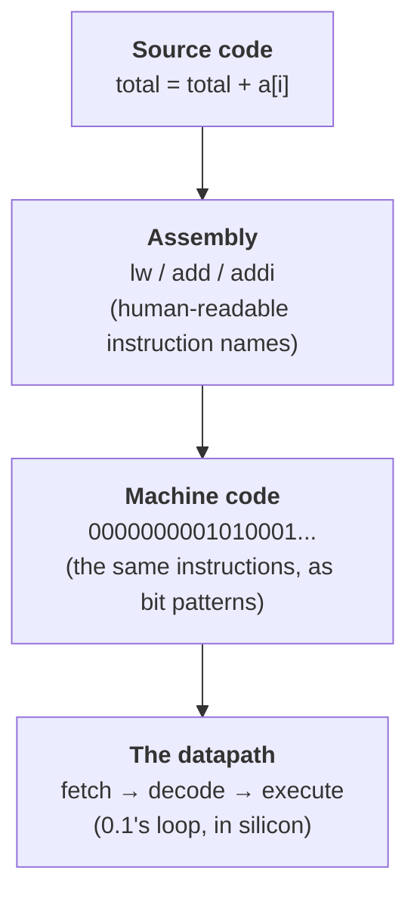

# 0.4 From code to machine instructions

You now know that the CPU runs a fetch–decode–execute loop
([0.1](01-hardware.md)), that everything is bits ([0.2](02-binary.md)), and
that your source code is translated before it runs ([0.3](03-programs.md)).
This section closes the gap those three leave open: *what, exactly, is the
CPU fetching and executing?* The answer is the most important idea in this
chapter — a program, in any language, is ultimately ground down into a long
list of tiny numbered orders that the hardware carries out one at a time. By
the end you will have decoded one of those orders by hand and **run a working
CPU in your browser**.

## The CPU's tiny vocabulary

!!! abstract "In plain words"

    - **What it is.** A CPU understands only a small, fixed set of extremely
      simple orders — its **instruction set** — and every program is
      eventually rewritten as a long list of them.
    - **Picture it.** A line cook who can *only* follow atomic steps: "fetch a
      bowl", "add two cups of flour", "stir once", "check if the timer hit
      zero". No single step is clever. A soufflé is just thousands of those
      steps in the right order.
    - **Why it matters.** It demystifies everything above it. Python, Java, a
      video game, a browser — all of them become the same alphabet of tiny
      orders before the hardware will touch them.

The set of orders a particular CPU understands is called its **instruction
set architecture** (ISA). It is genuinely small: a few kinds of arithmetic,
a way to move data between memory and the CPU, and a way to make decisions
and repeat. Each individual order is called a **machine instruction**, and
it does almost nothing on its own — add two numbers, copy one value, compare
two values and maybe jump. The power comes entirely from stringing millions
of them together, billions of times per second.

Different CPU families speak different instruction sets — Intel and AMD chips
use **x86**, phones and Apple's machines use **ARM**, and the ISA this book
uses to teach is **RISC-V**, a clean, modern, open design that is also the
teaching standard in Patterson & Hennessy's textbook (see the note at the end
of this section). The *ideas* are the same across all of them.

## A machine instruction is just a number

Here is the pivot the whole chapter has been building toward. Back in
[0.1](01-hardware.md) you met the **von Neumann idea**: instructions and data
live in the *same* memory. And in [0.2](02-binary.md) you learned that memory
holds nothing but bit patterns. Put those together and you get the
**stored-program** principle:

> A machine instruction is a bit pattern — a number — stored in memory,
> exactly like a piece of data.

The CPU fetches a number, treats it as an order, does what it says, and moves
on. There is no separate "instruction memory" with a special format; an
instruction is a number, and the only thing that makes it an *instruction* is
that the program counter happened to point at it. Watch how ordinary that
makes it look:

```python
# The number below is a real RISC-V machine instruction (we build it in the
# next section). But it is just an integer, so it fits in a memory cell like
# any other data -- the CPU can't tell instructions from data by looking.
memory = [0, 0, 0, 0]
memory[0] = 5308563          # an "add 5" instruction, encoded as a number
memory[1] = 42               # an ordinary data value
print("memory[0] =", memory[0], "  <- the CPU will run this as an instruction")
print("memory[1] =", memory[1], "  <- the CPU will use this as data")
print("both are just numbers:", type(memory[0]) is type(memory[1]))
```

The output confirms it: `5308563` and `42` are both just integers in cells.
The number `5308563` becomes an instruction *only* because the CPU fetches it
as one. This is why "a program is data too" from [0.1](01-hardware.md) is not
a slogan but a literal fact of the hardware — and it is what lets a compiler
write a program to a file, and an operating system load it back.

An instruction written as a raw number is unreadable to humans, so we give
each pattern a short name. That human-readable form is **assembly language** —
one line of assembly per machine instruction, a name instead of a number.
Assembly and machine code are the *same instructions*: one is for people, one
is for the silicon.

## A quick tour of a RISC-V instruction set

The CPU has a handful of **registers** — ultra-fast storage slots built right
into the chip, the fastest level of the memory hierarchy from
[0.1](01-hardware.md). RISC-V names them `x0`, `x1`, `x2`, and so on. Almost
every instruction does its work *on registers*; separate load and store
instructions shuttle values between registers and the much larger, slower
RAM. That "compute in registers, move to and from memory explicitly" style is
what the *R* in RISC (Reduced Instruction Set Computer) is about.

Here is a taste of the instruction set — not a manual, just enough to read a
program. These are assembly lines; each stands for one machine-code number.

**Arithmetic** (register in, register out):

```text
add  x3, x1, x2     # x3 = x1 + x2      (add two registers)
sub  x3, x1, x2     # x3 = x1 - x2      (subtract)
addi x3, x1, 5      # x3 = x1 + 5       (add an immediate -- a constant baked
                    #                    into the instruction itself)
```

**Load and store** (the only way to touch RAM):

```text
lw   x3, 0(x1)      # load  word: x3 = memory[ x1 + 0 ]
sw   x3, 0(x1)      # store word: memory[ x1 + 0 ] = x3
```

**Branch and jump** (how a program makes decisions and loops):

```text
beq  x1, x2, LABEL  # branch if equal:      if x1 == x2, jump to LABEL
bne  x1, x2, LABEL  # branch if not equal:  if x1 != x2, jump to LABEL
blt  x1, x2, LABEL  # branch if less than:  if x1 <  x2, jump to LABEL
jal  x1, LABEL      # jump to LABEL (and remember where we came from)
```

That is roughly ten instructions, and it is already enough to express *any*
computation — arithmetic to do the work, loads and stores to reach memory,
and branches to choose and repeat. A real ISA has more (multiply, divide,
bit-shifts, floating point), but they are conveniences, not new powers.

| Instruction kind | Example | Plain meaning |
| --- | --- | --- |
| Arithmetic | `add x3, x1, x2` | put `x1 + x2` into `x3` |
| Immediate arithmetic | `addi x3, x1, 5` | put `x1 + 5` into `x3` |
| Load | `lw x3, 0(x1)` | copy a word from RAM into `x3` |
| Store | `sw x3, 0(x1)` | copy `x3` out to RAM |
| Branch | `bne x1, x2, LABEL` | jump *only if* `x1 != x2` |
| Jump | `jal x1, LABEL` | jump to `LABEL` unconditionally |

## The compile ladder: one line of code, all the way down

A single line of a high-level language usually turns into *several* machine
instructions. Suppose a loop contains this line, adding an array element to a
running total:

```text
total = total + a[i]
```

The compiler cannot do that in one machine order, because the CPU can only
compute on registers and must reach memory explicitly. So it emits a short
sequence like:

```text
lw   x5, 0(x10)     # load a[i] from memory into register x5
add  x6, x6, x5     # total (kept in x6) += that value
addi x10, x10, 4    # advance the array pointer to the next element
```

That is the **compile ladder** — the chain of layers your code descends
before the hardware runs it:



You have already seen the *interpreted* version of this ladder one level up:
[0.3's `dis` demo](03-programs.md) disassembled a Python function into
bytecode instructions like `LOAD_FAST` and `BINARY_OP`. Bytecode is machine
code for an imaginary CPU (the Python Virtual Machine); the RISC-V code here
is machine code for a real one. Same idea, different target.

### Decoding one instruction into its fields

The bottom two rungs — assembly and machine code — are the same instruction
in two costumes. Let us prove it by building one real RISC-V instruction as a
number and taking it apart again. We will use `addi x1, x2, 5` ("put `x2 + 5`
into `x1`"). RISC-V packs this "I-type" instruction into exactly 32 bits, cut
into five labelled fields:

| bits | 31 … 20 | 19 … 15 | 14 … 12 | 11 … 7 | 6 … 0 |
| --- | --- | --- | --- | --- | --- |
| field | `imm` (12) | `rs1` (5) | `funct3` (3) | `rd` (5) | `opcode` (7) |
| meaning | the constant | source register | which operation | destination | instruction family |

`opcode` and `funct3` together say *what* to do; `rd`, `rs1`, and `imm` say
*what to do it with*. Packing and unpacking those fields is pure bit
arithmetic — shifts and masks, the tools from [0.2](02-binary.md):

```python
# Encode one real RISC-V instruction -- addi x1, x2, 5 -- as a 32-bit number,
# then decode it back into its fields. addi is an "I-type" instruction.
opcode = 0b0010011      # 7 bits: the OP-IMM family (addi lives here)
rd     = 1              # 5 bits: destination register, x1
funct3 = 0b000          # 3 bits: which OP-IMM operation (000 = add)
rs1    = 2              # 5 bits: source register, x2
imm    = 5              # 12 bits: the immediate constant

# Pack each field into its bit position (the RISC-V I-type layout):
word = (imm << 20) | (rs1 << 15) | (funct3 << 12) | (rd << 7) | opcode

print("the instruction as a number:", word)
print("in hex   :", hex(word))
print("in binary:", format(word, "032b"))   # 32 bits, zero-padded

# Pull the fields back out with shifts and masks -- exactly what the CPU's
# decode step does in hardware:
print("opcode :", format(word & 0x7F, "07b"))
print("rd     : x%d" % ((word >> 7) & 0x1F))
print("funct3 :", format((word >> 12) & 0x7, "03b"))
print("rs1    : x%d" % ((word >> 15) & 0x1F))
print("imm    :", (word >> 20) & 0xFFF)
```

The instruction `addi x1, x2, 5` *is* the number `5308563` — `0x510093`, or
in binary `00000000010100010000000010010011`. Read from the right, the last
seven bits `0010011` are the opcode, the next five are `x1`, and so on. When
the CPU decodes this instruction, it does exactly what the second half of the
block does: mask off each field with an `& ` and shift it down. **Decode is
not a metaphor — it is these masks and shifts, done in hardware.** This is
the number `5308563` you dropped into `memory[0]` two sections ago; now you
can see the "add 5" hiding inside it.

Naming the four layers of the ladder, top to bottom:

1. **Source code** — `total = total + a[i]`, what you write.
2. **Assembly** — `lw`, `add`, `addi`: readable names for machine instructions.
3. **Machine code** — the 32-bit numbers like `5308563`, what actually sits in
   memory.
4. **Execution** — the CPU's fetch–decode–execute datapath from
   [0.1](01-hardware.md) runs those numbers, one per trip around the loop.

## Build a CPU: run the machine yourself

!!! abstract "In plain words"

    - **What it is.** A tiny, complete CPU — registers, memory, a program
      counter, and a loop that fetches, decodes, and executes machine
      instructions — small enough to read in one sitting.
    - **Picture it.** The line cook again: `program` is the recipe card,
      `reg` is the countertop with a few labelled bowls, `pc` is your finger
      tracking which step you are on. The `while` loop is the cook working
      through the card, one step per pass.
    - **Why it matters.** Fetch–decode–execute stops being a diagram and
      becomes something you *watch happen*, number by number.

Everything so far comes together in one runnable program. Below is a mini-CPU
with a **register file** (four registers), a small **memory**, a **program
counter**, and eight machine instructions: `LI` (load immediate), `ADD`,
`ADDI`, `SUB`, `LOAD`, `STORE`, `BNE`, and `HALT`. The `program` it runs sums
the integers 1 to 5, then stores the total. After *every* instruction it
prints the program counter and all four registers, so you can watch
fetch–decode–execute march forward:

```python
import numpy as np

# --- the mini-CPU's state -------------------------------------------------
reg = np.zeros(4, dtype=np.int64)   # 4 registers r0..r3: the CPU's scratch slots
mem = np.zeros(8, dtype=np.int64)   # 8 words of RAM
pc = 0                              # program counter: index of the next instruction

# --- the program: sum the integers 1..5, then store the total in mem[0] ---
# Each tuple is one machine instruction: an opcode, then its operands.
program = [
    ("LI",    1, 5),       # 0: r1 = 5      (the counter i, counts down)
    ("LI",    0, 0),       # 1: r0 = 0      (the running sum)
    ("LI",    2, 0),       # 2: r2 = 0      (a constant 0 to test against)
    ("ADD",   0, 0, 1),    # 3: r0 = r0 + r1     <-- top of the loop
    ("ADDI",  1, 1, -1),   # 4: r1 = r1 - 1
    ("BNE",   1, 2, 3),    # 5: if r1 != r2, jump back to instruction 3
    ("STORE", 0, 0),       # 6: mem[0] = r0
    ("HALT",),             # 7: stop
]

def fmt(instr):
    rest = ", ".join(str(a) for a in instr[1:])
    return f"{instr[0]} {rest}".strip()

print(f"{'step':>4}  {'pc':>2}  {'instruction':<14}  r0 r1 r2 r3")
step = 0
running = True
while running:
    op, *args = program[pc]     # FETCH: read the instruction at address pc
    here = pc
    pc += 1                     # by default, the next instruction follows
    if op == "LI":              # DECODE which operation, then EXECUTE it
        rd, imm = args
        reg[rd] = imm
    elif op == "ADD":
        rd, rs, rt = args
        reg[rd] = reg[rs] + reg[rt]
    elif op == "ADDI":
        rd, rs, imm = args
        reg[rd] = reg[rs] + imm
    elif op == "SUB":
        rd, rs, rt = args
        reg[rd] = reg[rs] - reg[rt]
    elif op == "LOAD":
        rd, addr = args
        reg[rd] = mem[addr]
    elif op == "STORE":
        rs, addr = args
        mem[addr] = reg[rs]
    elif op == "BNE":
        rs, rt, target = args
        if reg[rs] != reg[rt]:
            pc = target         # branch taken: overwrite the program counter
    elif op == "HALT":
        running = False
    step += 1
    regs = " ".join(f"{v:>2}" for v in reg)
    print(f"{step:>4}  {here:>2}  {fmt(program[here]):<14}  {regs}")

print()
print("final sum in mem[0]:", mem[0])
```

Read the trace top to bottom and you are reading the CPU's mind:

- **Steps 1–3** load the three starting values: the counter `r1 = 5`, the sum
  `r0 = 0`, and the constant `r2 = 0`.
- **Step 4** runs `ADD` for the first time: the sum `r0` becomes `5`.
- **Step 5** decrements the counter (`ADDI ... -1`), and **step 6** is the
  `BNE`: because `r1` (now 4) is not equal to `r2` (0), the program counter
  jumps *back* to instruction 3. That backward jump **is** the loop.
- The loop body repeats, and the sum `r0` climbs `5 → 9 → 12 → 14 → 15` as it
  adds 5, 4, 3, 2, 1.
- When the counter finally hits 0, `BNE` finds `r1 == r2`, does *not* jump,
  and control falls through to `STORE` and `HALT`.

The last line prints `final sum in mem[0]: 15`. You just ran a CPU: it fetched
twenty instructions, decoded each one, executed it, and used a branch to
build a loop out of straight-line orders — exactly what the silicon in front
of you is doing right now, only slower and out loud. (Register `r3` stays 0
throughout: a real CPU always has more registers than any one program needs.)

## Connecting it up

This is what [0.3's](03-programs.md) "compiled versus interpreted" was really
about, seen from the bottom:

- A **compiler** for C or Rust turns your whole program into machine
  instructions like these *ahead of time*, and the CPU runs them directly.
- An **interpreter** like Python's does not — but it runs a loop
  *strikingly similar to the one above* over its own bytecode, which is why
  the `dis` output in [0.3](03-programs.md) looked so much like a little
  instruction set. The Python VM is a fetch–decode–execute loop written in
  software, running on top of the CPU's fetch–decode–execute loop in hardware.

The whole tower — your source code, the assembly it compiles to, the machine
code that encodes it, and the datapath that executes it — is exactly what
[Chapter 23](../ch23-os/index.md) reopens once you have more programming under
your belt, tracing a real program from text all the way to the electrons.

!!! info "Where to go deeper — Patterson & Hennessy"

    The canonical treatment of everything in this section is
    **Patterson & Hennessy, *Computer Organization and Design* (RISC-V
    edition)** — the standard undergraduate text on how a CPU is built. It
    develops the full RISC-V instruction set, the exact instruction encodings,
    and the datapath that fetches and executes them, then builds up through
    pipelining, caches, and the memory hierarchy. If this section was the
    postcard, that book is the country.

!!! note "An honest note on scale"

    Our mini-CPU has 8 instructions; real ISAs have hundreds, plus floating
    point, vectors, and privileged instructions for the operating system. And
    real CPUs do not finish one instruction before starting the next — they
    **pipeline**, working on several instructions at once like an assembly
    line, and even reorder them to keep busy. The *model* you ran is faithful;
    the *scale and parallelism* are where a processor-design course (and the
    book above) take over.

!!! warning "Common mistakes"

    - **Thinking there is a separate "instruction memory".** In a von Neumann
      machine, instructions and data share one memory. A number is an
      instruction only because the program counter points at it — nothing
      about the bits marks them as code.
    - **Confusing assembly with machine code.** They are the same
      instructions. Assembly is the human-readable name (`addi x1, x2, 5`);
      machine code is the bit pattern (`5308563`). An **assembler** translates
      one to the other, line for line.
    - **Believing the CPU "understands" your programming language.** It never
      sees your Python or Java. It only ever executes machine instructions;
      everything else is a translation layer above it ([0.3](03-programs.md)).
    - **Forgetting that a loop is just a backward branch.** There is no `for`
      or `while` in the hardware — only branch instructions that overwrite the
      program counter, as `BNE` did in the trace.

## Check your understanding

1. In one sentence, what makes a number in memory an *instruction* rather
   than data?

    ??? success "Answer"
        Nothing about the number itself — only that the CPU fetches it *as* an
        instruction because the program counter is pointing at it. The same
        bit pattern could equally be used as data. That is the stored-program
        idea: instructions and data share one memory and one format (bits).

2. The instruction `addi x1, x2, 5` encodes to the number `5308563`. Does
   that mean assembly is "faster" than machine code?

    ??? success "Answer"
        No — they are the *same instruction*. `addi x1, x2, 5` is just the
        human-readable name for the bit pattern `5308563`; an assembler
        translates one directly into the other. Neither is faster; only the
        notation differs.

3. In the tiny-CPU trace, the `BNE` instruction sometimes changes `pc` to 3
   and sometimes does not. What is it doing, and what high-level construct is
   it implementing?

    ??? success "Answer"
        `BNE` (branch-if-not-equal) compares the counter `r1` with the
        constant `r2` (0). While they differ, it sets `pc` back to instruction
        3, re-running the loop body; once `r1` reaches 0 it lets control fall
        through. A conditional backward branch like this is exactly how a
        `while` loop is built out of straight-line machine instructions.

4. A friend says "Python is slow because it has no machine instructions."
   What is wrong with that, using [0.3](03-programs.md) and this section?

    ??? success "Answer"
        Everything runs as machine instructions in the end — the CPU knows
        nothing else. Python is slower because it *interprets*: it runs a
        software fetch–decode–execute loop over its own bytecode, and that
        extra layer costs many real machine instructions per Python operation.
        A compiled language skips the layer by turning the program into machine
        instructions ahead of time.

Next, the [exercises](exercises.md) let you decode an instruction of your own,
hand-trace the tiny CPU, and see one bit pattern mean three different things.
