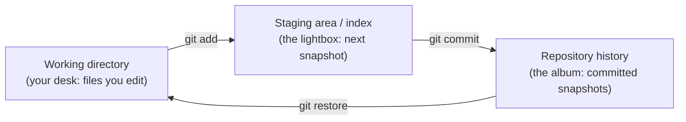
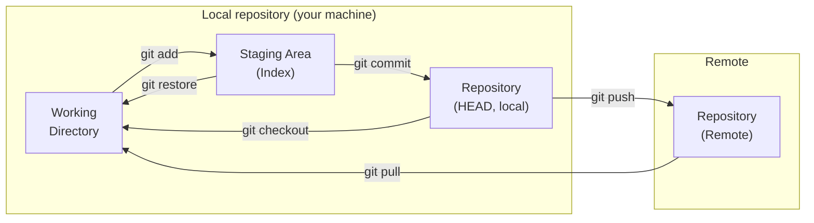

# 1.3 Git and the staging model

Sooner or later every programmer meets the folder of doom: `essay.doc`,
`essay_final.doc`, `essay_final_v2.doc`, `essay_final_v2_REAL.doc`,
`essay_final_v2_REAL_lastone.doc`. Which one went to the teacher? Which one
has the paragraph you deleted on Tuesday and now want back? Nobody knows.
Code makes this worse — projects have hundreds of files, changes in several
at once, and teammates editing simultaneously. **Version control** is the
tool category that solves this, **Git** is the tool that won, and the single
idea that trips up every beginner is Git's **staging model**: your work does
not go straight from "edited" to "saved forever" — it passes through a set of
distinct *areas*, one deliberate step at a time. This section teaches those
areas until you can point at any command and say which area it touches.

## The problem: you want a history, not a pile of copies

What you actually want from your files is not five confusingly named copies.
It is a *history*: a list of saved moments, each with a note about what
changed and why, that you can browse, compare, and return to. Something
like:

```python
history = [
    ("a1c8f52", "2026-03-02", "Add introduction"),
    ("9b81e77", "2026-03-04", "Rewrite argument in section 2"),
    ("3c05a9f", "2026-03-05", "Fix typos found by Sam"),
]

for commit_id, date, message in history:
    print(f"{commit_id}  {date}  {message}")
```

That — plus the ability to jump back to any line of it, see exactly what
changed between any two lines, and merge a teammate's history with yours —
is Git. Each saved moment is called a **commit**: a snapshot of your whole
project, stamped with an author, a date, a message, and an ID. The mess of
`_final_v2` copies collapses into one clean, searchable timeline.

## One picture to carry the whole chapter

Before any commands, fix one image in your mind. Every command below is a
move within it.

!!! abstract "In plain words"

    - **What it is.** Git keeps your project in a few separate *areas*, and
      each Git command moves your work from one area to the next.
    - **Picture it.** You are a photographer assembling a bound album.
        - Your **working directory** is your **desk** — the loose prints you
          are editing right now, easy to change, easy to mess up.
        - The **staging area** (the *index*) is a **lightbox** where you lay
          out exactly the shots you want on the next page — a chosen subset,
          arranged before anything is permanent.
        - The **local repository** is the **printed, bound album** — each
          page dated and glued in, permanent, kept in a drawer at home.
        - The **remote** is the copy you **mail to a shared library** so
          others can read it and add their own pages.
    - **Why it matters.** Almost every "Git is confusing" moment is really a
      question of *which area a file is in* and *which command moves it*.
      Learn the areas and the commands stop being magic spells.

The chapter maps every command onto this picture: `git add` moves a print
from the desk to the lightbox, `git commit` glues the lightbox layout into
the album, `git push` mails the album to the library, and the backward
commands (`git restore`, `git reset`) take work back out of an area.

## The areas, precisely

### The gentle version: three boxes

Most of the time you think about only the three *local* areas — the ones on
your own machine. Work flows left to right:



Why the middle box at all? Because real editing sessions are messy: you
fixed a bug *and* half-finished a new feature. Staging lets you put only the
bug fix on the lightbox and commit it now — a clean snapshot with an honest
message — leaving the unfinished feature on your desk for later.

### The full version: four areas including the remote

Add the fourth area — the **remote**, a copy of the repository on another
machine such as GitHub — and you have the complete model. The first three
areas together are your **local repository**; the fourth lives elsewhere.



Read the arrows as the six moves that make up almost everything you will
ever do:

| Arrow | Command | Moves work from → to |
| --- | --- | --- |
| add | `git add` | working directory → staging area |
| commit | `git commit` | staging area → local repository (HEAD) |
| push | `git push` | local repository → remote |
| pull | `git pull` | remote → your local repo and working directory |
| checkout | `git checkout` / `git switch` | local repository → working directory |
| restore | `git restore` | staging area or history → working directory |

This section owns the three *local* areas and the moves between them.
`push`, `pull`, and `clone` — everything about the remote — get their own
treatment in [1.4 Working with remotes](04-git-remotes.md).

### Where each area physically lives

Each area is a real place on disk, not an abstraction:

- **Working directory** — your ordinary project files, the ones your text
  editor opens. This is just the folder you are in.
- **Staging area (the index)** — a single file, `.git/index`, inside your
  project. It records the exact contents that will go into the *next*
  commit. "Staging a file" writes its current contents into that index.
- **Local repository** — the committed snapshots and their metadata, all
  under the hidden `.git/` folder. Deleting `.git/` would throw away the
  entire history while leaving your working files untouched.
- **Remote** — a whole other copy of `.git/` on another machine (GitHub,
  GitLab, a colleague's laptop). Nothing you do locally touches it until you
  `push`.

`HEAD` is the name Git gives to "the commit you are currently sitting on" —
the last page of the album you have open. A commit moves `HEAD` forward.

### The three states a file can be in

At any moment Git sees each of your files in exactly one of three states.
This vocabulary is what `git status` reports, so it pays to nail it down:

- **Untracked** — the file exists on your desk but Git has never been told
  to watch it. It is not in the index and not in any commit. New files start
  here.
- **Modified (unstaged)** — Git is tracking the file, and its contents on
  disk differ from what is staged. You have edited it since the last `add`.
- **Staged** — the file's current contents have been copied into the index
  and are queued for the next commit.

A single `git status` shows all three at once. Suppose `shopping.txt` is a
brand-new file you just `git add`-ed, `recipe.txt` was committed earlier and
you have since edited it, and `notes.txt` you have never added:

```console
$ git status
On branch main
Changes to be committed:
  (use "git restore --staged <file>..." to unstage)
        new file:   shopping.txt

Changes not staged for commit:
  (use "git add <file>..." to update what will be committed)
  (use "git restore <file>..." to discard changes in working directory)
        modified:   recipe.txt

Untracked files:
  (use "git add <file>..." to include in what will be committed)
        notes.txt
```

Reading it area by area:

- **"Changes to be committed"** lists what is in the **staging area** —
  `shopping.txt` is **staged**.
- **"Changes not staged for commit"** lists tracked files whose desk copy is
  ahead of the index — `recipe.txt` is **modified**.
- **"Untracked files"** lists files Git is ignoring — `notes.txt` is
  **untracked**.

`git status` is the command you will run more than any other, precisely
because it names the area every file is in and tells you the command to move
it.

## The forward flow: `add`, then `commit`

Time for the real thing. Two commands do the initial setup: `git init` turns
an ordinary folder into a repository (creating that `.git/` directory), and
`git status` reports the empty state.

```console
$ mkdir recipes
$ cd recipes
$ git init
Initialized empty Git repository in /Users/kim/recipes/.git/
$ git status
On branch main

No commits yet

nothing to commit (create/copy files and use "git add" to track)
```

Now create a file and walk it from the desk, to the lightbox, into the
album:

```console
$ git status
On branch main

No commits yet

Untracked files:
  (use "git add <file>..." to include in what will be committed)
        pancakes.txt

nothing added to commit but untracked files present (use "git add" to track)
$ git add pancakes.txt
$ git commit -m "Add pancake recipe"
[main (root-commit) f4a2c1d] Add pancake recipe
 1 file changed, 4 insertions(+)
 create mode 100644 pancakes.txt
```

Two arrows fired. `git add pancakes.txt` copied the file into the index
(working → staging: the *add* arrow). `git commit -m "..."` snapshotted the
index into a permanent commit (staging → history: the *commit* arrow), with
the message in quotes. Git's reply names the branch (`main`), the new
commit's abbreviated ID (`f4a2c1d`), and the size of the change.

That is the whole daily cycle, and you will repeat it for the rest of your
programming life:

1. **`git status`** — see which area each file is in.
2. **`git add <file>`** — move the changes you want onto the lightbox.
3. **`git commit -m "..."`** — glue the lightbox layout into the album with
   an honest message.

!!! tip "One-time setup: tell Git who you are"
    The very first commit on a new machine fails with *"Please tell me who
    you are"* until you run:

    ```console
    $ git config --global user.name "Kim Lee"
    $ git config --global user.email "kim@example.com"
    ```

    Git stamps this identity onto every commit. (Also: depending on your
    Git version, a brand-new repository may call its first branch `master`
    instead of `main`; `git config --global init.defaultBranch main`
    matches what GitHub uses.)

### What a commit ID really is

Each commit remembers its *parent* — the commit that came before — and its
ID is a **hash**: a fingerprint computed from the content (Chapter 0's bits
at work). You can imitate the scheme in a few lines:

```python
import hashlib

def commit_id(message, parent, content):
    fingerprint = (message + parent + content).encode()
    return hashlib.sha1(fingerprint).hexdigest()[:7]

c1 = commit_id("Add shopping list", "none", "eggs\nmilk\n")
c2 = commit_id("Add bread", c1, "eggs\nmilk\nbread\n")
c3 = commit_id("Remove milk", c2, "eggs\nbread\n")
print("history:", c1, "->", c2, "->", c3)
```

Each ID depends on the content *and* on the parent's ID, so changing any old
commit would change every ID after it — the chain is tamper-evident. Real
Git does exactly this (with full 40-character hashes; the 7-character forms
you see everywhere are abbreviations).

## Watch it move: a stage simulator you can run

Real Git cannot run in this browser, so here is a small, honest model of it
you *can* run. `MiniGit` holds the three local areas as three Python
containers — `working` (the desk), `index` (the lightbox), and `history`
(the album) — and each method is one of the moves from the diagram. Run it
and watch a single file travel through the states.

```python
class MiniGit:
    """A three-area model of Git you can run: working tree, index, history."""

    def __init__(self):
        self.working = {}        # your desk: files as you are editing them
        self.index = {}          # the lightbox: the next snapshot, assembled
        self.history = []        # the bound album: committed snapshots

    def _head(self):
        return self.history[-1]["snapshot"] if self.history else {}

    def write(self, name, text):        # edit a file in the working tree
        self.working[name] = text

    def stage(self, name):              # git add: working -> index
        self.index[name] = self.working[name]

    def commit(self, message):          # git commit: index -> history
        self.history.append({"message": message, "snapshot": dict(self.index)})

    def restore(self, name):            # git restore <file>: index -> working
        if name in self.index:
            self.working[name] = self.index[name]

    def unstage(self, name):            # git restore --staged: HEAD -> index
        head = self._head()
        if name in head:
            self.index[name] = head[name]
        else:
            self.index.pop(name, None)

    def status(self):
        head = self._head()
        names = sorted(set(self.working) | set(self.index) | set(head))
        print("  status:")
        for name in names:
            w, i, h = self.working.get(name), self.index.get(name), head.get(name)
            tags = []
            if i is not None and i != h:          # index differs from HEAD
                tags.append("staged")
            if name in self.working and name not in self.index and name not in head:
                tags.append("untracked")
            elif name in self.working and i is not None and w != i:
                tags.append("modified")
            if not tags:
                tags.append("committed (clean)")
            print(f"    {name}: {', '.join(tags)}")

    def log(self):
        print("  log (newest first):")
        for n in range(len(self.history) - 1, -1, -1):
            print(f"    [{n}] {self.history[n]['message']}")


repo = MiniGit()

print(">>> write pancakes.txt on the desk (working tree)")
repo.write("pancakes.txt", "flour\n1 egg\nmilk\n")
repo.status()

print(">>> stage it (git add: desk -> lightbox)")
repo.stage("pancakes.txt")
repo.status()

print(">>> edit it AGAIN on the desk (do not re-stage)")
repo.write("pancakes.txt", "flour\n2 eggs\nmilk\n")
repo.status()

print(">>> commit (git commit: lightbox -> album)")
repo.commit("Add pancake recipe")
repo.status()

print(">>> restore pancakes.txt (git restore: lightbox -> desk)")
repo.restore("pancakes.txt")
repo.status()

repo.log()
```

The printed run is worth reading line by line:

```text
>>> write pancakes.txt on the desk (working tree)
  status:
    pancakes.txt: untracked
>>> stage it (git add: desk -> lightbox)
  status:
    pancakes.txt: staged
>>> edit it AGAIN on the desk (do not re-stage)
  status:
    pancakes.txt: staged, modified
>>> commit (git commit: lightbox -> album)
  status:
    pancakes.txt: modified
>>> restore pancakes.txt (git restore: lightbox -> desk)
  status:
    pancakes.txt: committed (clean)
  log (newest first):
    [0] Add pancake recipe
```

Two moments deserve a pause:

- **`staged, modified` at once** is the classic subtlety. After you staged
  the one-egg version and then edited the file to two eggs, the file is in
  *both* areas differently: the lightbox holds one egg, the desk holds two.
  Real `git status` shows this exact file under *both* "Changes to be
  committed" and "Changes not staged for commit".
- **`modified` right after the commit** is the payoff. The commit captured
  what was on the lightbox — the **one-egg** version — not the two-egg edit
  still sitting on your desk. `git commit` snapshots the *index*, never the
  working directory. This is the single most common beginner surprise, and
  now you have watched it happen.

## Moving backward: undoing safely

Everything so far pushed work *forward* through the areas. The commands that
move it *backward* are where beginners lose real work, so they deserve the
same care.

!!! abstract "In plain words"

    - **What it is.** A family of commands that take a file (or your whole
      project) back to an earlier state in one of the three areas.
    - **Picture it.** `restore` puts a print back the way the lightbox has
      it; `restore --staged` clears a shot off the lightbox but leaves your
      desk edit alone; `reset` rewinds the album itself — gently (just the
      bookmark), or violently (tearing pages off the desk too).
    - **Why it matters.** Some of these are safe and reversible; one of them
      (`reset --hard`) permanently destroys uncommitted work. Knowing which
      area each one changes is the difference between "undo" and "disaster".

The four everyday undo commands:

- **`git restore <file>`** — discard your working-tree edits, refilling the
  desk copy from the lightbox (the index). Your uncommitted edit is gone.
- **`git restore --staged <file>`** — *unstage*: clear the file off the
  lightbox by refilling the index from `HEAD`. Your desk edit is **kept** —
  this only reverses a `git add`.
- **`git switch <branch>`** / **`git switch -c <new>`** — move `HEAD` to
  another branch (or make one). Since Git 2.23, switching branches is
  `switch` and restoring files is `restore` — two clear verbs that split the
  old, overloaded `git checkout`, which still does both jobs (`git checkout
  <branch>` and `git checkout -- <file>`).
- **`git reset --soft|--mixed|--hard <commit>`** — move `HEAD` back to an
  earlier commit, optionally dragging the index and working tree with it.

The whole family is just "which of the three areas do I change?" — so read it
as a table:

| Command | HEAD (history) | Index (staging) | Working dir (desk) |
| --- | --- | --- | --- |
| `git restore <file>` | — | — | overwritten from index |
| `git restore --staged <file>` | — | reset from HEAD | — |
| `git reset --soft <commit>` | moves | — | — |
| `git reset --mixed <commit>` *(default)* | moves | reset to HEAD | — |
| `git reset --hard <commit>` | moves | reset to HEAD | **reset to HEAD** |

So `reset --soft` keeps everything staged (handy for redoing a commit
message); the default `reset` (`--mixed`) also unstages your changes but
leaves your files edited; and `reset --hard` throws away the index *and* your
working-tree edits back to the target commit.

!!! warning "These two throw work away for good"
    `git reset --hard` and `git checkout -- <file>` (and its modern spelling
    `git restore <file>`) **permanently discard uncommitted changes** — there
    is no Trash and no undo, because the discarded version was never
    committed. If in doubt, `git status` first, and remember: work that has
    been *committed* is almost always recoverable; work that has only been
    *edited or staged* is not.

## Looking back: `log` and `diff`

### `git log` — the history

`git log` shows the album, newest first; `--oneline` condenses it to one line
per commit:

```console
$ git log --oneline
f4a2c1d (HEAD -> main) Add pancake recipe
```

### `git diff` — what changed, and between which areas

`git diff` shows changes line by line, with `-` for removed and `+` for
added. *Which* two areas it compares depends on the flag — and this maps
straight onto the three boxes:

- **`git diff`** — working directory vs index. "What have I edited but not
  yet staged?"
- **`git diff --staged`** (also spelled `--cached`) — index vs `HEAD`. "What
  will the next commit contain?"

```console
$ git diff
diff --git a/pancakes.txt b/pancakes.txt
index 8f2e1a3..c7b4d92 100644
--- a/pancakes.txt
+++ b/pancakes.txt
@@ -1,4 +1,5 @@
 flour
-1 egg
+2 eggs
 milk
 butter
+maple syrup
```

This "unified diff" format is worth learning to read — you will see it in
code reviews for the rest of your career. It is not Git magic, either:
Python's standard library computes the same thing, and you can run it here:

```python
import difflib

old = ["flour", "1 egg", "milk", "butter"]
new = ["flour", "2 eggs", "milk", "butter", "maple syrup"]

for line in difflib.unified_diff(old, new, "before", "after", lineterm=""):
    print(line)
```

Compare the output with the `git diff` transcript above: same hunk header
`@@ -1,4 +1,5 @@` ("4 lines starting at line 1 became 5 lines starting at
line 1"), same `-`/`+` lines, same unchanged context around them.

## `.gitignore` — files Git should pretend not to see

Not everything on your desk belongs in the album. A `.gitignore` file lists
patterns Git should never track: generated files that can always be rebuilt,
and files that belong to *your machine* rather than to the project's history.
A typical Python `.gitignore`:

```text
.venv/
__pycache__/
*.pyc
.DS_Store
```

Add it *before* your first commit if you can — Git keeps whatever you have
already committed, so the easiest time to keep junk out of history is before
it gets in. (Chapter 24 revisits this, including the rule *commit what humans
write; ignore what machines can regenerate*.)

## Branches, in one paragraph

A **branch** is a movable label pointing at a commit. `main` is just the
default label; creating a new branch (`git switch -c experiment`) lets you
pile up commits on a side line while `main` stays untouched, and merging
brings the good ones back. That single idea — cheap parallel lines of
history — is how teams of hundreds work on one codebase without trampling
each other, and it deserves more than a paragraph: it gets one in
[Chapter 24 · A real Git workflow](../ch24-practice/01-git-workflow.md),
which owns branches, merges, conflicts, and pull requests.

## Where next: the fourth area

You now own the three local areas cold. The fourth — the **remote**, and the
`push` / `pull` / `clone` / `fetch` commands that sync with it — is a section
of its own: [1.4 Working with remotes](04-git-remotes.md). Read it next to
turn your private album into shared, backed-up history.

!!! warning "Common mistakes"
    - **Editing after `git add`, then committing.** The commit contains the
      version you *staged*, not the one on disk — you saw this in the
      simulator (`staged, modified`, then a plain `modified` survived the
      commit). Run `git status`; if the file is still "modified", `git add`
      it again before committing.
    - **Reaching for `git reset --hard` to "undo".** It moves `HEAD` *and*
      wipes the index and your edited files. To undo just a staging, use
      `git restore --staged`; to undo just a working edit, `git restore` —
      neither of which rewinds history.
    - **Confusing `git restore` and `git restore --staged`.** Without
      `--staged` it changes the **working directory** (discards your edit);
      with `--staged` it changes the **index** (unstages, keeps your edit).
      Opposite areas.
    - **Forgetting `-m`.** `git commit` alone drops you into a text editor
      (often `vim`). If that traps you: press ++esc++, type `:q!`, press
      ++enter++, breathe, and use `-m` next time.
    - **Committing secrets or junk.** Passwords, API keys, `.venv/`, giant
      data files — once committed, they live in history even after you delete
      them. `.gitignore` first, and never commit credentials.

## Check your understanding

1. Which area does `git add` change, and which area does `git commit` read
   from when it builds the snapshot?

    ??? success "Answer"
        `git add` copies a file's current contents into the **staging area
        (the index)** — the working → staging arrow. `git commit` snapshots
        the **index**, not the working directory. That is why editing a file
        *after* staging it, then committing, captures the older, staged
        version.

2. You `git add report.txt`, then edit `report.txt` again without re-adding
   it. What does `git status` show, and what will the next commit contain?

    ??? success "Answer"
        The file appears **twice** — as "staged" (the version you added) and
        as "modified" (the newer edit on disk). The next commit contains the
        **staged** version only. Re-run `git add report.txt` to fold the new
        edit into the commit.

3. What is the difference between `git restore report.txt` and `git restore
   --staged report.txt`?

    ??? success "Answer"
        `git restore report.txt` changes the **working directory**: it
        discards your uncommitted edits by refilling the file from the
        index (destructive — the edit is gone). `git restore --staged
        report.txt` changes the **index**: it unstages the file (refills the
        index from `HEAD`) but leaves your working-directory edit untouched.
        Different areas, opposite effects.

4. Your last commit's message has a typo, but the staged snapshot is
   correct. Which `reset` variant lets you redo just the commit without
   disturbing your files, and why?

    ??? success "Answer"
        `git reset --soft HEAD~1`. It moves `HEAD` back one commit but leaves
        the **index** and **working directory** exactly as they are, so your
        changes stay staged and you can `git commit` again with a corrected
        message. `--mixed` would unstage them; `--hard` would delete them.

5. What does `git reset --hard` destroy that a plain `git reset` (`--mixed`)
   leaves alone?

    ??? success "Answer"
        `--hard` resets the **working directory** as well as `HEAD` and the
        index — your uncommitted edits on disk are permanently gone. Plain
        `git reset` (`--mixed`) rewinds `HEAD` and unstages changes but keeps
        your edited files on disk, so nothing you typed is lost.

6. `git diff` shows nothing, but `git diff --staged` shows several changed
   lines. What state is your work in?

    ??? success "Answer"
        Everything you have edited is already **staged**. `git diff`
        (working vs index) is empty because the desk and the lightbox match;
        `git diff --staged` (index vs `HEAD`) is non-empty because the
        lightbox holds changes not yet committed. You are ready to `git
        commit`.
