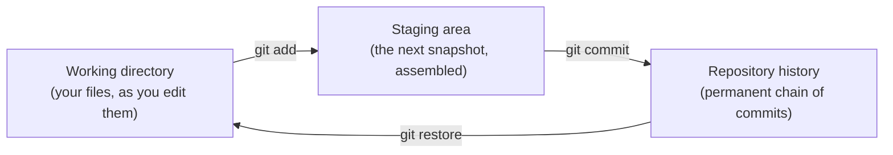

# 1.3 Git and version control, first taste

Sooner or later every programmer meets the folder of doom: `essay.doc`,
`essay_final.doc`, `essay_final_v2.doc`, `essay_final_v2_REAL.doc`,
`essay_final_v2_REAL_lastone.doc`. Which one went to the teacher? Which one
has the paragraph you deleted on Tuesday and now want back? Nobody knows.
Code makes this worse — projects have hundreds of files, changes in several
at once, and teammates editing simultaneously. **Version control** is the
tool category that solves this, **Git** is the tool that won, and using it
from your very first project is one of the highest-return habits in
programming.

## The problem version control solves

What you actually want from your files is not five confusingly named copies.
It is a *history*: a list of saved moments, each with a note about what
changed and why, that you can browse, compare, and return to. Something
like:

```python
history = [
    ("a1c8f52", "2026-03-02", "Add introduction"),
    ("9b81e77", "2026-03-04", "Rewrite argument in section 2"),
    ("3c05a9f", "2026-03-05", "Fix typos found by Sam"),
]

for commit_id, date, message in history:
    print(f"{commit_id}  {date}  {message}")
```

That — plus the ability to jump back to any line of it, see exactly what
changed between any two lines, and merge a teammate's history with yours —
is Git. Each saved moment is called a **commit**: a snapshot of your whole
project, stamped with an author, a date, a message, and an ID. The mess of
`_final_v2` copies collapses into one clean, searchable timeline.

## Three places your work lives

Git's one genuinely confusing idea is that your work passes through *three*
areas, not two:

- the **working directory** — your project folder, the ordinary files you
  edit;
- the **staging area** — a drafting table where you assemble the *next*
  snapshot, choosing which changes belong in it;
- the **repository history** — the permanent chain of commits, stored in a
  hidden `.git` folder inside your project.



Why the middle step? Because real editing sessions are messy: you fixed a
bug *and* half-finished a new feature. Staging lets you commit the bug fix
now — a clean snapshot with an honest message — and the rest later.

Each commit also remembers its *parent*, the commit that came before, and
its ID is a **hash** (Chapter 0's bits at work: a fingerprint computed from
the content). You can imitate the scheme in a few lines:

```python
import hashlib

def commit_id(message, parent, content):
    fingerprint = (message + parent + content).encode()
    return hashlib.sha1(fingerprint).hexdigest()[:7]

c1 = commit_id("Add shopping list", "none", "eggs\nmilk\n")
c2 = commit_id("Add bread", c1, "eggs\nmilk\nbread\n")
c3 = commit_id("Remove milk", c2, "eggs\nbread\n")
print("history:", c1, "->", c2, "->", c3)
```

Each ID depends on the content *and* on the parent's ID, so changing any old
commit would change every ID after it — the chain is tamper-evident. Real
Git does exactly this (with full 40-character hashes; the 7-character forms
you see everywhere are abbreviations).

## Your first repository

Time for the real thing. The commands below are a complete, honest session —
this is what it looks like on screen. `git init` turns a folder into a
repository; `git status` is the command you will run more than any other,
because it always tells you what state the three areas are in and what to
type next.

```console
$ mkdir recipes
$ cd recipes
$ git init
Initialized empty Git repository in /Users/kim/recipes/.git/
$ git status
On branch main

No commits yet

nothing to commit (create/copy files and use "git add" to track)
```

Create a file (any editor), then walk it through the three areas:

```console
$ git status
On branch main

No commits yet

Untracked files:
  (use "git add <file>..." to include in what will be committed)
        pancakes.txt

nothing added to commit but untracked files present (use "git add" to track)
$ git add pancakes.txt
$ git commit -m "Add pancake recipe"
[main (root-commit) f4a2c1d] Add pancake recipe
 1 file changed, 4 insertions(+)
 create mode 100644 pancakes.txt
```

`git add` moved the file onto the staging table; `git commit -m "..."` made
the snapshot permanent, with the message in quotes. Git's reply names the
branch (`main`), the new commit's abbreviated ID (`f4a2c1d`), and the size
of the change.

!!! tip "One-time setup: tell Git who you are"
    The very first commit on a new machine fails with *"Please tell me who
    you are"* until you run:

    ```console
    $ git config --global user.name "Kim Lee"
    $ git config --global user.email "kim@example.com"
    ```

    Git stamps this identity onto every commit. (Also: depending on your
    Git version, a brand-new repository may call its first branch `master`
    instead of `main`; `git config --global init.defaultBranch main`
    matches what GitHub uses.)

## Looking back: `log` and `diff`

`git log` shows the history, newest first; the `--oneline` flag condenses it
to one line per commit:

```console
$ git log
commit f4a2c1d8e9b7a6c5d4e3f2a1b0c9d8e7f6a5b4c3 (HEAD -> main)
Author: Kim Lee <kim@example.com>
Date:   Wed Mar 4 10:15:00 2026 -0600

    Add pancake recipe
```

`git diff` answers "what have I changed since the last snapshot?" — line by
line, with `-` for removed and `+` for added:

```console
$ git diff
diff --git a/pancakes.txt b/pancakes.txt
index 8f2e1a3..c7b4d92 100644
--- a/pancakes.txt
+++ b/pancakes.txt
@@ -1,4 +1,5 @@
 flour
-1 egg
+2 eggs
 milk
 butter
+maple syrup
```

This "unified diff" format is worth learning to read — you will see it in
code reviews for the rest of your career. It is not Git magic, either;
Python's standard library computes the same thing, and you can run it here:

```python
import difflib

old = ["flour", "1 egg", "milk", "butter"]
new = ["flour", "2 eggs", "milk", "butter", "maple syrup"]

for line in difflib.unified_diff(old, new, "before", "after", lineterm=""):
    print(line)
```

Compare the output with the `git diff` transcript above: same hunk header
`@@ -1,4 +1,5 @@` ("4 lines starting at line 1 became 5 lines starting at
line 1"), same `-`/`+` lines, same unchanged context around them.

## Branches, in one paragraph

A **branch** is a movable label pointing at a commit. `main` is just the
default label; creating a new branch (`git switch -c experiment`) lets you
pile up commits on a side line while `main` stays untouched, and merging
brings the good ones back. That single idea — cheap parallel lines of
history — is how teams of hundreds work on one codebase without trampling
each other, and it deserves more than a paragraph: it gets one in
[Chapter 24 · A real Git workflow](../ch24-practice/01-git-workflow.md).

## Sharing your work: GitHub

Git runs entirely on your machine — no account, no internet. **GitHub** is a
separate thing: a website that *hosts* copies of Git repositories, so you
can back up your history, share it, and collaborate. (Git is the tool;
GitHub is one popular home for repositories, alongside GitLab and others.)
Three commands connect the two worlds:

```console
$ git clone https://github.com/kim/recipes.git   # copy a repo from GitHub
$ git push                                       # upload your new commits
$ git pull                                       # download others' commits
```

Two conventions make a repository welcoming on arrival. A **README** file
(usually `README.md`, written in Markdown) is the repository's front page —
what the project is, how to run it — and GitHub displays it automatically.
And a **`.gitignore`** file lists things Git should pretend not to see:
generated files that can always be rebuilt and belong to *your machine*,
not to history. A typical Python one:

```text
.venv/
__pycache__/
*.pyc
.DS_Store
```

Add it *before* your first commit if you can — Git keeps whatever you have
already committed, so the easiest time to keep junk out of history is
before it gets in.

!!! example "Recap — your first repo in six commands"
    From a project folder to code on GitHub (after creating an empty
    repository on the GitHub website):

    ```console
    $ git init
    $ git add .
    $ git commit -m "First commit"
    $ git branch -M main
    $ git remote add origin https://github.com/YOU/YOUR-REPO.git
    $ git push -u origin main
    ```

    (`git add .` stages everything in the folder; `git remote add` tells
    your local repository its GitHub address; `-u` makes plain `git push`
    work from then on.)

!!! warning "Common mistakes"
    - **Editing after `git add`, then committing.** The commit contains the
      version you *staged*, not the one on disk. Run `git status` — it
      will show the file in both "staged" and "modified" states — and
      `git add` it again.
    - **Forgetting `-m`.** `git commit` alone drops you into a text editor
      (often `vim`) to type the message. If that ever traps you: press
      ++esc++, type `:q!`, press ++enter++, breathe, and use `-m` next
      time.
    - **Committing secrets or junk.** Passwords, API keys, `.venv/`, giant
      data files — once committed, they live in the history even after you
      delete them. `.gitignore` first, and never commit credentials.
    - **Thinking Git and GitHub are the same.** Deleting a repo on GitHub
      does not touch your local copy, and committing locally uploads
      nothing until you `git push`.

## Check your understanding

1. What problem does the staging area solve? Why not commit straight from
   the working directory?

    ??? success "Answer"
        It lets you choose *which* changes go into the next snapshot. Real
        editing mixes unrelated changes (a bug fix here, a half-finished
        feature there); staging lets you commit the finished part now as
        one clean, well-described commit and keep the rest for later.

2. Commit IDs like `f4a2c1d` look random. What are they actually, and why
   does that make history tamper-evident?

    ??? success "Answer"
        Each ID is a hash — a fingerprint computed from the commit's
        content, metadata, and its parent's ID. Because every ID depends on
        the previous one, quietly altering an old commit would change its
        hash and every hash after it, making the alteration obvious.

3. You commit on your laptop, then check GitHub and the commit is not
   there. What step is missing?

    ??? success "Answer"
        `git push`. Commits are recorded locally, in your own `.git`
        folder; nothing reaches GitHub until you push (and nothing arrives
        from it until you pull). Git works fully offline — GitHub is a
        hosted copy, not the repository itself.

4. Put these in the order you would actually run them, starting from an
   edited file: `git commit -m "..."`, `git status`, `git add`.

    ??? success "Answer"
        `git status` (see what changed), `git add` (stage it), `git commit
        -m "..."` (snapshot it). Running `git status` again after each step
        costs nothing and is exactly what experienced users do.
