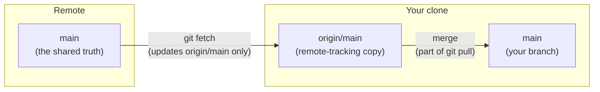

# 1.4 Working with remotes

[Section 1.3](03-git.md) built the album entirely on your own machine: you
edited on the desk, staged on the lightbox, and bound snapshots into a local
album. Everything there works with no account and no internet. This section
adds the fourth area — the **remote** — the copy of your repository that
lives on another machine so you can back it up, share it, and collaborate.
The commands are few (`clone`, `push`, `fetch`, `pull`), but one distinction
inside them — `fetch` versus `pull` — is where most beginners get lost, so we
take it slowly.

!!! abstract "In plain words"

    - **What it is.** A remote is a second, full copy of your repository on
      another computer; you sync the two on purpose, with explicit commands.
    - **Picture it.** Your bound album sits in a drawer at home (your local
      repo). The **remote** is a copy you keep in a **shared library** so
      teammates can read it. You `push` your finished pages *up* to the
      library; you `pull` others' new pages *down*. Neither copy changes the
      other by accident — you carry pages back and forth deliberately.
    - **Why it matters.** A commit on your laptop is *not* backed up and *not*
      shared until you push it. Understanding that the two repositories are
      independent — and how they exchange commits — is what keeps a team's
      work from colliding.

Crucially, your local repository and the remote are **two complete
repositories**. Each has its own commits, its own branches, its own history.
They are not a client and a server in the web sense; they are peers that
copy commits to each other when you tell them to.

## `git clone` — copy a repository

You usually meet a remote by **cloning** it: making a local copy of a
repository that already exists on a server.

```console
$ git clone https://github.com/kim/recipes.git
Cloning into 'recipes'...
remote: Enumerating objects: 42, done.
Receiving objects: 100% (42/42), 8.14 KiB, done.
$ cd recipes
```

One command copies three things:

- the **working directory** — the project's files, checked out ready to edit;
- the **full history** — every commit, not just the latest; your clone is a
  complete repository that works offline;
- a **remote link named `origin`** — a saved nickname for the URL you cloned
  from, so later `push` and `pull` know where to go.

## Connecting an existing repo to a remote

If you started locally with `git init` (as in 1.3) there is no remote yet.
You create the empty repository on the hosting site, then point your local
repo at it:

```console
$ git remote add origin https://github.com/kim/recipes.git
$ git remote -v
origin  https://github.com/kim/recipes.git (fetch)
origin  https://github.com/kim/recipes.git (push)
```

`origin` is not a magic word — it is just the **conventional nickname** for
your main remote's URL. You could call it anything; everyone calls the
default `origin`. `git remote -v` (for *verbose*) lists your remotes and the
URLs they stand for, one line for fetching and one for pushing.

## `git push` — upload your commits

`git push` sends commits that exist locally but not yet on the remote,
fast-forwarding the remote's branch to match yours. The first time, name the
remote and branch and add `-u`:

```console
$ git push -u origin main
Enumerating objects: 6, done.
To https://github.com/kim/recipes.git
 * [new branch]      main -> main
branch 'main' set up to track 'origin/main'.
```

The `-u` (short for `--set-upstream`) records that your local `main`
**tracks** `origin/main`. After that one-time setup, a bare `git push` (and
`git pull`) knows the remote and branch on its own:

```console
$ git push
Everything up-to-date
```

**"Everything up-to-date"** means your local branch has no commits the remote
lacks — nothing to send. But a push can also be **rejected**:

```console
$ git push
 ! [rejected]        main -> main (non-fast-forward)
error: failed to push some refs to 'https://github.com/kim/recipes.git'
hint: Updates were rejected because the remote contains work that you do
hint: not have locally. ... integrate the remote changes (e.g. 'git pull')
```

A **non-fast-forward** rejection means someone else pushed commits to
`origin/main` after you last synced, so your branch is no longer a clean
extension of the remote's. Git refuses to overwrite their work. The fix is
always the same: **pull first** (bring their commits into your branch, merging
if needed), then push.

## `git fetch` vs `git pull` — the distinction beginners miss

This is the crux. Both bring commits *down* from the remote, but they differ
in whether they touch your working branch.

!!! abstract "In plain words"

    - **`git fetch`** downloads new commits from the remote into a
      *remote-tracking* branch called `origin/main`, and stops. Your own
      `main` and your working directory do **not** move. It is "show me
      what's new" — you look before you leap.
    - **`git pull`** is `git fetch` **followed by** a merge of `origin/main`
      into your `main`. It downloads *and* updates your branch and working
      files in one step.

The key is the third pointer. After a fetch you are watching *three* things:



`git fetch` moves only the `origin/main` pointer to match the server. `git
pull` does that *and* the second arrow — merging `origin/main` into your
`main`. So `git pull` = `git fetch` + `git merge origin/main`.

Prefer `fetch` when you want to **look before you leap**: inspect incoming
commits with `git log main..origin/main`, see what changed, and only then
merge. Prefer `pull` when you already trust the incoming work and just want to
catch up.

!!! warning "`origin/main` is not `main`"
    `origin/main` is your local, possibly stale, *memory* of where the
    remote's `main` was at your last fetch. `main` is your own branch. They
    are two different pointers; `fetch` moves the first, a merge moves the
    second. Confusing them is the root of most "but I pulled!" confusion.

## Watch commits travel: extending the simulator

Here is a compact, self-contained model of two developers and a shared
server. Each `Repo` tracks its own `main` (a chain of commit ids) and, for a
clone, `origin_main` — its last-known copy of the remote. Run it and watch
commits move up to `origin` and back down.

```python
class Repo:
    """One full repository: a chain of commits on `main`, plus (for a clone)
    `origin_main` — this repo's last-known copy of the remote's main."""

    def __init__(self, name):
        self.name = name
        self.main = []          # commit ids on our own main branch
        self.origin_main = []   # remote-tracking ref: origin/main, as last seen

    def commit(self, cid):      # make a local commit
        self.main.append(cid)


def clone(remote, name):
    local = Repo(name)
    local.main = list(remote.main)          # full history copied
    local.origin_main = list(remote.main)   # origin/main starts in sync
    print(f"  {name}: cloned; main={local.main}, origin/main={local.origin_main}")
    return local


def push(local, remote):
    n = len(remote.main)
    if local.main[:n] != remote.main:            # remote has commits we lack
        print(f"  {local.name}: push REJECTED (non-fast-forward) -> pull first")
        return
    if len(local.main) == n:
        print(f"  {local.name}: Everything up-to-date")
        return
    remote.main = list(local.main)               # fast-forward the remote
    local.origin_main = list(remote.main)
    print(f"  {local.name}: pushed; origin/main is now {remote.main}")


def fetch(local, remote):
    local.origin_main = list(remote.main)        # updates origin/main ONLY
    print(f"  {local.name}: fetched; origin/main={local.origin_main}, "
          f"main={local.main} (working tree untouched)")


def pull(local, remote):
    fetch(local, remote)
    if local.main == local.origin_main[:len(local.main)]:   # fast-forward merge
        local.main = list(local.origin_main)
    print(f"  {local.name}: merged; main={local.main}")


origin = Repo("origin")   # the shared server; origin.main is the truth

print(">>> Ana starts the project and pushes two commits")
ana = Repo("ana")
ana.commit("c1"); ana.commit("c2")
push(ana, origin)

print(">>> Bo clones the shared repo")
bo = clone(origin, "bo")

print(">>> Ana adds c3 and pushes")
ana.commit("c3")
push(ana, origin)

print(">>> Bo FETCHES: origin/main moves ahead, but Bo's main does not")
fetch(bo, origin)

print(">>> Bo PULLS: fetch + fast-forward merge")
pull(bo, origin)

print(">>> Bo has nothing new to send")
push(bo, origin)

print(">>> Bo commits c4 and pushes; meanwhile Ana commits c5 on the old tip")
bo.commit("c4"); push(bo, origin)
ana.commit("c5"); push(ana, origin)
```

The printed run tells the whole story of syncing:

```text
>>> Ana starts the project and pushes two commits
  ana: pushed; origin/main is now ['c1', 'c2']
>>> Bo clones the shared repo
  bo: cloned; main=['c1', 'c2'], origin/main=['c1', 'c2']
>>> Ana adds c3 and pushes
  ana: pushed; origin/main is now ['c1', 'c2', 'c3']
>>> Bo FETCHES: origin/main moves ahead, but Bo's main does not
  bo: fetched; origin/main=['c1', 'c2', 'c3'], main=['c1', 'c2'] (working tree untouched)
>>> Bo PULLS: fetch + fast-forward merge
  bo: fetched; origin/main=['c1', 'c2', 'c3'], main=['c1', 'c2'] (working tree untouched)
  bo: merged; main=['c1', 'c2', 'c3']
>>> Bo has nothing new to send
  bo: Everything up-to-date
>>> Bo commits c4 and pushes; meanwhile Ana commits c5 on the old tip
  bo: pushed; origin/main is now ['c1', 'c2', 'c3', 'c4']
  ana: push REJECTED (non-fast-forward) -> pull first
```

Trace the two lessons the run makes visible:

- **Fetch vs pull.** After Bo's `fetch`, `origin/main` jumps to
  `['c1','c2','c3']` while Bo's `main` stays at `['c1','c2']` — the download
  happened, but the working branch did not move. Only the following `pull`
  (fetch + merge) advances `main`.
- **Why a push gets rejected.** Ana committed `c5` on top of `c3` while the
  server had already moved to `c4` (Bo's push). Ana's branch is no longer a
  clean extension of the remote, so the push is rejected. Ana must pull `c4`
  first — merging it with `c5` — and then push.

## Git is not GitHub

Git runs entirely on your machine — no account, no internet. **GitHub** is a
separate thing: a website that *hosts* copies of Git repositories (a place for
the shared library), alongside GitLab, Bitbucket, and others. Git is the tool;
GitHub is one popular home for remotes. Deleting a repository on GitHub does
not touch your local clone, and committing locally uploads nothing until you
`git push`.

Two conventions make a hosted repository welcoming on arrival:

- **`README.md`** — the repository's front page, written in Markdown: what
  the project is and how to run it. GitHub displays it automatically under
  the file list.
- **`.gitignore`** — the ignore list from [Section 1.3](03-git.md), so the
  shared copy never fills up with `.venv/`, caches, or secrets.

!!! example "Recap — your first repo on a remote, in six commands"
    From a fresh project folder to code on GitHub (after creating an empty
    repository on the GitHub website):

    ```console
    $ git init
    $ git add .
    $ git commit -m "First commit"
    $ git branch -M main
    $ git remote add origin https://github.com/YOU/YOUR-REPO.git
    $ git push -u origin main
    ```

    The first three are the local cycle from 1.3 (`add` stages everything,
    `commit` snapshots it). The last three connect and sync: `branch -M main`
    names the branch, `remote add` saves the remote's address under the
    nickname `origin`, and `push -u` uploads and sets up tracking so plain
    `git push` works forever after. The Git card in
    [Appendix F](../appendix/F-toolchain-reference.md) lists the rest,
    grouped by task, for looking up rather than learning.

!!! warning "Common mistakes"
    - **Assuming a local commit is backed up.** A commit lives only in your
      `.git/` until you `git push`. Lose the laptop before pushing and the
      commit is gone. "Committed" means *saved locally*, not *shared*.
    - **Push rejected because you didn't pull.** A `non-fast-forward`
      rejection means the remote has commits you lack. Never force past it
      blindly (`--force` overwrites teammates' work); `git pull` to
      integrate, resolve any conflict, then push.
    - **Confusing `origin/main` with `main`.** `origin/main` is your cached
      snapshot of the remote from your last fetch; `main` is your live
      branch. `git fetch` updates the first without touching the second.
    - **Expecting `git fetch` to change your files.** It never does — it only
      updates remote-tracking branches. If you wanted your working files
      updated too, you wanted `git pull`.

## Check your understanding

1. What exactly is the difference between `git fetch` and `git pull`?

    ??? success "Answer"
        `git fetch` downloads new commits from the remote into your
        remote-tracking branch (`origin/main`) and stops — your own branch
        and working files do not move. `git pull` does the same fetch and
        *then* merges `origin/main` into your current branch, updating your
        files. In short, `pull` = `fetch` + `merge`.

2. When you clone a repo and later type `git push` with no arguments, how
   does Git know where to send your commits?

    ??? success "Answer"
        `git clone` saved the source URL under the nickname **`origin`** and
        set your `main` to **track** `origin/main`. That tracking link is
        what a bare `git push` (or `git pull`) follows, so you don't have to
        name the remote and branch every time. `git remote -v` shows the URL
        behind `origin`.

3. Your `git push` is rejected as a "non-fast-forward". What happened, and
   what should you do?

    ??? success "Answer"
        Someone pushed commits to the remote after you last synced, so your
        branch is no longer a straight extension of `origin/main`. Git won't
        discard their work. Run `git pull` to bring their commits into your
        branch (resolving any merge conflict), then `git push`. Do **not**
        reach for `--force`, which would overwrite their commits.

4. You committed your work an hour ago but have not pushed. Is it safely
   backed up? Why or why not?

    ??? success "Answer"
        No. The commit exists only in your local `.git/` folder. It is saved
        against your own mistakes (you can check it out again), but it is not
        on any other machine, so a lost or broken laptop loses it. It becomes
        backed up and shareable only after `git push`.

5. After `git fetch`, `git log` on your `main` shows nothing new, but
   `git log origin/main` shows three new commits. Did fetch fail?

    ??? success "Answer"
        No — that is exactly what `fetch` does. It advanced `origin/main` to
        include the three new commits but deliberately left your `main`
        untouched. To fold them into your branch, merge (`git merge
        origin/main`) or simply `git pull`, which does the fetch and the
        merge together.
