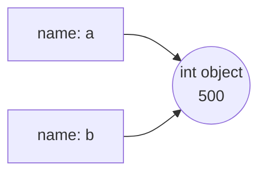
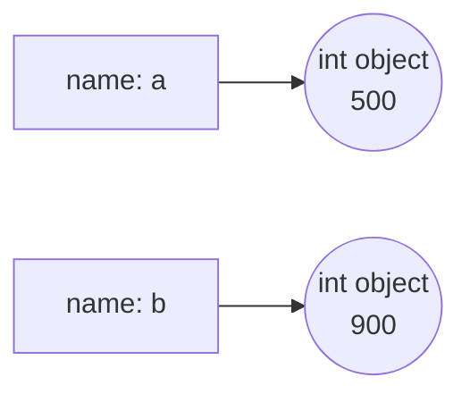

# 2.1 Variables and types

Almost every line of code you will ever write either creates a value or gives
one a name. Getting a precise mental picture of what a *name* actually is —
and what Python does when you write `x = 5` — pays off for the rest of this
handbook: it is the difference between guessing what a program does and
*knowing*. It also sets up the biggest philosophical difference between
Python and Java: how the two languages treat types.

## Assignment: giving a value a name

An **assignment statement** uses a single equals sign `=`. It is not the
mathematician's "equals" — it is an instruction: *evaluate whatever is on the
right, then make the name on the left refer to the result*.

```python
message = "Hello, world"
print(message)
```

Running this prints `Hello, world`. The right side (`"Hello, world"`) is
evaluated first; then the name `message` is attached to it. From that point
on, writing `message` anywhere in the program means *the value this name
currently refers to*.

Because the right side runs first, a variable may appear on both sides of
its own assignment:

```python
score = 10
score = score + 5   # right side first: 10 + 5 is 15, then 'score' is re-attached
print(score)
```

This prints `15`. Read `score = score + 5` as "the new `score` is the old
`score` plus five" — never as an equation (as an equation it would be
nonsense).

## A name is a label, not a box

Many textbooks say a variable is "a box that holds a value". For Java that
picture is close to the truth; for Python it is actively misleading. In
Python, values are **objects** that live on their own, and a variable is a
**name tag tied to an object by an arrow**. Assignment moves the arrow — it
never copies the object into a box.

Watch what happens when two names get involved:

```python
a = 500
b = a        # b now refers to the SAME object that a refers to
b = 900      # this moves b's arrow to a new object; a is untouched
print(a)
print(b)
```

The output is `500` then `900`. After line 2, both names point at one object:



After line 3, `b`'s arrow has been *moved* to a brand-new object — `a`'s
arrow never budged:



For numbers and strings the box model and the arrow model happen to predict
the same results, so you could limp along with boxes for a while. But in
[Chapter 9](../ch09-collections/index.md), when two names point at one *list*
and you change the list itself, only the arrow model predicts what happens.
Learn it now, cheaply.

## Naming rules and conventions

Python enforces a few hard **rules** for names:

- letters, digits, and underscores only — no spaces, no hyphens;
- the first character must not be a digit (`speed2` is fine, `2speed` is not);
- names are case-sensitive: `total`, `Total`, and `TOTAL` are three
  different names;
- reserved words (**keywords**) like `if`, `class`, and `while` cannot be
  used as names.

Python can tell you its full keyword list:

```python
import keyword
print(len(keyword.kwlist), "reserved words")
print(keyword.kwlist[:6])
```

The output shows there are `35` reserved words, beginning with
`['False', 'None', 'True', 'and', 'as', 'assert']`. Try to use one as a
variable name and Python refuses before running a single line:

```python
# raises SyntaxError
class = "Programming I"   # 'class' is a reserved word
```

Beyond the rules there are **conventions** — style choices the community
agrees on. Python names use `snake_case`: lowercase words joined by
underscores.

```python
user_name = "Ada"       # good Python style: snake_case
items_in_cart = 3
_draft = True           # a leading underscore is legal (it hints "internal use")
print(user_name, items_in_cart, _draft)
```

!!! info "Java corner"
    Java's convention is `camelCase` — `userName`, `itemsInCart` — with the
    first word lowercase and each later word capitalised. Both languages
    *accept* either style; each community *expects* its own. Write
    `snake_case` in Python and `camelCase` in Java, and readers of both will
    thank you.

Whatever the style, choose names that say what the value *means*:
`price_per_kg` beats `p`, and future-you is the main beneficiary.

## The four core types

Every object in Python has a **type** — a category that determines what the
value can do. Four types carry most beginner programs, and the built-in
`type()` function reveals them:

```python
print(type(21))        # a whole number
print(type(3.14))      # a number with a decimal point
print(type("hello"))   # text
print(type(True))      # a truth value
```

The output names each type:

```text
<class 'int'>
<class 'float'>
<class 'str'>
<class 'bool'>
```

- **`int`** — integers: whole numbers, positive, negative, or zero.
- **`float`** — "floating-point" numbers: anything written with a decimal
  point, like `3.14` or `-0.5`. (They are approximations — more in
  [section 2.2](02-number-systems.md).)
- **`str`** — strings: text wrapped in quotes. `"42"` is a string, not a
  number; the quotes decide.
- **`bool`** — Booleans: exactly two values, `True` and `False`. They power
  every decision a program makes ([Chapter 4](../ch04-branching/index.md)).

## Dynamic vs static typing

Here is the deepest Python/Java split in this chapter. In Java you must
*declare* a variable's type, and the variable keeps that type forever. In
Python the **name has no type at all — only objects do**, and a name may be
re-attached to an object of a different type at any moment.

=== "Python"

    ```python
    x = 5
    print(type(x))
    x = "five"       # perfectly legal: x now refers to a str
    print(type(x))
    ```

=== "Java"

    ```java
    int x = 5;       // x is declared as int, forever
    x = "five";      // ✗ compile-time error: incompatible types
    ```

The Python version runs happily and prints `<class 'int'>` then
`<class 'str'>`. This is **dynamic typing**: types are checked while the
program runs. Java's **static typing** checks types at *compile time* —
before the program runs at all. The broken Java line above never becomes a
running program; the compiler rejects the whole file with
`incompatible types: String cannot be converted to int`.

So where does Python catch type mistakes? At **runtime**, at the exact
moment an operation makes no sense:

```python
# raises TypeError
x = 5
print(x + " apples")   # adding an int to a str has no meaning
```

Running this produces a **traceback** ending in:

```text
TypeError: unsupported operand type(s) for +: 'int' and 'str'
```

Note the trade-off: Java tells you about the mistake before the program ever
runs, but makes you declare everything; Python lets you write faster, but a
type mistake can hide until the guilty line finally executes. Neither
approach is "better" — you will grow fluent in both.

## Reassignment and multiple assignment

A name can be reassigned as often as you like — the arrow just moves:

```python
count = 1
count = count + 1
count = count + 1
print(count)
```

This prints `3`. Python also lets you assign several names in one line,
which is tidy for values that belong together:

```python
width, height = 1920, 1080     # two names, two values, one line
print(width, height)

x = y = 0                      # chained: both names point at the same 0
print(x, y)

a, b = 10, 20
a, b = b, a                    # the classic Python swap — no helper needed
print(a, b)
```

The output is `1920 1080`, `0 0`, and `20 10`. The swap works because Python
evaluates the whole right side (`b, a` → the pair `20, 10`) *before* moving
either arrow. In Java the same swap needs a third, temporary variable.

## Converting between types

The type names double as **conversion functions**: `int(...)`, `float(...)`,
and `str(...)` each build a *new* object of that type from what you give
them.

```python
print(int("42") + 1)            # str -> int, then arithmetic works
print(float("2.5") * 2)         # str -> float
print(str(404) + " Not Found")  # int -> str, then + means "join text"
print(int(3.99))                # float -> int CHOPS the decimals (no rounding!)
print(int(-3.99))               # ... toward zero, so this is -3, not -4
```

The output:

```text
43
5.0
404 Not Found
3
-3
```

Two behaviours deserve a second look. First, `int()` on a float
**truncates** — it discards the fractional part rather than rounding, so
`int(3.99)` is `3`. If you want proper rounding, that is `round()`'s job
([section 2.4](04-math-input.md)). Second, not every string can convert, and
a failed conversion stops the program:

```python
# raises ValueError
int("3.7")   # a float-looking string is not valid for int()
```

The message is `ValueError: invalid literal for int() with base 10: '3.7'`.
A `ValueError` means the *type* of the argument was fine (a string) but its
*value* was unusable. If you genuinely need `"3.7"` as a whole number,
convert in two steps: `int(float("3.7"))` gives `3`.

!!! warning "Common mistakes"
    - **Using a name before assigning it.** `print(total)` before any
      `total = ...` raises `NameError: name 'total' is not defined` —
      Python never invents a default value for you.
    - **Expecting `int()` to round.** `int(9.99)` is `9`. Truncation, not
      rounding — use `round(9.99)` if you want `10`.
    - **Converting the wrong string.** `int("3.7")` and `int("forty")` both
      raise `ValueError`. Only strings that *look like* whole numbers (plus
      optional sign and surrounding spaces) work.
    - **Shadowing a built-in.** After `str = "hello"`, the conversion
      function `str(...)` is gone — the name now points at your string, and
      `str(404)` raises `TypeError`. Avoid naming variables `str`, `int`,
      `type`, `list`, `max`, or any other built-in.

## Check your understanding

1. After these three lines run, what does `print(b)` show — and why?

    ```text
    a = 10
    b = a
    a = 99
    ```

    ??? success "Answer"
        `10`. Line 2 makes `b`'s arrow point at the same object `a` points
        at (the int `10`). Line 3 moves **`a`'s** arrow to a new object,
        `99` — `b`'s arrow never moved. Assignment moves one arrow; it never
        links two names together permanently.

2. Which of these are legal Python names: `2fast`, `total_sum`, `my-score`,
   `class`, `myTotal`?

    ??? success "Answer"
        `total_sum` and `myTotal` are legal (`myTotal` is legal but
        un-Pythonic — the convention is `my_total`). `2fast` starts with a
        digit, `my-score` contains a hyphen (Python reads it as
        `my minus score`), and `class` is a reserved word — all three are
        rejected with a `SyntaxError`.

3. What is the type of each value: `7`, `7.0`, `"7"`, `7 == 7`?

    ??? success "Answer"
        `int`, `float`, `str`, and `bool`. The decimal point makes `7.0` a
        float, the quotes make `"7"` a string, and a comparison like
        `7 == 7` produces the Boolean `True`.

4. What happens when each of these runs: `int("42")`, `int("42.0")`,
   `int(42.9)`?

    ??? success "Answer"
        `int("42")` gives `42`. `int("42.0")` raises `ValueError` — the
        string contains a decimal point, so it is not a valid whole-number
        literal. `int(42.9)` gives `42` — converting a *float* (not a
        string) truncates toward zero.
