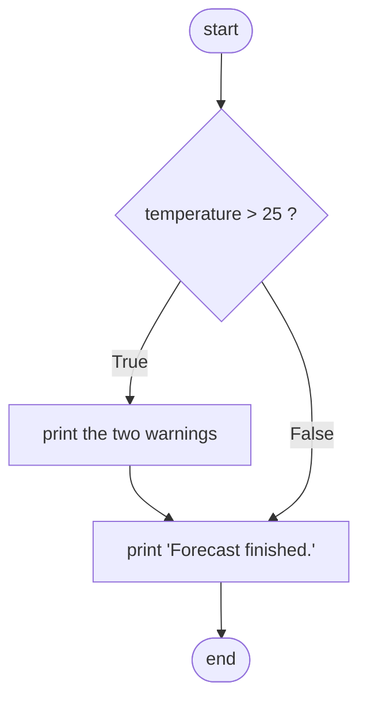
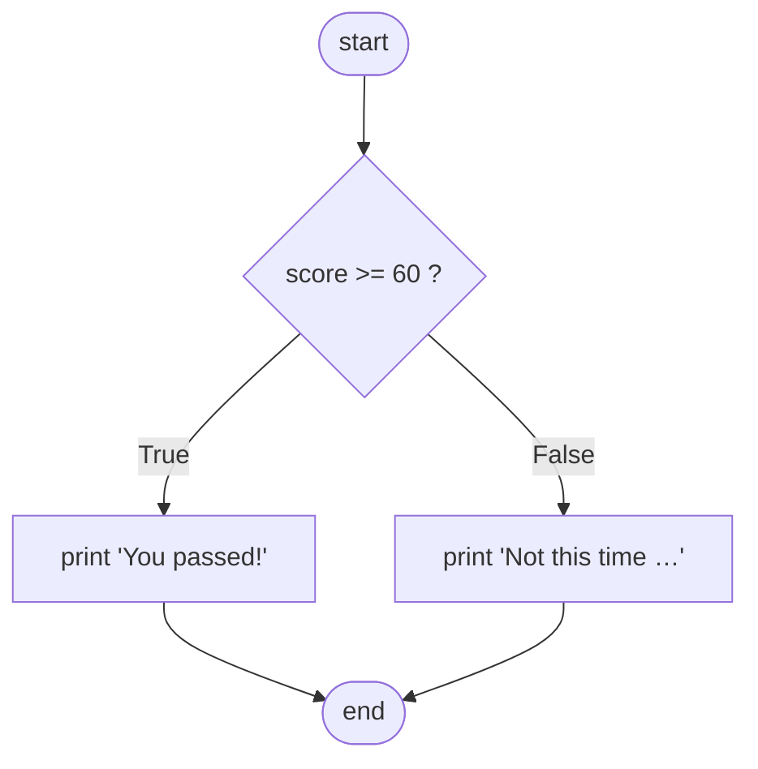
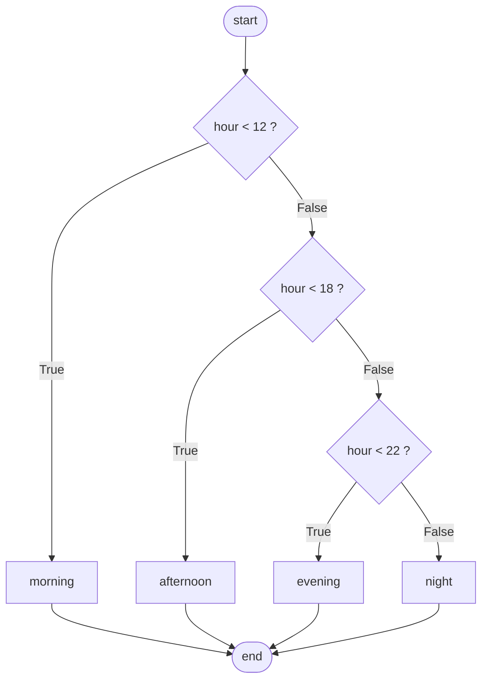

# 4.2 if, elif, else

You now know how to build a Boolean — this section is about *acting* on one.
The `if` statement is the fork in the road: it evaluates a condition and, on
`True`, runs a block of code that would otherwise be skipped. Add `else` and
`elif` and you can steer a program down any one of many paths. Along the way
we meet Python's most distinctive design decision: **indentation is not
decoration — it *is* the block structure.**

## Anatomy of an if statement

Four ingredients: the keyword `if`, a condition, a colon, and an indented
block underneath.

```python
temperature = 30

if temperature > 25:
    print("It's hot today.")
    print("Drink water.")      # same indentation — same block

print("Forecast finished.")     # not indented — always runs
```

This prints all three lines. Change `temperature` to `20` and run it again:
only `Forecast finished.` appears, because the two indented lines belong to
the `if` and are skipped when the condition is `False`.

The rule Python uses is beautifully simple: **every consecutive line indented
under the `if` is inside it; the first line back at the old indentation is
outside.** The standard indent is 4 spaces — pick that and never mix in tab
characters, or Python will refuse to run the file.

Here is the same program in Java. Where Python uses the colon and
indentation, Java uses braces `{ }` — and indentation in Java is purely
cosmetic:

=== "Python"

    ```python
    temperature = 30
    if temperature > 25:
        print("It's hot today.")
        print("Drink water.")
    print("Forecast finished.")
    ```

=== "Java"

    ```java
    int temperature = 30;
    if (temperature > 25) {          // parentheses required, braces mark the block
        System.out.println("It's hot today.");
        System.out.println("Drink water.");
    }
    System.out.println("Forecast finished.");
    ```

A one-way branch looks like this as a flowchart — note that `False` simply
*skips* the body:



## Two-way branches: else

Often you want *something* to happen on both outcomes: one thing when the
condition holds, another when it does not. That is `else` — it takes no
condition of its own, because it means "in every other case":

```python
score = 47

if score >= 60:
    print("You passed!")
else:
    print("Not this time — review and retry.")

print("(exactly one of the two lines above printed)")
```



Exactly one of the two branches runs — never both, never neither.

## Multi-way branches: elif

For more than two outcomes, chain conditions with `elif` (short for
"else if"). Python checks the conditions **top to bottom and runs only the
first one that is `True`**; the optional final `else` catches everything
that fell through.

```python
hour = 14

if hour < 12:
    print("Good morning")
elif hour < 18:
    print("Good afternoon")
elif hour < 22:
    print("Good evening")
else:
    print("Good night")
```

With `hour = 14`, the first test `14 < 12` fails, the second `14 < 18`
succeeds, so `Good afternoon` prints — and crucially, Python *never even
looks at* the remaining tests. Each `elif` silently carries an invisible
"and nothing above me matched".



Beware the impostor: a stack of *separate* `if` statements looks similar but
behaves completely differently, because every condition gets tested:

```python
score = 95

if score >= 90:
    print("A")
if score >= 80:
    print("B")      # this ALSO runs — 95 is >= 80 too!
if score >= 70:
    print("C")      # and so does this
```

This prints `A`, `B`, *and* `C`. When the outcomes are meant to be mutually
exclusive, you want one `if … elif … elif` chain, not three `if`s.

## Worked example: a letter-grade assigner

Let's build a real branching program in stages, the way you would at a
keyboard.

**Stage 1 — pass/fail.** Start with the simplest version that does anything:

```python
score = 83

if score >= 60:
    print("pass")
else:
    print("fail")
```

**Stage 2 — full letter grades.** Replace the two-way split with an `elif`
chain. The key design decision: test the *highest* boundary first, so that
each later test only sees scores the earlier ones rejected.

```python
score = 83

if score >= 90:
    print("A")
elif score >= 80:
    print("B")       # reached only when score < 90, so this means 80–89
elif score >= 70:
    print("C")
elif score >= 60:
    print("D")
else:
    print("F")
```

**Stage 3 — wrap it in a function and test the boundaries.** A grade
assigner you can call is more useful than one with the score baked in — and
testing values *on* each boundary (90, 60) as well as beside it (89, 59) is
how you catch off-by-one mistakes:

```python
def letter_grade(score):
    if score >= 90:
        return "A"
    elif score >= 80:
        return "B"
    elif score >= 70:
        return "C"
    elif score >= 60:
        return "D"
    else:
        return "F"

for s in [95, 90, 89, 72, 60, 59]:
    print(s, "->", letter_grade(s))
```

The output pairs each score with exactly the grade you would assign by hand
— `90 -> A` and `89 -> B` confirm the boundaries land on the right side.
(What happens if you reorder the tests lowest-first? Section
[4.4](04-switch-style-debug.md) dissects that bug.)

## Nesting — and how to flatten it

An `if` can live inside another `if`; the inner block simply indents one more
level. Nesting is sometimes exactly right, but each level pushes the real
work further from the margin and adds one more condition the reader must
hold in their head:

```python
user_exists = True
password_ok = True

if user_exists:
    if password_ok:
        print("Welcome!")
    else:
        print("Wrong password.")
else:
    print("No such user.")
```

When the nested conditions all guard the *same* success case, you can often
flatten them with `and`:

```python
user_exists = True
password_ok = True

if user_exists and password_ok:
    print("Welcome!")
else:
    print("Login failed.")      # (loses the specific reason, though)
```

Notice the trade-off: the flat version is shorter but no longer says *why*
the login failed. When you need distinct messages for distinct failures, the
cleanest structure is the next pattern.

## Guard patterns: early return

Inside a function, `return` ends the call immediately — and that enables the
**guard pattern**: check each disqualifying condition first, bail out at
once, and let the "happy path" sit unindented at the bottom. (Functions and
`return` are from
[Chapter 3](../ch03-functions/03-writing-functions.md).)

```python
def login_message(user_exists, password_ok, account_active):
    if not user_exists:
        return "No such user."          # guard 1
    if not password_ok:
        return "Wrong password."        # guard 2
    if not account_active:
        return "Account suspended."     # guard 3
    return "Welcome!"                   # main logic — zero nesting

print(login_message(True, True, True))
print(login_message(True, False, True))
print(login_message(False, True, True))
```

Three failure reasons, three separate messages, and no branch is ever more
than one level deep. Compare that with the three-level pyramid the nested
version of this function would need. Guards also shine for handling bad
input:

```python
def safe_divide(a, b):
    if b == 0:
        return None       # guard: refuse the impossible case
    return a / b

print(safe_divide(10, 4))   # 2.5
print(safe_divide(10, 0))   # None
```

!!! warning "Common mistakes"
    - **Forgetting the colon** after `if`, `elif`, or `else` — a
      `SyntaxError` pointing at the end of the line.
    - **Wrong or inconsistent indentation.** A body line indented 3 spaces
      under a 4-space block is an `IndentationError`; a line accidentally
      *un*indented silently leaves the block and always runs.
    - **A stack of `if`s where you meant `elif`.** If the cases are
      exclusive (a score has *one* grade), separate `if`s let several
      branches fire, as the A/B/C demo above showed.
    - **Code after `return` in the same branch** — it never runs. `return`
      leaves the function on the spot.

## Check your understanding

1. Without running it, what does this print?

    ```text
    x = 5
    if x > 10:
        print("big")
        print("really big")
    print("done")
    ```

    ??? success "Answer"
        Just `done`. Both `print` calls are indented, so both belong to the
        `if` block, and `5 > 10` is `False` — the whole block is skipped.

2. In the greeting example, what prints when `hour = 12`, and which tests
   does Python actually evaluate?

    ??? success "Answer"
        `Good afternoon`. Python evaluates `12 < 12` (`False`), then
        `12 < 18` (`True`), runs that branch, and skips the rest — the
        `hour < 22` test is never evaluated.

3. Why does `letter_grade(90)` return `"A"` and not `"B"`?

    ??? success "Answer"
        The first test is `score >= 90`, and `90 >= 90` is `True`, so the
        chain stops there. The `>=` (rather than `>`) puts the boundary
        value 90 into the A branch — exactly the kind of detail boundary
        testing is designed to confirm.

4. Rewrite this nested code as a single flat `if` with one condition:

    ```text
    if age >= 13:
        if age <= 19:
            print("teenager")
    ```

    ??? success "Answer"
        `if age >= 13 and age <= 19:` — or, most Pythonic of all, the
        chained comparison `if 13 <= age <= 19:` from
        [section 4.1](01-booleans-logic.md).
