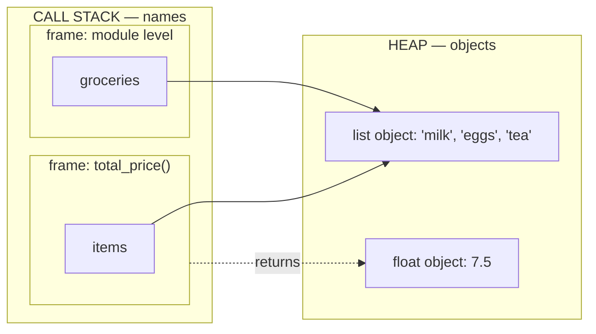
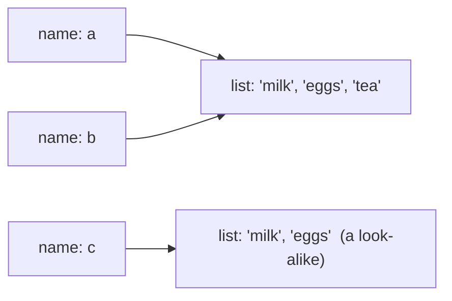

# 5.3 The stack and the heap

Where is a variable, actually? So far you have pictured variables as labelled
boxes, and that picture has served well — but it cannot explain why a change
to one list sometimes shows up in another, or how two functions can each have
their own `n` without colliding. The real picture has two places: a tidy
**call stack** of function workspaces that appear and vanish, and a big open
**heap** where the objects themselves live. Learn to draw this picture and an
entire category of "spooky action at a distance" bugs becomes something you
can predict before you run the code.

## Every call gets a frame

When Python calls a function, it creates a **frame** (also called a *stack
frame*): a fresh workspace holding that call's local names — its parameters
and local variables — plus a bookmark recording where to resume when the
function returns. Frames stack on top of each other, newest on top, and when
a function returns, its frame is destroyed. Last in, first out.

You can watch frames come and go by printing at each entry and exit:

```python
def make_coffee():
    print("    [make_coffee] frame created")
    print("    [make_coffee] frame destroyed")

def breakfast():
    print("  [breakfast] frame created")
    make_coffee()
    print("  [breakfast] back from make_coffee")
    print("  [breakfast] frame destroyed")

print("[main] program starts")
breakfast()
print("[main] back from breakfast — done")
```

Output:

```text
[main] program starts
  [breakfast] frame created
    [make_coffee] frame created
    [make_coffee] frame destroyed
  [breakfast] back from make_coffee
  [breakfast] frame destroyed
[main] back from breakfast — done
```

Read the indentation as the height of the stack. At the deepest moment, three
frames are alive at once — the module level (the "main" frame), `breakfast`,
and `make_coffee` on top. Then they unwind in reverse order: the most recently
created frame is always the first destroyed. (This trace is exactly what a
**stack trace** in an error message shows — the tower of frames alive at the
moment of the crash — and it powers recursion in
[Chapter 17](../ch17-recursion/01-call-stack.md).)

Because every call gets its *own* frame, two frames can hold the same name
without interfering:

```python
def double(n):
    n = n * 2        # this n lives in double's frame only
    return n

n = 10
print(double(n))     # 20
print(n)             # 10 — the outer n never changed
```

The `n` inside `double` and the `n` at module level are entries in two
different frames. Assigning to one does not touch the other — which is why
the second print still shows `10`.

## The heap: where the objects actually live

Here is the twist: frames hold *names*, but they do not hold the *objects*.
Every object — every number, string, and list — lives in the **heap**, a
large, unstructured pool of memory that objects are allocated from in
whatever order they are created. (A *list*, if you haven't met one yet, is an
object holding a sequence of values, like `["milk", "eggs"]`; lists get their
own treatment in [Chapter 7](../ch07-arrays/01-arrays-vs-lists.md).)

A name in a frame is only an *arrow* — a **reference** — pointing at an
object in the heap. Assignment copies arrows, never objects. Passing an
argument to a function copies an arrow into the new frame. Which means two
names, even in different frames, can point at **one and the same object**:



Both arrows aim at a single list. The code below builds exactly this picture
and asks Python to confirm it with the `is` operator from
[Chapter 4](../ch04-branching/03-equality-identity.md), which tests whether
two names point at the same object:

```python
def total_price(items):
    print("same object as groceries?", items is groceries)
    return 2.5 + 3.0 + 2.0

groceries = ["milk", "eggs", "tea"]
print("total:", total_price(groceries))
```

Output:

```text
same object as groceries? True
total: 7.5
```

The list was *not* copied into the function — only the arrow was. One list,
two names, in two different frames. This is why Python's way of passing
arguments is cheap (an arrow is a few bytes, even if the list holds a million
items) and why it has consequences we must respect: if a function *changes*
the object its parameter points at, the caller sees the change.

## Watching objects with `id()`

Python will happily tell you which object a name points at: the built-in
`id(x)` returns a number that uniquely identifies the object `x` refers to
(in CPython it is essentially the object's address in the heap). Two names
hold the same object exactly when their `id`s are equal — which is precisely
what `is` checks:

```python
a = ["milk", "eggs"]
b = a                  # copies the ARROW — no new list is made
c = ["milk", "eggs"]   # builds a brand-new list that merely looks the same

print(id(a) == id(b))  # True  — one object, two names
print(id(a) == id(c))  # False — a look-alike is a different object
print(a is b, a is c)  # True False — `is` asks the same question

b.append("tea")        # change the object through b...
print(a)               # ...and a sees it: ['milk', 'eggs', 'tea']
print(c)               # the look-alike is untouched: ['milk', 'eggs']
```

The last three lines are the "aha": `a` and `b` are **the same list**, so a
change made through either name is visible through both. `c` merely has equal
contents (so `a == c` was `True` before the append) but is its own object in
its own patch of heap.



When you find yourself asking "did my function change my caller's data?", stop
guessing: draw the arrows, or print `x is y` and let Python settle it.

## Garbage collection, in two paragraphs

If objects are created in the heap all the time, who cleans up? In languages
like C, the programmer must explicitly free every allocation — forget one and
the program slowly eats all available memory (a *memory leak*). Python instead
uses automatic **garbage collection**, built primarily on **reference
counting**: every object keeps a count of how many arrows currently point at
it. Assign `b = a` and the list's count rises; rebind `b = 3` or let a frame
be destroyed and the counts of everything that frame pointed to fall. The
instant an object's count hits zero — no name anywhere can reach it — Python
reclaims its memory on the spot. (Reference counting alone cannot free two
objects that point only at each other, so CPython adds a cycle detector that
periodically sweeps such orphaned rings.)

Java reaches the same goal by a different route: instead of counting
continuously, its garbage collector periodically *traces* every arrow
reachable from the running program and reclaims whatever was never reached.
Tracing batches the cleanup work (occasionally causing tiny "GC pauses"),
while reference counting pays as it goes. The practical upshot is the same in
both languages, and it is excellent news: you may freely create objects and
simply drop them — the runtime, not you, is responsible for taking out the
trash.

## Two names, one list — the door to Chapter 9

You now hold the chapter's most valuable picture: **names on the stack,
objects on the heap, assignment copies arrows.** It explains the `double(n)`
example (numbers are immutable, so the callee can only *rebind its own
arrow*), and it explains why `b.append("tea")` changed "both" lists — there
was only ever one list. What it opens up next: aliasing versus copying,
mutable versus immutable objects, and how Java's "primitives vs references"
split maps onto Python's everything-is-an-object world. That is the business
of [Chapter 9: values vs references](../ch09-collections/01-references.md) —
when you get there, this section is the foundation it builds on.

!!! warning "Common mistakes"
    - **Thinking `b = a` copies the data.** It copies an arrow. If the object
      is mutable (like a list), changes through `b` are visible through `a`.
    - **Expecting a function to modify the caller's *variable*.** Assigning
      to a parameter (`n = n * 2`) only moves the callee's own arrow; the
      caller's name is untouched. (Mutating the *object* the arrow points at
      is a different story — that the caller does see.)
    - **Using `==` when you mean `is`.** `a == c` asks "equal contents?";
      `a is c` asks "same object?". Two look-alike lists are `==` but not
      `is`.
    - **Worrying about freeing memory.** In Python (and Java) the garbage
      collector reclaims unreachable objects automatically; `del` removes a
      *name*, not necessarily the object.

## Check your understanding

1. Just before `make_coffee` finishes in the first example, how many frames
   are on the stack, and which is destroyed first afterwards?

    ??? success "Answer"
        Three: the module-level frame, `breakfast`, and `make_coffee` on top.
        Frames are destroyed newest-first, so `make_coffee`'s goes first —
        last in, first out.

2. After `x = [1, 2]; y = x; y = [1, 2, 3]`, does `x` change? What does
   `x is y` print?

    ??? success "Answer"
        `x` is still `[1, 2]`. The third line does not modify the first list —
        it *rebinds* the name `y` to a brand-new list. `x is y` prints
        `False`.

3. After `p = [1, 2]; q = p; q.append(3)`, what are `p` and `p is q`?

    ??? success "Answer"
        `p` is `[1, 2, 3]` and `p is q` is `True`. `q = p` copied the arrow,
        so `q.append(3)` changed the one shared list that both names point at.

4. In one sentence each: what does the stack hold, and what does the heap
   hold?

    ??? success "Answer"
        The stack holds one frame per active function call, each mapping local
        names to references (arrows). The heap holds the objects themselves —
        every number, string, and list — for as long as at least one reference
        can still reach them.
