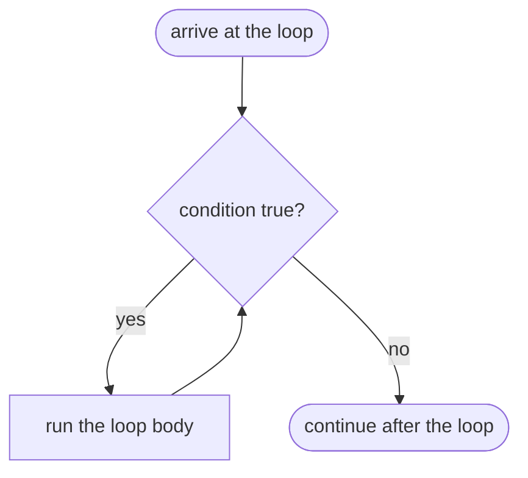

# 6.1 while and do-while

A program that can only run each line once is like a recipe that can only
stir the pot a single time. The `while` loop removes that limit: it runs a
block of code *repeatedly, for as long as a condition stays true*. Mastering
one small discipline — initialize, test, update — is the difference between
loops that work and loops that spin forever, so this section drills that
discipline into three patterns you will reuse for the rest of the book:
counters, accumulators, and sentinels.

## The anatomy of a while loop

A `while` loop has two parts: a **condition** (any boolean expression, exactly
like the ones you wrote in [Chapter 4](../ch04-branching/01-booleans-logic.md))
and an indented **body**. Python checks the condition *before every pass*: if
it is `True`, the body runs once and control jumps back up to the check; if it
is `False`, the loop is skipped or exited and the program continues below.



```python
countdown = 3
while countdown > 0:
    print(countdown)
    countdown -= 1
print("Liftoff!")
```

The body ran three times — with `countdown` equal to 3, then 2, then 1. When
`countdown` reached 0 the condition `countdown > 0` became `False`, so the
body did *not* run a fourth time and `print("Liftoff!")` took over. Note that
the condition is checked *first*: if `countdown` had started at 0, the body
would never have run at all.

## Initialize, test, update

Every well-behaved `while` loop answers three questions, usually on three
separate lines:

1. **Initialize** — where does the loop variable start? (`countdown = 3`)
2. **Test** — when do we keep going? (`while countdown > 0:`)
3. **Update** — how does each pass move us toward stopping?
   (`countdown -= 1`)

If any of the three is missing or inconsistent with the others, the loop runs
the wrong number of times — or forever. Here is the countdown traced pass by
pass. A **trace table** like this is the single best tool for understanding
any loop: one row per check of the condition.

| check # | `countdown` at the test | `countdown > 0`? | body runs? | printed |
| ------- | ----------------------- | ----------------- | ---------- | ------- |
| 1       | 3                       | `True`            | yes        | `3`     |
| 2       | 2                       | `True`            | yes        | `2`     |
| 3       | 1                       | `True`            | yes        | `1`     |
| 4       | 0                       | `False`           | no         | —       |

The condition is tested **four** times but the body runs only **three** —
the final test is the one that says "stop". That off-by-one distinction trips
up almost every beginner at least once.

## Counter loops

A **counter loop** uses the loop variable to count passes: run the body
exactly $n$ times, numbered $1$ through $n$.

```python
lap = 1
while lap <= 5:
    print("lap", lap)
    lap += 1
print("race over after", lap - 1, "laps")
```

After the loop, `lap` is 6 — the first value that *failed* the test — which
is why the last line prints `lap - 1`. Whenever you use a loop variable after
the loop ends, pause and ask what value it actually holds; it is never the
last value that ran the body.

## Accumulator loops

An **accumulator loop** carries a running result in a second variable and
folds one value into it per pass. Three classics, one idea. First, a running
**sum**:

```python
total = 0          # the accumulator starts empty
n = 1
while n <= 100:
    total += n     # fold the current value in
    n += 1
print("1 + 2 + ... + 100 =", total)
```

The result is 5050 — the sum a young Gauss famously computed in his head, and
your loop verified it in a few microseconds. The accumulator `total` starts
at 0 because 0 is the identity for addition: adding it changes nothing.

For a running **product**, the starting value must be 1 instead — starting a
product at 0 would keep it 0 forever:

```python
product = 1        # 1 is the identity for multiplication
n = 1
while n <= 5:
    product *= n
    n += 1
print("5! =", product)
```

This prints `5! = 120`, the factorial $5! = 1 \times 2 \times 3 \times 4
\times 5$. Finally, a **count** — accumulating how many times something
happened. Here we count digits by repeatedly chopping the last one off with
integer division:

```python
n = 90210
digits = 0
while n > 0:
    n //= 10       # chop off the last digit
    digits += 1
print("90210 has", digits, "digits")
```

Each pass makes `n` ten times smaller (rounding down): 90210, 9021, 902, 90,
9, 0 — five chops, so five digits. Notice this loop's "update" shrinks `n`
rather than growing a counter toward a limit; what matters is only that every
pass makes progress toward the condition failing.

## Sentinel-controlled loops

Sometimes you do not know how many items are coming — you process data *until
a special stop value appears*. That stop value is called a **sentinel**, and
by convention it is a value that could never be real data (a negative score,
an empty string).

As everywhere in this handbook, we hard-code the "typed" values into a list
instead of calling `input()` (see
[reading input](../ch02-data/04-math-input.md) for why); the logic is
identical.

```python
# Scores arrive one at a time; -1 means "no more scores".
entries = [83, 91, 78, -1, 99]   # imagine the user typed these
i = 0
total = 0
count = 0
while entries[i] != -1:
    total += entries[i]
    count += 1
    i += 1
print(f"read {count} scores, average {total / count:.1f}")
```

The loop reads 83, 91, and 78, then the test sees `-1` and stops — printing
`read 3 scores, average 84.0`. Two details deserve a hard look. The sentinel
itself is **tested but never processed**: `-1` is not added to `total`. And
the `99` after the sentinel is never even looked at — a sentinel means "stop
reading", not "skip this one".

## do-while: run first, ask later

Java (like C and C++) has a second loop, `do-while`, whose condition is
tested at the *bottom* — so the body is guaranteed to run **at least once**.
That shape is perfect for "attempt, then check whether to retry" problems
like input validation or guessing games. Python has no `do-while` statement;
the idiomatic emulation is `while True:` with a `break` at the point where
the test belongs.

=== "Python"

    ```python
    secret = 7
    guesses = [3, 9, 7]        # imagine the user typed these
    i = 0
    while True:                # body always runs first ...
        guess = guesses[i]
        i += 1
        print("you guessed", guess)
        if guess == secret:    # ... the test happens after
            break
    print("correct!")
    ```

=== "Java"

    ```java
    Scanner in = new Scanner(System.in);
    int secret = 7;
    int guess;
    do {
        guess = in.nextInt();                 // body always runs first ...
        System.out.println("you guessed " + guess);
    } while (guess != secret);                // ... the test happens after
    System.out.println("correct!");
    ```

Both versions print all three guesses and then `correct!`. Note the flipped
logic: Java's `while (guess != secret)` says *keep going*, while Python's
`if guess == secret: break` says *stop* — the same test, viewed from opposite
sides. `while True` looks alarming at first ("isn't that infinite?"), but
paired with a reachable `break` it is a respected, idiomatic pattern — not a
bug.

## Infinite loops

An **infinite loop** is a loop whose condition never becomes false. Your
program stops responding and, in a terminal, prints forever until you kill it
with ++ctrl+c++. Here is the classic — shown as plain text on purpose, so
there is no Run button to trap you:

```text
# DO NOT RUN — this loop never ends
n = 10
while n > 0:
    print(n)      # we forgot to update n, so n stays 10 forever
```

Nearly every infinite loop has one of three causes, and all three are
failures of the initialize–test–update discipline:

1. **Forgot the update.** As above: no line changes `n`, so the condition's
   answer can never change.
2. **The update moves the wrong way.** `n += 1` under `while n > 0:` makes
   `n` *larger* every pass — the test only gets more true.
3. **The condition can never be reached.** `while n != 0:` with `n` starting
   at 9 and updating by `n -= 2` steps 9, 7, 5, 3, 1, −1, … right *past*
   zero. The loop makes progress, but toward a value the test never matches —
   which is why `while n > 0:` is safer than `while n != 0:`.

Here is the fixed version of the broken loop above, with the update restored:

```python
n = 10
while n > 0:
    print(n, end=" ")
    n -= 1
print()
print("done — n is now", n)
```

Ten numbers, then it stops with `n` at 0. Progress every pass, toward a
condition that must eventually fail: that is the whole recipe.

## A debugging ritual: print the loop variable

When a loop misbehaves — wrong count, wrong total, never stops — resist the
urge to stare at the code. Instead, make the loop *show you* what it is
doing: print the loop variable (and any accumulator) at the top of every
pass, run it, and compare against the trace table you expected.

```python
n = 3
total = 0
while n > 0:
    print(f"pass starts: n = {n}, total = {total}")
    total += n
    n -= 1
print(f"loop over:   n = {n}, total = {total}")
```

Each line is one row of a live trace table: `n` marches 3, 2, 1 while `total`
grows 0, 3, 5, and the final line confirms `n = 0, total = 6`. If the printed
story disagrees with the story in your head, the bug is at the first line
where they differ. When the loop is fixed, delete the print — it did its job.

!!! warning "Common mistakes"

    - **Forgetting the update line.** The #1 cause of infinite loops. Every
      `while` body must change something the condition looks at.
    - **Off-by-one boundaries.** `while n < 5` runs the body for 1, 2, 3, 4;
      `while n <= 5` includes 5. Trace one pass at each edge to check which
      you meant.
    - **Processing the sentinel.** Testing `entries[i] != -1` *after* adding
      `entries[i]` to the total folds the sentinel into your data. Test
      first, process second.
    - **Trusting the loop variable after the loop.** When the loop exits, the
      variable holds the first value that *failed* the test (the countdown
      ends with `n == 0`, the lap counter with `lap == 6`) — not the last
      value that ran the body.

## Check your understanding

1. How many times does this loop's body run, and what is `n` afterwards?

    ```text
    n = 0
    while n < 3:
        print("hi")
        n += 1
    ```

    ??? success "Answer"
        The body runs **three** times (for `n` = 0, 1, 2). Afterwards `n` is
        **3** — the first value for which `n < 3` was `False`. The condition
        itself was tested four times.

2. This sentinel loop is supposed to average the scores before the `-1`, but
   it prints the wrong answer. What went wrong?

    ```text
    entries = [80, 90, -1]
    i = 0
    total = 0
    count = 0
    while i < len(entries):
        total += entries[i]
        count += 1
        if entries[i] == -1:
            break
        i += 1
    print(total / count)
    ```

    ??? success "Answer"
        It processes the sentinel before testing it: `-1` is added to
        `total` and counted, giving $(80 + 90 - 1)/3 = 56.33\ldots$ instead
        of $(80 + 90)/2 = 85$. The sentinel test must come *before* the
        value is folded in — for example `while entries[i] != -1:` as in
        this section's example.

3. Why does the `while True:` … `break` pattern guarantee the body runs at
   least once, when a plain `while` does not?

    ??? success "Answer"
        A plain `while` tests its condition *before* the first pass, so a
        condition that starts out `False` skips the body entirely. In the
        `while True:` pattern the only exit test is the `if … break`
        *inside* the body — so the body must begin executing before any
        test can stop it. That is exactly the behaviour of Java's
        `do-while`, which tests at the bottom.
