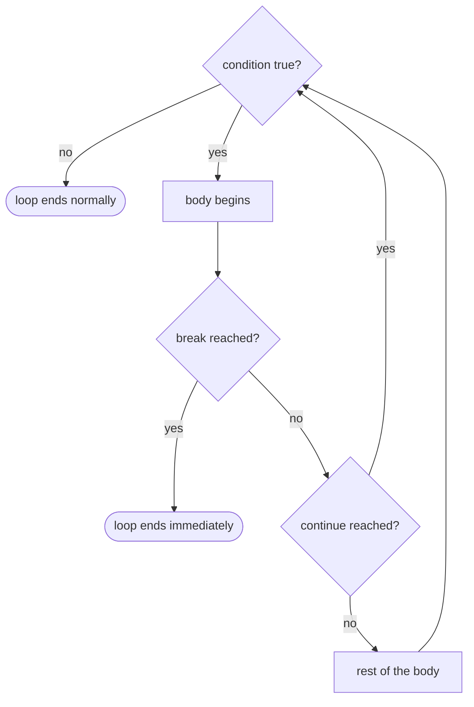

# 6.3 Nested loops, break, continue

Put a loop inside another loop and you can sweep a *grid* instead of a line —
every row of a spreadsheet, every pixel of an image, every (row, column)
cell of a game board. Add `break` and `continue` and you gain precise
control over *which* passes actually run. These tools are where loops stop
being a syntax topic and start being a thinking tool, so this section leans
hard on tracing: if you can predict a nested loop's output before running
it, you own this chapter.

## One loop inside another

When one loop's body contains another loop, the **inner loop runs to
completion on every single pass of the outer loop**. That sentence is the
whole secret of nested loops — everything else is bookkeeping.

```python
for row in range(1, 4):
    for col in range(1, 3):
        print(f"(row {row}, col {col})", end="  ")
    print()   # end the row with a newline
```

Each outer pass prints one full line: the inner loop runs *both* of its
passes (`col` = 1, 2) before `row` is allowed to advance. The bare
`print()` matters — the inner loop uses `end="  "` to stay on one line, so
someone must finally print the newline. Here is the trace:

| outer pass | `row` | inner loop runs for `col` = | printed on this line |
| ---------- | ----- | --------------------------- | -------------------- |
| 1          | 1     | 1, 2                        | `(row 1, col 1)  (row 1, col 2)` |
| 2          | 2     | 1, 2                        | `(row 2, col 1)  (row 2, col 2)` |
| 3          | 3     | 1, 2                        | `(row 3, col 1)  (row 3, col 2)` |

Total inner-body executions: $3 \times 2 = 6$. In general, nesting
multiplies: an outer loop of $m$ passes around an inner loop of $n$ passes
runs the inner body $m \times n$ times.

## The times table

The classic nested-loop showpiece: `row` sweeps the rows, `col` sweeps the
columns, and the cell value is their product. The f-string format `:4`
right-aligns every number in 4 characters so the columns line up.

```python
for row in range(1, 10):
    for col in range(1, 10):
        print(f"{row * col:4}", end="")
    print()
```

Run it: a full 9 × 9 multiplication table, 81 products, from four lines of
code. Cover the code and ask yourself where `72` will appear — row 8
column 9 and row 9 column 8 — then check. If the `:4` puzzles you, revisit
[formatting output](../ch03-functions/04-output-formatting.md); without it
the columns collapse into a ragged mess.

## Star patterns

Pattern printing is the traditional nested-loop workout, because the inner
loop's length must *depend on* the outer loop's variable. A left-aligned
triangle first — row $r$ contains exactly $r$ stars:

```python
n = 5
for row in range(1, n + 1):
    for star in range(row):     # inner bound depends on the outer variable
        print("*", end="")
    print()
```

The inner loop runs 1, then 2, … then 5 times, producing the growing
staircase. (Python's string repetition `"*" * row` could replace the inner
loop — handy, but the nested version is the transferable skill; Java has no
`"*" * row`.)

The centered **pyramid** adds a second inner job: print spaces before the
stars. Row $r$ of an $n$-row pyramid needs $n - r$ spaces then $2r - 1$
stars:

```python
n = 5
for row in range(1, n + 1):
    for _ in range(n - row):        # leading spaces
        print(" ", end="")
    for _ in range(2 * row - 1):    # the stars
        print("*", end="")
    print()
```

Two inner loops in sequence, both governed by `row`: 4 spaces + 1 star,
3 spaces + 3 stars, … 0 spaces + 9 stars. The variable name `_` is a Python
convention meaning "this loop variable is never used — we only care about
the repetition count."

## break: leave the loop now

`break` ends the *current* loop immediately — no more passes, no finishing
the current pass — and execution continues at the first line after the
loop. `continue` is gentler: it abandons only the *rest of the current
pass* and jumps straight back to the loop's next test.



`break` shines when continuing would be useless or dangerous — here it
stops before a division by zero can happen:

```python
data = [7, 3, 0, 8, 4]
for x in data:
    if x == 0:
        print("hit a zero — stopping before dividing")
        break
    print(f"10 // {x} = {10 // x}")
```

The loop processes 7 and 3, meets 0, and leaves — 8 and 4 are never
touched. In practice, `break` almost always sits inside an `if`; an
unconditional `break` would make the loop pointless.

## continue: skip this pass

```python
total = 0
for n in range(1, 11):
    if n % 2 == 1:
        continue        # odd — skip the rest of this pass
    total += n
print("sum of evens 1..10 =", total)
```

For odd `n`, `continue` jumps back to the loop header before `total += n`
can run, so only $2 + 4 + 6 + 8 + 10 = 30$ accumulates. Use `continue`
sparingly: `if n % 2 == 0: total += n` says the same thing positively, and
most style guides prefer that when the skipped part is short. `continue`
earns its keep when the "skip" cases are many and the main logic is long.

## break only exits one level

The single most common `break` misconception: **`break` exits only the
innermost loop that contains it.** The outer loop carries on as if nothing
happened. Watch it fail to stop a grid search:

```python
grid = [[5, 9, 2],
        [7, 3, 8],
        [1, 6, 4]]
target = 3
for r in range(3):
    for c in range(3):
        if grid[r][c] == target:
            print(f"found {target} at row {r}, col {c}")
            break                 # exits the INNER loop only
    print(f"finished scanning row {r}")
```

The target is found in row 1 — yet "finished scanning row 2" still prints,
because `break` ended only the column loop; the row loop dutifully
continued. Two clean patterns fix this. The **found-flag** pattern lets the
outer loop see that the inner loop succeeded:

```python
grid = [[5, 9, 2],
        [7, 3, 8],
        [1, 6, 4]]
target = 3
found = False
for r in range(3):
    for c in range(3):
        if grid[r][c] == target:
            print(f"found {target} at row {r}, col {c}")
            found = True
            break                 # exit the inner loop ...
    if found:
        break                     # ... then exit the outer loop too
print("search over")
```

Now the search stops for real: the flag is checked right after the inner
loop, and the outer `break` fires before row 2 is ever scanned. Cleaner
still, when the search lives in a function, is the **return pattern** —
`return` exits *every* loop level at once:

```python
def find(grid, target):
    for r in range(len(grid)):
        for c in range(len(grid[r])):
            if grid[r][c] == target:
                return r, c       # leaves both loops AND the function
    return None                   # exhausted the grid: not found

grid = [[5, 9, 2], [7, 3, 8], [1, 6, 4]]
print(find(grid, 3))
print(find(grid, 42))
```

`(1, 1)` and `None` — and the function reads as a plain statement of the
algorithm, with no flag to maintain. When you find yourself wanting a
multi-level `break`, that is usually the code asking to become a function.

## The curious loop-else

Python only, and honestly a bit obscure: a `for` or `while` loop may have an
`else` clause, which runs **only if the loop finished without hitting
`break`**. Think of it as the "not found" branch of a search:

```python
n = 91
for d in range(2, n):
    if n % d == 0:
        print(f"{n} = {d} * {n // d} — not prime")
        break
else:                     # no break happened: no divisor was found
    print(f"{n} is prime")
```

Since $91 = 7 \times 13$, the `break` fires and the `else` is skipped; try
the same shape with a prime like 97 and the `else` line is the one that
prints. This is genuinely handy for search loops — it replaces a found-flag
— but it confuses many readers (it looks like it should mean "if the loop
never ran", which it does not). Java has no equivalent, and plenty of
working Python programmers avoid it; recognise it when you see it, and reach
for it only when it makes code clearly shorter.

!!! warning "Common mistakes"

    - **Reusing the same variable for both loops.** `for i in ...:` nested
      inside `for i in ...:` makes the inner loop clobber the outer loop's
      variable each pass — name them after their roles: `row`/`col`,
      `r`/`c`.
    - **Expecting `break` to exit everything.** It exits one level. Use a
      found-flag or move the loops into a function and `return`.
    - **Forgetting the bare `print()`** after an inner loop that used
      `end=""` — all your rows melt into one endless line.
    - **Confusing `break` and `continue`.** `break` = "no more passes at
      all"; `continue` = "skip the rest of *this* pass only". If unsure,
      trace three passes by hand.

## Check your understanding

1. An outer loop runs 4 passes and its body contains an inner loop that runs
   3 passes. How many times does the *inner body* execute in total?

    ??? success "Answer"
        $4 \times 3 = 12$ times — the inner loop runs all 3 of its passes on
        each of the outer loop's 4 passes.

2. Predict the exact output before tracing:

    ```text
    for i in range(1, 4):
        for j in range(1, 4):
            if j > i:
                continue
            print(i, j, sep="-", end=" ")
        print()
    ```

    ??? success "Answer"
        ```text
        1-1 
        2-1 2-2 
        3-1 3-2 3-3 
        ```
        For each `i`, the pairs with `j > i` are skipped by `continue` but
        the inner loop keeps going — so row `i` shows the pairs `i-1`
        through `i-i`. (With `break` instead of `continue` the output would
        be identical here, since once `j > i` becomes true it stays true —
        but only `break` would save the wasted passes.)

3. When does a loop's `else` clause run, and when does it not?

    ??? success "Answer"
        It runs when the loop terminates *normally* — the `for` sequence is
        exhausted or the `while` condition turns false — and is skipped
        whenever the loop is left via `break`. A loop that runs zero passes
        still triggers its `else`, which is the counter-intuitive part.

4. Without a found-flag or loop-else, what is the cleanest way to stop a
   search that lives inside two nested loops the moment it succeeds?

    ??? success "Answer"
        Put the nested loops in a function and `return` the result at the
        moment of success — `return` unwinds every loop level at once, and
        the `return None` (or a sentinel result) after the loops handles
        the not-found case.
