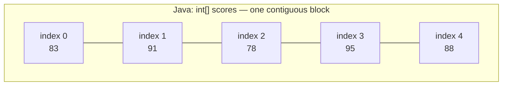
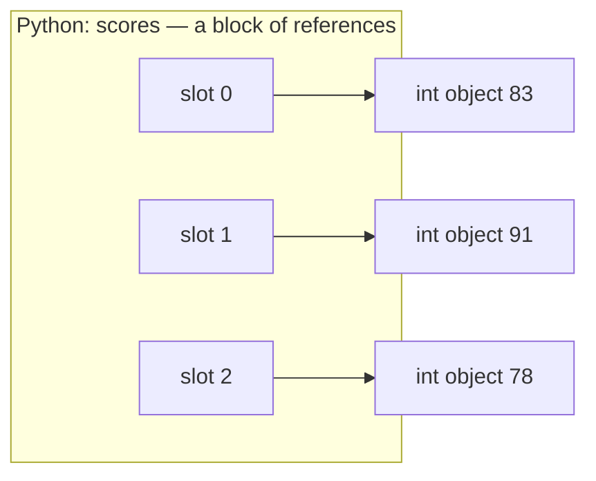

# 7.1 Arrays vs Python lists

Imagine a teacher who wants the class average of 100 test scores. With only
the tools from earlier chapters, that program needs 100 variables —
`score1`, `score2`, … `score100` — and an addition expression 100 names
long. This section introduces the fix: a **collection**, one variable that
holds many values in numbered slots.

You will meet the Java **array** and the Python **list**, learn why their
slots are numbered from 0, and see what happens when you reach past the last
slot. We finish with NumPy, the library that gives Python a "real" array when
it needs one.

## One variable per value does not scale

Here is the 100-scores program, mercifully cut down to three:

```python
score1 = 83
score2 = 91
score3 = 78
# ...imagine 97 more lines like these...

average = (score1 + score2 + score3) / 3
print(average)
```

It prints `84.0`, and it *works* — but look at the cost. Three problems, and
every one of them gets worse as the class gets bigger:

- **Every new score costs two edits**: a new variable *and* a longer average
  line.
- **A loop cannot help.** Variable names are fixed in the source code, so no
  loop can manufacture `score1 … score100`.
- **The program can never ask "how many scores do I have?"** That number is
  smeared across a hundred lines.

A collection solves all three problems at once:

```python
scores = [83, 91, 78, 95, 88, 67, 74, 90, 82, 79]

print(len(scores))                # how many values? one call
print(sum(scores) / len(scores))  # the average, however many there are
```

This prints `10` and then `82.7`. One variable, `scores`, holds all ten
values. `len(scores)` — read "length of scores" — reports how many there
are. Best of all, this code does not change *at all* if the list grows to
a thousand entries. That is what "scales" means.

## Two flavours: Java arrays and Python lists

Your Java course and this handbook use different collections for the same
job, and the differences are worth seeing side by side.

=== "Python"

    ```python
    scores = [83, 91]      # a list literal: values in square brackets
    scores.append(78)      # lists can GROW after creation
    print(scores)
    print(len(scores))
    ```

=== "Java"

    ```java
    int[] scores = new int[5];   // five slots, ALL start at 0
    scores[0] = 83;
    scores[1] = 91;
    System.out.println(scores.length);   // 5 — a field, not a method

    int[] primes = {2, 3, 5, 7, 11};     // literal form, sized to fit
    ```

The Python block prints `[83, 91, 78]` and `3`. The key contrasts:

| Property | Java array | Python list |
|---|---|---|
| Create | `new int[5]` or `{2, 3, 5}` | `[83, 91]` |
| Length | `scores.length` (fixed forever) | `len(scores)` (can change) |
| Grow / shrink | impossible — make a new array | `append`, `pop`, … |
| Element types | one declared type only (`int[]`) | anything, even mixed |
| Unset slots | defaults: `0`, `0.0`, `false`, `null` | no such thing — you supply every value |

A Java array's length is chosen at creation and never changes; asking for
a sixth slot in a five-slot array is an error, not a growth opportunity.
Python lists grow on demand (Chapter 9 explains the trick behind that).

Python's "anything goes" typing is real but should be used sparingly:

```python
grab_bag = [42, "hello", 3.14, True]
for item in grab_bag:
    print(type(item).__name__, item)
```

```text
int 42
str hello
float 3.14
bool True
```

Python happily stores four different types in one list. Resist the
temptation: code that processes a list usually assumes every element
supports the same operations, and a stray string in a list of numbers
crashes the `sum()` that worked yesterday. Treat "one list, one type" as a
rule of style even though Python does not enforce it.

## Why counting starts at zero

Both languages number the slots — the **indexes** — starting from 0, not
1. This is not a historical accident to memorise; it is a description of
where the element lives. The index answers the question *"how many steps
from the start?"* The first element is zero steps from the start, so its
index is 0.

```python
letters = ["a", "b", "c", "d"]
print(letters[0])    # zero steps from the start
print(letters[3])    # three steps from the start
print(len(letters))  # 4 elements ...
```

This prints `a`, then `d`, then `4` — and there is the trap every beginner
falls into once: the list has **length 4**, but its **last index is 3**.
In general, a collection of length $n$ has legal indexes $0$ through
$n-1$. The last element is always `letters[len(letters) - 1]`.

| index | 0 | 1 | 2 | 3 |
|---|---|---|---|---|
| value | `"a"` | `"b"` | `"c"` | `"d"` |

Indexing works the same in Java: `letters[0]` is the first element,
`letters[letters.length - 1]` the last.

## Negative indexes (Python only)

Because "last element" comes up constantly, Python adds a shortcut Java
does not have: a negative index counts backwards from the end. Index `-1`
is the last element, `-2` the one before it, and so on.

```python
letters = ["a", "b", "c", "d"]
print(letters[-1])                  # last
print(letters[-2])                  # second to last
print(letters[len(letters) - 1])    # the long way to say -1
```

This prints `d`, `c`, `d`. Under the hood, `letters[-k]` simply means
`letters[len(letters) - k]` — Python does the subtraction for you.

!!! info "Java corner"
    Java has no negative indexing. `letters[-1]` in Java throws an
    `ArrayIndexOutOfBoundsException` at run time, exactly as `letters[4]`
    would. The only way to say "last" is `letters[letters.length - 1]`.

## Stepping off the end

What if you ask for index 5 in a five-element list? The legal indexes are
0–4, so both languages stop your program with an error rather than hand
you garbage from a neighbouring patch of memory.

```python
# raises IndexError
scores = [83, 91, 78, 95, 88]
print(scores[5])    # legal indexes are 0..4
```

Running this shows a traceback ending in:

```text
IndexError: list index out of range
```

Read that as "the index you used does not name a slot in this list." The
usual cause is an off-by-one mistake — using `len(scores)` itself as an
index, or looping one step too far.

!!! info "Java corner"
    Java's version is more talkative. `scores[5]` on a five-element array
    throws
    `ArrayIndexOutOfBoundsException: Index 5 out of bounds for length 5`,
    which tells you both the bad index and the array's length. Same
    disease, same cure: the last legal index is `length - 1`.

## The memory picture

Why does Java insist on one type and a fixed length while Python is so
relaxed? Because the two structures are built differently in memory.

A Java `int[]` is one solid, contiguous block: five `int`-sized slots
sitting side by side. That is why the type and length are locked in — the
block was measured and allocated in one piece.



A Python list is a contiguous block too — but a block of **references**
(arrows pointing at objects), not of the values themselves. Each slot
holds an arrow; the actual `int` objects live elsewhere. An arrow can
point at anything, which is exactly why a list can mix types and why it
can grow: the arrows are all the same size no matter what they point to.



Both designs share the property that makes collections fast: to find slot
$i$, the computer computes $\text{start address} + i \times \text{slot
size}$ — one multiplication and one addition, no matter how long the
collection is.
That is why `scores[9999]` is exactly as fast as `scores[0]`. References
return in force in [Chapter 9](../ch09-collections/01-references.md);
for now, the picture above is all you need.

## NumPy: Python's "real" array

Python's arrows-to-objects design is flexible but costs memory and speed:
a million-element list is a million arrows plus a million separate `int`
objects. For serious number crunching, Python programmers reach for
**NumPy**, a library whose `ndarray` type is built like a Java array — one
contiguous block of raw values, all the same type.

```python
import numpy as np

scores = np.array([83, 91, 78, 95, 88])
curved = scores + 5          # one line updates EVERY element
print(curved)
print(scores.mean())
```

```text
[ 88  96  83 100  93]
87.0
```

Two things to notice:

- **`scores + 5` added 5 to *all five elements*** in one expression, with no
  loop in sight. NumPy runs that loop internally in fast compiled code, which
  is the main reason the library exists.
- **The array carries a `dtype`** ("data type"): the single type that every
  element must have.

```python
import numpy as np

a = np.array([1, 2, 3], dtype=np.int64)
print(a.dtype)

mixed = np.array([1, 2.5, 3])   # an int among floats?
print(mixed.dtype)              # NumPy converts them ALL to float
```

```text
int64
float64
```

Where a Python list would happily store `[1, 2.5, 3]` as an `int` and two
`float`s, NumPy converts everything to one common dtype — here `float64`.
And like a Java array, an ndarray enforces its type when you assign:

```python
import numpy as np

counts = np.array([1, 2, 3])
counts[0] = 2.9                 # a float into an integer array...
print(counts)
```

This prints `[2 2 3]` — the `2.9` was **truncated** to `2` to fit the
integer dtype, with no error. NumPy arrays are also fixed-length, exactly
like Java arrays.

Rule of thumb: use a plain `list` for everyday programs and mixed jobs;
use NumPy when you have thousands of numbers and want speed or
whole-array math. We will use both in the rest of this handbook.

!!! warning "Common mistakes"
    - **Using the length as an index.** `scores[len(scores)]` is always an
      `IndexError`; the last element is `scores[len(scores) - 1]` (or
      `scores[-1]` in Python).
    - **Expecting index 1 to be the first element.** `scores[1]` is the
      *second* value. If a result looks shifted by one, check your
      indexes first.
    - **Treating a Java array like a Python list.** Java arrays have no
      `append`; their length is fixed at creation. Growing means
      allocating a new, larger array.
    - **Mixing types in a list because you can.** `[42, "42"]` is legal
      Python and a reliable source of surprising `TypeError`s later. Keep
      each list to one type.

## Check your understanding

1. A list has 8 elements. What is its smallest legal index, and its
   largest?

    ??? success "Answer"
        Smallest 0, largest 7. A collection of length $n$ has legal
        indexes $0$ through $n-1$, because an index is a count of steps
        from the start — and the first element is zero steps away.

2. What does `words[-1]` mean in Python, and what happens if you try the
   same thing in Java?

    ??? success "Answer"
        In Python it is the last element — shorthand for
        `words[len(words) - 1]`. In Java a negative index throws an
        `ArrayIndexOutOfBoundsException`; you must write
        `words[words.length - 1]`.

3. `np.array([3, 7, 2.5])` — what is the dtype of the result, and why?

    ??? success "Answer"
        `float64`. A NumPy array stores exactly one type, so NumPy picks
        a type that can represent every value given. Since `2.5` needs a
        float, the integers `3` and `7` are converted to floats too.

4. Why is `scores[500000]` no slower than `scores[0]`?

    ??? success "Answer"
        The slots sit at evenly spaced positions, so the computer finds
        slot $i$ with one arithmetic step: start address plus $i$ times
        the slot size. No searching or walking is involved, so the cost
        does not depend on $i$ or on the length of the list.
