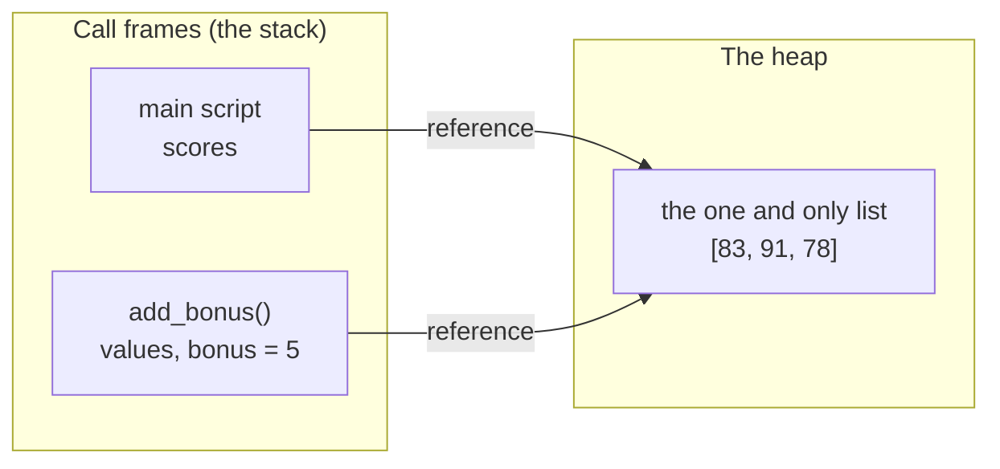

# 8.2 Arrays and functions together

Sooner or later you pass a list to a function — and discover that the
function can change *your* list, the one back at the call site. This is
not a bug; it is the single most important fact about how lists and
functions interact.

Misunderstanding it produces two opposite surprises:

- functions that change data you wanted left alone;
- functions that mysteriously change nothing at all.

This section builds the mental model that predicts both.

## A list argument is a reference

When you call `f(scores)`, Python does not ship a copy of the list into
the function. It copies the **reference** — the arrow pointing at the
list object. The parameter inside the function and the variable outside
it are two arrows aimed at *one* list. So when the function modifies the
list through its arrow, the caller sees every change:

```python
def add_bonus(values, bonus):
    """Add bonus points to every score, in place."""
    for i in range(len(values)):
        values[i] += bonus

scores = [83, 91, 78]
add_bonus(scores, 5)
print(scores)
```

This prints `[88, 96, 83]` — the caller's list changed, even though the
function never used the name `scores` and returned nothing. Here is the
moment mid-call, drawn as frames and heap
(see [the stack and the heap](../ch05-under-the-hood/03-stack-heap.md)):



Two frames, two names, **one list**. `values[i] += bonus` follows the
arrow and edits the shared object — a **mutation** (an in-place change).
There is no "function's copy" to protect the caller.

## Rebinding is not mutating

Now the opposite surprise. This function looks like it replaces the
list, yet the caller sees nothing:

```python
def replace_with_zeros(values):
    values = [0, 0, 0]          # rebinds the LOCAL name only
    print("inside :", values)

scores = [83, 91, 78]
replace_with_zeros(scores)
print("outside:", scores)
```

```text
inside : [0, 0, 0]
outside: [83, 91, 78]
```

The line `values = [0, 0, 0]` is an **assignment to the name**
`values`: it builds a brand-new list and re-aims the *local* arrow at
it. The caller's arrow, `scores`, still points at the original list,
untouched. Re-aiming a name is called **rebinding**, and rebinding a
parameter never affects the caller.

The distinction is worth a careful side-by-side, because the two lines
look so similar:

```python
def mutate(values):
    values[0] = 999             # changes the SHARED list

def rebind(values):
    values = [999]              # re-aims the local arrow; caller unaffected

a = [1, 2, 3]
b = [1, 2, 3]
mutate(a)
rebind(b)
print("after mutate:", a)
print("after rebind:", b)
```

```text
after mutate: [999, 2, 3]
after rebind: [1, 2, 3]
```

The test is simple: does the line change *the object at the end of the
arrow*, or does it *re-aim the arrow itself*?

| The line… | Examples | Does the caller see it? |
| --- | --- | --- |
| **mutates** the shared object | `values[0] = ...`, `values.append(...)`, `values.sort()` | **yes** |
| **rebinds** the local name | `values = [...]`, `values = values + [4]`, `values = sorted(values)` | **no** |

The sneaky pair sits across those two rows: `values = values + [4]` and
`values.append(4)` both "add an element", but only the second one reaches the
caller.

## Return a new list, or mutate in place — and say which

Both behaviours are legitimate tools. A function can *return a fresh
list*, leaving its argument pristine, or *mutate in place*, saving
memory and often matching intent ("apply the curve to these scores").
What is not legitimate is being vague about which one you wrote.

The convention, used throughout Python's own library, is: **an in-place
function returns `None`; a function that returns a useful list did not
touch its argument.** Document it in the docstring either way:

```python
def doubled(values):
    """Return a NEW list with every element doubled (argument untouched)."""
    result = []
    for v in values:
        result.append(v * 2)
    return result

def double_in_place(values):
    """Double every element of values itself. Returns None."""
    for i in range(len(values)):
        values[i] *= 2

nums = [1, 2, 3]
fresh = doubled(nums)
print(fresh, nums)          # new list; original intact

double_in_place(nums)
print(nums)                 # original changed
```

```text
[2, 4, 6] [1, 2, 3]
[2, 4, 6]
```

You have already met this convention in the wild: `sorted(xs)` returns
a new list, while `xs.sort()` mutates and returns `None` — which is why
`xs = xs.sort()` is a classic way to lose your data (more in
[Section 8.3](03-first-algorithms.md)).

## The swap helper

The most useful tiny mutator of all, and the workhorse of every sorting
algorithm in this book: exchange two elements.

```python
def swap(values, i, j):
    """Exchange values[i] and values[j] in place."""
    values[i], values[j] = values[j], values[i]

letters = ["a", "b", "c", "d"]
swap(letters, 0, 3)
print(letters)
```

This prints `['d', 'b', 'c', 'a']`. It works *because* lists are passed
by reference — a swap that happened to a private copy would be useless.
Python's simultaneous assignment does the exchange in one line; Java
needs the traditional temporary variable:

=== "Python"

    ```python
    def swap(values, i, j):
        values[i], values[j] = values[j], values[i]
    ```

=== "Java"

    ```java
    static void swap(int[] values, int i, int j) {
        int temp = values[i];   // stash one value...
        values[i] = values[j];  // ...overwrite it...
        values[j] = temp;       // ...restore the stash
    }
    ```

## Java does exactly the same thing

Everything above transfers to Java unchanged, because Java arrays are
references too:

```java
static void addBonus(int[] values, int bonus) {
    for (int i = 0; i < values.length; i++) {
        values[i] += bonus;            // caller's array changes
    }
}

static void replaceWithZeros(int[] values) {
    values = new int[3];               // rebinds the local copy only
}
```

After `addBonus(scores, 5)`, the caller's array is changed; after
`replaceWithZeros(scores)`, it is not. Identical behaviour, identical
reasoning.

!!! info "Java corner — the pass-by-reference myth"
    You will hear "Java passes objects by reference." That phrasing is
    imprecise, and the `replaceWithZeros` example is the proof. The
    exact truth: **Java passes references by value.** The method
    receives its own *copy of the arrow*. Both arrows point at the same
    array, so mutations through the copy are visible to the caller —
    but re-aiming the copy (`values = new int[3]`) changes only the
    copy, which true pass-by-reference *would* have propagated back.
    Python behaves the same way (the mechanism is sometimes called
    "pass by object reference"). One model covers both languages:
    *the arrow is copied; the object is shared.*

!!! warning "Common mistakes"
    - **Expecting a private copy.** Passing a list and mutating it
      changes the caller's data. If the caller needs its list intact,
      work on a copy: `values = list(values)` as the function's first
      line, or return a new list instead.
    - **Expecting rebinding to escape.** `values = [...]`,
      `values = values + [x]`, and `values = sorted(values)` inside a
      function all leave the caller's list untouched. To change the
      caller's data you must *mutate*: `values[i] = ...`,
      `values.append(...)`, `values.sort()`.
    - **Doing both jobs at once.** A function that mutates its argument
      *and* returns it invites `b = f(a)` where callers then believe
      `a` and `b` are independent — they are the same list. Pick one
      behaviour and document it.
    - **Forgetting that `xs.sort()` returns `None`.**
      `xs = xs.sort()` sorts the list and then overwrites your only
      reference to it with `None`.

## Check your understanding

1. After this code runs, what does it print?

    ```text
    def tweak(items):
        items.append(4)
        items = [9, 9]
        items.append(5)

    data = [1, 2, 3]
    tweak(data)
    print(data)
    ```

    ??? success "Answer"
        `[1, 2, 3, 4]`. The first `append` mutates the shared list.
        Then `items = [9, 9]` rebinds the local name to a new list, so
        the final `append(5)` modifies that new private list, which is
        discarded when the function returns.

2. Your function must leave its argument unchanged but you want to use
   in-place operations while computing. What one line fixes it?

    ??? success "Answer"
        Make a copy first: `values = list(values)` (or
        `values = values[:]`) as the first line. All later mutations
        then hit the copy; the caller's list is safe.

3. True or false: "Java passes arrays by reference."

    ??? success "Answer"
        False, strictly speaking. Java passes *the reference by value* —
        the method gets a copy of the arrow. Mutating the shared array
        works through either arrow, but reassigning the parameter
        (`values = new int[...]`) affects only the method's copy, which
        genuine pass-by-reference would not be true of.

4. Which of these lines inside `def f(xs):` are visible to the caller?
   (a) `xs[0] = 7` (b) `xs = xs + [7]` (c) `xs.insert(0, 7)`
   (d) `xs = sorted(xs)`

    ??? success "Answer"
        (a) and (c) — both mutate the shared list object. (b) and (d)
        build new lists and rebind the local name, so the caller never
        sees them.
