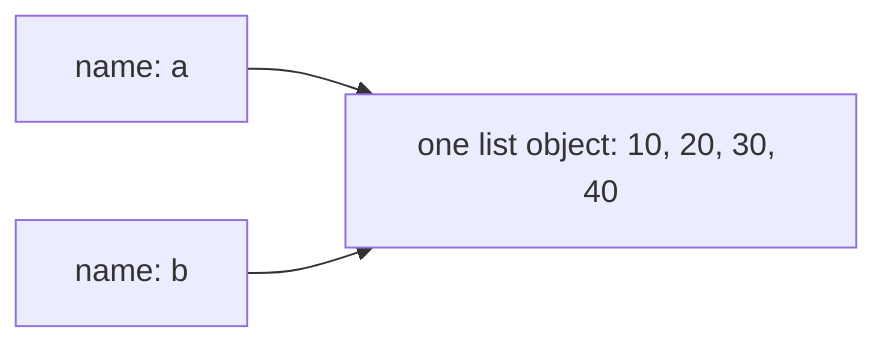
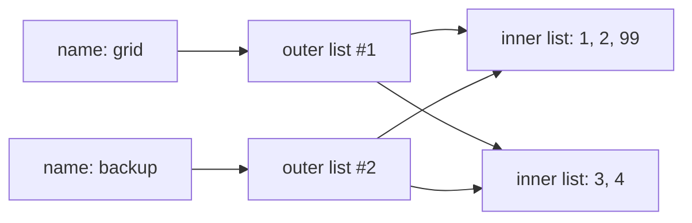

# 9.1 Values vs references

There is a moment in every programmer's first year when a list changes
"by itself" — you modified `b`, and somehow `a` changed too. That moment is
not a bug in Python; it is the *reference model* announcing itself. This page
is the one to read slowly, because the mental picture you build here explains
function arguments, object behaviour, copying, and half of the confusing bugs
you will ever meet. Once the picture clicks, those bugs stop being mysterious
and become one-line fixes.

## A variable is a name tag, not a box

Back in [Chapter 2](../ch02-data/01-variables-types.md) it was fine to
picture a variable as a labelled box with a value inside. Now we need the
more accurate picture:

> In Python, every value is an **object** that lives in memory, and a
> **variable is just a name bound to an object** — a name tag on a string
> tied to the object. Assignment ties the string; it never builds a new box.

Objects live on the **heap** — the big open storage area you met in
[Section 5.3](../ch05-under-the-hood/03-stack-heap.md). Names live in
stack frames and namespaces. One object can have any number of names tied
to it, including zero (at which point Python quietly recycles it).

```python
message = "meet at noon"
alias = message              # a second name tag on the SAME string object
print(alias)                 # meet at noon
print(message is alias)      # True — one object, two names
```

`is` is new here; we will define it properly in a moment. For now: it asks
"are these two names tied to the *same object*?" — and the answer is yes,
because the assignment `alias = message` did not copy the string. It copied
the *reference* (the tie to the object), which costs almost nothing no matter
how large the object is.

## Assignment copies the reference, not the object

With strings you can rarely tell the difference, because strings cannot be
changed. With lists — which *can* be changed — the difference is dramatic:

```python
a = [10, 20, 30]
b = a                # copies the REFERENCE, not the list
b.append(40)

print("b:", b)       # b: [10, 20, 30, 40]
print("a:", a)       # a: [10, 20, 30, 40]  ← a changed too!
print(a is b)        # True
```

We never touched `a` after the first line — and yet `a` shows the new
element. There was only ever **one list**. `a` and `b` are two name tags on
it, and `b.append(40)` modified the shared object that both names reach:



Two names for one object are called **aliases**, and the situation is called
**aliasing**. Aliasing is not an error — it is often exactly what you want
(it is how functions receive lists without copying them). It only bites when
you *believed* you had two independent lists.

!!! tip "The one-question habit"
    Whenever you write `x = y` and `y` refers to a mutable object (a list,
    for now — later dicts and your own objects), ask one question: *"Do I
    want a second name for the same object, or a genuinely separate copy?"*
    Asking it takes two seconds and prevents the classic aliasing bug.

## `==` asks "equal contents"; `is` asks "same object"

You met `==` versus `is` briefly in
[Section 4.3](../ch04-branching/03-equality-identity.md). With lists in
hand, the distinction finally has teeth:

- `a == b` — **equality**: do the two objects have the same contents?
- `a is b` — **identity**: are `a` and `b` the very same object?

```python
a = [1, 2, 3]
b = a              # second name for the SAME list
c = [1, 2, 3]      # a DIFFERENT list that happens to have equal contents

print(a == b, a is b)    # True True
print(a == c, a is c)    # True False
```

`a` and `c` are like two printed copies of the same page: equal in every
character, but you can scribble on one without marking the other. `a` and
`b` are the *same* page.

Identity is the sharper question, so `is` returning `True` guarantees `==`
is `True` (an object always equals itself) — but never the other way round.

!!! warning "`is` is only for the sharing question (and for `None`)"
    Never use `is` to compare numbers or strings. Python caches some small
    immutable objects behind the scenes, so `is` on numbers sometimes says
    `True` and sometimes `False` for reasons that are implementation
    details, not logic:

    ```python
    n = 1000
    a = n * n          # computed at run time → a fresh int object
    b = n * n          # computed again       → another fresh object
    print(a == b)      # True  — same value, always
    print(a is b)      # False — two separate objects
    ```

    Use `==` for values. Reserve `is` for "are these the same object?" —
    which in everyday code mostly means aliasing checks and the idiom
    `x is None`.

## Making a real copy

When you *do* want an independent list, say so explicitly. Python gives you
three equivalent spellings:

```python
original = [1, 2, 3]

s = original[:]         # 1. slice copy: "all of it, as a new list"
t = list(original)      # 2. constructor copy
u = original.copy()     # 3. method copy — the most readable

original.append(99)

print(original)         # [1, 2, 3, 99]
print(s, t, u)          # [1, 2, 3] [1, 2, 3] [1, 2, 3]
print(s is original)    # False — genuinely separate objects
```

All three build a **new list object** and copy the references to the
elements across. For a flat list of numbers or strings, that is all the
independence you will ever need.

The phrase "copy the references to the elements" is about to matter.

## The trap: shallow copies and nested lists

A copy that duplicates the outer list but *shares* everything inside it is
called a **shallow copy** — and all three spellings above are shallow.
Watch what happens with a list of lists:

```python
grid = [[1, 2], [3, 4]]
backup = grid.copy()        # a NEW outer list ...

grid[0].append(99)          # ... but the SAME inner lists

print(grid)                 # [[1, 2, 99], [3, 4]]
print(backup)               # [[1, 2, 99], [3, 4]]  ← the "backup" changed!
print(grid is backup)       # False — the outer lists really are different
print(grid[0] is backup[0]) # True  — the inner lists are shared
```

The picture makes the bug obvious. The copy created a second outer list,
but both outer lists hold references to the *same two* inner lists:



When you need every level copied, use `copy.deepcopy` from the standard
library's `copy` module. It walks the whole structure and duplicates
everything it finds:

```python
import copy

grid = [[1, 2], [3, 4]]
backup = copy.deepcopy(grid)   # copies the outer list AND the inner lists

grid[0].append(99)

print(grid)     # [[1, 2, 99], [3, 4]]
print(backup)   # [[1, 2], [3, 4]] — untouched, a true independent snapshot
```

Rule of thumb: flat list → shallow copy is fine; anything nested (lists of
lists, lists of dicts, lists of your own objects) → decide consciously, and
reach for `copy.deepcopy` when you need full independence.

## Primitives and references — the Java picture

Your Java course splits the world in two. Java has eight **primitive
types** (`int`, `double`, `boolean`, `char`, …) whose variables really *are*
little boxes holding the value itself, and **reference types** (arrays,
`String`, every object) whose variables hold a reference — exactly like
every Python variable. Assignment copies whatever is in the variable: for a
primitive that is the value, for a reference type it is the reference.

=== "Python"

    ```python
    a = [1, 2, 3]
    b = a                 # copies the reference — b is an alias
    b[0] = 99
    print(a[0])           # 99

    x = 5
    y = x                 # also copies a reference! (see below)
    y = y + 1             # rebinds y to a NEW int object
    print(x, y)           # 5 6
    ```

=== "Java"

    ```java
    int[] a = {1, 2, 3};
    int[] b = a;                     // copies the reference — b is an alias
    b[0] = 99;
    System.out.println(a[0]);        // 99

    int x = 5;                       // primitive: the value sits in the box
    int y = x;                       // the VALUE 5 is copied
    y = y + 1;
    System.out.println(x + " " + y); // 5 6
    ```

The array halves behave identically: assign, alias, mutate through one name,
observe through the other. The `int` halves *also print the same thing* —
but for two different reasons, and the difference is worth spelling out.

## Why Python's numbers *feel* like primitives

Python has no primitives. `5` is an object; `x = 5` binds a name to it;
`y = x` makes `y` an alias of the very same int object. By everything this
page has said, you should now worry: *can changing `y` change `x`?*

It cannot — and the reason is the deepest sentence in this part of the book:

> **`int` objects are immutable, and immutability is what makes them feel
> like primitives.** An alias is only observable when someone *mutates* the
> shared object. There is no operation anywhere in Python that changes an
> existing int in place — `y = y + 1` builds a *new* int object and rebinds
> the name `y` to it. So two names may share a number, but you can never
> catch them doing it.

```python
x = 5
y = x            # x and y: two names, one int object — true aliasing!
y = y + 1        # ints can't change, so + makes a NEW object; y is rebound
print(x, y)      # 5 6 — the sharing was real, but unobservable

a = [5]
b = a            # same setup with a MUTABLE object ...
b.append(6)      # ... and now the sharing shows
print(a, b)      # [5, 6] [5, 6]
```

So Python's rule is uniform — *everything* is a reference to an object —
and the familiar "copied-like-a-value" behaviour of numbers, strings, and
booleans is not a second mechanism. It is the same mechanism applied to
objects that no one can mutate. Java bakes the value/reference split into
its type system; Python gets the same felt behaviour from the
mutable/immutable split. Keep that one sentence and both languages become
predictable.

## Tie-back: this is why function arguments behave that way

In [Section 8.2](../ch08-grids/02-arrays-functions.md) you learned two
facts as rules of thumb: a function *can* change a list the caller passed
in, and assigning to the parameter name does nothing outside. Both are now
one-line consequences of the reference model — argument passing **is**
assignment: the parameter becomes an alias of the object you passed.

```python
def add_bonus(scores):
    scores.append(100)      # mutates the shared object — caller sees it

def replace(scores):
    scores = [0, 0, 0]      # rebinds the LOCAL name only — caller unaffected

marks = [88, 92]
add_bonus(marks)
print(marks)                # [88, 92, 100]
replace(marks)
print(marks)                # [88, 92, 100] — unchanged
```

Mutation travels through an alias; rebinding never does. That single
distinction — *mutate the object* versus *rebind the name* — is the whole
story, here and everywhere else in Python.

!!! warning "Common mistakes"

    - **Believing `b = a` copies the list.** It copies the reference. If
      you then change the list through either name, "both" lists change —
      because there is only one. Ask the one-question habit: alias or copy?
    - **Using a shallow copy on nested data.** `grid.copy()` duplicates
      only the outer list; the rows are still shared. If a "backup"
      mysteriously changes, suspect a shallow copy and reach for
      `copy.deepcopy`.
    - **Using `is` to compare values.** `a is b` on numbers or strings can
      return `True` or `False` depending on caching that is not part of the
      language's promises. Compare values with `==`; keep `is` for identity
      checks and `x is None`.
    - **Expecting `scores = [...]` inside a function to affect the
      caller.** Assignment rebinds the local name. Only *mutation*
      (`append`, `remove`, `scores[0] = ...`) is visible outside.

## Check your understanding

1. After `a = [1, 2]` and `b = a`, what do `a == b` and `a is b` print?
   What about after `c = [1, 2]` — what are `a == c` and `a is c`?

    ??? success "Answer"
        `a == b` → `True` and `a is b` → `True`: one object, two names, and
        every object equals itself. `a == c` → `True` because the contents
        match, but `a is c` → `False`: `[1, 2]` in the `c` line built a
        brand-new list object.

2. `backup = data.copy()` — under exactly what circumstances can `backup`
   still appear to "change" after this line?

    ??? success "Answer"
        When `data` contains references to mutable objects (inner lists,
        dicts, objects) and someone mutates one of *those*. The shallow copy
        duplicated the outer list only; both outer lists share the inner
        objects. `copy.deepcopy(data)` removes the sharing at every level.

3. Java's `int x = y;` copies a value, while Python's `x = y` copies a
   reference — yet integer code behaves the same in both languages. Why?

    ??? success "Answer"
        Because Python's `int` objects are immutable. Sharing is only
        observable through mutation, and no operation mutates an int —
        arithmetic always produces a new object and rebinds the name. So
        the sharing exists but can never be detected, which is precisely
        what "feels like a primitive" means.

4. Predict the output, then run it mentally through the reference model:
   `x = [[0] * 2] * 3`, then `x[0][0] = 7`, then `print(x)`.

    ??? success "Answer"
        `[[7, 0], [7, 0], [7, 0]]`. The `* 3` copied the *reference* to one
        inner list three times, so all three rows are aliases of a single
        list — the row-building trap from
        [Section 8.1](../ch08-grids/01-2d-arrays.md), now fully explained.
