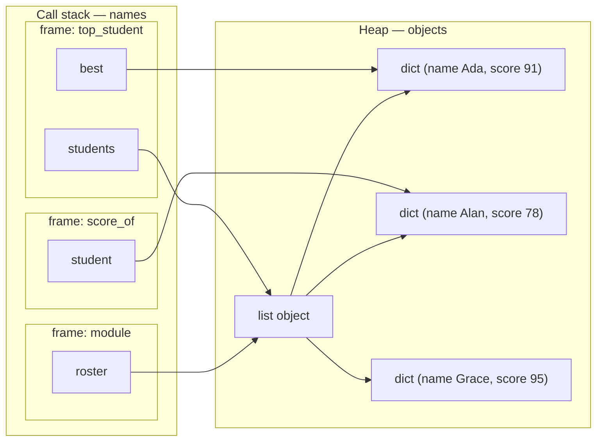

# 9.3 Objects in memory — two views of OOP

You now know that variables hold references and objects live somewhere else.
This page assembles the complete picture of *where*: stack frames full of
names on one side, a heap full of objects on the other, and arrows crossing
from every frame into the shared heap. Once you can draw that picture for a
running program, two things fall out almost for free — why a "list of
objects" behaves the way it does, and what object-oriented programming
actually splits in two: the *user's* view of an object and the *author's*
view. You have been living on the user side since Chapter 3; this page walks
you up to the door of the author side.

## Names on the stack, objects on the heap

Recall the two memory regions from
[Section 5.3](../ch05-under-the-hood/03-stack-heap.md): every function call
pushes a **stack frame** holding that call's local names, and all objects —
lists, strings, dicts, everything — live in the **heap**, outside any frame.
A frame never contains a list; it contains a *name bound to* a list.

Run this small program. It uses **dicts** — think of a dict as a bundle of
labelled values, so `student["score"]` reads the value labelled `"score"`
(dicts get their own full treatment in
[Section 14.1](../ch14-beyond/01-collections-tour.md)):

```python
def score_of(student):
    return student["score"]

def top_student(students):
    best = students[0]
    for s in students:
        if score_of(s) > score_of(best):
            best = s
    return best

roster = [
    {"name": "Ada",   "score": 91},
    {"name": "Alan",  "score": 78},
    {"name": "Grace", "score": 95},
]
winner = top_student(roster)
print(winner["name"])           # Grace
print(winner is roster[2])      # True — one dict object, two routes to it
```

Freeze the program at the moment `score_of` is running, deep inside the
loop. Three frames are alive — the module, `top_student`, and `score_of` —
and *every arrow points into the same heap*:



Read the arrows carefully — each one is a reference:

- `roster` and `students` are aliases of one list object. Passing the list
  to `top_student` copied a reference, not three dicts' worth of data.
- The list object itself holds three references — to the three dicts. A
  list never contains objects; it contains arrows to them.
- `best` points *directly* at Ada's dict — the same dict the list points
  at. `student` points at whichever dict the loop is visiting.

When `score_of` returns, its frame pops and the name `student` vanishes —
but the dict it pointed at is untouched, because names and objects live in
different places. When the whole program ends, `winner is roster[2]` prints
`True` for the same reason: `top_student` returned a *reference*, so
`winner` is one more route to Grace's dict, not a copy of it.

## A list of objects is a list of references

That picture makes the following behaviour obvious rather than spooky.
Pulling an element out of a list gives you a reference to the shared
object — so mutating it "through" any route changes what every route sees:

```python
roster = [
    {"name": "Ada",  "score": 91},
    {"name": "Alan", "score": 78},
]

alan = roster[1]            # NOT a copy — another reference to Alan's dict
alan["score"] = 80
print(roster[1])            # {'name': 'Alan', 'score': 80}

for student in roster:      # student refers to each dict in turn
    student["score"] += 5   # mutating the shared object — sticks!

print(roster)               # both scores went up by 5
```

Compare this with a fact you learned in
[Chapter 7](../ch07-arrays/index.md): reassigning the loop variable
(`student = ...`) does *nothing* to the list. Now you can say why in the
chapter's own vocabulary: `student["score"] += 5` **mutates the heap
object** that the list also points to, while `student = ...` merely
**rebinds a frame name**. Same rule as function arguments, same rule as
aliasing — it is all one rule.

## Two views of an object

Look at the dicts above: they are pure *state* — data with no behaviour.
Real objects bundle state **and** the operations on it. That bundling
creates two legitimate ways to look at the same object:

- **The external view (the user's view):** *what* can it do? You see a
  menu of methods and a promise about what each one accomplishes. You
  neither see nor care how.
- **The internal view (the author's view):** *how* does it work? You see
  the state inside and the code that manipulates it, and you are
  responsible for keeping every promise the menu makes.

Here is a `Counter` object. First, be its **user**: the class definition is
included so the block can run, but skip it — read only the last six lines,
where the counter is *used*:

```python
class Counter:
    """Counts events, one click at a time."""
    def __init__(self):
        self._count = 0
    def click(self):
        self._count += 1
    def reset(self):
        self._count = 0
    def value(self):
        return self._count

visitors = Counter()        # make a fresh counter object (on the heap!)
visitors.click()
visitors.click()
visitors.click()
print(visitors.value())     # 3
visitors.reset()
print(visitors.value())     # 0
```

As a user you needed exactly three sentences of documentation: *`click()`
counts one event, `value()` reports the total, `reset()` starts over.*
That is the external view — a contract, not a mechanism.

Now put on the author's hat and read the class from the top. The state is
one variable, `self._count`, created when the object is born (`__init__`)
and stored *inside the object on the heap* — not in any frame, which is why
it survives between calls. Each method is a promise-keeper: `click` adds
one, `reset` zeroes it, `value` reports it. The leading underscore in
`_count` is the author whispering "this is internal — users, stay out."
(The full grammar of classes — `self`, `__init__`, methods — is
[Chapter 12](../ch12-classes/index.md)'s job; today you only need to *read*
it.)

And because objects live on the heap, everything from this chapter applies
to them unchanged:

```python
class Counter:
    def __init__(self):
        self._count = 0
    def click(self):
        self._count += 1
    def value(self):
        return self._count

a = Counter()
b = Counter()               # a second, independent object
a.click()
a.click()
b.click()
print(a.value(), b.value()) # 2 1 — two objects, two separate states

c = a                       # aliasing, exactly like lists
c.click()
print(a.value())            # 3 — a and c are one object
print(a is c, a is b)       # True False
```

Two calls to `Counter()` build two heap objects with separate `_count`
state. Assignment (`c = a`) copies a reference, so clicking through `c` is
clicking `a`'s object. If you predicted all three printed lines, the
reference model has officially clicked.

## You have been the user all along

Why does this split matter enough to organise whole languages around? Look
back at your own history in this book:

```python
name = "grace hopper"
print(name.title())        # you know WHAT this does ...
print(name.upper())        # ... with no idea HOW (and you never needed one)

nums = [3, 1, 2]
nums.sort()                # a complete sorting algorithm hides in here
print(nums)                # [1, 2, 3]
```

Since [Chapter 3](../ch03-functions/01-using-objects.md) you have used
`str`, `list`, and friends purely through their external views. Somewhere
inside `sort()` is a sophisticated algorithm you have never read — and its
authors can replace it tomorrow with a faster one, and *your code will not
change*, because you depended only on the promise, never on the mechanism.
That is the entire payoff of the split: users get simplicity, authors get
the freedom to change the insides, and the method menu is the treaty line
between them.

The next step is inevitable: [Chapter 12](../ch12-classes/index.md) hands
you the author's pen, and you will write `__init__`, methods, and promises
of your own. Everything there rests on today's picture — an object is heap
state plus the methods that guard it.

!!! warning "Common mistakes"

    - **Treating `x = roster[1]` as a copy.** Indexing hands you a
      reference to the shared object; mutating through it changes what the
      list shows. If you need an independent snapshot, copy explicitly
      (Section [9.1](01-references.md)).
    - **Expecting `student = ...` in a loop body to modify the list.**
      Rebinding the loop name never touches the list; only mutating the
      object it refers to does.
    - **Reaching into internals the author marked private.** Writing
      `visitors._count = 100` works today and breaks the object's promises
      tomorrow. Users talk to the method menu.
    - **Thinking each frame gets its own copy of an object.** Frames hold
      only names; every frame's arrows point into one shared heap. That is
      why three functions can all "have" the same list at once.

## Check your understanding

1. In the three-frame diagram, `roster`, `students`, and the loop's `s`
   can all reach Alan's dict. How many copies of Alan's data exist in
   memory?

    ??? success "Answer"
        One. The heap holds a single dict object; `roster` reaches it
        through the list, `students` is an alias of that same list, and
        `s` points at the dict directly during one loop pass. Every route
        is just a chain of references to the same object.

2. A function receives `items`, a list of dicts, and runs
   `items[0]["price"] = 0`. Does the caller see the change? What if the
   function instead runs `items = []`?

    ??? success "Answer"
        The first line mutates a heap dict that the caller's list also
        references — the caller sees the price become 0. The second line
        only rebinds the function's local name `items` to a new empty
        list; the caller's list is untouched.

3. Using `visitors = Counter()` as the example: which parts belong to the
   external view, and which to the internal view?

    ??? success "Answer"
        External: the method menu and its promises — `click()` counts one,
        `value()` reports the total, `reset()` starts over. Internal: the
        state `self._count`, the `__init__` method that creates it, and
        the code inside each method. Users rely only on the former; the
        author may rewrite the latter freely as long as the promises hold.
