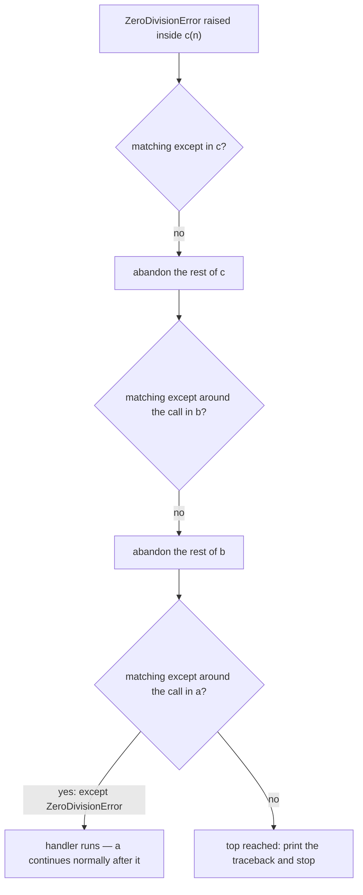

# 10.2 Exceptions — try, except, finally

Your programs have crashed plenty of times by now — a wall of red text, a
final line naming something like `ValueError`, and everything stops. Until
today your only options were "fix the code" or "avoid the bad input". But
some failures cannot be avoided, only *met*: users type nonsense, files go
missing, and a divisor turns out to be zero at run time. Exceptions are
Python's machinery for meeting failure in a controlled way, and they run on
one elegant idea: a failure is an **object**, and that object travels back
up through your function calls until someone catches it.

## What an exception actually is

When an operation cannot do its job, it does not return a wrong answer or a
secret error number. It **raises an exception**, and four things happen in
order:

1. **An object is created** describing the failure — its *type* names the
   kind of problem, its *message* gives the specifics.
2. **The normal flow is abandoned** at the point of failure: nothing further
   down the current function runs.
3. **The object flies up the call chain** — callee, to caller, to caller's
   caller … — looking for a handler.
4. **If nobody catches it**, it reaches the top, the program stops, and
   Python prints the object's story as a traceback.

That last step is what every crash you have ever seen actually was.

You can hold the object in your hands and look at it:

```python
try:
    number = int("abc")
except ValueError as error:
    print(type(error))    # <class 'ValueError'>
    print(error)          # invalid literal for int() with base 10: 'abc'
```

The `as error` clause binds a name to the exception object itself —
`type(error)` is its class, and printing it shows the message that would
otherwise have ended the program. Java calls the same act *throwing*;
"raise" and "throw" are two words for one idea.

## The crash you already know

Here is the failure from the [previous section](01-cli-programs.md), naked
and unhandled. Run it and read the last line of the output:

```python
# raises ValueError
number = int("abc")     # "abc" cannot be parsed as an integer
print("this line never runs")
```

Note what did *not* happen: `int` did not return `0` or `-1`; the `print`
never executed. The exception abandoned everything downstream of the
failure point instantly. That abrupt exit is a *feature* — a wrong answer
that flows onward silently is far more dangerous than a loud stop.

## try / except: meeting the failure

To handle a failure instead of crashing, put the risky code in a `try`
block and the response in an `except` block:

```python
text = "abc"   # imagine the user typed this

try:
    number = int(text)
    print("you entered", number)
except ValueError:
    print(f"'{text}' is not a whole number — try again")

print("the program is still alive")
```

The mechanics, precisely:

1. Python runs the `try` block normally.
2. If nothing goes wrong, the `except` block is **skipped entirely**.
3. If a `ValueError` is raised anywhere in the `try` block, Python
   abandons the rest of the block, runs the matching `except` block, and
   then **carries on after** the whole statement — the program survives.

Change `text` to `"42"` and run again: the `except` block vanishes from
the story, and both prints fire.

## Catch narrowly — the bare `except` trap

`except ValueError:` names exactly which failure it is prepared to handle.
You will meet code that writes `except:` with no name — a **bare except**
that catches *everything*. It looks safe and is quietly poisonous, because
"everything" includes your own bugs. Watch it eat a typo:

```python
def average(scores):
    try:
        return sum(scors) / len(scores)     # 'scors' — a typo!
    except:                                 # catches EVERYTHING ...
        return 0.0                          # ... including the typo

print(average([80, 90, 100]))   # 0.0 — silently, catastrophically wrong
```

The typo raises a `NameError` — a bug, not bad input — but the bare
`except` swallows it and manufactures a plausible-looking `0.0`. You could
ship this and not notice for months. Now catch only what we *meant* to
handle (an empty list dividing by zero) and the bug surfaces immediately,
pointing straight at itself:

```python
# raises NameError
def average(scores):
    try:
        return sum(scors) / len(scores)     # same typo ...
    except ZeroDivisionError:               # ... but we catch ONLY empty lists
        return 0.0

print(average([80, 90, 100]))   # NameError — the typo has nowhere to hide
```

The rule: **catch the narrowest exception you can actually do something
about, and let everything else fly.** An exception you cannot handle is
better off crashing loudly during development than lying quietly in
production.

## Handling several failure kinds

One `try` can have multiple `except` clauses; Python runs the first one
whose type matches:

```python
entries = ["12", "0", "oops"]   # imagine three users typed these

for text in entries:
    try:
        result = 100 / int(text)
        print(f"100 / {text} = {result}")
    except ValueError:
        print(f"'{text}' is not a number")
    except ZeroDivisionError:
        print("cannot divide by zero")
```

`"12"` sails through; `"0"` converts fine but explodes at the division;
`"oops"` never even reaches the division. Each failure finds its own
handler, and the loop — crucially — keeps going.

## `else` and `finally`

Two optional clauses complete the anatomy:

- **`else`** runs only when the `try` block finished *without* an exception.
  It is the "success lane", and it lets you keep the `try` block down to the
  lines that can genuinely fail.
- **`finally`** runs **no matter what** — success, handled failure, or
  unhandled failure. It is where cleanup lives: closing files, releasing
  resources.

```python
def read_score(text):
    try:
        score = int(text)
    except ValueError:
        print("  bad input:", text)
    else:
        print("  parsed fine:", score)     # only on success
    finally:
        print("  finished with", text)     # always, without exception

read_score("88")
read_score("elephant")
```

The strongest promise `finally` makes is the one this next block
demonstrates: it runs *even when the exception escapes unhandled*. The
cleanup happens, and *then* the exception continues on its way up:

```python
# raises ZeroDivisionError
try:
    print("about to divide")
    result = 1 / 0
    print("never reached")
finally:
    print("cleanup runs even though the exception escapes")
```

## Raising your own exceptions

Handling other people's exceptions is half the story. The other half:
*your* functions will be handed arguments that make no sense, and the
honest response is to refuse — loudly. `raise` creates and throws an
exception of your choosing:

```python
# raises ValueError
def set_volume(level):
    if level < 0 or level > 10:
        raise ValueError(f"volume must be between 0 and 10, got {level}")
    print("volume set to", level)

set_volume(7)      # fine
set_volume(42)     # nobody catches it → the program stops here
```

Why is raising better than, say, returning `None` or clamping to 10? For
the same reason `int("abc")` does not return 0: a **wrong value travels;
an exception stops**. The caller either handles the refusal explicitly —

```python
def set_volume(level):
    if level < 0 or level > 10:
        raise ValueError(f"volume must be between 0 and 10, got {level}")
    print("volume set to", level)

for requested in [7, 42]:
    try:
        set_volume(requested)
    except ValueError as error:
        print("rejected:", error)
```

— or the program halts at the exact line where the nonsense first
appeared, with a message *you* wrote explaining why. Both outcomes beat a
silent wrong answer. Pick the standard type that fits the failure:
`ValueError` for "right type, impossible value", `TypeError` for "wrong
kind of thing entirely".

## The flight of an exception is non-linear

Everything so far happened inside one function. The real power — and the
real mind-bend — is that an exception raised deep in a call chain can be
caught *any number of levels above*, skipping every function in between:

```python
def c(n):
    return 100 / n          # failure happens HERE — no try in sight

def b(n):
    return c(n)             # no handler here either

def a(n):
    try:
        return b(n)
    except ZeroDivisionError:
        return 0.0          # caught HERE, two calls above the failure

print(a(4))    # 25.0
print(a(0))    # 0.0 — the exception flew from c, through b, to a
```

When `c` divides by zero, Python abandons `c`, then abandons `b` (which
never finishes its `return`), and only in `a` finds a `try` with a
matching `except`. This search is why exception control flow is called
**non-linear**: execution does not proceed to "the next line" — it jumps
to the nearest matching handler up the stack, however far away that is:



Keep this diagram in mind for the [next section](03-stack-traces.md): a
traceback is precisely the record of this search failing all the way to
the top.

## Java: try / catch / finally — and checked exceptions

The syntax translates almost word for word (`except` → `catch`,
`raise` → `throw`):

=== "Python"

    ```python
    text = "abc"   # imagine the user typed this
    try:
        number = int(text)
        print("you entered", number)
    except ValueError:
        print(text, "is not a whole number")
    finally:
        print("done")
    ```

=== "Java"

    ```java
    String text = "abc";
    try {
        int number = Integer.parseInt(text);
        System.out.println("you entered " + number);
    } catch (NumberFormatException e) {
        System.out.println(text + " is not a whole number");
    } finally {
        System.out.println("done");
    }
    ```

One genuine difference deserves spelling out. Java divides exceptions into
**checked** and **unchecked**. A checked exception (like
`IOException`) is part of a method's official signature: any method that
might raise one must either handle it or declare it with
`throws IOException`, and the *compiler refuses to build* code that
ignores the possibility. The intent is admirable — failures you can
reasonably anticipate become impossible to forget.

Unchecked exceptions (subclasses of `RuntimeException`, such as
`NullPointerException` or `ArrayIndexOutOfBoundsException`) carry no such
obligation — they usually signal bugs, and forcing every line to declare
"this might have a bug" would be absurd.

Python, by contrast, makes *every* exception unchecked: nothing in a
function's signature says what it might raise, and no tool forces you to
catch anything.

| | Java: checked (`IOException`) | Java: unchecked (`RuntimeException`) | Python: all exceptions |
| --- | --- | --- | --- |
| Declared in the signature | must be, via `throws` | never | never |
| Compiler makes you handle it | yes | no | there is no compiler to ask |
| Usually signals | a foreseeable failure | a bug | either |

The cost of Python's choice is that no tool reminds you; the compensation is
documentation, tests, and the habit this page has been drilling — handle
narrowly what you can, let the rest fly loudly.

!!! warning "Common mistakes"

    - **Bare `except:` (or a reflexive `except Exception:`).** It swallows
      bugs — typos, wrong types, everything — and replaces them with
      plausible nonsense. Name the exact exception you are prepared to
      handle.
    - **Wrapping half the program in one `try`.** The more lines inside,
      the less you know about what actually failed. Keep the `try` block
      to the few lines that can genuinely raise, and use `else` for the
      success path.
    - **Using exceptions where an `if` does the job.** Checking
      `len(argv) != 3` is a normal decision, not a failure. Reserve
      exceptions for the cases a simple check cannot express cleanly.
    - **Catching an exception you cannot actually fix** — printing
      "error!" and continuing with broken state. If you have no recovery,
      do not catch; a loud early crash is a gift to whoever debugs it.

## Check your understanding

1. Why did the bare-`except` version of `average` return `0.0` for a
   perfectly good list, and why did narrowing to
   `except ZeroDivisionError` "fix" it?

    ??? success "Answer"
        The typo `scors` raises `NameError` — a bug. The bare `except`
        matches *any* exception, so it treated the bug as if it were the
        anticipated empty-list failure and returned the fallback `0.0`.
        The narrow handler matches only `ZeroDivisionError`, so the
        `NameError` escaped, crashed the program, and pointed directly at
        the misspelled name — which is what you want a bug to do.

2. A function opens a network connection, and the code that uses it might
   raise several different exceptions, not all of which you can predict.
   Which clause guarantees the connection is closed, and what exactly does
   it guarantee?

    ??? success "Answer"
        `finally`. Its body runs whether the `try` block succeeds, fails
        with a handled exception, or fails with an exception that escapes —
        in the last case the cleanup runs first and the exception then
        continues up the call chain.

3. `set_volume(42)` could simply clamp the value to 10 instead of raising
   `ValueError`. Give one concrete argument for raising instead.

    ??? success "Answer"
        Clamping hides the caller's mistake: whoever passed 42 believes
        the volume is now 42, and every later computation builds on a
        silently altered value. Raising stops the program at the first
        moment the nonsense exists, with a message naming the rule that
        was broken — the failure is visible, local, and cheap to fix.
