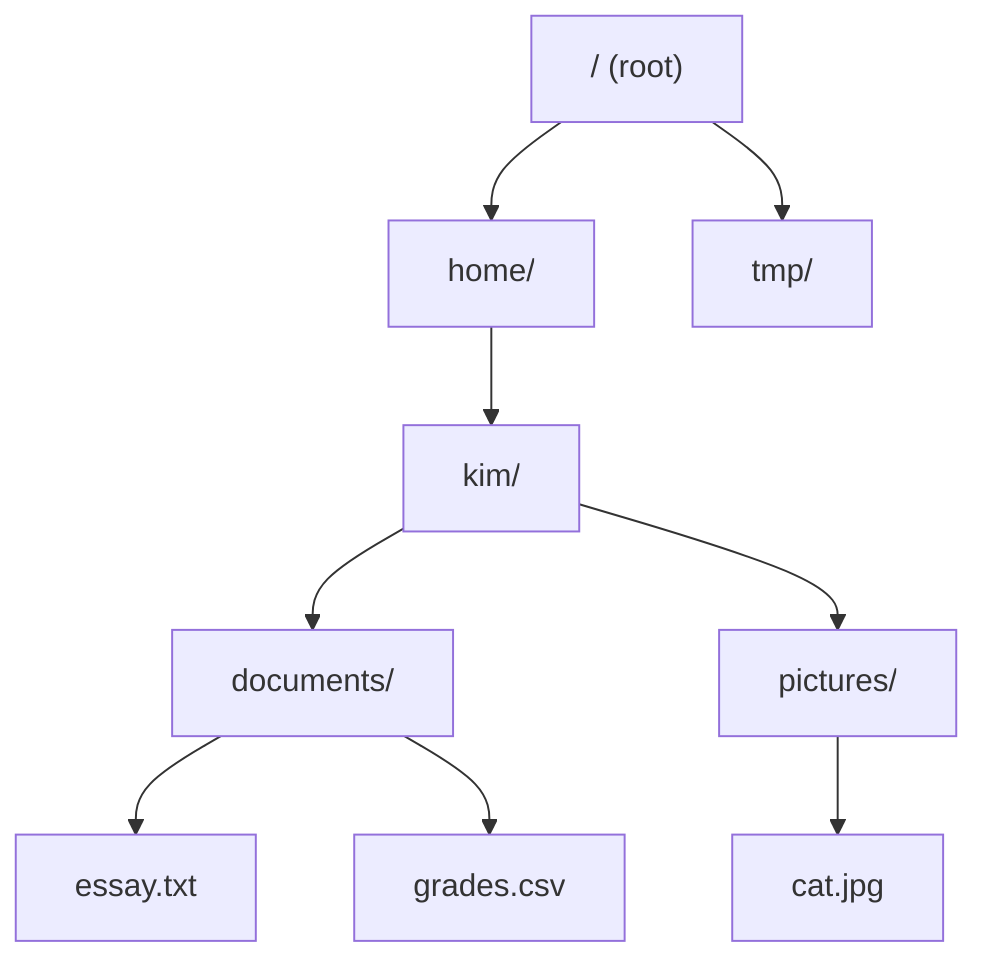

# 11.1 Paths and the file system

Before a program can open a file, it has to *name* it — and naming a file
means describing where it lives among the thousands of others on the disk.
That description is called a **path**, and paths are a small language of their
own, with two dialects (Windows and everything else) and a few classic traps.
Ten minutes spent understanding paths now will save you hours of
`FileNotFoundError` later, because in practice most "file bugs" are really
*path* bugs: the file is fine, but the program is looking in the wrong place.

## A tree of files and folders

An operating system organizes storage as a **tree**. The leaves are **files**
— named chunks of data such as `essay.txt` or `cat.jpg`. The branches are
**directories** (also called **folders**), which contain files and other
directories. At the very top sits the **root**: `/` on macOS and Linux, or a
drive like `C:\` on Windows.



A path is simply the walk you take through this tree to reach something. To
reach `essay.txt` above, you start at the root, enter `home`, then `kim`,
then `documents`: written down, that walk is `/home/kim/documents/essay.txt`.
Each `/` marks one step down into a directory. Python can even show you the
individual steps — here is a sneak preview of `pathlib`, the module this
whole section builds toward:

```python
from pathlib import Path

p = Path("/home/kim/documents/essay.txt")
print(p.parts)
```

```text
('/', 'home', 'kim', 'documents', 'essay.txt')
```

One string on the way in; on the way out, the walk itself — root, three
directories, file. Keep that picture: *a path is a recorded walk through the
tree.*

## Absolute and relative paths

There are two ways to give directions to a place: from a fixed landmark
("starting from the city center, …") or from where you already stand ("two
blocks left of here"). Paths work the same way.

- An **absolute path** starts at the root and spells out the entire walk:
  `/home/kim/documents/essay.txt`. It means the same thing no matter where
  your program is running.
- A **relative path** starts from the program's current location:
  `documents/essay.txt`. It is shorter, but its meaning *depends on where you
  are* — the same relative path can point to different files (or nothing) on
  different days.

You can ask a path which kind it is:

```python
from pathlib import Path

print(Path("documents/essay.txt").is_absolute())
print(Path("/home/kim/documents/essay.txt").is_absolute())
```

The first prints `False`, the second `True`. The rule of thumb: absolute
paths are unambiguous but brittle (they break on anyone else's computer);
relative paths are portable but depend on context. We will pin down exactly
*what* they are relative to in a moment.

## Slashes, backslashes, and why we always write `/`

macOS and Linux separate path pieces with a forward slash (`/`). Windows
traditionally uses a backslash (`\`) — and that is a problem in Python source
code, because inside a string a backslash starts an **escape sequence** like
`\n` (newline) or `\t` (tab). Watch what happens to an innocent-looking
Windows path:

```python
print("C:\new_folder\notes.txt")   # the \n's are NOT slashes...
```

```text
C:
ew_folder
otes.txt
```

Both `\n`s were silently turned into newlines and the path was mangled. You
*can* fix this by doubling the backslashes (`"C:\\new_folder\\notes.txt"`) or
by using a raw string (`r"C:\new_folder\notes.txt"`), but there is a simpler
habit: **always write forward slashes**. Python — and Windows itself, under
the hood — accepts `/` in paths on every operating system, so
`"C:/new_folder/notes.txt"` and `"data/notes.txt"` just work everywhere.
Write `/`, and the whole class of backslash bugs disappears.

## Building paths with `pathlib`

Better still, don't build paths out of raw strings at all. The standard
library's `pathlib` module gives you a `Path` object that understands the
tree structure, joins pieces with the `/` operator, and answers questions
about itself:

```python
from pathlib import Path

p = Path("data") / "notes" / "todo.txt"

print(p)          # the whole path
print(p.name)     # the last piece: the file name
print(p.suffix)   # the file extension
print(p.stem)     # the name without its extension
print(p.parent)   # the directory that contains it
```

```text
data/notes/todo.txt
todo.txt
.txt
todo
data/notes
```

That `/` between `Path("data")` and `"notes"` is not division — `Path`
overloads the operator (an idea you met in
[Chapter 5](../ch05-under-the-hood/04-overloading-imports.md)) to mean "step
into". The result is a new `Path`, and on Windows it would print itself with
backslashes automatically. You describe the walk; `pathlib` speaks the local
dialect.

One thing a `Path` object is *not*: a file. Creating a `Path` just creates a
description — an address written on an envelope. Nothing exists on disk until
you actually write something (next section).

=== "Python"

    ```python
    from pathlib import Path

    p = Path("data") / "notes" / "todo.txt"
    print(p.name)     # todo.txt
    print(p.parent)   # data/notes
    print(p.exists()) # False — it's only an address so far
    ```

=== "Java"

    ```java
    import java.nio.file.Path;
    import java.nio.file.Files;

    Path p = Path.of("data", "notes", "todo.txt");
    System.out.println(p.getFileName());  // todo.txt
    System.out.println(p.getParent());    // data/notes
    System.out.println(Files.exists(p));  // false
    ```

Java's `java.nio.file.Path` is the same idea with the same vocabulary: you
build a path from pieces (`Path.of` instead of the `/` operator), and static
helper methods in `Files` ask the questions that Python puts directly on the
`Path` object.

## Where do relative paths start? The current working directory

Every running program has a **current working directory** (often just
"cwd"): the directory the operating system considers it to be "standing in".
Relative paths are resolved starting from there — `documents/essay.txt`
means "`documents/essay.txt` *inside the current working directory*".

```python
from pathlib import Path

print(Path.cwd())
```

The output depends on where Python was started: in a terminal it is whatever
directory you were in when you typed `python`; in these browser pages it is a
directory inside the sandbox. That dependence is exactly why relative paths
sometimes surprise beginners — a program that works when launched from one
directory fails when launched from another, because "here" moved. When a file
mysteriously "does not exist", printing `Path.cwd()` is the first
diagnostic to reach for.

## Asking questions about a path

!!! info "Important — the files on this page live in your browser"
    Every Run button on this page (and throughout this chapter) executes in
    **Pyodide's in-memory file system**. Files you create are private to this
    page, never touch your real disk, and vanish when you reload. That makes
    these pages a perfect sandbox: you can create, overwrite, and delete
    files with zero risk. It also means each example **creates its own files
    before using them** — there is no pre-existing data to read.

`Path` objects can check what actually exists at their address:

```python
from pathlib import Path

p = Path("message.txt")
p.unlink(missing_ok=True)     # delete leftovers so re-running starts fresh

print(p.exists())             # False — just an address, nothing there

p.write_text("Hello, file system!", encoding="utf-8")

print(p.exists())             # True — now the file is real
print(p.is_file())            # True — and it is a file...
print(p.is_dir())             # False — ...not a directory
```

The output is `False`, then `True`, `True`, `False`: the `Path` existed as a
Python object the whole time, but only `write_text` (a convenient shortcut we
will replace with `open` in the next section) made a real file appear.
Directories work the same way — `mkdir` grows a new branch of the tree:

```python
from pathlib import Path

folder = Path("project") / "data"
folder.mkdir(parents=True, exist_ok=True)   # create it, and its parents

print(folder.exists(), folder.is_dir())     # True True
```

`parents=True` creates `project/` on the way to `project/data/`, and
`exist_ok=True` makes it safe to run twice — without it, creating a
directory that already exists raises `FileExistsError`.

!!! warning "Common mistakes"
    - **Backslashes in string paths.** `"data\notes.txt"` contains the
      escape `\n`, not a separator. Use forward slashes (they work on every
      OS) or `pathlib` and never think about it again.
    - **Assuming a relative path starts at the script's folder.** It starts
      at the *current working directory*, which depends on where the program
      was launched from. Print `Path.cwd()` when in doubt.
    - **Expecting `Path("report.txt")` to create a file.** A `Path` is only
      an address; the file appears when you write to it.
    - **Gluing paths with `+`.** `"data" + "notes.txt"` gives
      `"datanotes.txt"` — no separator. Use `Path("data") / "notes.txt"`.

## Check your understanding

1. Which of these is an absolute path: `results/run1.txt` or
   `/home/kim/results/run1.txt`? What extra information does the other one
   need before it names a definite file?

    ??? success "Answer"
        `/home/kim/results/run1.txt` is absolute — it starts at the root
        `/` and describes the full walk. `results/run1.txt` is relative: it
        only names a definite file once you know the **current working
        directory** it starts from.

2. What does this print?

    ```text
    p = Path("music") / "jazz" / "take5.mp3"
    print(p.suffix, p.name, p.parent)
    ```

    ??? success "Answer"
        `.mp3 take5.mp3 music/jazz` — `suffix` is the extension, `name` the
        final component, `parent` everything before it.

3. True or false: after `p = Path("diary.txt")`, a file named `diary.txt`
   exists.

    ??? success "Answer"
        False. A `Path` object is a description of a location, like an
        address on an envelope. `p.exists()` would return `False` until
        something is actually written there.

4. A classmate's program works when run from the project folder but crashes
   with `FileNotFoundError` when run from the desktop. The code opens
   `data/scores.txt`. What is going on?

    ??? success "Answer"
        `data/scores.txt` is a relative path, so it is resolved from the
        current working directory. Launched from the project folder, "here"
        contains `data/`; launched from the desktop, it does not. The fix is
        to run from the right directory or build a path that does not depend
        on the launch location.
