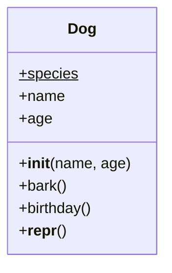

# 12.1 Anatomy of a class

When you wrote `name.upper()` in Chapter 3, someone else had already decided
what a string *is* and what it can *do*. Today you get to be that someone.
Writing a class means defining a new kind of object: the data each one
carries, and the methods anyone may call on it.

Nothing you have learned gets thrown away — a class is mostly variables and
functions arranged in a new shape. But that shape is the single most
important idea in this half of the book, so we will walk through it slowly,
one organ at a time.

## Blueprint and instances

A **class** is a blueprint; an **instance** is one thing built from it. The
blueprint for a house says "every house has a door and windows"; it is not
itself a house. From one blueprint you can build a whole street of houses,
each with its own door color, each standing on its own plot.

You have lived this distinction already: `str` is a class, while `"hello"`
and `"goodbye"` are two instances of it. Python will happily point at the
blueprint behind any value:

```python
print(type("hello"))
print(type([1, 2, 3]))
print(isinstance("hello", str))
```

```text
<class 'str'>
<class 'list'>
True
```

Every value you have ever used was an instance of *some* class. In
[Chapter 9](../ch09-collections/03-objects-in-memory.md) you saw where
instances live — on the heap, with variables holding references to them.
Nothing about that picture changes now. The only news is that the blueprint
can be yours.

## Your first class: `Dog`

Here is a complete class, followed by two instances built from it. Run it,
then we will dissect every line.

```python
class Dog:
    """A dog with a name and an age."""

    def __init__(self, name, age):
        self.name = name
        self.age = age

    def bark(self):
        print(f"{self.name} says: Woof!")

rex = Dog("Rex", 3)
luna = Dog("Luna", 5)

rex.bark()
luna.bark()
print(rex.name, "is", rex.age)
```

```text
Rex says: Woof!
Luna says: Woof!
Rex is 3
```

Reading from the top:

- **`class Dog:`** opens the blueprint. Class names are capitalized by
  convention (`Dog`, `WeatherStation`) — that is how you spot them.
- **`def __init__(self, name, age):`** is the **initializer** — the special
  method Python runs automatically whenever a new `Dog` is constructed. The
  double underscores mark it as one of Python's special hooks. It plays the
  role of a **constructor** in Java.
- **`self.name = name`** creates an **attribute**: a variable living
  *inside this particular object* — Java's *field*. The right side is the
  parameter that was passed in; the left side stores it on the object, where
  it survives after `__init__` returns.
- **`def bark(self):`** is a **method** — a function that lives in the class
  and works on one instance. Inside it, `self.name` reaches back into
  whichever dog the method was called on.
- **`rex = Dog("Rex", 3)`** builds an instance. Calling the class like a
  function makes a fresh empty object, runs `__init__` on it with your
  arguments, and hands the finished object back. No `new` keyword — in
  Python, the class itself is the factory.

## What exactly is `self`?

`self` is the object the method was called on — the same thing `this` means
in Java, with one honest difference: Python makes you write it. When you
call `rex.bark()`, Python quietly rewrites the call as `Dog.bark(rex)`, so
the object lands in the first parameter. That is all `self` is: the first
parameter, receiving the object before the dot. You can even make the secret
rewrite yourself:

```python
class Dog:
    def __init__(self, name):
        self.name = name

    def bark(self):
        print(self.name, "says: Woof!")

rex = Dog("Rex")

rex.bark()        # the normal spelling
Dog.bark(rex)     # exactly the same call, written out by hand
```

Both lines print `Rex says: Woof!`. Once you see that `rex.bark()` *is*
`Dog.bark(rex)`, Python's most famous beginner error becomes perfectly
logical. Define a method without `self` and watch the machinery collide:

```python
# raises TypeError
class Greeter:
    def hello():              # forgot self!
        print("Hello!")

g = Greeter()
g.hello()                     # Python passes g anyway -> TypeError
```

The message — `hello() takes 0 positional arguments but 1 was given` —
confuses everyone the first time, because the call `g.hello()` *looks* empty.
But you now know the hidden rewrite: Python passed `g` as the first argument,
and `hello` had no parameter to catch it.

!!! tip "Diagnosis on sight"
    "Takes 0 positional arguments but 1 was given" on a method call always
    means the same thing: a missing `self`.

=== "Python"

    ```python
    class Dog:
        def __init__(self, name):
            self.name = name      # self is explicit, always

        def bark(self):
            print(self.name, "says: Woof!")

    rex = Dog("Rex")
    rex.bark()
    ```

=== "Java"

    ```java
    public class Dog {
        private String name;

        public Dog(String name) {
            this.name = name;     // "this" often optional in Java
        }

        public void bark() {
            System.out.println(name + " says: Woof!");
        }
    }

    Dog rex = new Dog("Rex");
    rex.bark();
    ```

Java lets you omit `this.` when the meaning is unambiguous; Python never
does. Every attribute access is spelled `self.something`, which costs five
keystrokes and buys total clarity about what is an attribute and what is a
local variable.

## Each instance carries its own state

The blueprint is shared; the state is not. Every instance gets its own set
of attributes, so changing one dog leaves every other dog untouched:

```python
class Dog:
    def __init__(self, name, age):
        self.name = name
        self.age = age

    def birthday(self):
        self.age += 1

rex = Dog("Rex", 3)
luna = Dog("Luna", 5)

rex.birthday()
rex.birthday()

print(rex.name, rex.age)      # Rex 5
print(luna.name, luna.age)    # Luna 5 — completely unaffected
```

Two `birthday()` calls aged Rex from 3 to 5; Luna never noticed. In the
memory picture from Chapter 9: `rex` and `luna` are references to two
separate objects on the heap, each with its own `name` and `age` boxes
inside. A method call through `rex` can only touch Rex's boxes, because
that is the object riding in as `self`.

## Introduce yourself: `__repr__`

Print a home-made object and Python shrugs:

```python
class Dog:
    def __init__(self, name):
        self.name = name

print(Dog("Rex"))
```

The output is something like `<__main__.Dog object at 0x14ab3f7d0>` — the
class name and a memory address that varies from run to run. Accurate,
useless. Defining the special method `__repr__` teaches your objects to
describe themselves:

```python
class Dog:
    def __init__(self, name, age):
        self.name = name
        self.age = age

    def __repr__(self):
        return f"Dog(name={self.name!r}, age={self.age})"

rex = Dog("Rex", 3)
print(rex)
print([Dog("Ada", 1), Dog("Bo", 2)])   # lists use it for each element
```

```text
Dog(name='Rex', age=3)
[Dog(name='Ada', age=1), Dog(name='Bo', age=2)]
```

Three things to notice:

- **`__repr__` returns a string; it does not print one.** Python calls it
  whenever anything needs to display the object — `print`, error messages,
  and (as the second line shows) every element of a printed list.
- **The `!r` in the f-string** shows the value with its quotes.
- **The gold standard** is output resembling the call that would rebuild the
  object — exactly what we produced.

Give every class you write a `__repr__`; ten seconds of typing repays itself
the first time you debug.

## Class attributes vs instance attributes

Not every attribute belongs to an individual object:

| | Instance attribute | Class attribute |
| --- | --- | --- |
| Written as | `self.name = ...`, inside a method | a plain assignment in the `class` block |
| How many copies | one per object | one in total, shared by every instance |
| Use it for | anything that varies from object to object | facts true of the whole species |

Here both kinds live side by side:

```python
class Dog:
    species = "Canis familiaris"    # class attribute: one copy, shared

    def __init__(self, name):
        self.name = name            # instance attribute: one per dog

rex = Dog("Rex")
luna = Dog("Luna")

print(rex.species)
print(luna.species)

Dog.species = "Canis lupus familiaris"   # change the shared copy...
print(rex.species, "/", luna.species)    # ...and every dog sees it
```

```text
Canis familiaris
Canis familiaris
Canis lupus familiaris / Canis lupus familiaris
```

When you write `rex.species`, Python looks in the instance first and — not
finding a `species` there — falls back to the class. That fallback is why one
assignment to `Dog.species` changed the answer for both dogs.

The trap runs in reverse, too: `rex.species = "wolf"` would *not* change the
class copy. It would create an instance attribute on `rex` alone that shadows
the shared one. The exercises turn this into a prediction puzzle.

## The whole anatomy, side by side



One box, two compartments: attributes on top, methods below — this is a
**UML class diagram**, the standard sketch language for classes that
[Chapter 13 covers in full](../ch13-design/02-uml.md). The `$` after
`species` is UML's underline-style marker for a class-level (shared) member;
everything else is per-instance.

=== "Python"

    ```python
    class Dog:
        species = "Canis familiaris"        # class attribute

        def __init__(self, name, age):      # initializer
            self.name = name                # instance attributes
            self.age = age

        def bark(self):                     # method
            print(f"{self.name}: Woof!")

    rex = Dog("Rex", 3)                     # construction — no "new"
    rex.bark()
    ```

=== "Java"

    ```java
    public class Dog {
        static String species = "Canis familiaris"; // static field

        private String name;                        // fields
        private int age;

        public Dog(String name, int age) {          // constructor
            this.name = name;
            this.age = age;
        }

        public void bark() {                        // method
            System.out.println(name + ": Woof!");
        }
    }

    Dog rex = new Dog("Rex", 3);                    // construction — "new"
    rex.bark();
    ```

The translation table is short:

| Java | Python |
| --- | --- |
| field | instance attribute |
| constructor | `__init__` |
| `this` (often left implicit) | `self` (always written out) |
| `static` field | class attribute |
| `new Dog("Rex", 3)` | `Dog("Rex", 3)` |

Java also declares types and access modifiers (`private String name`) —
Python handles visibility by convention instead, a story
[Chapter 13 takes up properly](../ch13-design/01-encapsulation.md).

!!! warning "Common mistakes"
    - **Forgetting `self` in the method definition.** The resulting
      `TypeError: takes 0 positional arguments but 1 was given` is the #1
      beginner error with classes. The 1 that "was given" is the object
      itself.
    - **Forgetting `self.` when storing.** Writing `name = name` inside
      `__init__` assigns to a local variable that evaporates when the method
      returns; the object ends up with no `name` attribute, and later
      `rex.name` raises `AttributeError`.
    - **Calling `__init__` yourself.** You never write `rex.__init__(...)`;
      constructing with `Dog("Rex", 3)` runs it for you.
    - **Making per-object data a class attribute.** Put `name` at class
      level and every dog shares one name. Class attributes are for
      species-wide facts; anything that varies per object belongs in
      `__init__` via `self`.

## Check your understanding

1. When Python executes `rex = Dog("Rex", 3)`, what three things happen, in
   order?

    ??? success "Answer"
        Python creates a fresh, empty `Dog` object; runs
        `Dog.__init__(new_object, "Rex", 3)`, which stores the attributes
        via `self`; and returns the finished object, whose reference is
        bound to `rex`.

2. `g.hello()` has empty parentheses, yet Python complains that 1 argument
   was given. Where did the argument come from?

    ??? success "Answer"
        From the dot. `g.hello()` is rewritten as `Greeter.hello(g)`, so the
        object `g` is passed as the first argument. If `hello` was defined
        without `self`, there is no parameter to receive it — hence the
        `TypeError`.

3. After this code, what does `print(a.wheels, b.wheels)` show?

    ```text
    class Bike:
        wheels = 2
        def __init__(self, owner):
            self.owner = owner

    a = Bike("Ana")
    b = Bike("Ben")
    a.wheels = 3
    ```

    ??? success "Answer"
        `3 2`. The assignment `a.wheels = 3` did not touch the class
        attribute — it created an instance attribute on `a` that shadows it.
        `b` has no instance `wheels`, so lookup falls through to the class
        and still finds `2`.
