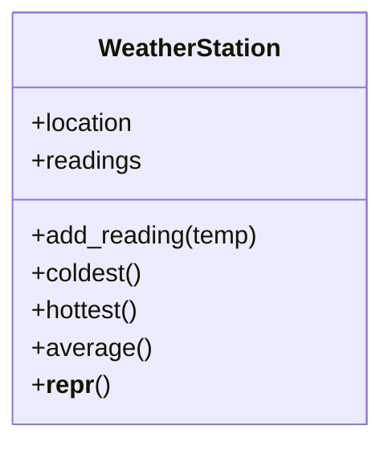
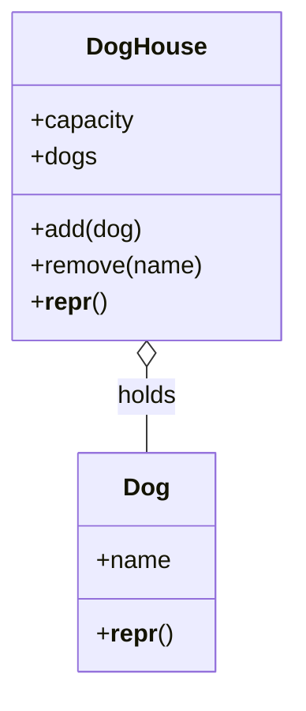

# 12.2 Worked examples — Dog, WeatherStation

Knowing the parts of a class is like knowing the parts of a sentence — the
real skill is composing. In this section we build two complete classes the
way working programmers actually do: **in stages**, starting with the
smallest version that does anything, running it, and only then growing it.
Watch not just the code but the *decisions* — what became an attribute, what
became a method, and who is responsible for what — because the section ends
by making those decisions explicit.

## Build 1: a weather station

The problem: a rooftop sensor produces temperature readings all day, and we
want something that collects them and answers questions — coldest, hottest,
average. Here is the design we are heading for:



### Stage 1 — state, and a way to add to it

The smallest useful version stores a location and an initially empty list of
readings. This "start empty, fill later" pattern is everywhere in class
design:

```python
class WeatherStation:
    def __init__(self, location):
        self.location = location
        self.readings = []            # starts empty; grows over time

    def add_reading(self, temp):
        self.readings.append(temp)

station = WeatherStation("Rooftop")
station.add_reading(18.5)
station.add_reading(21.0)

print(station.location, station.readings)
```

```text
Rooftop [18.5, 21.0]
```

Notice that `__init__` took no readings. The station begins life with an
empty list, and `add_reading` is the *only* door through which data enters.
Every reading, whenever it arrives, ends up in the same place — this
object's own list.

### Stage 2 — asking the station questions

Now the payoff methods. Each one computes its answer *from the object's own
state* — no parameters needed, because everything required is already inside
`self`:

```python
class WeatherStation:
    def __init__(self, location):
        self.location = location
        self.readings = []

    def add_reading(self, temp):
        self.readings.append(temp)

    def coldest(self):
        return min(self.readings)

    def hottest(self):
        return max(self.readings)

    def average(self):
        return sum(self.readings) / len(self.readings)

station = WeatherStation("Rooftop")
for temp in [18.5, 21.0, 19.2, 24.8, 17.1]:
    station.add_reading(temp)

print("coldest:", station.coldest())
print("hottest:", station.hottest())
print(f"average: {station.average():.1f}")
```

```text
coldest: 17.1
hottest: 24.8
average: 20.1
```

The methods `return` their answers instead of printing them — so callers can
format, compare, or store the results as they wish. A method that only
prints has one use; a method that returns has thousands.

### Stage 3 — the empty station

Every design has an awkward case, and finding yours early is a professional
habit. What if nobody has added a reading yet? `min` of an empty list is a
crash:

```python
# raises ValueError
class WeatherStation:
    def __init__(self, location):
        self.location = location
        self.readings = []

    def coldest(self):
        return min(self.readings)

empty = WeatherStation("Basement")
print(empty.coldest())      # min() of an empty list -> ValueError
```

A well-mannered class does not let routine situations explode. We decide on
a policy — "questions asked of an empty station answer `None`" — and while
we are at it, add the `__repr__` every class deserves:

```python
class WeatherStation:
    def __init__(self, location):
        self.location = location
        self.readings = []

    def __repr__(self):
        return f"WeatherStation({self.location!r}, {len(self.readings)} readings)"

    def add_reading(self, temp):
        self.readings.append(temp)

    def coldest(self):
        if len(self.readings) == 0:
            return None
        return min(self.readings)

    def hottest(self):
        if len(self.readings) == 0:
            return None
        return max(self.readings)

    def average(self):
        if len(self.readings) == 0:
            return None
        return sum(self.readings) / len(self.readings)

empty = WeatherStation("Basement")
print(empty)
print("coldest:", empty.coldest())    # None, not a crash

empty.add_reading(12.0)
print(empty)
print("coldest:", empty.coldest())
```

```text
WeatherStation('Basement', 0 readings)
coldest: None
WeatherStation('Basement', 1 readings)
coldest: 12.0
```

Returning `None` is one reasonable policy; raising a clear exception of your
own is another. What matters is that *you chose*, and that every method
applies the same choice — classes are little contracts, and consistency is
what makes them trustworthy.

## Build 2: `Dog` and `DogHouse` — composition

One class is a solo; real programs are ensembles. The most common
relationship between classes is **composition** — one object *has* others
inside it, usually in a list. We say `DogHouse` **HAS-A** collection of
`Dog`s:



### Stage 1 — the resident

`Dog` needs almost nothing here: a name and a good `__repr__`. Small classes
are not a failure of imagination — they are a sign the class does one job:

```python
class Dog:
    def __init__(self, name):
        self.name = name

    def __repr__(self):
        return f"Dog({self.name!r})"

print(Dog("Rex"))
print([Dog("Rex"), Dog("Luna")])
```

```text
Dog('Rex')
[Dog('Rex'), Dog('Luna')]
```

That second line is why `__repr__` matters so much in composition: the
`DogHouse` is about to keep dogs in a list, and a printed list shows each
element's `__repr__`. Informative parts make informative wholes.

### Stage 2 — the house, with a rule

`DogHouse` owns two pieces of state — a capacity and the list of current
residents — and enforces one rule: never exceed capacity. The rule lives
inside `add`, the only door in:

```python
class Dog:
    def __init__(self, name):
        self.name = name

    def __repr__(self):
        return f"Dog({self.name!r})"


class DogHouse:
    def __init__(self, capacity):
        self.capacity = capacity
        self.dogs = []

    def __repr__(self):
        return f"DogHouse({len(self.dogs)}/{self.capacity}: {self.dogs})"

    def add(self, dog):
        if len(self.dogs) >= self.capacity:
            return False              # politely refuse
        self.dogs.append(dog)
        return True

house = DogHouse(2)
print(house.add(Dog("Rex")))
print(house.add(Dog("Luna")))
print(house.add(Dog("Biscuit")))     # full — refused
print(house)
```

```text
True
True
False
DogHouse(2/2: [Dog('Rex'), Dog('Luna')])
```

`add` returns `True` or `False` so the caller *knows* whether the dog got in
— and note what it receives: a whole `Dog` object, not a name string.
Objects flow into other objects; that is composition in motion.

### Stage 3 — checking out

Removal by name completes the interface. We search the list for a matching
resident, and again the return value tells the caller what happened — the
evicted `Dog`, or `None` if no dog by that name lives here:

```python
class Dog:
    def __init__(self, name):
        self.name = name

    def __repr__(self):
        return f"Dog({self.name!r})"


class DogHouse:
    def __init__(self, capacity):
        self.capacity = capacity
        self.dogs = []

    def __repr__(self):
        return f"DogHouse({len(self.dogs)}/{self.capacity}: {self.dogs})"

    def add(self, dog):
        if len(self.dogs) >= self.capacity:
            return False
        self.dogs.append(dog)
        return True

    def remove(self, name):
        for dog in self.dogs:
            if dog.name == name:
                self.dogs.remove(dog)
                return dog            # hand the evicted dog back
        return None                   # nobody by that name

house = DogHouse(2)
house.add(Dog("Rex"))
house.add(Dog("Luna"))

print(house.remove("Rex"))
print(house.remove("Bigfoot"))       # not a resident
print(house)
house.add(Dog("Biscuit"))            # room again now
print(house)
```

```text
Dog('Rex')
None
DogHouse(1/2: [Dog('Luna')])
DogHouse(2/2: [Dog('Luna'), Dog('Biscuit')])
```

Removing Rex made room, so Biscuit's second chance succeeds. The house's
state and its rules travel together, and every interaction goes through its
methods.

## How designers think: nouns, verbs, and change

Step back from the two builds and the method behind them shows through.

**Nouns become classes; verbs become methods.** Re-read the problem
statements. "A *station* collects *readings*" — noun `WeatherStation`,
holding `readings`, with verb `add_reading`. "A *dog house* holds *dogs* up
to a capacity; dogs can be *added* and *removed*" — nouns `DogHouse` and
`Dog`, verbs `add` and `remove`. This noun/verb reading is genuinely how
designers get their first draft, and it is how you should start every
exercise on the next page.

**Design is tested by change.** Suppose the requirement shifts: *puppies
under one year count only half toward capacity.* Which code changes? Only
the test inside `DogHouse.add` — one method, one class. Every program that
creates houses, adds dogs, or removes them keeps working untouched, because
none of them ever counted residents themselves; they always asked the house
to do it. That is the payoff of routing every interaction through methods:
the rule lived in exactly one place, so the change lands in exactly one
place.

There is a catch, though. Nothing yet *stops* an impatient caller from
writing `house.dogs.append(...)` and smuggling a third dog past the capacity
check. Making the rule not just centralized but *unbypassable* is
**encapsulation** — the subject of
[Chapter 13, next](../ch13-design/01-encapsulation.md).

!!! warning "Common mistakes"
    - **Reaching around the methods.** Calling `house.dogs.append(dog)`
      directly bypasses the capacity rule and corrupts the object's
      guarantees. If the class provides a method for the job, use it.
    - **Forgetting the empty case.** `average`, `min`, and `max` all fail on
      an empty collection. Decide the policy (return `None`, raise, or
      return a default) the day you write the method, not the day it
      crashes.
    - **Printing instead of returning.** A method that prints its answer
      can only be used one way. Return the value; let the caller decide
      what to do with it.
    - **Sharing one list by accident.** Writing
      `def __init__(self, dogs=[])` makes *every* house share a single
      default list — a famous Python trap. Default to `None` and create
      `[]` inside `__init__`, or simply start empty as we did.

## Check your understanding

1. What does "`DogHouse` HAS-A `Dog`" mean, and how is it visible in the
   code?

    ??? success "Answer"
        Composition: a `DogHouse` object contains `Dog` objects as part of
        its state. In code, it is the `self.dogs` list inside `DogHouse`,
        holding whole `Dog` objects passed into `add`.

2. Read this problem statement and propose classes and methods: "A *library*
   lends *books*; members can *borrow* a book and *return* it, and no book
   can be borrowed twice at once."

    ??? success "Answer"
        Nouns → classes: `Library`, `Book` (arguably `Member` too). Verbs →
        methods on `Library`: `borrow(title)`, `give_back(title)`. The
        "never borrowed twice" rule lives inside `borrow`, exactly as the
        capacity rule lived inside `DogHouse.add`.

3. The capacity rule changed so puppies count half. Why did only
   `DogHouse.add` need to change, and what habit made that possible?

    ??? success "Answer"
        Because the rule was enforced in exactly one place — inside `add` —
        and every user of the class went through that method instead of
        touching `house.dogs` directly. Routing all changes to state through
        methods localizes future change.
