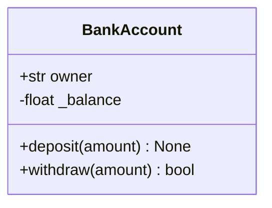
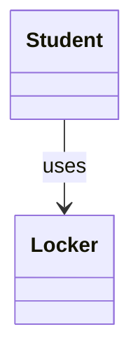
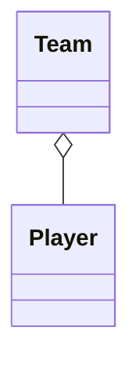
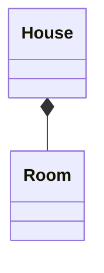
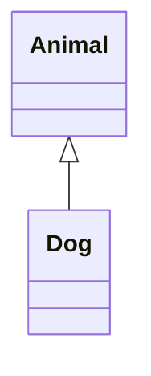
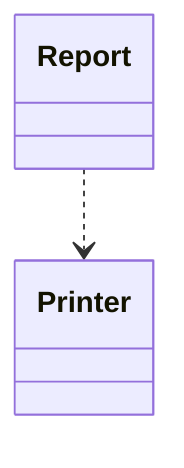
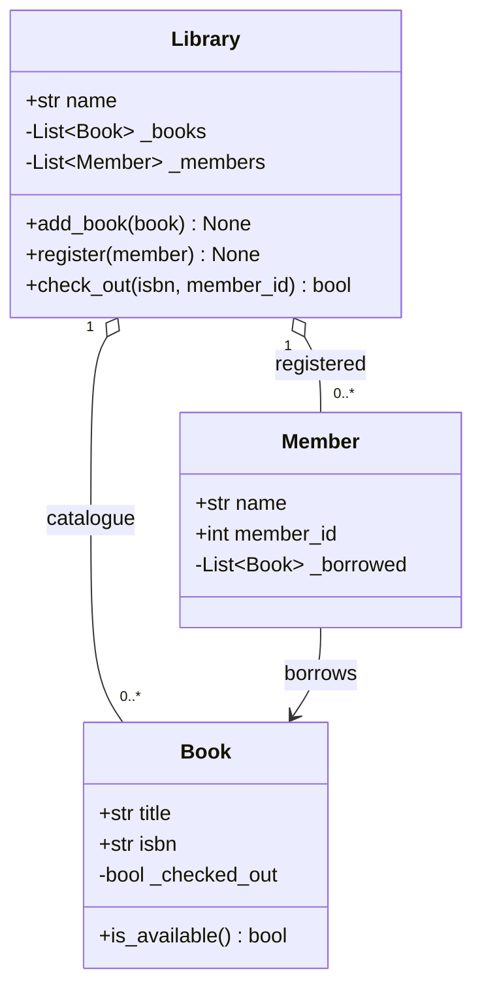
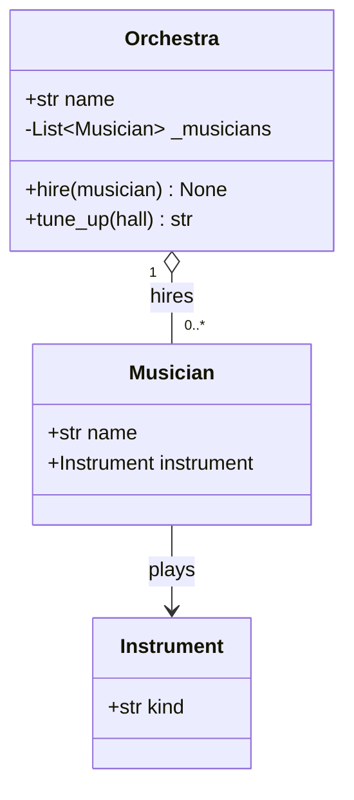

# 13.2 UML class diagrams

Code is a terrible medium for *discussing* a design. To decide whether a
`Library` should own its `Book`s or merely know about them, you do not
need forty lines of Python — you need two boxes and one arrow, drawn in
ten seconds, cheap enough to erase and redraw until the design feels
right. That is what **UML** (Unified Modeling Language) class diagrams
are for: a standard visual shorthand that every professional programmer
can read, used on whiteboards, in documentation, and in design reviews.
This handbook draws UML with **mermaid**, a text-to-diagram language that
renders directly in Markdown — which means that by the end of this page
you will not just *read* class diagrams, you will *write* them.

## Why draw before you code

A diagram earns its keep three ways. **Cost**: moving a responsibility
between boxes takes seconds; moving it between written classes means
editing constructors, call sites, and tests. **Communication**: a diagram
shows the whole design at once, in a form a teammate (or your future
self) absorbs far faster than code. **Honesty**: a class that is hard to
draw — arrows everywhere — is usually a class that is hard to use, and
the diagram says so *before* you invest a week in it. The habit to build:
three or more classes, sketch first.

## Anatomy of a class box

A UML class is a rectangle with three compartments, top to bottom:

1. the **name** of the class;
2. its **attributes** (UML says *fields*), one per line;
3. its **operations** (UML says *methods*), one per line.

Each member line starts with a **visibility marker**:

| Marker | UML meaning | Python habit |
| --- | --- | --- |
| `+` | public | plain name — the official interface |
| `-` | private | `_name` (or `__name`) — internals |
| `#` | protected | `_name` in a class designed for subclassing |

Here is the guarded `BankAccount` from
[13.1](01-encapsulation.md) as a class box:



Read it as: *`BankAccount` publicly exposes `owner`, privately holds
`_balance`, and offers two public operations; `withdraw` returns a
`bool`.* Attributes are written `visibility type name`; operations add
parentheses (with parameter names) and put the return type after.

## Writing mermaid `classDiagram` yourself

That diagram is nothing but text. Here is its exact source — this is what
you would type into any Markdown file between a pair of ```` ```mermaid ````
fences:

```text
classDiagram
    class BankAccount {
        +str owner
        -float _balance
        +deposit(amount) None
        +withdraw(amount) bool
    }
```

The rules, in full — this is the whole language you need:

- The first line is always the keyword `classDiagram`.
- Declare a class with `class Name { ... }` and put one member per line
  inside the braces.
- A line *without* parentheses is an attribute; a line *with* parentheses
  is a method. The `+`, `-`, `#` prefixes are the visibility markers from
  the table above.
- Write generic (container) types with tildes, because angle brackets
  would confuse the parser: `List~Book~` renders as *List&lt;Book&gt;*.
- Relationships are written *outside* the braces, one per line, as
  `ClassA arrow ClassB`, optionally followed by `: label`. The five
  arrows are the subject of the next section.
- Cardinalities (how many?) go in quotes on either side of the arrow:
  `Library "1" o-- "0..*" Book` — one library, zero-or-more books.

!!! tip
    Experiment instantly at `https://mermaid.live` — paste text, see the
    picture. Ten minutes of play fixes the syntax in your memory.

## The five relationships

Boxes are the easy half. The design information lives in the **arrows**
between them, and UML distinguishes five. The table first, then each with
a diagram and the Python it corresponds to:

| Relationship | Mermaid | Read it as | In Python code |
| --- | --- | --- | --- |
| Association | `A --> B` | "A knows about B" | attribute holding a B made elsewhere |
| Aggregation | `A o-- B` | "A has B, but B lives on without A" | container of B objects passed in |
| Composition | `A *-- B` | "A owns B; B dies with A" | A creates its B objects in `__init__` |
| Inheritance | `A <|-- B` | "B is a kind of A" | `class B(A):` |
| Dependency | `A ..> B` | "A briefly uses B" | B appears only as a parameter or local |

### Association — "knows about"



A lasting link to a peer object. The `Student` stores a reference to a
`Locker` that was created elsewhere and has its own independent life:

```python
class Locker:
    def __init__(self, number):
        self.number = number

class Student:
    def __init__(self, name, locker):
        self.name = name
        self.locker = locker      # a lasting link to a peer object

s = Student("Ines", Locker(217))
print(f"{s.name} uses locker {s.locker.number}")
```

### Aggregation — "has, but does not own"



A whole–part relationship with independent parts: the team *has* players,
but the players existed before the team and survive its deletion. The open
diamond sits on the *whole* (the `Team`) side.

```python
class Player:
    def __init__(self, name):
        self.name = name

class Team:
    def __init__(self, players):
        self.players = players    # made elsewhere, handed in

alice, bo = Player("Alice"), Player("Bo")
team = Team([alice, bo])
del team                          # the team dissolves ...
print(alice.name, "still exists") # ... its players do not
```

In code, association and aggregation look identical — an attribute
holding a reference. The diagram records *intent*: aggregation says
"whole and part", association says "peers". Even professionals shrug at
borderline cases; do not lose sleep there.

### Composition — "owns outright"



The strongest form of ownership: the house *creates* its rooms, no other
object holds them, and when the house goes, the rooms go. The filled
diamond sits on the owner's side. The code signature: the parts are built
inside `__init__` and never handed in from outside.

```python
class Room:
    def __init__(self, name):
        self.name = name

class House:
    def __init__(self):
        self.rooms = [Room("kitchen"), Room("bedroom")]  # built inside

h = House()
print([room.name for room in h.rooms])
```

### Inheritance — "is a kind of"



The hollow triangle points **at the parent**. `Dog` is a kind of
`Animal` and inherits everything an `Animal` can do:

```python
class Animal:
    def eat(self):
        return "munch"

class Dog(Animal):        # Dog is an Animal
    pass

print(Dog().eat())        # inherited without writing anything
```

This arrow is so important that [Chapter 15](../ch15-inheritance/index.md)
is devoted entirely to it — here you only need to recognise it.

### Dependency — "briefly uses"



The weakest link: `Report` uses a `Printer` inside one method — as a
parameter or a local variable — but keeps no attribute. Dashed line,
because the connection evaporates when the method returns.

```python
class Printer:
    def output(self, text):
        print(text)

class Report:
    def __init__(self, title):
        self.title = title

    def send_to(self, printer):   # uses it, does not keep it
        printer.output(f"--- {self.title} ---")

Report("Quarterly sales").send_to(Printer())
```

## From diagram to code: the Library

Time for a full round trip. Suppose a design session produced this
three-class diagram:



Translating is mechanical. Each box becomes a `class`; each attribute
line becomes an assignment in `__init__` (with `-` members getting the
underscore); each operation becomes a `def`. The aggregation arrows tell
us books and members are created *outside* the library and added to it;
the association tells us a member will hold references to borrowed books.

```python
class Book:
    def __init__(self, title, isbn):
        self.title = title
        self.isbn = isbn
        self._checked_out = False

    def is_available(self):
        return not self._checked_out


class Member:
    def __init__(self, name, member_id):
        self.name = name
        self.member_id = member_id
        self._borrowed = []          # Books this member holds


class Library:
    def __init__(self, name):
        self.name = name
        self._books = []
        self._members = []

    def add_book(self, book):
        self._books.append(book)

    def register(self, member):
        self._members.append(member)

    def check_out(self, isbn, member_id):
        return False   # you will implement this in Exercise 13.8

    def summary(self):
        return (f"{self.name}: {len(self._books)} book(s), "
                f"{len(self._members)} member(s)")


lib = Library("Riverside Branch")
lib.add_book(Book("A Tour of the Machine", "978-1-0000-0001-1"))
lib.register(Member("Sam Ortiz", 4021))
print(lib.summary())
```

This prints `Riverside Branch: 1 book(s), 1 member(s)`. A skeleton like
this is exactly what a diagram should hand you: every *shape* decision is
made, and only the interesting logic remains.

## From code to diagram

Now reverse the direction. Read this working code and extract its design:

```python
class Instrument:
    def __init__(self, kind):
        self.kind = kind

class Musician:
    def __init__(self, name, instrument):
        self.name = name
        self.instrument = instrument   # handed in from outside

class Orchestra:
    def __init__(self, name):
        self.name = name
        self._musicians = []           # filled over time

    def hire(self, musician):
        self._musicians.append(musician)

    def tune_up(self, hall):           # uses the hall, keeps nothing
        return f"{self.name} tuning up in {hall}"

violin = Instrument("violin")
mara = Musician("Mara", violin)
orch = Orchestra("Civic Symphony")
orch.hire(mara)
print(orch.tune_up("Main Hall"))
```

Work attribute by attribute. `Orchestra._musicians` holds `Musician`
objects that were created outside and passed to `hire` — aggregation.
`Musician.instrument` is a lasting reference to a peer — association.
`hall` is only a parameter of `tune_up`, never stored — a dependency at
most, and since it is a plain string we simply leave it off the diagram:



Being able to run this translation in both directions is the actual
skill. The next section uses it for real: requirements in, diagram drawn,
system built.

!!! warning "Common mistakes"

    - **Inheritance arrow drawn backwards.** The triangle points at the
      *parent*: `Animal <|-- Dog`. Writing `Dog <|-- Animal` claims that
      Animal is a kind of Dog — a very different zoo.
    - **Composition for things handed in.** If objects are created
      outside and passed to the constructor or an `add` method, that is
      aggregation (`o--`) at most. Reserve `*--` for parts the owner
      builds itself.
    - **Drawing everything.** A diagram that lists every helper method
      and private field is as unreadable as the code. Diagrams are for
      *communication* — include what a reader needs to grasp the design,
      omit the rest.
    - **Forgetting the `classDiagram` header.** Without that first line,
      mermaid does not know which diagram type you want and renders an
      error box instead of your design.

## Check your understanding

1. A `University` creates its `Department` objects in its own
   `__init__`, and no other code ever holds them. Which arrow, written in
   mermaid, connects the two?

    ??? success "Answer"
        Composition, with the filled diamond on the owner:
        `University *-- Department`. The departments are built inside the
        university and die with it.

2. What does `Shape <|-- Circle` claim, and which class is the parent?

    ??? success "Answer"
        It claims *Circle is a kind of Shape* — inheritance. The hollow
        triangle touches `Shape`, so `Shape` is the parent and `Circle`
        the child (`class Circle(Shape):` in Python).

3. A method `Invoice.print_via(printer)` takes a `Printer` argument, uses
   it, and returns. `Invoice` has no printer attribute. Association or
   dependency — and how would the arrow differ?

    ??? success "Answer"
        Dependency: the link lasts only for the duration of one call.
        Draw it dashed, `Invoice ..> Printer`. An association (`-->`,
        solid) would require a lasting attribute.
