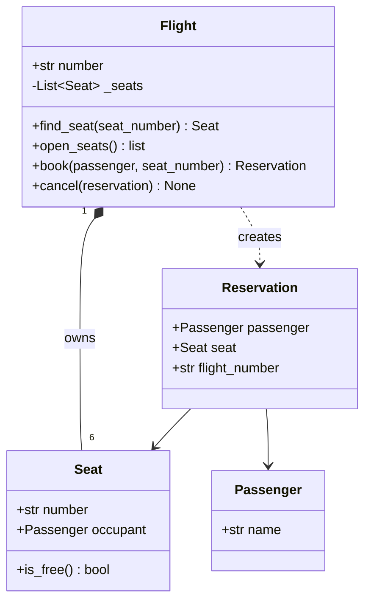

# 13.3 Multi-class systems

One class is a data type; several classes working together are a
*program*. This page builds a complete miniature system — an airline
reservation desk — from four sentences of requirements to a running
scenario, using every tool this chapter has introduced: nouns become
classes, verbs become methods, the design goes on paper as a mermaid
diagram *before* any code, and encapsulation decides who is allowed to
touch what. The system is small enough to hold in your head and real
enough to teach the design lessons that scale.

## From requirements to nouns and verbs

Every design starts as prose. Here is our customer's request:

> 1. The airline operates flights. Each **flight** has a flight number
>    and a fixed set of **seats**.
> 2. A **passenger** can *book* a free seat on a flight; booking a seat
>    that is taken must be *rejected*.
> 3. A successful booking produces a **reservation** that links the
>    passenger to the seat.
> 4. A passenger can *cancel* a reservation, which *frees* the seat for
>    someone else.

The classic first move: underline the **nouns** (candidate classes or
attributes) and the *verbs* (candidate methods).

| Word | Kind | Becomes |
| --- | --- | --- |
| flight | noun | class `Flight` |
| flight number | noun | attribute `Flight.number` |
| seat | noun | class `Seat` |
| passenger | noun | class `Passenger` |
| reservation | noun | class `Reservation` |
| book | verb | method `Flight.book(...)` |
| reject | verb | `book` returns `None` on failure |
| cancel | verb | method `Flight.cancel(...)` |
| free | verb | `Seat.is_free()`, and what `cancel` does |

Not every noun deserves a class — *flight number* is clearly just an
attribute — and not every verb deserves a method of its own. The table is
a brainstorm, not a contract; judgement trims it.

## The design on paper

Now the relationships, decided *before* coding. Seats belong to exactly
one flight and are created by it — composition. A reservation merely
*points at* a passenger and a seat — associations. And `Flight.book`
manufactures reservations — a dashed dependency arrow.



Two deliberate choices are worth pausing on. First, a `Seat` does **not**
know which `Flight` it belongs to — nothing in the requirements needs
that direction, and every arrow you *don't* draw is complexity you don't
pay for. Second, the seat's `occupant` starts as `None`; "no passenger"
is a state a seat must be able to represent.

## Building it, class by class

We implement from the edges inward: the classes with no dependencies
first, the coordinator (`Flight`) last.

`Seat` knows its number and who is sitting in it — nothing else:

```python
class Seat:
    """One seat on one flight; knows who occupies it."""

    def __init__(self, number):
        self.number = number      # e.g. "1A"
        self.occupant = None      # a Passenger, or None if free

    def is_free(self):
        return self.occupant is None

    def __str__(self):
        if self.is_free():
            return f"Seat {self.number}: free"
        return f"Seat {self.number}: taken by {self.occupant.name}"

print(Seat("1A"))
```

Running it prints `Seat 1A: free`. Next, the two record-keepers.
`Passenger` is almost embarrassingly small — and that is fine; a class
with one honest job beats a clever one with three. `Reservation` links a
passenger to a seat and remembers which flight the link belongs to:

```python
# continues
class Passenger:
    def __init__(self, name):
        self.name = name


class Reservation:
    """Records that one passenger holds one seat on one flight."""

    def __init__(self, passenger, seat, flight_number):
        self.passenger = passenger
        self.seat = seat
        self.flight_number = flight_number

    def __str__(self):
        return (f"{self.passenger.name} -> seat {self.seat.number} "
                f"on {self.flight_number}")

ada = Passenger("Ada Lam")
print(Reservation(ada, Seat("1A"), "NW713"))
```

!!! note "About the `# continues` marker"
    A block starting with `# continues` re-runs everything above it on
    this page and then its own lines — that is how it can use `Seat`
    without redefining it. Its output therefore *starts with* the earlier
    blocks' output (`Seat 1A: free` here) before the new line:
    `Ada Lam -> seat 1A on NW713`.

Notice what `Reservation` does **not** do: it never writes to
`seat.occupant`. Creating a reservation and actually claiming the seat
are different acts, and exactly one class should have the power to claim
seats. That class is `Flight` — the coordinator that owns the seats and
enforces every rule from the requirements:

```python
# continues
class Flight:
    ROWS = (1, 2)
    LETTERS = ("A", "B", "C")

    def __init__(self, number):
        self.number = number
        # composition: the flight builds its own seats
        self._seats = [Seat(f"{row}{letter}")
                       for row in self.ROWS for letter in self.LETTERS]

    def find_seat(self, seat_number):
        for seat in self._seats:
            if seat.number == seat_number:
                return seat
        return None

    def open_seats(self):
        return [seat.number for seat in self._seats if seat.is_free()]

    def book(self, passenger, seat_number):
        """Return a Reservation, or None if the seat is unavailable."""
        seat = self.find_seat(seat_number)
        if seat is None or not seat.is_free():
            return None                      # requirement 2: reject
        seat.occupant = passenger
        return Reservation(passenger, seat, self.number)

    def cancel(self, reservation):
        reservation.seat.occupant = None     # requirement 4: free it

    def __str__(self):
        return (f"Flight {self.number}: {len(self.open_seats())} "
                f"of {len(self._seats)} seats free")

flight = Flight("NW713")
maya = Passenger("Maya Chen")
print(flight.book(maya, "2B"))
print(flight)
```

The two new output lines are `Maya Chen -> seat 2B on NW713` and
`Flight NW713: 5 of 6 seats free`. Every requirement now has a home:
booking checks availability and either claims the seat or returns `None`;
cancelling puts the seat back exactly as it was.

## The scenario, end to end

With all four classes on the page, the scenario is a plain script —
exactly the code you would put at the bottom of the finished file. It
exercises every requirement in order: book, double-book (rejected),
cancel, rebook.

```python
# continues
flight = Flight("NW713")             # a fresh flight, nobody aboard
ada = Passenger("Ada Lam")
ben = Passenger("Ben Osei")
chloe = Passenger("Chloe Park")

print(flight)

res_ada = flight.book(ada, "1A")
print(f"Booked: {res_ada}")

res_ben = flight.book(ben, "2C")
print(f"Booked: {res_ben}")

res_dup = flight.book(chloe, "1A")           # 1A is taken
if res_dup is None:
    print("Rejected: seat 1A on NW713 is already taken")

flight.cancel(res_ada)
print(f"Cancelled: {ada.name} gave up seat 1A")

res_chloe = flight.book(chloe, "1A")
print(f"Booked: {res_chloe}")

print(flight)
```

After the four familiar lines from the earlier stages (the price of
`# continues`), the scenario itself prints exactly this:

```text
Flight NW713: 6 of 6 seats free
Booked: Ada Lam -> seat 1A on NW713
Booked: Ben Osei -> seat 2C on NW713
Rejected: seat 1A on NW713 is already taken
Cancelled: Ada Lam gave up seat 1A
Booked: Chloe Park -> seat 1A on NW713
Flight NW713: 4 of 6 seats free
```

Walk through it against the requirements. Line 1: a fresh flight, all
six seats open. Lines 2–3: two successful bookings, each returning a
`Reservation` whose `__str__` states the link it records. Line 4: Chloe
asks for Ada's seat; `book` finds the seat occupied and returns `None` —
the rejection required by sentence 2, and note that *nothing changed*:
a refused booking leaves no fingerprints. Line 5: Ada cancels, and her
seat's `occupant` goes back to `None`. Line 6: the very same seat is
booked again, this time by Chloe — proof the cancel truly freed it.
Line 7: two seats taken (Ben in 2C, Chloe in 1A), four free.

One more design decision hides in plain sight: the *classes* never call
`print`. All printing lives in the scenario script at the bottom. Keeping
input/output out of the model classes means the same `Flight` could sit
behind a web page, a phone app, or a test suite without changing a line.

## The design lessons, made explicit

**Single responsibility.** Each class has one job you can state in one
sentence — and when you cannot, the class wants splitting:

| Class | Its one job |
| --- | --- |
| `Seat` | know its number and who occupies it |
| `Passenger` | identify a person |
| `Reservation` | record one passenger–seat–flight link |
| `Flight` | own the seats and enforce the booking rules |

**Who owns what data.** The seats live in `Flight._seats` — underscored,
because outside code has no business rearranging them — and only
`Flight.book` and `Flight.cancel` ever write to a seat's `occupant`.
When every mutation of a piece of state flows through one class, bugs
have a return address.

**Law of least surprise.** `book` on a taken seat could have raised an
exception, silently evicted the current occupant, or picked a different
seat "helpfully". It returns `None` and changes nothing: the least
surprising behaviour, and the easiest for calling code to handle
honestly. Design APIs the way you wish others designed them for you.

## Three shapes, one itch

To close the chapter, a small system that *works perfectly* and still
feels wrong. Three geometry classes, each with an `area()` and a
`describe()`:

```python
import math

class Circle:
    def __init__(self, radius):
        self.radius = radius

    def area(self):
        return math.pi * self.radius ** 2

    def describe(self):                    # duplicated!
        print(f"circle with area {self.area():.2f}")

class Rectangle:
    def __init__(self, width, height):
        self.width = width
        self.height = height

    def area(self):
        return self.width * self.height

    def describe(self):                    # duplicated!
        print(f"rectangle with area {self.area():.2f}")

class Triangle:
    def __init__(self, base, height):
        self.base = base
        self.height = height

    def area(self):
        return self.base * self.height / 2

    def describe(self):                    # duplicated!
        print(f"triangle with area {self.area():.2f}")

for shape in [Circle(1), Rectangle(2, 3), Triangle(4, 5)]:
    shape.describe()
```

```text
circle with area 3.14
rectangle with area 6.00
triangle with area 10.00
```

Look at the three `describe` methods: apart from one word, they are the
same code, written three times. Fix a formatting bug in one and you must
remember to fix it in all three. And although the loop at the bottom
treats the shapes uniformly, nothing in the language *knows* they are all
"shapes" — the similarity lives only in our heads. Three classes share
`area()` and triplicate `describe()`... there must be a better way. There
is, and it is the single biggest idea remaining in this book:
[Chapter 15](../ch15-inheritance/index.md) resolves this exact example
with inheritance.

!!! warning "Common mistakes"

    - **The god class.** Cramming seats, passengers, and booking rules
      into one giant `Airline` class. It works — briefly — and then every
      change touches the same 300 lines. If you cannot state a class's
      job in one sentence, split it.
    - **Letting anyone claim a seat.** If scenario code writes
      `seat.occupant = someone` directly, the double-booking check in
      `book` is decoration. Route every state change through the class
      that owns the rule.
    - **Classes that print.** A `Flight` that calls `print` inside `book`
      cannot be reused where printing is wrong (tests, web servers).
      Return values; let the caller decide how to show them.
    - **Modelling more than the requirements ask.** Meal preferences,
      frequent-flyer tiers, seat prices — none of the four sentences
      mention them. Build the system that was asked for; leave hooks for
      the rest.

## Check your understanding

1. In the nouns-and-verbs pass, why did *flight number* become an
   attribute while *flight* became a class?

    ??? success "Answer"
        A flight has its own state (a set of seats) and behaviour
        (booking, cancelling), so it earns a class. A flight number is a
        single value with no behaviour of its own — it is *data about* a
        flight, hence an attribute.

2. `Reservation.__init__` receives a seat but never sets
   `seat.occupant`. Why is that a feature, not an oversight?

    ??? success "Answer"
        Claiming a seat is governed by a rule (only if free), and rules
        need a single enforcement point. That point is `Flight.book`. If
        constructing a `Reservation` also claimed the seat, anyone could
        bypass the availability check by constructing one directly.

3. `flight.book(dana, "9Z")` is called on our six-seat flight. What
   happens, and which line of `book` decides it?

    ??? success "Answer"
        `find_seat` returns `None` because no seat is numbered "9Z", so
        the guard `if seat is None or not seat.is_free()` triggers and
        `book` returns `None` — a rejection with no state change.
