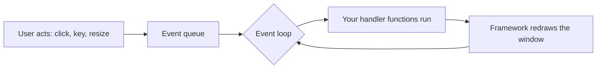

# 14.3 GUIs and other directions

Every program in this book so far has had the same shape: start at the
top, run to the bottom, print, exit. Yet almost no software you *use*
works that way — your editor, your browser, and every phone app sit
quietly doing nothing until you click, tap, or type, then spring into
action, then wait again. Building programs like that requires turning
the flow of control inside out, and understanding that inversion — the
**event loop** — is the last conceptual gift of Part II. This section
shows you the model, lets you taste it in runnable code, and then opens
the map: where can you go from here?

## The event loop: programs that wait

A graphical program (GUI, for *graphical user interface*) is organised
around three parts:

- **Events** — clicks, keypresses, window resizes — arrive from the user at
  unpredictable moments and wait in a queue.
- **The event loop** is owned by the GUI framework rather than by you. It
  takes events one at a time and dispatches each to the handler registered
  for it.
- **Your handlers** do the work: one updates some state, the framework
  redraws the window, and the loop goes back to waiting.

In a picture:



Notice who is in charge: *the framework calls your code*, not the other
way around. You write small functions, hand them over, and surrender
control. This is sometimes called the Hollywood principle — "don't call
us, we'll call you" — and it is the single biggest mental shift between
console programs and GUI programs.

## Hello, window — in both languages

Here is the classic first window in Python's built-in `tkinter` toolkit
and in Java's Swing. An honest note first: **these blocks have no Run
button on purpose.** The browser sandbox that runs this book's Python
has no window system — no screen of its own, no way to pop up a real
desktop window — so GUI code cannot execute here. Copy the Python
version into a file on your own machine
(see [Chapter 1.2](../ch01-tools/02-python-setup.md)) and run it there;
a small window with a button will appear.

```text
# hello_window.py — run on your own machine, not in the browser
import tkinter as tk

def say_hello():                       # a handler, written by you
    label.config(text="Hello, world!")

root = tk.Tk()                         # the main window
root.title("My first window")

label = tk.Label(root, text="Press the button")
button = tk.Button(root, text="Say hello", command=say_hello)
label.pack()                           # let the layout manager place them
button.pack()

root.mainloop()                        # hand control to the event loop
```

```text
// HelloWindow.java — the same program in Java Swing
import javax.swing.*;

public class HelloWindow {
    public static void main(String[] args) {
        JFrame frame = new JFrame("My first window");
        JLabel label = new JLabel("Press the button");
        JButton button = new JButton("Say hello");

        button.addActionListener(e -> label.setText("Hello, world!"));

        frame.add(label, "North");
        frame.add(button, "South");
        frame.setSize(250, 100);
        frame.setDefaultCloseOperation(JFrame.EXIT_ON_CLOSE);
        frame.setVisible(true);        // the event loop starts here
    }
}
```

The two programs are the same shape:

1. **Build the widgets.**
2. **Register a handler** — `command=say_hello` in Python,
   `addActionListener(...)` in Java.
3. **Start the loop** — `mainloop()` / `setVisible(true)`.

After step 3, *your* code only runs when events arrive.

Note a crucial detail in the Python: it says `command=say_hello` — the
function itself, no parentheses. Writing `command=say_hello()` would *call*
the function immediately, once, during setup, and register its return value
(`None`) as the handler. This is the most common first GUI bug in existence.

Neither sketch is the end of the story.
[Section 42.4](../ch42-web-gui/04-desktop-gui.md) builds a small app twice —
in tkinter, and in **JavaFX**, the toolkit that has largely replaced the
Swing shown here — and adds what a real interface needs: layout panes,
observable properties, the UI-thread rule that explains frozen windows, and a
runnable Python model of a widget tree with layout, hit testing, and event
bubbling.

## Callbacks: functions handed to the framework

A function you pass to a framework for it to call later is a
**callback**. Nothing about callbacks actually requires windows —
functions are values in Python, so we can build a tiny, perfectly
runnable event loop of our own and watch the whole model work:

```python
def on_click():
    print("Button clicked!")

def on_quit():
    print("Bye!")

handlers = {"click": on_click, "quit": on_quit}   # registration

# imagine these arriving from a user, one by one
events = ["click", "click", "hover", "quit"]

for event in events:                   # the event loop
    handler = handlers.get(event)      # dispatch ...
    if handler:
        handler()                      # ... and call back
    else:
        print(f"(no handler for '{event}' — ignored)")
```

```text
Button clicked!
Button clicked!
(no handler for 'hover' — ignored)
Bye!
```

That is genuinely all an event loop is: a queue of events, a dictionary
from event to handler (the collection choice is no accident — see
[14.1](01-collections-tour.md)), and a loop that dispatches. Real
frameworks add windows, drawing, and dozens of event types, but the
skeleton in those twelve lines never changes.

## A taste of another domain: text processing

GUIs are one direction; here is a second one you can run right now.
Enormous amounts of real programming is *text* work — log files, emails,
web pages, form letters — and your existing toolkit already handles it.
Two miniatures. First, finding all capitalized words in a passage:

```python
passage = ("When Ada Lovelace met Charles Babbage in London, "
           "the Analytical Engine was still a dream.")

capitalized = [word.strip(".,") for word in passage.split()
               if word[0].isupper()]
print(capitalized)
```

```text
['When', 'Ada', 'Lovelace', 'Charles', 'Babbage', 'London', 'Analytical', 'Engine']
```

Second, naive template filling — the heart of every mail-merge and
form-letter system ever written:

```python
template = "Dear {name}, your table for {size} is booked for {time}."
booking = {"name": "Ms. Okafor", "size": 4, "time": "7:30 pm"}

# by hand: replace each {key} with its value
letter = template
for key, value in booking.items():
    letter = letter.replace("{" + key + "}", str(value))
print(letter)

# Python's built-in version of the same idea
print(template.format(**booking))
```

Both lines print
`Dear Ms. Okafor, your table for 4 is booked for 7:30 pm.` — your
hand-rolled loop and the built-in `format` agree, and now you know
roughly what `format` does for a living.

## The map from here

Four directions, each fully reachable with what you now know. The first is
more than a direction now: [Chapter 42](../ch42-web-gui/index.md) takes the
web up in full, alongside the desktop windows this page began with.

**The web.** A web application is a program whose events are HTTP
requests instead of clicks: a browser asks for a URL, your handler
function builds a page, the framework sends it back. Python frameworks
like Flask and Django are dictionaries-of-handlers at heart — the event
loop model again, wearing a different hat. That is exactly where
Chapter 42 goes: [42.1](../ch42-web-gui/01-html-css.md) on the HTML and
CSS a page is made of, [42.2](../ch42-web-gui/02-http-server.md) on HTTP
and the request parser, router, and middleware chain at the heart of every
web framework, and [42.3](../ch42-web-gui/03-javascript.md) on browser
JavaScript — including the real event loop, task queue and microtask queue
and all, that the little dispatcher earlier on this page is a sketch of.

**Games.** A game is an event loop running at sixty beats per second:
read input, update the world, redraw, repeat. The objects of Chapters
12–13 shine here — players, enemies, and items are classes; the game
loop calls their `update()` methods. Libraries like Pygame let you build
one in a weekend.

**Data science.** Reading files (Chapter 11), collections (this
chapter), and loops are 90% of practical data work: load a million
rows, group them with dicts, count with `Counter`, plot the result.
The scientific stack — numpy, pandas, matplotlib — industrialises those
exact patterns, trading your `for` loops for operations on whole arrays
at once.

**Audio and music.** Sound is a long array of numbers (Chapter 0's
lesson that *everything* is numbers, cashed in). Generating a tone is a
loop computing a sine wave; an effect is a function transforming one
array into another; a synthesizer is classes wired into — once again —
an event loop listening for keys.

## You know enough to learn anything

Look at what those four paragraphs quietly assumed: functions,
collections, classes, files, loops, events — and you have every one.
That is the real graduation from Part II.

No domain on the map requires new *fundamentals*. Each requires learning a
library, and libraries are learned by reading documentation, trying small
examples, and debugging patiently — skills you have been practicing since
Chapter 2.

Programmers are not people who know everything; they are people equipped to
learn the next thing. You are now one of them. Part III will deepen the
foundations — inheritance, complexity, recursion, data structures — and
[Part VI](../part6-overview.md) later hands you the working toolchain that
professional programmers assume: the shell as a language, build systems,
test frameworks, regular expressions, and the web and GUI material of
Chapter 42. But from this page onward, nothing in programming is closed to
you.

!!! warning "Common mistakes"

    - **Calling the callback instead of passing it.** `command=
      say_hello()` runs the function now and registers `None`;
      `command=say_hello` (no parentheses) hands the function itself to
      the framework. This bug bites everyone exactly once — let it be
      cheap.
    - **Blocking the event loop.** A handler that runs for ten seconds
      freezes the whole window, because the loop cannot dispatch the
      next event until your handler returns. Long work belongs outside
      the handler.
    - **Expecting top-to-bottom flow in a GUI program.** After
      `mainloop()`, the order of *your* code lines no longer determines
      the order things happen — events do. Trace GUI programs by asking
      "which handler fires?", not "which line is next?".
    - **Trying to run window code in the browser sandbox.** The Run
      button's Python has no display to draw on; `tkinter` needs a real
      desktop. Run GUI programs from a file on your own machine.

## Check your understanding

1. In the event-loop model, who calls your handler function, and when?

    ??? success "Answer"
        The framework's event loop calls it, whenever a matching event
        is dispatched. You never call it yourself — you only register
        it. That inversion of control is what makes a program feel
        "always ready" instead of "runs once, top to bottom".

2. What exactly goes wrong with
   `tk.Button(root, text="Go", command=launch())`?

    ??? success "Answer"
        The parentheses call `launch` immediately, during setup, and
        pass its *return value* (probably `None`) as the callback. The
        button then does nothing when clicked. Correct is
        `command=launch` — pass the function itself.

3. Why can't the ▶ Run button on this site execute the `tkinter`
   example?

    ??? success "Answer"
        The examples run in a Python sandbox inside your browser tab,
        which has no window system — no display for `tkinter` to open a
        window on. The code is fine; the environment simply has nowhere
        to draw, so GUI programs must run on a real desktop.
