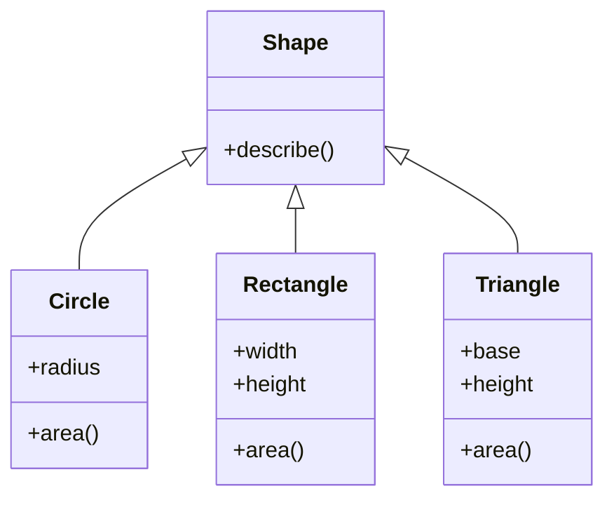

# 15.1 Inheritance

Every large program contains families of classes that are *almost* the same:
three kinds of shape, five kinds of bank account, a dozen kinds of game
character. Without a way to say "these classes share a core", you end up
copying the shared code into every class — and every future fix must be
repeated in every copy. Inheritance is the mechanism that lets one class
receive the attributes and methods of another, so the shared core is written
exactly once.

## The Shapes problem, one more time

[Chapter 13](../ch13-design/03-multi-class.md) closed with an itch: three
classes — `Circle`, `Rectangle`, `Triangle` — each storing its own
measurements and computing its own `area()`, fine so far, but each also
carrying a `describe` method that was a near-copy of the other two:

```text
class Circle:
    ...
    def describe(self):                       # duplicated!
        print(f"circle with area {self.area():.2f}")

class Rectangle:
    ...
    def describe(self):                       # duplicated!
        print(f"rectangle with area {self.area():.2f}")

class Triangle:
    ...
    def describe(self):                       # duplicated!
        print(f"triangle with area {self.area():.2f}")
```

Three near-identical method bodies — only the name differs — is a *design
smell*. Chapter 13 named the two pains precisely:

- **Every fix has to be made three times.** Improve the wording of
  `describe` and you must change `Circle`, `Rectangle`, *and* `Triangle`.
  Forget one copy and the program is silently inconsistent.
- **No shared type exists.** The loop over `[Circle(1), Rectangle(2, 3),
  Triangle(4, 5)]` treated the three uniformly, yet nothing in the language
  knew they were all "shapes".

The fix for both is to say out loud what we have been muttering all along:
a circle, a rectangle, and a triangle *are all shapes*. Shared behaviour
belongs in a **base class** (also called a *parent* or *superclass*) that
the three specific classes inherit from:

```python
import math

class Shape:                     # the base class: shared behaviour lives here
    def describe(self):
        name = type(self).__name__.lower()    # "Circle" -> "circle", etc.
        print(f"{name} with area {self.area():.2f}")

class Circle(Shape):             # Circle inherits from Shape
    def __init__(self, radius):
        self.radius = radius

    def area(self):
        return math.pi * self.radius ** 2

class Rectangle(Shape):
    def __init__(self, width, height):
        self.width = width
        self.height = height

    def area(self):
        return self.width * self.height

class Triangle(Shape):
    def __init__(self, base, height):
        self.base = base
        self.height = height

    def area(self):
        return self.base * self.height / 2

for shape in [Circle(1), Rectangle(2, 3), Triangle(4, 5)]:
    shape.describe()             # defined once, in Shape — works for all
```

The output is character-for-character what Chapter 13's version printed:
behaviour preserved, duplication gone. `describe` now exists in exactly one
place — and even the differing names came along, computed from the class
itself.

Both pains are cured. A formatting fix happens once. And the classes now
share a genuine type: every one of them *is a* `Shape`, a fact
[section 15.2](02-polymorphism.md) will cash in.

Notice the trick inside `describe`: it calls `self.area()`, a method the
*base class never defines*. That is legal because by the time `describe`
runs, `self` is always a concrete shape that has one.

!!! tip "The handshake behind most inheritance"

    The base class supplies the **skeleton**; each subclass supplies the
    **specifics**. `Shape.describe` is the skeleton, each `area` is a
    specific, and the two meet at `self.area()`.

Here is the hierarchy as a UML diagram, in the notation from
[Chapter 13](../ch13-design/02-uml.md) (the hollow arrowhead points at the
parent):



## The syntax: `class Child(Parent)`

Python declares inheritance in the class header's parentheses; Java uses the
keyword `extends`. The meaning is the same: *everything the parent has, the
child has too*.

=== "Python"

    ```python
    class Animal:
        def eat(self):
            print("munch munch")

    class Dog(Animal):            # Dog inherits from Animal
        pass

    Dog().eat()                   # inherited — every Dog can eat
    ```

=== "Java"

    ```java
    class Animal {
        void eat() { System.out.println("munch munch"); }
    }

    class Dog extends Animal { }   // Dog inherits from Animal

    new Dog().eat();               // inherited — every Dog can eat
    ```

## What is inherited — and overridden

Three things follow from writing `class Child(Parent)`:

- **Everything is inherited.** The child receives *all* of the parent's
  methods — including `__init__` — and, through them, the parent's instance
  attributes.
- **The child may add members of its own.** Methods and attributes the
  parent never had.
- **A same-named method replaces the inherited one.** If the child defines a
  method the parent already had, the child's version wins. That is
  **overriding**.

```python
class Animal:
    def __init__(self, name):
        self.name = name          # attribute created by the parent

    def eat(self):
        print(f"{self.name} is eating.")

    def speak(self):
        print(f"{self.name} makes a sound.")

class Dog(Animal):                # no __init__ here — Animal's is inherited
    def fetch(self):              # new method, Dog only
        print(f"{self.name} fetches the ball!")

    def speak(self):              # overrides Animal.speak
        print(f"{self.name} says woof!")

class Cat(Animal):
    pass                          # inherits everything unchanged

rex = Dog("Rex")                  # runs the inherited Animal.__init__
rex.eat()                         # inherited
rex.fetch()                       # Dog's own
rex.speak()                       # Dog's override wins
Cat("Mia").speak()                # no override — Animal's version runs
print(isinstance(rex, Animal))    # True — a Dog IS an Animal
```

The lookup rule behind this is simple: for `obj.speak()`, Python searches
`obj`'s own class first and walks up to the parent only if the name is not
found. `Dog` defines `speak`, so its version runs; `Cat` does not, so the
search continues up to `Animal`.

!!! note "Inheritance creates a real type relationship"

    Look at the last line: `isinstance(rex, Animal)` is `True`. As far as
    Python is concerned `rex` is *both* a `Dog` and an `Animal`. Inheritance
    is not merely a code-sharing shortcut — it declares a genuine "is-a"
    relationship, so anything written to accept an `Animal` accepts a `Dog`.

!!! info "Java corner"

    Java overriding works the same way, but Java programmers mark overrides
    with the `@Override` annotation so the compiler can catch typos. Python
    has no such check: if you misspell the method name (`def spek(self)`),
    you silently create a *new* method instead of overriding — a classic
    bug. Read override names twice.

## Constructors chain: `super().__init__`

Usually a child class needs *more* attributes than its parent, so it defines
its own `__init__`. But the parent's `__init__` still has a job to do —
someone has to set up the parent's attributes.

The child therefore calls the parent's constructor explicitly with
`super().__init__(...)`, where `super()` means roughly "the parent-class
view of this same object". Watch the order in which the prints appear:

```python
class Animal:
    def __init__(self, name):
        print("  2. Animal.__init__ runs: storing name")
        self.name = name

class Dog(Animal):
    def __init__(self, name, breed):
        print("1. Dog.__init__ starts")
        super().__init__(name)        # hand control to the parent...
        print("  3. Dog.__init__ resumes: storing breed")
        self.breed = breed            # ...then finish the child's setup

rex = Dog("Rex", "beagle")
print(f"4. Done: {rex.name} the {rex.breed}")
```

Constructors *chain*, and the numbered prints show the order exactly:

1. The child's `__init__` starts and does whatever must happen first.
2. `super().__init__(...)` hands control to the parent, which runs to
   completion and sets up the attributes *it* declared.
3. Control returns to the child, which finishes its own setup.

Every class in the chain initialises exactly the attributes it declared, and
nothing gets forgotten.

### When you forget the call

Python will not remind you. The object is simply born half-built, and the
crash happens *later*, wherever the missing attribute is first touched:

```python
# raises AttributeError
class Animal:
    def __init__(self, name):
        self.name = name

class Dog(Animal):
    def __init__(self, name, breed):
        self.breed = breed            # oops — never called super().__init__

rex = Dog("Rex", "beagle")            # no error here...
print(rex.name)                       # ...but rex has no .name attribute
```

!!! info "Java corner"

    Java is stricter: every constructor begins with a call to the parent
    constructor, and if you don't write `super(...)` yourself the compiler
    silently inserts a no-argument `super()` — or refuses to compile if the
    parent has no no-argument constructor. Python never inserts the call
    for you: **if the child defines `__init__`, the parent's `__init__`
    runs only if you call it.**

## Extending vs replacing behaviour

`super()` is not only for constructors. Inside any override you can call
`super().method(...)` to run the parent's version and then add to it —
*extending* the behaviour instead of replacing it wholesale:

```python
class Account:
    def __init__(self, owner):
        self.owner = owner
        self.balance = 0.0

    def deposit(self, amount):
        self.balance += amount
        print(f"Deposited {amount:.2f}; balance is now {self.balance:.2f}")

class LoggedAccount(Account):
    def deposit(self, amount):
        print(f"[log] {self.owner} requested a deposit of {amount:.2f}")
        super().deposit(amount)       # reuse the parent's logic, don't copy it

acct = LoggedAccount("Ada")
acct.deposit(50)
acct.deposit(25)
```

`LoggedAccount.deposit` adds one line of logging and delegates the real work
upward. If the deposit rules ever change in `Account`, the logged version
inherits the fix automatically — which was the whole point of inheritance.

## The is-a test: when inheritance is right

Inheritance is so convenient that beginners reach for it everywhere, and
that is a mistake. The honest test is one sentence:

> Say "*Child* is a *Parent*" out loud. If the sentence is obviously true,
> inheritance fits. If it sounds even slightly forced, you probably want
> **composition** — one object *holding* another — instead.

Try the sentence on three candidate designs:

| Say it out loud | Verdict | What to write |
| --- | --- | --- |
| "A `Dog` is an `Animal`" | obviously true | `class Dog(Animal)` |
| "A `Circle` is a `Shape`" | obviously true | `class Circle(Shape)` |
| "A `Car` is an `Engine`" | false — a car *has* one | composition |

So the engine belongs *inside* the car as an attribute, not above it as a
parent:

```python
class Engine:
    def start(self):
        print("Engine on.")

class Car:                        # a Car HAS-A Engine — composition
    def __init__(self):
        self.engine = Engine()    # held as an attribute, not inherited

    def drive(self):
        self.engine.start()
        print("Rolling.")

Car().drive()
```

You met composition without the name in
[Chapter 12's worked examples](../ch12-classes/02-worked-examples.md), where
a `WeatherStation` held a list of readings rather than trying to *be* one.
When in doubt, prefer composition: it keeps classes independent, while a bad
inheritance link is hard to undo later.

## Single vs multiple inheritance

Everything above used one parent per class — **single inheritance** — and
that covers the vast majority of real designs. Java in fact *only* allows a
single parent class (`extends` one class; wanting more is what interfaces
are for, as we will see in [section 15.3](03-interfaces.md)).

### Multiple inheritance and the MRO

Python does permit **multiple inheritance** — `class C(A, B)` — which raises
an inevitable question: if both parents define the same method, whose runs?
The answer is a documented rule called the **method resolution order** (MRO).
Roughly, Python searches:

1. the class itself;
2. then its parents, left to right as written in the class header;
3. then each parent's own parents, after that parent;
4. and never the same class twice.

You can ask any class for its MRO:

```python
class Swimmer:
    def move(self):
        print("swims")

class Runner:
    def move(self):
        print("runs")

class Triathlete(Swimmer, Runner):    # two parents, left to right
    pass

Triathlete().move()                   # Swimmer is listed first, so it wins

for cls in Triathlete.__mro__:        # the exact search order Python uses
    print(cls.__name__)
```

Multiple inheritance has legitimate uses — the standard library mixes in
small helper classes this way — but designs built on it get confusing fast.
**Our advice, shared by most professional Python: one parent per class.**
Reach for composition or [section 15.3](03-interfaces.md)'s tools when that
feels limiting.

!!! warning "Common mistakes"

    - **Forgetting `super().__init__(...)`** in a child's `__init__`. No
      error appears at construction time; instead an `AttributeError`
      surfaces later, far from the real cause. If the child defines
      `__init__`, chain to the parent first.
    - **Misspelling an override.** `def spek(self)` quietly creates a new
      method; the inherited `speak` remains in force. Python has no
      `@Override` check — verify the name matches exactly.
    - **Inheriting for convenience instead of meaning.** `class Car(Engine)`
      compiles and even "works", but the design collapses the moment a car
      needs two engines or an engine needs to exist outside a car. Apply
      the is-a test; use composition when it fails.
    - **Calling `super().__init__()` without the arguments the parent
      needs.** `super().__init__()` runs the parent's `__init__` with no
      arguments; if the parent requires a `name`, that is a `TypeError`.
      Pass along whatever the parent's constructor expects.

## Check your understanding

1. A child class defines `__init__` but never calls `super().__init__`.
   What happens, and when do you find out?

    ??? success "Answer"

        The parent's `__init__` never runs, so the attributes it would have
        created don't exist. Construction itself succeeds; the failure is
        deferred to the first time some code touches a missing attribute,
        raising `AttributeError` — often far from the actual bug.

2. You want `SavingsAccount.deposit` to do everything `Account.deposit`
   does *plus* print a bonus message. Replace or extend — and how?

    ??? success "Answer"

        Extend: override `deposit` in `SavingsAccount`, call
        `super().deposit(amount)` inside it to reuse the parent's logic,
        then add the extra print. Copying the parent's body would
        re-create the duplication inheritance exists to remove.

3. True or false: "A `Square` has a side length, and a `Circle` has a
   radius, so `class Square(Circle)` would let `Square` reuse `Circle`'s
   code."

    ??? success "Answer"

        False. A square is not a circle — the is-a test fails — so
        inheriting would hand `Square` a meaningless `radius` and any
        circle-specific behaviour. If both need shared behaviour, give
        them a common parent like `Shape` instead.
