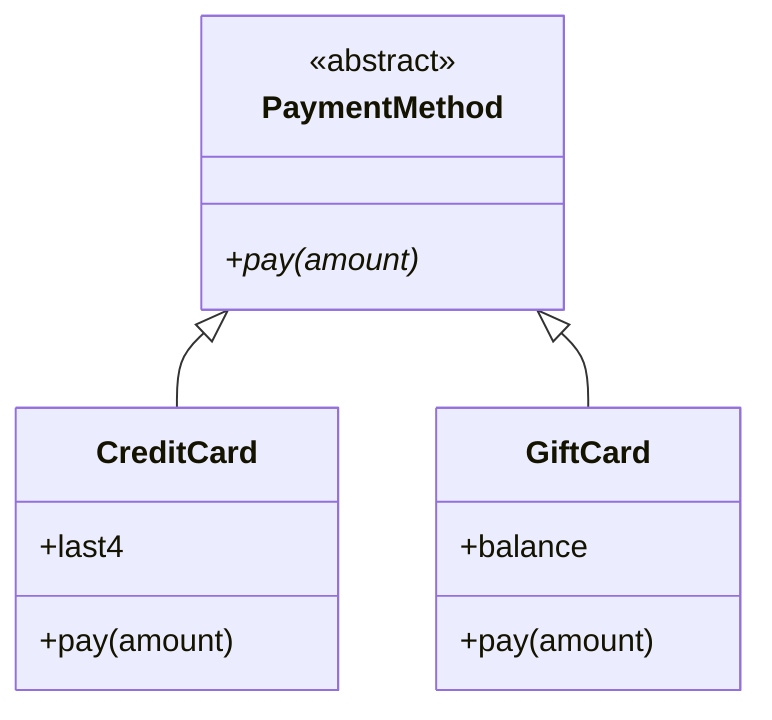

# 15.3 Interfaces and abstract classes

Inheritance shares *implementation*: real code in a base class flows into
subclasses. But teams often need to share something thinner — a pure
*promise*. "Every payment method can `pay`; every shape can report an
`area`" — never mind how.

A named promise like this is called a **contract**, and it is what lets one
programmer write the checkout code while another writes the gift-card class,
months apart, and have the pieces snap together. Java's tool for contracts is
the `interface`. Python offers two answers — abstract base classes and duck
typing — and knowing when to use which is a small badge of Python fluency.

## Java interfaces vs Python ABCs

A Java `interface` lists method signatures with no bodies; a class
`implements` it (and may implement many at once — this is how Java escapes
its single-parent limit). Python expresses the same idea with an **abstract
base class** (ABC): a class that inherits from `abc.ABC` and marks its
promised-but-not-provided methods with `@abstractmethod`.

=== "Python"

    ```python
    from abc import ABC, abstractmethod

    class Measurable(ABC):            # the contract
        @abstractmethod
        def area(self):
            """Return the area in square units."""

        def describe(self):           # a concrete helper may ride along
            print(f"area = {self.area():.2f}")

    class Circle(Measurable):         # signing the contract
        def __init__(self, radius):
            self.radius = radius

        def area(self):               # fulfilling it
            return 3.141592653589793 * self.radius ** 2

    Circle(2).describe()
    ```

=== "Java"

    ```java
    interface Measurable {            // the contract
        double area();                // no body — signature only

        default void describe() {     // 'default' methods may have bodies
            System.out.println("area = " + area());
        }
    }

    class Circle implements Measurable {   // signing the contract
        double radius;
        Circle(double radius) { this.radius = radius; }

        public double area() {        // fulfilling it
            return Math.PI * radius * radius;
        }
    }
    ```

    ```java
    // A class implements MANY interfaces, though it extends only one class:
    class Circle extends Shape implements Measurable, Comparable<Circle> { ... }
    ```

## The contract is enforced

What does `@abstractmethod` actually buy you? Enforcement, at two separate
moments.

**First: the contract itself is not a usable object.** An abstract class
refuses to be instantiated:

```python
# raises TypeError
from abc import ABC, abstractmethod

class Measurable(ABC):
    @abstractmethod
    def area(self):
        """Return the area in square units."""

m = Measurable()      # a promise is not a thing — this refuses to run
```

**Second: a subclass that *signs* the contract but fails to *fulfil* it is
still abstract**, and refuses just the same:

```python
# raises TypeError
from abc import ABC, abstractmethod

class Measurable(ABC):
    @abstractmethod
    def area(self):
        """Return the area in square units."""

class Blob(Measurable):
    pass                  # never implemented area()

b = Blob()                # caught at construction time, not deep in a loop
```

!!! note "The point is *where* the error appears"

    With plain duck typing, a missing `area` crashes wherever some distant
    loop happens to call it. With an ABC, the crash happens *at
    construction*, with a message naming exactly which methods are missing.
    The bug is caught earlier and diagnosed for you.

## Abstract class vs interface: the honest distinction

The two ideas overlap but are not identical, and the difference is worth
keeping straight:

| | Java `interface` | Abstract class (Java `abstract class` / Python ABC) |
| --- | --- | --- |
| Method bodies | Normally none (`default` methods excepted) | Mix of abstract and fully implemented methods |
| Fields / state | No instance fields | May define attributes and `__init__` |
| How many can a class take? | Many (`implements A, B, C`) | One parent class in Java; Python allows more but one is the norm |
| Best mental model | Pure contract: "what you can do" | Half-built machine: "what you are, partly assembled" |

Python's ABCs can play both roles:

- **Only abstract methods** — the class behaves like a Java interface, a
  pure contract.
- **Abstract methods mixed with real code and attributes** — the class
  behaves like Java's `abstract class`, a half-built machine.

The `Shape` class from [section 15.1](01-inheritance.md) was secretly the
second kind: it provided `describe` for free while *expecting* an `area` it
never defined. Turning that informal expectation into `@abstractmethod` is a
one-line upgrade that makes the expectation machine-checked.

## A worked plug-in system: payment methods

Contracts shine in plug-in architectures: a core routine written once,
against the contract, plus any number of interchangeable implementations.
Here is a miniature checkout system. Note that `checkout` — the "core" —
mentions no concrete class anywhere:

```python
from abc import ABC, abstractmethod

class PaymentMethod(ABC):
    """The contract every payment plug-in must fulfil."""

    @abstractmethod
    def pay(self, amount):
        """Attempt to pay `amount`; return a receipt string."""

class CreditCard(PaymentMethod):
    def __init__(self, number):
        self.last4 = number[-4:]

    def pay(self, amount):
        return f"Charged ${amount:.2f} to card ending {self.last4}"

class GiftCard(PaymentMethod):
    def __init__(self, balance):
        self.balance = balance

    def pay(self, amount):
        if amount > self.balance:
            return f"Declined: gift card holds only ${self.balance:.2f}"
        self.balance -= amount
        return f"Paid ${amount:.2f} by gift card (${self.balance:.2f} left)"

def checkout(cart_total, method):
    """Written once, against the contract — knows no concrete class."""
    print(f"Cart total ${cart_total:.2f} -> {method.pay(cart_total)}")

checkout(25.00, CreditCard("1234 5678 9012 3456"))
checkout(25.00, GiftCard(40.00))
checkout(25.00, GiftCard(10.00))
```

Next month someone adds `class BankTransfer(PaymentMethod)` in a separate
file. `checkout` does not change. The ABC guarantees the new class actually
implements `pay` before a single object is created — the contract is the
seam that lets the team work in parallel.



## Python's other answer: if it quacks…

Everything the ABC gave us, duck typing gives informally. Nothing stops you
from deleting `PaymentMethod` entirely: `checkout` only ever calls
`method.pay(...)`, so *any* object with a `pay` method already works — no
registration, no inheritance, no ceremony.

You have seen Python's built-ins run on this principle all along. `len(x)`
works on any object with a `__len__` method, whoever wrote it:

```python
class Playlist:                 # inherits from nothing special
    def __init__(self, songs):
        self.songs = songs

    def __len__(self):          # the "sizeable" protocol: one method
        return len(self.songs)

road_trip = Playlist(["Track A", "Track B", "Track C"])
print(len(road_trip))           # len() happily quacks along
```

Informal contracts like "has `__len__`", "has `pay`", "has `area`" are
called **protocols** in Python. (Modern Python can even spell them out for
type checkers with `typing.Protocol` — static duck typing — but that is a
tool for a later course; the idea is what matters here.)

## So which should you use? An honest answer

- **Duck typing suffices** for small programs, scripts, and code where you
  control all the classes involved. It is less code, and the Python
  standard library itself mostly works this way.
- **Reach for an ABC** when the contract *is* the product: frameworks and
  plug-in systems where strangers will implement your classes; team
  projects where "you forgot to implement `pay`" should fail loudly on day
  one rather than in production; base classes that also ship shared
  concrete code. The ABC turns a convention into an error message.

If in doubt in this book's exercises: start with duck typing, and promote
the design to an ABC the moment a missing method bites you.

!!! warning "Common mistakes"

    - **Instantiating the contract.** `PaymentMethod()` raises `TypeError`
      by design — abstract classes exist to be subclassed, not built.
      Create a concrete subclass instead.
    - **Misspelling the implementing method.** `def Pay(self, amount)` does
      not satisfy `@abstractmethod pay` — the class stays abstract and
      still refuses to instantiate. Match names exactly.
    - **Forgetting to inherit from `ABC`.** `@abstractmethod` only enforces
      anything when the class's metaclass cooperates — in practice:
      subclass `ABC` (or set `metaclass=ABCMeta`), or the "abstract"
      method silently behaves like a normal one.
    - **Writing ABCs for everything.** A three-class script does not need a
      formal contract; the ceremony buys you nothing a docstring wouldn't.
      Contracts pay for themselves at team and framework scale.

## Check your understanding

1. In Java, why are interfaces the standard escape from the single-parent
   rule — what can a class do with interfaces that it cannot do with
   classes?

    ??? success "Answer"

        A Java class may `extends` only one class but `implements` any
        number of interfaces. Since interfaces carry (almost) no
        implementation, multiple contracts can be combined without the
        ambiguity multiple parent classes would create.

2. What are the *two* moments at which Python's ABC machinery raises
   `TypeError`, and what bug does each catch?

    ??? success "Answer"

        (1) Instantiating the abstract base itself — catches "you built
        the contract instead of an implementation". (2) Instantiating a
        subclass that hasn't implemented every `@abstractmethod` —
        catches "you signed the contract but didn't fulfil it", at
        construction time instead of mid-execution.

3. `checkout` worked identically whether or not `PaymentMethod` existed.
   What, concretely, did the ABC add?

    ??? success "Answer"

        Not new behaviour — earlier and clearer failure. Without the ABC, a
        `pay`-less class crashes inside `checkout` with `AttributeError`
        whenever it is first used; with it, the faulty class cannot even
        be instantiated, and the error names the missing method. It also
        documents the contract in code.

4. A teammate proposes: "Make every class in our 20,000-line framework
   implement a formal ABC." Give one argument for and one against.

    ??? success "Answer"

        For: at framework scale, ABCs make contracts explicit and
        machine-checked for outside implementers, failing fast with named
        missing methods. Against: blanket ceremony — many classes have no
        outside implementers, and duck typing plus tests covers them; use
        ABCs at the genuine plug-in seams, not everywhere.
