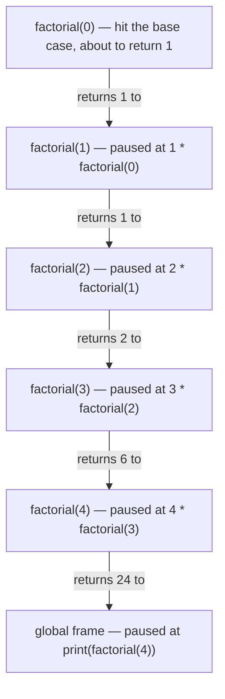

# 17.1 The call stack

The single most important fact about recursion is that there is nothing new
to learn about *how it runs*. When `factorial` calls `factorial`, Python does
exactly what it does when `main` calls `greet`: it pushes a fresh **stack
frame** — a private workspace holding that call's parameters and local
variables — onto the [call stack](../ch05-under-the-hood/03-stack-heap.md),
runs the function body, and pops the frame when the function returns. A
recursive function simply ends up with several of *its own* frames on the
stack at once, each with its own value of `n`. Once you see that, recursion
stops being mysterious and becomes a bookkeeping exercise you can trace on
paper.

## A function that calls itself is still just a function

Start from the mathematical definition of the factorial:

$$
n! \;=\; n \times (n-1)! \qquad\text{with}\qquad 0! = 1
$$

The definition refers to itself, but with a *smaller* input — and it names
one input, $0$, where no self-reference is needed at all. Translating it into
Python is almost mechanical:

```python
def factorial(n):
    if n == 0:          # the case with a direct answer
        return 1
    return n * factorial(n - 1)   # the definition, verbatim

print(factorial(4))
print(factorial(10))
```

This prints `24` and `3628800`. Notice that the code is not "looping" in any
visible way — there is no `while`, no `for`. Each call to `factorial` either
answers immediately (`n == 0`) or delegates a slightly smaller question to
another call of the same function and finishes the job with one
multiplication.

## The two laws of recursion

Every correct recursive function obeys two laws:

1. **It has a base case** — at least one input for which it returns *without*
   calling itself. For `factorial`, that is `n == 0`.
2. **Every recursive call makes progress toward the base case.**
   `factorial(n)` calls `factorial(n - 1)`: the argument strictly shrinks, so
   after finitely many steps it must reach `0`.

Break either law and the function calls itself forever — or rather, until
Python runs out of patience, as we will see below. When you write a recursive
function, check these two laws *first*, before worrying about anything else.

## Tracing factorial(4) frame by frame

Let us watch the stack. Each row of this table is one event; the right-hand
column shows the frames currently on the stack, with the newest on the left.

| Step | Event | Stack (newest first) |
| --- | --- | --- |
| 1 | `factorial(4)` called | `f(4)` |
| 2 | needs `factorial(3)`; push new frame | `f(3)` `f(4)` |
| 3 | needs `factorial(2)`; push new frame | `f(2)` `f(3)` `f(4)` |
| 4 | needs `factorial(1)`; push new frame | `f(1)` `f(2)` `f(3)` `f(4)` |
| 5 | needs `factorial(0)`; push new frame | `f(0)` `f(1)` `f(2)` `f(3)` `f(4)` |
| 6 | base case! `f(0)` returns `1` | `f(1)` `f(2)` `f(3)` `f(4)` |
| 7 | `f(1)` computes `1 * 1`, returns `1` | `f(2)` `f(3)` `f(4)` |
| 8 | `f(2)` computes `2 * 1`, returns `2` | `f(3)` `f(4)` |
| 9 | `f(3)` computes `3 * 2`, returns `6` | `f(4)` |
| 10 | `f(4)` computes `4 * 6`, returns `24` | *(empty)* |

Two things deserve emphasis. First, the multiplications happen on the *way
back up*: `f(4)` cannot compute `4 * ...` until `f(3)` has finished. Second,
at step 5 there are five separate frames alive at once, each holding its own
`n`. Here is the stack at that moment of maximum depth (each frame returns
its result to the frame below it):



You can make Python narrate this descent and return itself. The version below
carries an extra `depth` parameter purely for indentation, so the printout
*is* the shape of the call stack over time:

```python
def factorial(n, depth=0):
    indent = "    " * depth
    print(f"{indent}factorial({n}) starts")
    if n == 0:
        print(f"{indent}base case -> returning 1")
        return 1
    result = n * factorial(n - 1, depth + 1)
    print(f"{indent}factorial({n}) returning {result}")
    return result

answer = factorial(4)
print("answer:", answer)
```

Run it and read the output top to bottom: the indentation marches right as
frames pile up (the descent), reaches the base case at maximum indent, then
the `returning` lines march back left as frames pop (the return). Every
recursive run you will ever trace has this V shape.

## No base case, no mercy

What if we break the first law? Then every call pushes another frame, no call
ever returns, and the stack grows until Python cuts the program off:

```python
# raises RecursionError
def broken(n):
    return broken(n - 1)    # no base case: the calls never stop

broken(10)
```

The traceback ends with
`RecursionError: maximum recursion depth exceeded` — Python's way of saying
the call stack hit its safety limit. That limit exists and you can ask for
it:

```python
import sys
print(sys.getrecursionlimit())
```

In standard CPython the default is 1000 frames (your runtime may print a
different value — whatever it prints is *your* limit). The cap is deliberate:
each frame costs real memory, and a runaway recursion would otherwise eat the
whole stack region of the process. The limit can be raised with
`sys.setrecursionlimit(...)`, but treat that as a last resort — a function
that needs 100 000 frames usually wants to be a loop instead, as
[section 17.3](03-vs-iteration.md) shows.

Note the subtlety: `broken` breaks law 1 outright. A function can also keep a
base case but break law 2 — `factorial(n - 1)` accidentally written as
`factorial(n)` never gets closer to `0` and fails the same way. Also beware
inputs that *step over* the base case: our `factorial(-1)` would recurse
through $-2, -3, \dots$ forever, because `n == 0` is never hit from below.

!!! info "Java corner"
    Java behaves the same way, with different vocabulary. Each thread gets a
    fixed-size stack (typically around 512 KB–1 MB), and a runaway recursion
    ends with `java.lang.StackOverflowError` — the error that a famous
    programming website is named after. There is no adjustable frame-count
    limit as in Python; you simply run out of stack memory, usually after a
    few thousand to a few tens of thousands of frames:

    ```java
    static int broken(int n) {
        return broken(n - 1);   // eventually: StackOverflowError
    }
    ```

!!! warning "Common mistakes"
    - **No base case, or an unreachable one.** Every recursive function needs
      an input it answers directly — and the recursive calls must actually
      reach it. `factorial(-1)` steps *past* `n == 0` and never terminates.
    - **Forgetting to `return` the recursive call.** Writing
      `factorial(n - 1)` on its own line instead of
      `return n * factorial(n - 1)` computes the sub-answer, throws it away,
      and returns `None`.
    - **Assuming the frames share variables.** Each call has its *own* `n` in
      its *own* frame. Changing `n` inside one call does not affect the
      others.
    - **Recursing on the same-sized problem.** A call like `helper(n)` inside
      `helper(n)` makes no progress; the argument (or the structure it walks)
      must shrink toward the base case.

## Check your understanding

1. In the `factorial(4)` trace, how many frames of `factorial` are on the
   stack at the deepest moment, and which frame returns first?

    ??? success "Answer"
        Five frames (`n` = 4, 3, 2, 1, 0), plus the global frame beneath
        them. The *newest* frame, `factorial(0)`, returns first — the stack
        unwinds in last-in, first-out order.

2. State the two laws of recursion, and say which one this function breaks:

    ```text
    def mystery(n):
        if n == 0:
            return 0
        return mystery(n // 1) + 1
    ```

    ??? success "Answer"
        Law 1: have a base case. Law 2: every recursive call must make
        progress toward it. This function has a base case but breaks law 2:
        `n // 1` equals `n`, so the argument never shrinks and the call never
        gets closer to `0`.

3. Without running it, what does `factorial(1)` do, step by step, in the
   original (non-printing) version?

    ??? success "Answer"
        `factorial(1)` is not the base case, so it evaluates
        `1 * factorial(0)`. That pushes a frame for `factorial(0)`, which
        hits the base case and returns `1`. Back in the `factorial(1)` frame,
        `1 * 1` is computed and `1` is returned.

4. Why do the multiplications in `factorial` happen while the stack is
   *unwinding* rather than while it is growing?

    ??? success "Answer"
        The expression `n * factorial(n - 1)` cannot be finished until
        `factorial(n - 1)` has produced a value. So each frame pauses at the
        multiplication, waits for the deeper call, and only multiplies when
        the result comes back — i.e. on the way back up.
