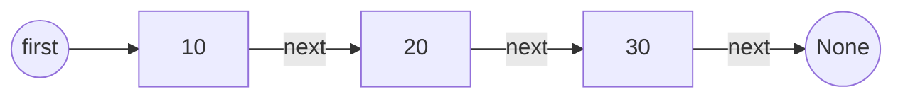
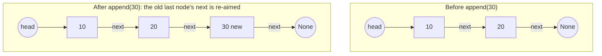
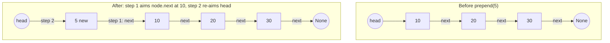
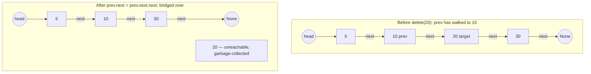
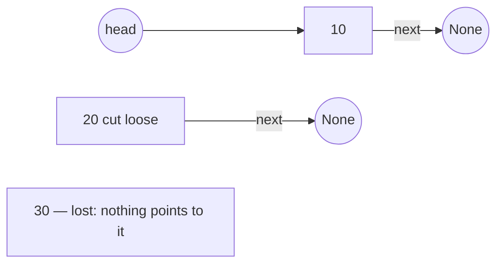

# 18.2 Singly linked lists

A linked list stores its items in separate little objects — **nodes** — each
holding one value and one reference to the next node. That is the entire
idea, and it buys exactly what the cost table in
[section 18.1](01-adts-generics.md) promised: splicing at the front becomes
two assignments instead of shifting an array. The price is a new discipline.
Every operation is *pointer surgery* — re-aiming references while the
patient is awake — and the professional method is always the same:
**draw the picture first, then write the assignments in the order the
picture demands.** In this section, every operation gets its picture.

## The Node idea

A node is the smallest possible class: a value, and a reference called
`next` that either points at another node or is `None` (the end of the
chain). Since a variable holding an object *is* a reference
([Chapter 9](../ch09-collections/01-references.md)), plain assignment is all
the linking machinery we need:

```python
class Node:
    def __init__(self, value):
        self.value = value
        self.next = None      # not linked to anything yet

first = Node(10)
second = Node(20)
third = Node(30)
first.next = second           # link 10 -> 20
second.next = third           # link 20 -> 30

walker = first                # walk the chain to prove it is connected
while walker is not None:
    print(walker.value)
    walker = walker.next      # follow the reference to the next node
```

This prints `10`, `20`, `30`. The `while` loop is the fundamental *traversal*
pattern — start at the first node, follow `next` until you fall off the end.
Here is the structure it walked:



Notice what is *not* here: no indices, no contiguous block. The nodes could
be anywhere on the heap; only the `next` references hold the sequence
together.

That has one dramatic consequence. Lose the reference to the first node and
the whole chain becomes unreachable garbage — which is why every linked list
class guards one precious attribute: `head`.

## A LinkedList class, grown operation by operation

We will grow a `LinkedList` class one operation at a time, each stage
runnable. Stage one: construction, `append`, and a `__repr__` so every later
stage can print itself:

```python
# continues
class LinkedList:
    def __init__(self):
        self.head = None          # empty list: no first node
        self._size = 0

    def append(self, value):
        """Add value at the END of the chain."""
        node = Node(value)
        if self.head is None:     # empty list: the new node IS the front
            self.head = node
        else:
            walker = self.head
            while walker.next is not None:   # walk to the last node
                walker = walker.next
            walker.next = node    # hook the new node onto the end
        self._size += 1

    def __len__(self):
        return self._size

    def __repr__(self):
        parts = []
        walker = self.head
        while walker is not None:
            parts.append(str(walker.value))
            walker = walker.next
        return " -> ".join(parts) + " -> None" if parts else "(empty)"

chain = LinkedList()
print(chain, "| length", len(chain))
chain.append(10)
chain.append(20)
chain.append(30)
print(chain, "| length", len(chain))
```

`append` has two cases because an empty list has no last node to hook onto.
Picture the normal case:



Note the cost hiding in that walk: `append` visits every node to find the
end — $O(n)$. (Real implementations also keep a `tail` reference to make it
$O(1)$; we keep the class minimal here and fix this in the exercises.)

## prepend — the two-assignment splice

Now the operation arrays are worst at. To insert at the front, in this order:

1. **Aim the new node's `next` at the current front** — `node.next = self.head`.
2. **Re-aim `head` at the new node** — `self.head = node`.

We will attach each new method to the existing class as we go — remember from
[Chapter 12](../ch12-classes/index.md) that a method is just a function
whose first parameter is `self`, so `LinkedList.prepend = prepend` bolts it
on exactly as if it had been written inside the `class` block.

```python
# continues
def prepend(self, value):
    """Add value at the FRONT — two assignments, no walking."""
    node = Node(value)
    node.next = self.head     # step 1: new node points at the old front
    self.head = node          # step 2: head points at the new node
    self._size += 1

LinkedList.prepend = prepend

chain.prepend(5)
print(chain, "| length", len(chain))
```



**The order is load-bearing.** Swap the two assignments — `self.head = node`
first — and the old front is no longer reachable when you try to point the new
node at it: `node.next = self.head` would then aim the node at *itself*.

Draw first; the picture tells you step 1 must run while `head` still knows
where the old front is.

No shifting, no walking: front insertion is $O(1)$, exactly as the ADT cost
table advertised.

## find — the traversal pattern, packaged

```python
# continues
def find(self, value):
    """Return the first Node holding value, or None if absent."""
    walker = self.head
    while walker is not None:
        if walker.value == value:
            return walker
        walker = walker.next
    return None

LinkedList.find = find

print(chain.find(20).value)
print(chain.find(99))
```

This prints `20` and `None` — the same walk as `__repr__`, stopping early on
a match. There is no shortcut: without indices, reaching anything is
$O(n)$.

## delete — pointer surgery with the picture first

The surgery for deleting the node holding `20` from `5 -> 10 -> 20 -> 30` is
three steps, only one of which writes anything:

1. **Walk a reference `prev` to the node *before* the target** — here, the
   node holding `10`. You must stand behind the target, because a singly
   linked node has no way back.
2. **Bridge over the target with one assignment** —
   `prev.next = prev.next.next`. This reads the old route and re-aims it in a
   single step.
3. **Let go.** Nothing points at the removed node any more, so Python's
   garbage collector reclaims it. You never "free" it yourself.



The only wrinkle is the front: the head node has no `prev`, so it needs its
own branch that re-aims `head` instead. That gives the finished method three
cases:

- **Empty list** — nothing to delete, report failure.
- **Target is the head** — re-aim `head` at `head.next`.
- **Target is anywhere else** — walk `prev`, then bridge.

```python
# continues
def delete(self, value):
    """Remove the first node holding value. Return True if found."""
    if self.head is None:                 # case 1: empty list
        return False
    if self.head.value == value:          # case 2: target is the front
        self.head = self.head.next
        self._size -= 1
        return True
    prev = self.head                      # case 3: walk prev to just
    while prev.next is not None:          #         before the target
        if prev.next.value == value:
            prev.next = prev.next.next    # the one-assignment bridge
            self._size -= 1
            return True
        prev = prev.next
    return False                          # value was never there

LinkedList.delete = delete

print(chain)
print("delete(20):", chain.delete(20), "->", chain)
print("delete(5): ", chain.delete(5), "->", chain)
print("delete(99):", chain.delete(99), "->", chain, "| length", len(chain))
```

Now the promised wrong-order bug. A tempting "tidy-up" is to cut the doomed
node loose *before* bridging over it. Watch what that order does:

```python
# continues
scratch = LinkedList()
for v in [10, 20, 30]:
    scratch.append(v)

prev = scratch.head           # 10, the node before the target
doomed = prev.next            # 20, the node to remove
doomed.next = None            # WRONG FIRST MOVE: 20 no longer knows 30
prev.next = doomed.next       # bridges to... None. The 30 node is lost!
print(scratch)
```

It prints `10 -> None` — node 30 was not deleted, yet it is gone, because
the only reference to it lived in `doomed.next` and we erased it one line
too early:



!!! note "The discipline, stated once and used forever"

    **Never overwrite a reference while it is the last road to a node you
    still need.**

The correct single assignment `prev.next = prev.next.next` reads the old route
and re-aims it in one step, so nothing needed is ever unreachable.

When an operation needs several assignments — as doubly linked insertion will,
next section — draw the picture and number the steps, so that each assignment
only overwrites references you have already copied or no longer need.

The class is now complete: `append`, `prepend`, `find`, `delete`,
`__len__`, and `__repr__`, with every pointer move accounted for in a
picture. (Writing the finished class in a single `class` statement — the
form you would actually keep in a file — is a five-minute copy-and-arrange
job; the [exercises](exercises.md) work from exactly these pieces.)

## The costs, verified

Theory says: `prepend` is $O(1)$ per call for the linked list but
`insert(0, ...)` is $O(n)$ per call for Python's array-backed `list`. Race
them:

```python
# continues
import time

def time_prepends_linked(n):
    lst = LinkedList()
    start = time.perf_counter()
    for k in range(n):
        lst.prepend(k)
    return (time.perf_counter() - start) * 1000

def time_prepends_array(n):
    lst = []
    start = time.perf_counter()
    for k in range(n):
        lst.insert(0, k)
    return (time.perf_counter() - start) * 1000

for n in [5000, 10000, 20000]:
    print(f"n = {n:6d}: linked {time_prepends_linked(n):8.1f} ms"
          f" | array list {time_prepends_array(n):8.1f} ms")
```

The linked column grows *linearly* with `n` (each prepend is constant work),
while the array column grows roughly *quadratically* (each insert shifts
everything). By `n = 20000` the array list is clearly losing, and widening
the gap is just a matter of larger `n`. The mirror-image experiment —
indexing into the middle — would show the array winning by just as much:
`items[n // 2]` is one address calculation, while a linked list must take
`n // 2` steps of `walker = walker.next`.

**So when does linked beat array?** In three situations:

- **The workload is dominated by front insertions and removals** — queues and
  deques.
- **You splice chains together or cut them apart** — an $O(1)$ re-aim, versus
  copying whole blocks.
- **Items must never move in memory once created** — other code may be holding
  references to them.

When you need random access by index, arrays win, full stop.

!!! warning "Common mistakes"
    - **Losing the head.** Writing `self.head = self.head.next` to "walk"
      the list destroys it — walk with a separate `walker` variable and
      leave `head` alone.
    - **Overwriting the last reference to a node you still need** — the
      wrong-order bug above. Draw the picture; number the assignments.
    - **Forgetting the empty and front cases.** `append` on an empty list
      and `delete` of the head node both need their own branch — until the
      sentinel trick in [section 18.3](03-doubly-linked.md) removes the
      need.
    - **Testing node equality with `is` when you mean values.**
      `walker.value == value` compares contents; `walker is other_node`
      asks whether two references point at the *same object* — both useful,
      not interchangeable.

## Check your understanding

1. Why is `prepend` $O(1)$ for a linked list but `insert(0, x)` $O(n)$ for
   Python's `list`?

    ??? success "Answer"
        The linked list only re-aims two references (`node.next` and
        `head`) no matter how long the chain is. The array-backed `list`
        must shift every existing element one slot to the right to open
        position 0 — work proportional to the length.

2. In `delete`, why does the loop test `prev.next.value` instead of walking
   a reference to the target node itself?

    ??? success "Answer"
        Because the bridge assignment is `prev.next = prev.next.next` — you
        must be standing at the node *before* the target to re-aim its
        `next`. In a singly linked list a node has no way back, so arriving
        *at* the target is one step too far.

3. Predict the output, then explain the state it reveals:

    ```text
    x = Node(1)
    y = Node(2)
    x.next = y
    z = x.next
    z.value = 99
    print(y.value)
    ```

    ??? success "Answer"
        `99`. `z = x.next` copies a *reference*, not the node, so `z` and
        `y` name the same object — changing it through one name is visible
        through the other. Aliasing is exactly why pointer surgery must be
        done in the right order.

4. After the wrong-order bug demo, which node still exists on the heap but
   can never be reached, and what happens to it?

    ??? success "Answer"
        The node holding 30: the only reference to it was `doomed.next`
        (from node 20), which was set to `None` too early. With no
        references left, Python's garbage collector reclaims it.
