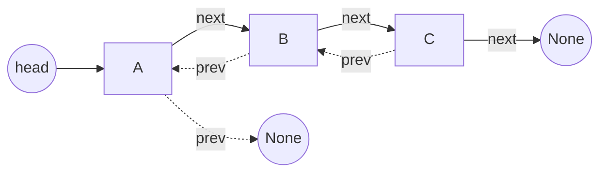
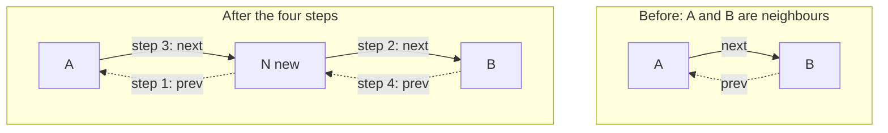
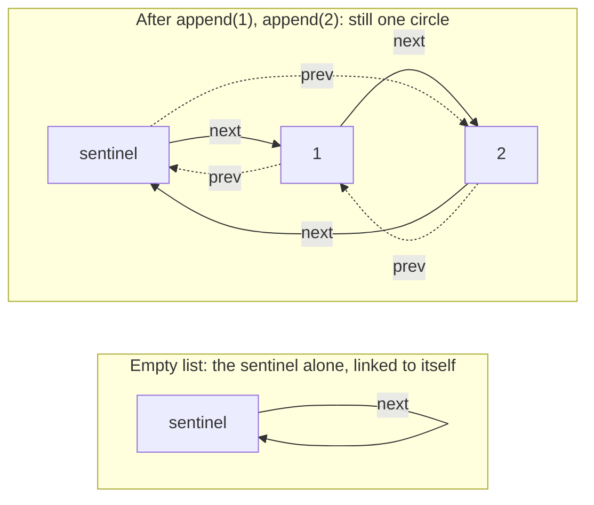

# 18.3 Doubly linked lists

A singly linked list is a one-way street: from any node you can reach
everything after it and nothing before it, which is why `delete` had to creep
up on its target from behind.

Give each node a second reference, `prev`, and the street runs both ways. You
can walk backwards, remove a node you are standing on, and treat the two ends
symmetrically — all in $O(1)$.

The extra power has a price. One more reference per node, and, more
interestingly, double the pointer surgery: every splice now updates *four*
references, in an order you must get right. This section builds the structure,
then introduces the **sentinel** — the trick that makes the trickiest part,
the edge cases, simply disappear.

## Adding prev: nodes that know both neighbours

```python
class DNode:
    def __init__(self, value=None):
        self.value = value
        self.prev = None      # reference to the node before
        self.next = None      # reference to the node after

a = DNode("A")
b = DNode("B")
a.next = b            # forward link
b.prev = a            # matching backward link
print(a.next.value, b.prev.value)
```

This prints `B A`. Every link is now a *pair* of references that must agree:
if `a.next` is `b`, then `b.prev` must be `a`. Diagrammed, with forward
links solid and backward links dashed:



The payoff is symmetry. With a reference to the *last* node (a `tail`, or
the sentinel below), inserting or removing at **either end** is $O(1)$ —
the singly linked list could only promise that for the front.

## The four-pointer update

To insert node `N` between neighbours `A` and `B`, four references must
change — `N`'s two outgoing links and one link on each neighbour:

1. `N.prev = A` — new node points back at `A`;
2. `N.next = B` — new node points forward at `B`;
3. `A.next = N` — `A`'s forward link re-aims at `N`;
4. `B.prev = N` — `B`'s backward link re-aims at `N`.



Why this order?

- **Steps 1–2 are always safe.** They write into the *new* node, which
  nothing points at yet, so no existing route can be destroyed.
- **Steps 3–4 are safe *here*.** They overwrite `A.next` and `B.prev`, but the
  old routes those held (`A.next` was `B`, `B.prev` was `A`) are still
  reachable through the local variables `A` and `B`.

!!! note "The discipline, restated for four pointers"

    **Capture both neighbours in variables first; then no assignment can
    strand you.**

The classic bug is writing `A.next = N` *before* using `A.next` to find `B` —
after the overwrite, `N.next = A.next` aims `N` at itself.

Removal is the mirror image, and shows off `prev`'s superpower — a node can
now unhook *itself*, no creeping up from behind:

```python
# continues
# build A <-> B <-> C by hand, then remove B from the middle
a, b, c = DNode("A"), DNode("B"), DNode("C")
a.next, b.prev = b, a
b.next, c.prev = c, b

b.prev.next = b.next      # A's forward link bridges over B
b.next.prev = b.prev      # C's backward link bridges over B
print(a.next.value, c.prev.value)   # A and C are now neighbours
```

This prints `C A`: two assignments, both reading `b`'s intact links before
anything is lost. Note the removal needed no walk at all — given the node,
unhooking is $O(1)$.

## Sentinels: making the edge cases vanish

Count the special cases our singly linked `delete` needed: empty list,
target at the head, target elsewhere. Doubly linked code doubles the
opportunities — is `prev` `None`? is `next` `None`? — and every operation
sprouts three or four `if` branches for first/last/empty situations.

The **sentinel** (or *dummy node*) kills them all. Allocate one permanent
value-less node when the list is created, and link it into a circle with
itself. Then three facts hold forever:

- **The real first node is `sentinel.next`**, whatever it happens to be.
- **The real last node is `sentinel.prev`.**
- **An empty list is the sentinel pointing at itself** — a circle of one.

Now **every** real node has a live node on both sides. There *is no*
first-or-last special case, because the neighbourhood is never `None`:



Here is a complete doubly linked list built on one sentinel. Watch how few
`if` statements it contains — one single insertion helper serves the front,
the back, and the empty list identically:

```python
class DNode:
    def __init__(self, value=None):
        self.value = value
        self.prev = None
        self.next = None

class DoublyLinkedList:
    def __init__(self):
        self.sentinel = DNode()               # the permanent dummy node
        self.sentinel.next = self.sentinel    # empty = a circle of one
        self.sentinel.prev = self.sentinel
        self._size = 0

    def _insert_between(self, value, before, after):
        node = DNode(value)
        node.prev = before        # steps 1-2: aim the new node's links
        node.next = after
        before.next = node        # steps 3-4: re-aim the neighbours
        after.prev = node
        self._size += 1

    def append(self, value):      # insert before the sentinel = at the back
        self._insert_between(value, self.sentinel.prev, self.sentinel)

    def appendleft(self, value):  # insert after the sentinel = at the front
        self._insert_between(value, self.sentinel, self.sentinel.next)

    def _unlink(self, node):
        node.prev.next = node.next
        node.next.prev = node.prev
        self._size -= 1
        return node.value

    def pop(self):
        if self._size == 0:
            raise IndexError("pop from empty list")
        return self._unlink(self.sentinel.prev)     # last real node

    def popleft(self):
        if self._size == 0:
            raise IndexError("pop from empty list")
        return self._unlink(self.sentinel.next)     # first real node

    def __len__(self):
        return self._size

    def __repr__(self):
        parts = []
        walker = self.sentinel.next
        while walker is not self.sentinel:
            parts.append(str(walker.value))
            walker = walker.next
        return " <-> ".join(parts) if parts else "(empty)"

d = DoublyLinkedList()
d.append(2)
d.append(3)
d.appendleft(1)          # all three inserts ran the SAME code path
print(d, "| length", len(d))
print("pop():", d.pop(), "| popleft():", d.popleft(), "| left:", d)
```

Study `append` on the *empty* list. Both `sentinel.prev` and `sentinel.next`
are the sentinel itself, so `_insert_between(value, sentinel, sentinel)`
splices the node into the circle of one — the same four assignments as any
middle insertion.

Empty, front, back: one code path. The only `if`s left in the whole class are
the honest ones, refusing to pop from an empty list.

That is what sentinels buy: fewer branches, fewer edge-case bugs, and pointer
surgery that is *always* the general case.

## Walking both ways

The two directions are now symmetric — the same loop shape, following
`next` or `prev`, stopping at the sentinel:

```python
# continues
d = DoublyLinkedList()
for word in ["alpha", "beta", "gamma", "delta"]:
    d.append(word)

walker = d.sentinel.next                 # forwards
while walker is not d.sentinel:
    print(walker.value, end=" ")
    walker = walker.next
print()

walker = d.sentinel.prev                 # backwards — no extra machinery
while walker is not d.sentinel:
    print(walker.value, end=" ")
    walker = walker.prev
print()
```

A singly linked list would need $O(n^2)$ work or a full copy to print
itself backwards; here it is the same $O(n)$ loop run in reverse gear.

## The production answer: collections.deque

You now know how a doubly linked structure works — so in real programs,
*don't build one*. Python ships `collections.deque`
("double-ended queue"), a heavily optimized C implementation of exactly
this behaviour contract:

```python
from collections import deque

jobs = deque()
jobs.append("render")        # O(1) at the back
jobs.append("upload")
jobs.appendleft("URGENT")    # O(1) at the front
print(jobs)
print(jobs.popleft())        # O(1) — take from the front
print(jobs.pop())            # O(1) — take from the back
print(jobs, "| length:", len(jobs))
```

Same method names we just implemented, same $O(1)$ end operations, none of
the maintenance burden. (Under the hood CPython's `deque` uses linked
*blocks* of 64 slots — a hybrid of the array and node worlds — but the
behaviour and costs are the doubly-linked contract.)

=== "Python"

    ```python
    from collections import deque
    line = deque(["a", "b"])
    line.appendleft("front")
    print(line.pop())          # "b"
    ```

=== "Java"

    ```java
    // java.util.LinkedList IS a doubly linked list with sentinel-style ends
    Deque<String> line = new LinkedList<>(List.of("a", "b"));
    line.addFirst("front");
    System.out.println(line.pollLast());   // "b"

    // ...but ArrayDeque is usually faster in practice and preferred:
    Deque<String> line2 = new ArrayDeque<>(List.of("a", "b"));
    ```

## Cost recap: the three lists

| Operation | Array list (`list`) | Singly linked (head only) | Doubly linked + sentinel |
| --- | --- | --- | --- |
| `get(i)` by index | $O(1)$ | $O(n)$ | $O(n)$ |
| insert/remove at front | $O(n)$ | $O(1)$ | $O(1)$ |
| insert/remove at back | $O(1)$ amortized | $O(n)$ | $O(1)$ |
| remove a node you hold a reference to | — | $O(n)$ (find prev) | $O(1)$ |
| walk backwards | $O(n)$ (easy) | not directly | $O(n)$ (easy) |
| memory per item | value slot | value + 1 reference | value + 2 references |

The bottom line for choosing:

- **Random access by index** — the array wins.
- **Heavy work at the two ends** — `deque` wins.
- **Unlinking arbitrary nodes you already hold references to, in $O(1)$** —
  caches and schedulers — the doubly linked list is the classic answer.

That last row pays off twice in [Chapter 36](../ch36-hashing-tries/index.md).
Its [exercises](../ch36-hashing-tries/exercises.md) build an **LRU cache**,
which is exactly a hash table (to find a node in $O(1)$) wired to a
sentinel-ended doubly linked list (to move that node to the front in $O(1)$) —
neither structure can do the job alone.

And [Section 36.4](../ch36-hashing-tries/04-skip-lists.md) stacks several
linked lists on top of one another to build a **skip list**: an ordered
structure that searches in expected $O(\log n)$ using coin flips instead of a
tree's rebalancing, which makes it a genuine alternative to the balanced trees
of [Chapter 35](../ch35-balanced-trees/index.md).

!!! warning "Common mistakes"
    - **Updating only half of a link pair.** Setting `a.next = b` without
      `b.prev = a` leaves the two directions disagreeing — forward and
      backward walks now see different lists.
    - **Overwriting a neighbour's link before capturing it.** In the
      four-step insertion, writing `A.next = N` first and then reading
      `A.next` to find `B` gives you `N` itself — self-loop. Capture `A`
      and `B` in variables before any writes.
    - **Forgetting the sentinel is not data.** Traversals must stop at
      `walker is not sentinel`, not `walker is not None` — a sentinel ring
      contains no `None` anywhere, so the latter loops forever.
    - **Hand-rolling in production.** Building `DoublyLinkedList` teaches
      the mechanics, but shipped code should reach for
      `collections.deque` / `ArrayDeque` unless you specifically need
      $O(1)$ unlinking of interior nodes you hold references to.

## Check your understanding

1. Exactly which four references change when inserting `N` between `A` and
   `B`, and why are the two writes into `N` always safe to do first?

    ??? success "Answer"
        `N.prev = A`, `N.next = B`, `A.next = N`, `B.prev = N`. The writes
        into `N` are safe because `N` is brand new — no other part of the
        structure routes through it yet, so nothing can be stranded.

2. How does a sentinel make "insert into an empty list" the same code as
   "insert in the middle"?

    ??? success "Answer"
        In an empty sentinel list, `sentinel.next` and `sentinel.prev` both
        point at the sentinel, so the new node is inserted "between" the
        sentinel and itself — the same four-pointer splice as between any
        two real nodes. No branch ever asks "is the list empty?".

3. Why is removing a node you already hold a reference to $O(1)$ in a
   doubly linked list but $O(n)$ in a singly linked one?

    ??? success "Answer"
        The bridge needs the *predecessor*. A doubly linked node carries it
        (`node.prev`), so both re-aims are immediate. A singly linked node
        does not, so you must walk from the head to find the node whose
        `next` is the target.

4. Your program keeps a to-do list, always adding at one end and removing
   at the other, sizes in the millions. What do you use in Python, and
   why not `list`?

    ??? success "Answer"
        `collections.deque`: both end operations are $O(1)$. A `list` pays
        $O(n)$ to insert or pop at the front (every element shifts), which
        at millions of items per operation is ruinous.
