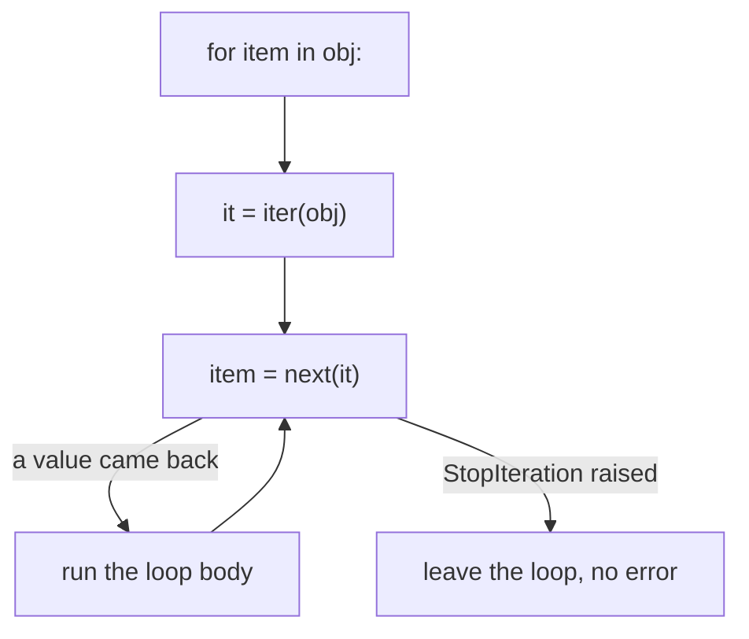

# 19.1 Iterators

You have been writing `for` loops since [Chapter 6](../ch06-loops/02-for.md),
and they have looped over lists, strings, ranges, dictionaries, and files
without complaint. That flexibility is not magic, and it is not a hundred
special cases baked into Python. It is one tiny protocol — two methods and
one exception — and once you know it, you can plug *your own classes* into
`for`, `in`, `list()`, `sum()`, and every other tool that consumes a
sequence. This section takes the lid off.

## What `for` really does

The `for` statement does not know anything about lists. When Python runs
`for item in obj:`, it performs three moves behind the scenes:

1. call `iter(obj)` to get an **iterator** — a little bookmark object that
   remembers a position;
2. call `next()` on that iterator, over and over, binding each result to
   `item` and running the loop body;
3. stop cleanly the moment `next()` raises the special exception
   `StopIteration`.



You can perform all three moves yourself. Here is a `for` loop taken apart:

```python
colors = ["red", "green", "blue"]

it = iter(colors)      # ask the list for an iterator
print(next(it))        # ask the iterator for the next value
print(next(it))
print(next(it))
```

The output is `red`, `green`, `blue` — one value per `next()` call. The
iterator `it` is a separate object from the list: it holds a position, and
each `next()` hands over the current value and advances the position.

What happens when the values run out? `next()` raises `StopIteration`:

```python
# raises StopIteration
colors = ["red", "green", "blue"]
it = iter(colors)
print(next(it))    # red
print(next(it))    # green
print(next(it))    # blue
print(next(it))    # nothing left — the iterator raises StopIteration
```

That traceback is not a bug — it is the iterator's way of saying "done". A
`for` loop *expects* this exception and treats it as the end signal. We can
prove it by hand-rolling a `for` loop out of `while`, `try`, and `except`
(the exception tools from
[Chapter 10](../ch10-exceptions/02-exceptions.md)):

```python
colors = ["red", "green", "blue"]

it = iter(colors)
while True:
    try:
        color = next(it)
    except StopIteration:
        break                  # the polite "no more values" signal
    print("got:", color)

print("loop finished cleanly")
```

This prints `got: red`, `got: green`, `got: blue`, then
`loop finished cleanly`. Every `for` loop you have ever written is exactly
this code in disguise.

## The iterator protocol

Two words carry precise meanings here, and telling them apart pays off for
the rest of your programming life:

| Term | Must provide | Job |
| --- | --- | --- |
| **Iterable** | `__iter__` returning an iterator | "You can loop over me" — lists, strings, ranges, dicts, files, your classes |
| **Iterator** | `__next__` producing values (and `__iter__` returning itself) | "I am one loop in progress" — a bookmark that only moves forward |

Built-in `iter(obj)` simply calls `obj.__iter__()`, and `next(it)` calls
`it.__next__()`. So to make a class work with `for`, you implement those
**dunder** (double-underscore) methods. Here is a complete, self-contained
example — a countdown that is its own iterator:

```python
class Countdown:
    """Counts start, start-1, ..., 1 — an iterable that is its own iterator."""

    def __init__(self, start):
        self.current = start

    def __iter__(self):
        return self               # "the iterator for me ... is me"

    def __next__(self):
        if self.current <= 0:
            raise StopIteration   # signal: no more values
        value = self.current
        self.current -= 1
        return value

for number in Countdown(3):
    print(number)
```

The loop prints `3`, `2`, `1`. Notice who is in charge: *the loop* asks, *the
object* answers. `Countdown` never sees the loop body; it just produces the
next value on demand and raises `StopIteration` when it has nothing left.

Java has the same idea with different manners:

=== "Python"

    ```python
    colors = ["red", "green", "blue"]

    it = iter(colors)
    while True:
        try:
            color = next(it)      # leap — and catch the signal if we fell
        except StopIteration:
            break
        print(color)
    ```

=== "Java"

    ```java
    List<String> colors = List.of("red", "green", "blue");

    Iterator<String> it = colors.iterator();
    while (it.hasNext()) {            // peek: is there another?
        String color = it.next();     // step: take it
        System.out.println(color);
    }
    // The enhanced for loop compiles down to exactly this:
    // for (String color : colors) { ... }
    ```

The design difference is worth savouring:

| | Java | Python |
| --- | --- | --- |
| The move | **peek before you step** | **leap and catch** |
| How it reads | ask `hasNext()`, and only then call `next()` | just call `next()`, and handle the signal if you went too far |
| End-of-data signal | a `false` return value | the `StopIteration` exception |
| The argument for it | never uses an exception for normal control flow | exactly *one* way for any iterator to end |

Python's style is often summarised as "easier to ask forgiveness than
permission", and its payoff is uniformity: because every iterator ends the
same way, `for`, `list()`, `sum()`, and friends all handle the ending with one
mechanism. Both designs work; each language is consistent about its choice.

## The payoff: a `for`-ready linked list

In [Chapter 18](../ch18-linked-lists/02-singly-linked.md) you built a
`LinkedList` out of chained `Node` objects. One thing it could *not* do was
`for item in mylist` — Python had no idea how to walk your private chain of
`next` references. Now you can teach it. The block below is self-contained:
a minimal `Node` and `LinkedList` (slimmer than Chapter 18's full version),
plus one new class — the iterator, a bookmark that rides along the chain:

```python
class Node:
    def __init__(self, value):
        self.value = value
        self.next = None


class LinkedListIterator:
    """A bookmark pointing at the next node to visit."""

    def __init__(self, start):
        self.current = start

    def __iter__(self):
        return self

    def __next__(self):
        if self.current is None:
            raise StopIteration          # walked off the end of the chain
        value = self.current.value
        self.current = self.current.next # slide the bookmark forward
        return value


class LinkedList:
    def __init__(self):
        self.head = None
        self.tail = None

    def append(self, value):
        node = Node(value)
        if self.head is None:
            self.head = node
        else:
            self.tail.next = node
        self.tail = node

    def __iter__(self):
        return LinkedListIterator(self.head)   # a fresh bookmark each time


playlist = LinkedList()
for title in ["Intro", "Groove", "Finale"]:
    playlist.append(title)

for title in playlist:           # our own class, driving a for loop!
    print(title)

print("Groove" in playlist)      # 'in' works too — it iterates and compares
print(list(playlist))            # so does list(), and sum(), and sorted()...
```

The output:

```text
Intro
Groove
Finale
True
['Intro', 'Groove', 'Finale']
```

This is the payoff moment. We implemented *one* dunder method, and our class
instantly works with `for`, `in`, `list()`, and every other tool built on the
protocol.

Note who is who in that code:

- **`LinkedList` is the iterable** — it hands out bookmarks.
- **`LinkedListIterator` is the iterator** — it *is* one walk in progress.

Keeping them separate means two loops over the same list get two independent
bookmarks and never trample each other.

## One-shot iterators, reusable iterables

An iterable is like a book; an iterator is like a bookmark. You can read a
book as many times as you like, but a bookmark only moves forward — and once
it falls off the last page, it is spent:

```python
numbers = [10, 20, 30]

print(sum(numbers))    # 60 — iterating the LIST starts fresh
print(sum(numbers))    # 60 again, and again forever

it = iter(numbers)
print(sum(it))         # 60 — this consumed the ITERATOR
print(sum(it))         # 0  — nothing left to add
print(list(it))        # [] — still nothing; it does not rewind
```

The second `sum(it)` is `0` and the `list(it)` is empty: the iterator is
exhausted and stays exhausted. This distinction explains a classic mystery:
"why did my second loop over the data do nothing?" — because the data was an
iterator (a file object, a generator, a `zip(...)` result), not a list. When
in doubt, capture the values with `list(...)` first.

## Generators: iterators without the boilerplate

`LinkedListIterator` works, but it took a whole class to say "walk the chain
and hand out values". Python has a shortcut so good that most programmers
never write an iterator class again: **any function containing `yield` is a
generator function.**

Calling such a function runs *none* of its body. Instead it returns a
generator — an iterator that runs the body lazily, *pausing* at each `yield`
to hand out a value and resuming from that exact spot on the next `next()`:

```python
def countdown(start):
    while start > 0:
        yield start          # pause here, hand out a value ...
        start -= 1           # ... and resume here on the next next()

print(countdown(3))          # not a list! a paused computation

for number in countdown(3):
    print(number)
```

The first `print` shows something like
`<generator object countdown at 0x...>` — a generator object, ready but not
started. The loop then prints `3`, `2`, `1`, and when the function body
finally ends, the generator raises `StopIteration` for us automatically.

All the protocol machinery — `__iter__`, `__next__`, the exception — is
generated from that one `yield` keyword.

Watch it shrink our linked-list code. The bookmark class disappears, and
`__iter__` becomes three lines of real work — walk, yield, advance:

```python
class Node:
    def __init__(self, value):
        self.value = value
        self.next = None


class LinkedList:
    def __init__(self):
        self.head = None
        self.tail = None

    def append(self, value):
        node = Node(value)
        if self.head is None:
            self.head = node
        else:
            self.tail.next = node
        self.tail = node

    def __iter__(self):              # the entire iterator, as a generator
        node = self.head
        while node is not None:
            yield node.value
            node = node.next


songs = LinkedList()
for title in ["Intro", "Groove", "Finale"]:
    songs.append(title)

print(list(songs))
```

Output: `['Intro', 'Groove', 'Finale']` — identical behaviour, a fraction of
the code. Because `__iter__` is a generator function, each call returns a
fresh generator, so the list is still safely re-iterable. From here on, when
a data structure in this handbook needs iteration, we will write it this way.

Generators are also the foundation of an entire programming style. Chained
together — each one pulling values from the previous stage and yielding
transformed ones — they become **pipelines** that stream a hundred million
records through a few kilobytes of memory.

Two later sections build that idea out.
[Section 39.2](../ch39-streams/02-map-filter-reduce.md) introduces the verbs
those stages are made of: `map`, `filter`, `reduce`, and Java's Streams API,
which is the same idea with types attached. Then
[39.3](../ch39-streams/03-pipelines.md) composes them, measures the constant
memory footprint, and shows that the result is what a `|` in a shell has been
doing all along.

!!! info "Java corner"

    Java has no `yield`-style generators for collections. To make a class
    usable in an enhanced `for` loop you implement `Iterable<T>` and hand
    back an `Iterator<T>` object with `hasNext()`/`next()` — essentially the
    `LinkedListIterator` class you wrote above, every time.

!!! warning "Common mistakes"

    - **Forgetting to raise `StopIteration`** in a hand-written `__next__`.
      The iterator then produces values forever, and `for` loops over it
      never end.
    - **Calling `next()` on an iterable instead of an iterator** —
      `next([1, 2, 3])` fails with `TypeError: 'list' object is not an
      iterator`. Get an iterator first: `next(iter([1, 2, 3]))`.
    - **Reusing an exhausted iterator** and concluding your data vanished.
      Iterators are one-shot; re-iterate the *iterable*, or store the values
      in a list.
    - **Expecting `print(gen)` to show values.** A generator displays as
      `<generator object ...>`; wrap it in `list(...)` to see its contents —
      remembering that doing so consumes it.

## Check your understanding

1. `it = iter("hi")`. What do three successive `next(it)` calls do?

    ??? success "Answer"
        The first returns `"h"`, the second returns `"i"`, and the third
        raises `StopIteration` — strings are iterable, and their iterators
        produce one character at a time.

2. A `for` loop ends when `StopIteration` is raised. Why do you never see
   that exception in a traceback from a normal loop?

    ??? success "Answer"
        The `for` statement calls `next()` internally inside the equivalent
        of a `try`/`except StopIteration` and treats the exception as the
        normal end-of-loop signal, so it is caught and never escapes.

3. `data = iter([1, 2, 3])`. What does `print(sum(data), sum(data))` print,
   and why?

    ??? success "Answer"
        `6 0`. The first `sum` consumes the iterator completely; the second
        `sum` receives an exhausted iterator with no values left, and the sum
        of nothing is `0`.

4. What is the *minimum* you must add to a class so that
   `for x in obj:` works on its instances?

    ??? success "Answer"
        An `__iter__` method that returns an iterator. The easiest way is to
        write `__iter__` as a generator function containing `yield` — then
        Python builds the iterator (including `__next__` and
        `StopIteration`) for you.
