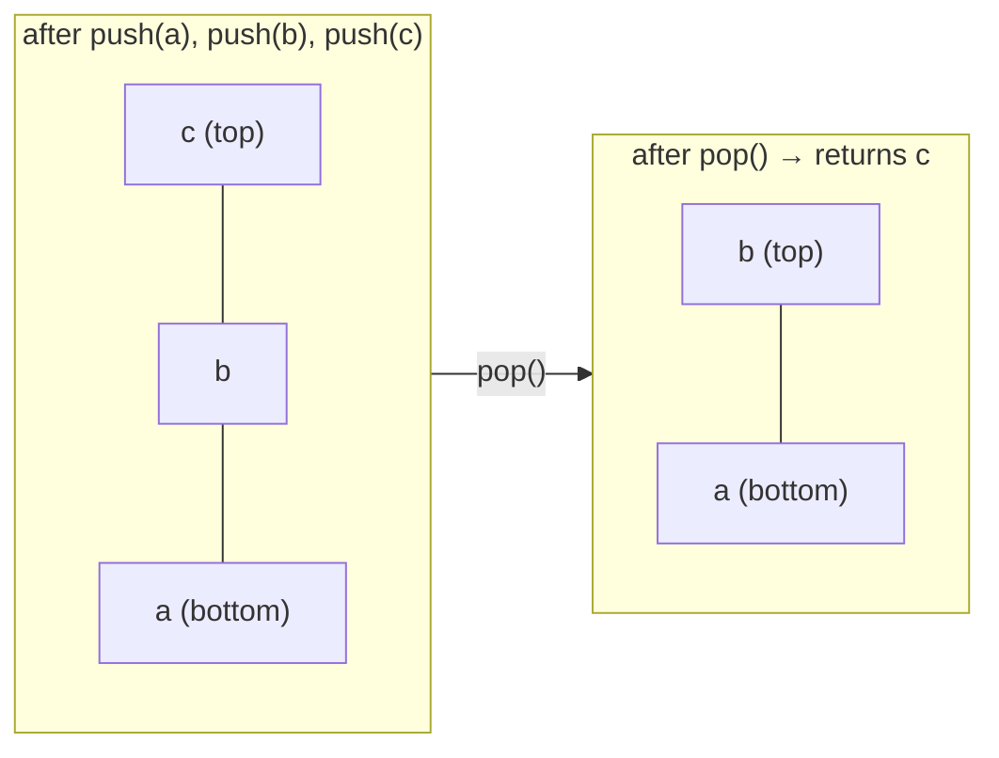

# 19.2 Stacks

Some of the most important structures in computing are the most restricted
ones. A **stack** is a sequence you may only touch at one end: add there,
remove there, look there, nothing else. That discipline — **last in, first
out** (LIFO) — sounds like a limitation, but it is precisely the behaviour
that bracket matching, undo systems, expression evaluation, web-browser
history, and the function call stack all require. In this section you will
implement a stack in ten lines, then use it to solve a real parsing problem
the way production tools do.

## LIFO and the stack ADT

Picture a stack of plates. You put a clean plate *on top*; you take the next
plate *from the top*; the plate at the bottom waits the longest. The last
plate in is the first plate out.



As an abstract data type (the ADT idea from
[Chapter 18](../ch18-linked-lists/01-adts-generics.md)), a stack promises
four operations and says nothing about how they are implemented:

| Operation | Meaning | Cost we expect |
| --- | --- | --- |
| `push(item)` | add `item` on top | $O(1)$ |
| `pop()` | remove and return the top item | $O(1)$ |
| `peek()` | return the top item *without* removing it | $O(1)$ |
| `is_empty()` | is there anything on the stack? | $O(1)$ |

## A stack in ten lines of Python

A Python list already does everything we need — *if* we agree that the top of
the stack is the **end** of the list.

- **The end is the right end.** `append` and `pop()` there are $O(1)$
  (amortised), because a list keeps spare capacity at its end, as you saw in
  [Chapter 9](../ch09-collections/02-dynamic-lists.md).
- **The front is the wrong end.** Inserting or removing at index 0 shifts
  every other element — $O(n)$ per operation.

Same list, opposite ends, completely different bills.

```python
class Stack:
    """A last-in-first-out stack. Top of the stack = end of the list."""

    def __init__(self):
        self._items = []

    def push(self, item):
        self._items.append(item)      # O(1): add at the end

    def pop(self):
        return self._items.pop()      # O(1): remove from the end

    def peek(self):
        return self._items[-1]

    def is_empty(self):
        return len(self._items) == 0

    def __len__(self):
        return len(self._items)


s = Stack()
s.push("a")
s.push("b")
s.push("c")
print("peek:", s.peek())
print("pop :", s.pop())
print("pop :", s.pop())
print("size:", len(s))
```

The output:

```text
peek: c
pop : c
pop : b
size: 1
```

`c` went on last and came off first — LIFO in action. Wrapping the list in a
class is not ceremony: it *enforces the discipline*. Code holding a `Stack`
cannot sneak a look at the middle or insert at index 3, so every stack you
hand out is guaranteed to behave like a stack. That is the ADT mindset —
publish the operations, hide the machinery.

## Worked example: balanced brackets

Every editor, compiler, and linter you use solves this problem constantly:
in a piece of text, is every opening bracket `(`, `[`, `{` closed by the
right partner, in the right order? `"([{}])"` is balanced; `"([)]"` is not —
the `)` arrives while `[` is still waiting.

The insight: **the most recently opened bracket must be the first one
closed**. "Most recent first" is LIFO — so a stack of *currently open
brackets* solves it. The algorithm is one pass:

1. **Walk the text once**, character by character.
2. **On an opener** `(`, `[`, `{` — push it onto the stack.
3. **On a closer** `)`, `]`, `}` — pop, and check that the popped opener is
   this closer's partner.
4. **At the end** — the text is balanced only if the stack is empty.

Here is the full trace on `"([{}])"`:

| Step | Char | Action | Stack after (top on right) |
| --- | --- | --- | --- |
| 1 | `(` | opener → push | `(` |
| 2 | `[` | opener → push | `(` `[` |
| 3 | `{` | opener → push | `(` `[` `{` |
| 4 | `}` | closer → pop `{` — matches | `(` `[` |
| 5 | `]` | closer → pop `[` — matches | `(` |
| 6 | `)` | closer → pop `(` — matches | *(empty)* |
| end | — | stack empty → **balanced** | |

Two failure modes exist, and the algorithm catches both:

- **A closer with no matching opener** — the stack is empty, or its top holds
  the wrong bracket. Examples: `"([)]"`, `"))"`.
- **Openers still on the stack when the text ends** — something was never
  closed. Example: `"(()"`.

```python
class Stack:
    def __init__(self):
        self._items = []

    def push(self, item):
        self._items.append(item)

    def pop(self):
        return self._items.pop()

    def is_empty(self):
        return len(self._items) == 0


def is_balanced(text):
    pairs = {")": "(", "]": "[", "}": "{"}
    stack = Stack()
    for ch in text:
        if ch in "([{":
            stack.push(ch)                 # remember the open bracket
        elif ch in ")]}":
            if stack.is_empty() or stack.pop() != pairs[ch]:
                return False               # closer with no matching opener
    return stack.is_empty()                # leftovers = unclosed openers


for text in ["([{}])", "([)]", "(()", "))", "print(nums[0])"]:
    print(f"{text!r:18} -> {is_balanced(text)}")
```

The output:

```text
'([{}])'           -> True
'([)]'             -> False
'(()'              -> False
'))'               -> False
'print(nums[0])'   -> True
```

Follow the failures against the trace-table logic: `"([)]"` dies at step 3
when `)` pops `[`; `"(()"` survives the walk but ends with `(` still on the
stack; `"))"` finds the stack already empty. The last test shows why this
matters: real code mixes brackets with other characters, and the checker
simply ignores everything that is not a bracket.

## Undo and redo: two stacks facing each other

Every "undo" you have ever pressed was a `pop`. An editor keeps two stacks and
obeys three rules:

1. **Doing something** pushes the action onto the *undo* stack.
2. **Undo** pops the most recent action off the undo stack — LIFO, because you
   undo the *last* thing you did, not the first — and pushes it onto the *redo*
   stack.
3. **Redo** pops it back off the redo stack and returns it to the undo stack.

One extra rule keeps history honest: a brand-new action **clears the redo
stack**, because after typing something new the old future no longer applies.

```python
undo_stack = []
redo_stack = []

def do(action):
    undo_stack.append(action)
    redo_stack.clear()             # a new action invalidates the old "future"
    print("did :", action)

def undo():
    if not undo_stack:
        print("nothing to undo")
        return
    action = undo_stack.pop()
    redo_stack.append(action)
    print("undid:", action)

def redo():
    if not redo_stack:
        print("nothing to redo")
        return
    action = redo_stack.pop()
    undo_stack.append(action)
    print("redid:", action)

do("type 'hello'")
do("bold the word")
undo()
undo()
redo()
do("type '!'")     # this clears the redo stack ...
redo()             # ... so there is nothing to redo
```

The output:

```text
did : type 'hello'
did : bold the word
undid: bold the word
undid: type 'hello'
redid: type 'hello'
did : type '!'
nothing to redo
```

Two lists, four rules, and you have the exact undo model used by real
editors. Notice how the *discipline* does the design work: because only the
tops are ever touched, history can never be replayed out of order.

## The call stack is a stack

The name is not a coincidence. As you saw in
[Chapter 17](../ch17-recursion/01-call-stack.md), every function call pushes
a **frame** (parameters, locals, return address) onto the call stack, and
every `return` pops it. The most recently called function must finish first
— pure LIFO. You can make the pushes and pops visible:

```python
def call(n):
    print("  " * (3 - n) + f"push frame: call({n})")
    if n > 0:
        call(n - 1)                     # push another frame on top
    print("  " * (3 - n) + f"pop  frame: call({n}) returns")

call(3)
```

The output:

```text
push frame: call(3)
  push frame: call(2)
    push frame: call(1)
      push frame: call(0)
      pop  frame: call(0) returns
    pop  frame: call(1) returns
  pop  frame: call(2) returns
pop  frame: call(3) returns
```

The pops come back in exactly the reverse order of the pushes. A stack
overflow (Python's `RecursionError`) is literally this stack running out of
room — and when you read a stack trace in
[Chapter 10](../ch10-exceptions/03-stack-traces.md), you were reading the
frames of this stack, top down.

## Stacks in Java

=== "Python"

    ```python
    stack = []               # or the Stack class from above
    stack.append("a")        # push
    stack.append("b")
    print(stack[-1])         # peek -> b
    print(stack.pop())       # b
    print(stack.pop())       # a
    ```

=== "Java"

    ```java
    Deque<String> stack = new ArrayDeque<>();
    stack.push("a");                    // push
    stack.push("b");
    System.out.println(stack.peek());   // b
    System.out.println(stack.pop());    // b
    System.out.println(stack.pop());    // a
    ```

Java's standard advice is to use a `Deque` (usually `ArrayDeque`) as a stack.
There *is* a class called `java.util.Stack`, but it is legacy for three
reasons:

- **It dates from Java 1.0** and predates the collections framework.
- **It extends `Vector`**, so every operation pays for synchronisation you
  rarely need.
- **It inherits `Vector`'s methods** for reading and inserting *anywhere* —
  worse for the ADT discipline, since it cannot actually guarantee LIFO
  behaviour.

Its own documentation points you to `Deque` instead.

## When `pop` has nothing to give

What should an empty stack do when you `pop` it? Our implementation inherits
its answer from `list.pop()`:

```python
# raises IndexError
class Stack:
    def __init__(self):
        self._items = []

    def push(self, item):
        self._items.append(item)

    def pop(self):
        return self._items.pop()


s = Stack()
s.push("only item")
print(s.pop())
print(s.pop())     # empty now — list.pop() raises IndexError
```

Popping an empty stack raises `IndexError: pop from empty list`. Is that
good API design? There are two defensible contracts:

- **Raise an exception** ("fail fast"). Popping an empty stack is almost
  always a bug in the *caller's* logic, and a loud crash at the exact line
  is the fastest route to finding it. It also keeps the return value clean —
  if `pop()` could return `None` as a signal, a stack that legitimately
  *stores* `None` becomes ambiguous.
- **Return a sentinel like `None`.** Kinder when "empty" is a normal,
  expected situation and the caller will check anyway. Java's `Deque` offers
  both spellings side by side: `pop()`/`element()` throw, while
  `poll()`/`peek()` return `null`.

Python's built-ins choose the first contract, and so does this handbook: an
exception for a *broken assumption*, a return value for a *normal answer*.
Whichever you pick, write it in the docstring — the contract is part of the
ADT, exactly as Chapter 18 promised.

!!! warning "Common mistakes"

    - **Using the wrong end of the list.** `insert(0, x)` / `pop(0)` still
      "work" as a stack, but every operation silently becomes $O(n)$. Push
      and pop at the *end*.
    - **Peeking or popping without checking for emptiness** in loops like
      `while ...: stack.pop()`. Guard with `is_empty()` (or catch the
      `IndexError`) — the bracket checker above needs its `is_empty()` test
      to survive `"))"`.
    - **Forgetting the leftover check.** Beginners' bracket checkers return
      `True` as soon as the loop ends; `"(()"` then passes. Balanced means
      the loop finishes *and* the stack is empty.
    - **Reaching into the middle.** If you find yourself writing
      `stack._items[3]`, you do not want a stack — use a list, or rethink.

## Check your understanding

1. Starting from an empty stack: `push(1)`, `push(2)`, `pop()`, `push(3)`,
   `pop()`, `pop()`. What does each `pop` return?

    ??? success "Answer"
        `2`, then `3`, then `1`. The stack after `push(1)`, `push(2)` is
        bottom→`1 2`; popping returns `2`; pushing `3` gives `1 3`; the last
        two pops return `3` then `1`.

2. Why is the *end* of a Python list the right place for the top of a stack?

    ??? success "Answer"
        `append` and `pop()` at the end are amortised $O(1)$ because a list
        keeps spare capacity there. At the front, every insert or removal
        shifts all remaining elements — $O(n)$ per operation.

3. Is `"([]{})"` balanced? What is the maximum number of items the checker's
   stack holds while scanning it?

    ??? success "Answer"
        Yes, it is balanced. The stack holds at most two items — `(` `[`
        just before `]` arrives, and `(` `{` just before the final `}`...`)`
        pair resolves. The nesting never gets deeper than 2.

4. Your stack must store user-supplied values *including* `None`. Which
   empty-pop contract does that force, and why?

    ??? success "Answer"
        Raise an exception. If `pop()` returned `None` to mean "empty", the
        caller could not distinguish an empty stack from a stack whose top
        element was legitimately `None`.
