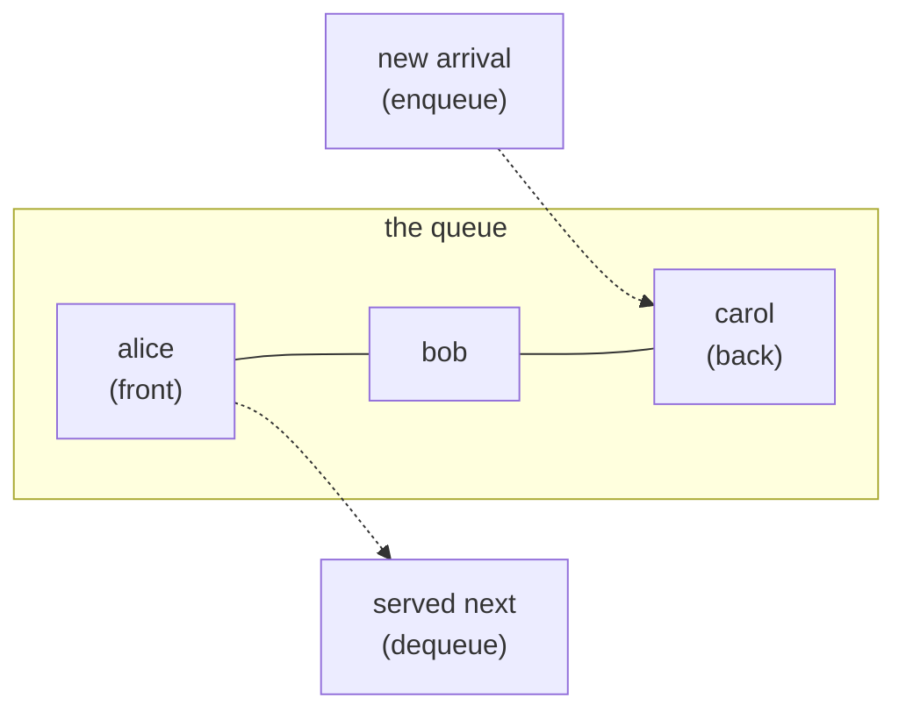
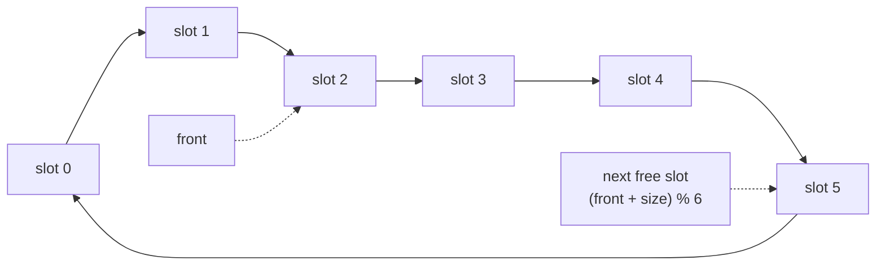

# 19.3 Queues

A stack serves whoever arrived *last*; most of the real world works the
other way. Print jobs, support tickets, network packets, and people at a
bakery are served in arrival order: **first in, first out** (FIFO). The
structure with that discipline is the **queue**, and it comes with a trap:
the obvious Python implementation is quietly $O(n)$ per operation. This
section builds the naive version, measures exactly why it is slow, then
reaches for the right tools — `collections.deque` and the classic
circular buffer.

## FIFO and the queue ADT

New arrivals join the **back**; service happens at the **front**; nobody
jumps the line.



| Operation | Meaning | Cost we expect |
| --- | --- | --- |
| `enqueue(item)` | add `item` at the back | $O(1)$ |
| `dequeue()` | remove and return the front item | $O(1)$ |
| `front()` | look at the front item without removing it | $O(1)$ |
| `is_empty()` | anything waiting? | $O(1)$ |

A stack needs one busy end; a queue needs **two** — and that difference is
about to matter.

### Stack vs queue at a glance

| | Stack | Queue |
| --- | --- | --- |
| Discipline | last in, first out (LIFO) | first in, first out (FIFO) |
| Busy ends | one | two |
| Add / remove | `push` / `pop`, same end | `enqueue` at the back, `dequeue` at the front |
| Serves | the newest item | the oldest item |
| Python spelling | a list: `append` / `pop` | a deque: `append` / `popleft` |
| Natural jobs | brackets, undo, the call stack, depth-first search | print spoolers, ticket lines, breadth-first search |
| Risk if misused | — | starvation: with LIFO, early arrivals may wait forever |

## The naive version: a plain list

The straightforward translation uses `append` for enqueue and `pop(0)` for
dequeue:

```python
queue = []
queue.append("alice")     # enqueue at the back
queue.append("bob")
queue.append("carol")

print("serving:", queue.pop(0))      # dequeue from the front
print("waiting:", queue)
```

This prints `serving: alice` then `waiting: ['bob', 'carol']` — correct
behaviour. The problem is hidden in what `pop(0)` had to do: a list stores its
elements contiguously, so removing slot 0 forces **every remaining element to
shift one slot left** to close the gap.

Bob moved, carol moved. With three people that is nothing; with a hundred
thousand it is a hundred thousand moves *per dequeue* — $O(n)$ each, and
$O(n^2)$ to drain the whole queue. Let's catch it in the act:

```python
from collections import deque
from time import perf_counter

n = 10_000

lst = list(range(n))
t0 = perf_counter()
while lst:
    lst.pop(0)                # shifts every remaining element left
list_ms = (perf_counter() - t0) * 1000

dq = deque(range(n))
t0 = perf_counter()
while dq:
    dq.popleft()              # removes at the front with no shifting
deque_ms = (perf_counter() - t0) * 1000

print(f"draining {n} items with list.pop(0)  : {list_ms:7.1f} ms")
print(f"draining {n} items with deque.popleft: {deque_ms:7.1f} ms")
```

Exact times vary by machine, but the pattern never does: the list version is
many times slower, and the gap explodes as `n` grows — double `n` and the
`pop(0)` time roughly *quadruples* (that is the $O(n^2)$ signature from
[Chapter 16](../ch16-complexity/01-big-o.md)), while the deque time merely
doubles.

## The right tool: `collections.deque`

Python's standard library ships a **deque** (*double-ended queue*,
pronounced "deck"): a structure engineered so that adding and removing at
**either end** is $O(1)$. That is exactly the two busy ends a queue needs.
Here is the queue ADT wrapped around it:

```python
from collections import deque

class Queue:
    """A first-in-first-out queue built on collections.deque."""

    def __init__(self):
        self._items = deque()

    def enqueue(self, item):
        self._items.append(item)        # O(1) at the back

    def dequeue(self):
        return self._items.popleft()    # O(1) at the front

    def front(self):
        return self._items[0]

    def is_empty(self):
        return len(self._items) == 0

    def __len__(self):
        return len(self._items)


q = Queue()
q.enqueue("alice")
q.enqueue("bob")
q.enqueue("carol")
print("front  :", q.front())
print("serving:", q.dequeue())
print("serving:", q.dequeue())
print("length :", len(q))
```

The output:

```text
front  : alice
serving: alice
serving: bob
length : 1
```

Arrival order in, arrival order out. Rule of thumb from here on: **queue in
Python means `collections.deque`** — `append` at the back, `popleft` at the
front.

## The circular buffer: a queue that chases its own tail

How would you build a fast queue if all you had were a fixed-size array —
no `deque`, no resizing? This is the situation in embedded devices, audio
processing, and network hardware, and the classic answer is the **circular
buffer** (ring buffer): let the front and back indices *march forward
forever*, and wrap them back to slot 0 with the modulo operator from
[Chapter 2](../ch02-data/03-operators.md).



Nothing ever shifts. Three rules run the whole structure:

1. **Dequeue** reads the slot at `front`, then advances `front` one step
   clockwise.
2. **Enqueue** writes one step past the last occupied slot — at index
   `(front + size) % capacity`.
3. **`% capacity` turns the row of slots into a ring** — index 5 plus one step
   is index 0 again.

```python
class CircularQueue:
    """A fixed-capacity FIFO queue in one array, using wrap-around indexing."""

    def __init__(self, capacity):
        self._slots = [None] * capacity
        self._capacity = capacity
        self._front = 0                 # index of the front element
        self._size = 0

    def enqueue(self, item):
        if self._size == self._capacity:
            raise OverflowError("queue is full")
        back = (self._front + self._size) % self._capacity    # wrap!
        self._slots[back] = item
        self._size += 1

    def dequeue(self):
        if self._size == 0:
            raise IndexError("queue is empty")
        item = self._slots[self._front]
        self._slots[self._front] = None                       # tidy the slot
        self._front = (self._front + 1) % self._capacity      # wrap!
        self._size -= 1
        return item


q = CircularQueue(4)
q.enqueue("a")
q.enqueue("b")
q.enqueue("c")
print("slots:", q._slots, "| front index:", q._front)

print("dequeued:", q.dequeue())
print("dequeued:", q.dequeue())
q.enqueue("d")
q.enqueue("e")            # (front + size) % 4 wraps around to slot 0!
print("slots:", q._slots, "| front index:", q._front)
```

The output:

```text
slots: ['a', 'b', 'c', None] | front index: 0
dequeued: a
dequeued: b
slots: ['e', None, 'c', 'd'] | front index: 2
```

Read the final line carefully: the queue's *logical* order is `c, d, e` (front
at index 2, then 3, then wrapping to 0), even though `e` physically sits in
slot 0 — the `%` made the indices lap the array.

Every operation is a genuine $O(1)$: one read, one write, one modulo. This is
precisely the trick inside `deque`-style structures, hardware buffers, and
keyboards' key-press queues.

## Worked simulation: the printer queue

Time to make FIFO earn its keep. Jobs arrive at a shared printer at known
times; the printer prints one page per second and takes jobs strictly in
arrival order. A queue *is* the waiting line; the simulation just turns a
clock:

```python
from collections import deque

# (arrival time, job name, pages)
arrivals = deque([
    (0, "tax-form", 3),
    (1, "photo", 1),
    (2, "essay", 2),
    (7, "recipe", 1),
])

waiting = deque()          # the printer queue itself
current = None             # [name, pages left] on the printer
clock = 0

while arrivals or waiting or current:
    while arrivals and arrivals[0][0] == clock:      # 1. arrivals join the back
        _, name, pages = arrivals.popleft()
        waiting.append([name, pages])
        print(f"t={clock}: {name} joins the queue ({pages} page(s))")
    if current is None and waiting:                  # 2. idle printer takes the front job
        current = waiting.popleft()
        print(f"t={clock}: printer starts {current[0]}")
    if current is not None:                          # 3. print one page
        current[1] -= 1
        if current[1] == 0:
            print(f"t={clock}: {current[0]} done")
            current = None
    clock += 1
```

The timeline:

```text
t=0: tax-form joins the queue (3 page(s))
t=0: printer starts tax-form
t=1: photo joins the queue (1 page(s))
t=2: essay joins the queue (2 page(s))
t=2: tax-form done
t=3: printer starts photo
t=3: photo done
t=4: printer starts essay
t=5: essay done
t=7: recipe joins the queue (1 page(s))
t=7: printer starts recipe
t=7: recipe done
```

Everything the queue promised is visible here:

- **FIFO preserves arrival order, not job size.** `photo` is a one-page job
  that arrived while a three-page job was printing, and it still waits its
  turn.
- **An empty queue means an idle printer.** Nothing happens at `t=6`, then
  `recipe` is served the moment it arrives.

Swap the deque for a stack and re-imagine the output: the last job in would
print first, and early jobs could wait forever — a failure mode called
*starvation*. Discipline is destiny.

!!! note "Where queues go next: breadth-first search"

    In [Chapter 20](../ch20-bst/03-traversals-balance.md) a queue will walk
    a tree *level by level*: visit a node, enqueue its children, repeat.
    Generalised to any graph, that algorithm is **breadth-first search
    (BFS)** — it explores everything one step away, then two steps, then
    three, which is why it finds shortest routes.
    [Section 37.2](../ch37-graphs/02-traversal.md) builds BFS in full on real
    graphs, and it is this exact `deque` doing the work: enqueue the
    neighbours, dequeue the next frontier node, repeat. The queue is the
    algorithm's beating heart, which is why swapping it for a stack turns
    BFS into depth-first search.

## Queues in Java

=== "Python"

    ```python
    from collections import deque

    q = deque()
    q.append("alice")        # enqueue
    q.append("bob")
    print(q[0])              # front -> alice
    print(q.popleft())       # dequeue -> alice
    print(q.popleft())       # bob
    ```

=== "Java"

    ```java
    Queue<String> q = new ArrayDeque<>();
    q.offer("alice");                 // enqueue
    q.offer("bob");
    System.out.println(q.peek());     // front -> alice
    System.out.println(q.poll());     // dequeue -> alice
    System.out.println(q.poll());     // bob
    ```

`Queue` is an interface; `ArrayDeque` is the usual implementation — a resizable
circular buffer, exactly the structure you just built.

Note Java's two method families, echoing the raise-vs-`None` contract
discussion from [section 19.2](02-stacks.md):

- **`add` / `remove` / `element`** throw an exception on failure.
- **`offer` / `poll` / `peek`** return `false` or `null` instead.

!!! warning "Common mistakes"

    - **Using `list.pop(0)` in production loops.** It works, which is why it
      survives code review — but it is $O(n)$ per dequeue and turns a fast
      program into a slow one exactly when the queue gets long. Reach for
      `deque.popleft()`.
    - **Mixing up the ends.** `append` + `pop()` is a stack; `append` +
      `popleft()` is a queue. One letter, opposite discipline.
    - **Forgetting the `%` in a circular queue.** Without wrap-around, the
      back index runs off the end of the array and crashes — the modulo is
      what turns the line into a ring.
    - **Treating a full fixed-size buffer as impossible.** A
      `CircularQueue` *must* decide its full-buffer contract (raise, drop
      the newest, or overwrite the oldest) — real systems pick deliberately.

## Check your understanding

1. Starting from an empty queue: `enqueue(1)`, `enqueue(2)`, `dequeue()`,
   `enqueue(3)`, `dequeue()`, `dequeue()`. What does each `dequeue` return?

    ??? success "Answer"
        `1`, then `2`, then `3` — FIFO always serves in arrival order, no
        matter how the operations interleave.

2. Why is `pop(0)` on a Python list $O(n)$ while `pop()` is $O(1)$?

    ??? success "Answer"
        Lists are contiguous arrays. Removing the last element just shortens
        the array, but removing element 0 leaves a gap at the front, so
        every remaining element must shift one slot left — $n-1$ moves.

3. A `CircularQueue` has capacity 5, `front == 3`, and `size == 4`. Which
   slot does the next `enqueue` write into?

    ??? success "Answer"
        Slot `(3 + 4) % 5 = 2`. The occupied slots are 3, 4, 0, 1 — the
        indices wrapped past the end of the array — so the next free slot is
        2.

4. Why does breadth-first search need a queue rather than a stack?

    ??? success "Answer"
        BFS must finish visiting everything at distance $k$ before anything
        at distance $k+1$. A queue serves nodes in the order they were
        discovered, which is exactly distance order; a stack would dive
        deep into the most recently discovered branch first (that variant
        is depth-first search).
