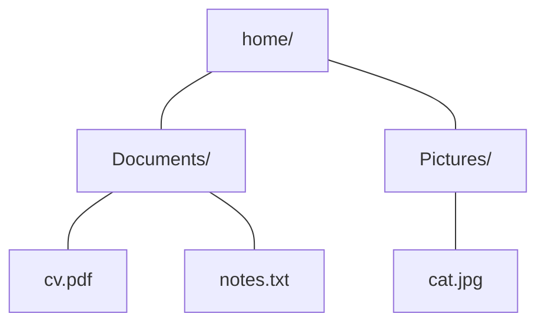
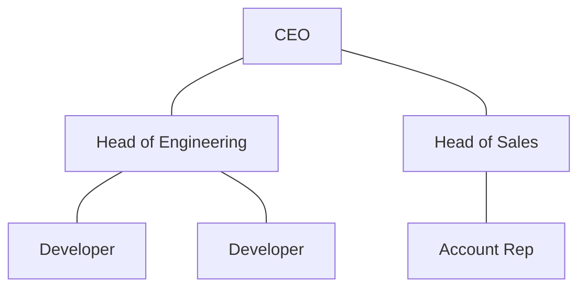
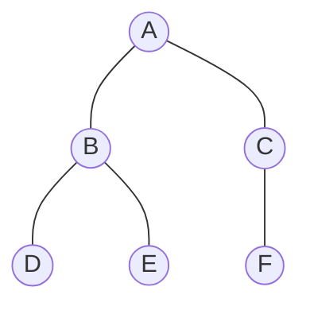
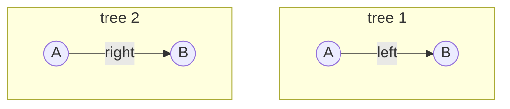

# 20.1 Tree vocabulary

Ask your computer to show a folder and you are looking at a tree. Ask who
reports to whom at a company, how a tournament narrows to a champion, how
this handbook divides into parts, chapters, and sections — trees, all of
them. Hierarchy is one of the commonest shapes in the world, and the tree is
its data structure. Before we can build the binary search tree in
[section 20.2](02-bst-ops.md), we need its vocabulary — a small set of words
that every book, interview, and library API uses with exact meanings.

## Hierarchies you already navigate

A **tree** is a set of nodes connected so that every node except one — the
**root** — hangs beneath exactly one **parent**. Two real hierarchies:





Notice what makes these *trees* rather than arbitrary diagrams: one node at
the top, every other node reachable from it by exactly one downward route,
and no loops. (Computer scientists draw trees upside down — the root at the
top, the leaves at the bottom. Botanists have learned to look away.)

## The naming of parts

Here is one abstract tree with every term we will ever need:



| Term | Meaning | In the diagram |
| --- | --- | --- |
| **root** | the one node with no parent | A |
| **parent / child** | the node directly above / directly below | A is the parent of B and C; D and E are children of B |
| **siblings** | children of the same parent | D and E; also B and C |
| **leaf** | a node with no children | D, E, F |
| **internal node** | a node with at least one child | A, B, C |
| **edge** | one parent–child connection | A–B, A–C, B–D, B–E, C–F (5 edges) |
| **path** | a sequence of edges walked downward | A → B → E |
| **subtree** | a node plus all its descendants | B, D, E form the subtree rooted at B |

Two measurements cause endless beginner confusion, so nail them now:

- The **depth of a node** is how many edges lie between it and the root.
  Depth of A: 0. Depth of B: 1. Depth of E: 2.
- The **height of a tree** is the depth of its deepest node — equivalently,
  the number of edges on the longest root-to-leaf path. This tree has
  height 2. A tree with a single node has height 0, and by convention the
  *empty* tree has height $-1$ (a convenient base case for recursion, as
  you will see).

Depth is measured *per node*, from the top. Height describes *the whole
tree*, from the bottom. A node's depth plus the height of its subtree never
exceeds the tree's height.

## Trees are recursive — this is why Chapter 17 came first

Look at the subtree rooted at B in the diagram above: B, D, E. It is a
complete, self-respecting tree in its own right — B is its root, D and E
its leaves. The same is true of the subtree rooted at C, and even of the
lonely subtree rooted at E. That observation is the single most important
fact about trees:

> **Every node is the root of a subtree.** A tree is either empty, or a
> root plus (smaller) subtrees.

That is a recursive definition, exactly like
[Chapter 17](../ch17-recursion/02-classic-recursion.md)'s recursive
functions: a base case (the empty tree) and a self-referencing case (a root
whose children are trees). Every algorithm in the rest of this chapter
mirrors that shape — do something at the root, recurse left, recurse right,
stop at `None`. If recursion felt abstract before, trees are where it starts
feeling inevitable.

## Binary trees: at most two children, and sides matter

A **binary tree** restricts every node to *at most two* children — and,
crucially, the two positions are named: the **left child** and the **right
child**. The names are not decoration. These are *different* trees:



Both have two nodes and one edge, but in tree 1, B is A's left child; in
tree 2, its right child. For a plain binary tree the distinction may seem
pedantic — for the binary *search* tree of the next section it is the whole
point, because left will mean "smaller" and right will mean "larger".

A node for such a tree is barely more than the linked-list node of
[Chapter 18](../ch18-linked-lists/02-singly-linked.md): where a list node
had one `next`, a binary tree node has a `left` and a `right`.

## Counting nodes: how much fits in a short tree

A **perfect** binary tree fills every level completely: 1 node at depth 0,
2 at depth 1, 4 at depth 2 — each level doubling. Summing the levels of a
perfect tree of height $h$:

$$
1 + 2 + 4 + \cdots + 2^h \;=\; 2^{h+1} - 1
$$

Let's verify that formula by brute force — build perfect trees and count
their nodes recursively (note both functions' shape: handle the empty tree,
recurse on both children):

```python
class Node:
    def __init__(self, left=None, right=None):
        self.left = left
        self.right = right

def build_perfect(h):
    """Return the root of a perfect binary tree of height h."""
    if h < 0:
        return None                                # the empty tree
    return Node(build_perfect(h - 1), build_perfect(h - 1))

def count_nodes(node):
    if node is None:
        return 0
    return 1 + count_nodes(node.left) + count_nodes(node.right)

for h in range(5):
    built = count_nodes(build_perfect(h))
    formula = 2 ** (h + 1) - 1
    print(f"height {h}: counted {built:2d} nodes, formula says {formula:2d}")
```

The output:

```text
height 0: counted  1 nodes, formula says  1
height 1: counted  3 nodes, formula says  3
height 2: counted  7 nodes, formula says  7
height 3: counted 15 nodes, formula says 15
height 4: counted 31 nodes, formula says 31
```

Read the formula in the useful direction: a tree of height $h$ can hold
about $2^{h+1}$ nodes, so holding $n$ nodes needs a height of only about
$\log_2 n$. The doubling that makes towers of Hanoi explode is now working
*for* us: capacity explodes while height creeps.

## Why you should want a tree: twenty questions

The game "twenty questions" finds one thing among a million because each
yes/no answer *halves* what remains: $2^{20} = 1{,}048{,}576$. A
well-shaped binary tree offers the same deal — starting from the root, each
step down discards half the tree:

```python
n = 1_000_000
remaining = n
questions = 0
while remaining > 1:
    remaining //= 2          # each answer halves the candidates
    questions += 1

print(f"{n:,} candidates need only {questions} halvings")
```

This prints `1,000,000 candidates need only 19 halvings`. Compare that with
scanning a list of a million items: 19 steps versus up to a million. The
next section builds the tree that turns this promise into working code —
and [section 20.3](03-traversals-balance.md) shows the fine print: the
promise holds only while the tree stays bushy.

!!! warning "Common mistakes"

    - **Confusing depth and height.** Depth belongs to a *node* (edges up to
      the root); height belongs to the *tree* (edges down its longest
      path). The root has depth 0; a one-node tree has height 0.
    - **Counting nodes instead of edges** in a path. The path A → B → E has
      length 2 (two edges), not 3, and a tree whose longest path touches 4
      nodes has height 3.
    - **Treating left and right children as interchangeable.** A node with
      only a left child is a *different tree* from a node with only a right
      child — and in a BST the difference decides where values live.
    - **Assuming every binary tree is short.** Only a *bushy* tree of $n$
      nodes has height near $\log_2 n$; nothing in the definition prevents
      a pathetic chain of height $n - 1$.

## Check your understanding

1. In the labelled tree above (A root; B, C children; D, E under B; F under
   C): list the leaves, the internal nodes, and the siblings of C.

    ??? success "Answer"
        Leaves: D, E, F. Internal nodes: A, B, C. C's only sibling is B —
        siblings share a parent, and A has exactly two children.

2. What is the height of a perfect binary tree with 63 nodes?

    ??? success "Answer"
        Solve $2^{h+1} - 1 = 63$: $2^{h+1} = 64$, so $h = 5$. Sixty-three
        nodes, and everything is at most five edges from the root.

3. A tree consists of a single node. What is its height, and what is the
   depth of its only node?

    ??? success "Answer"
        Both are 0. There are no edges anywhere: the root is also a leaf,
        zero edges from itself, and the longest root-to-leaf path has zero
        edges.

4. Complete the recursive definition: "A binary tree is either ______ or
   ______." Why does this make recursion the natural tool?

    ??? success "Answer"
        Either *empty*, or *a root node with a left binary tree and a right
        binary tree*. Any function that handles the empty case and calls
        itself on the left and right subtrees automatically handles every
        possible tree — the structure of the data dictates the structure of
        the code.
