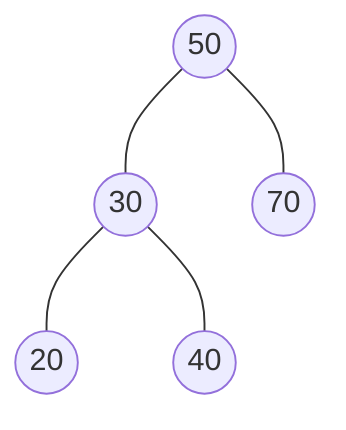
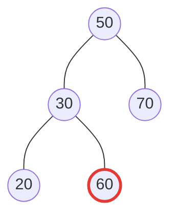
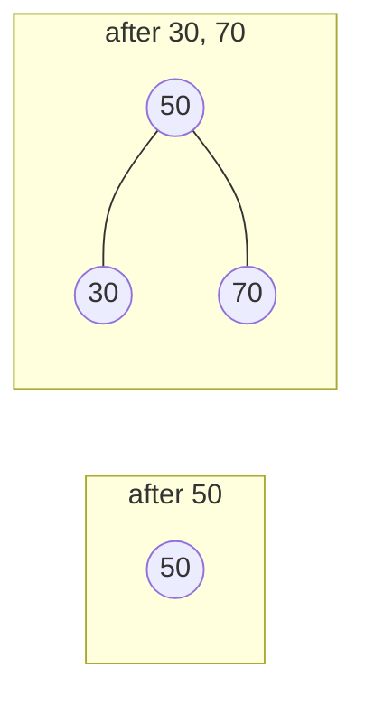
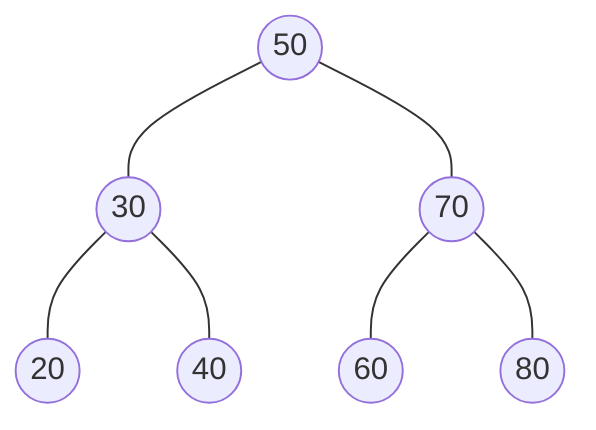
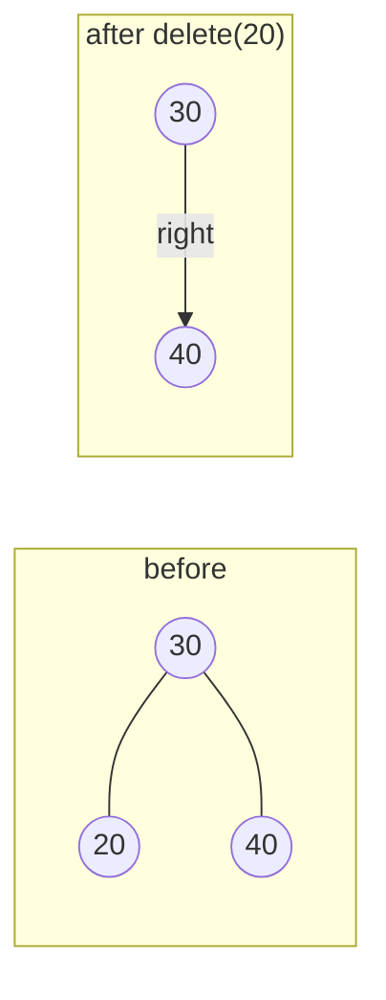
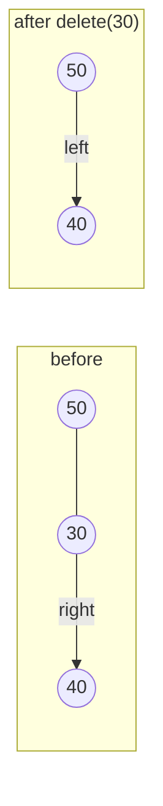
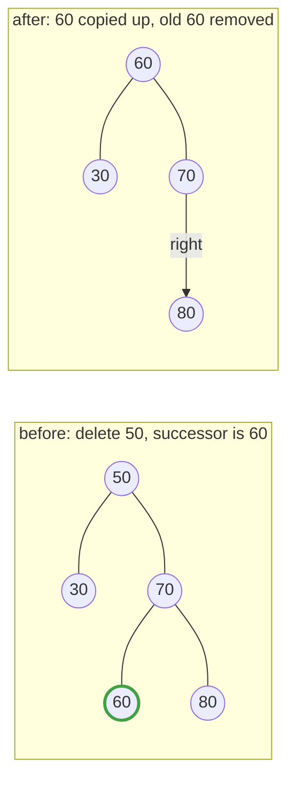

# 20.2 BST operations

A binary tree becomes a binary *search* tree the moment you add one rule
about where values may live — and that single rule turns "find my value"
from a full scan into a walk down one short path. This section states the
rule precisely (including the subtle way beginners get it wrong), then
builds a working BST one operation at a time: insert, search, min and max,
and — honestly, all three cases — delete.

## The invariant: left is smaller, right is larger, *everywhere*

> **BST invariant.** For *every* node in the tree: every value in its left
> subtree is smaller than the node's value, and every value in its right
> subtree is larger.

The word doing the heavy lifting is *every*. The rule is not "each child
compares correctly with its parent" — it constrains entire subtrees. A
valid example:



Check any node you like: everything left of 50 (namely 30, 20, 40) is below
50; everything right (70) is above; 30's own little family obeys too. Now
the classic trap — a tree that looks sorted *locally* but is wrong
*globally*:



Node by node it seems fine: 60 is greater than 30, so it sits correctly to
30's right; 20 sits correctly to 30's left. But 60 lives in the **left
subtree of 50**, and the invariant says everything in that subtree must be
*below 50*. Search for 60 and the bug bites: at the root, $60 > 50$ sends
you right — and 60 isn't there. A BST with one misplaced value is not
"mostly sorted"; it is broken, because every operation trusts the invariant
completely.

The reward for maintaining it: at any node, one comparison discards one
whole subtree. Every operation below is a walk from the root down a single
path, so every cost is $O(h)$, where $h$ is the height — about
$\log_2 n$ in a bushy tree, as [section 20.1](01-tree-vocab.md) promised.

## The raw material: nodes

A tree node is two references and a value — the linked-list node of
[Chapter 18](../ch18-linked-lists/02-singly-linked.md) with a second
`next`:

```python
class Node:
    def __init__(self, value):
        self.value = value
        self.left = None
        self.right = None

root = Node(50)
root.left = Node(30)
root.right = Node(70)

print(root.value, "has left child", root.left.value,
      "and right child", root.right.value)
```

This prints `50 has left child 30 and right child 70` — a three-node BST
wired by hand. Hand-wiring does not scale, and nothing stops us from wiring
it *wrong*; the whole point of the `BST` class we now build is that its
operations preserve the invariant automatically.

## Insert: walk down, attach at a leaf

To insert a value, play "higher or lower" from the root: go left if the new
value is smaller, right if larger — and when the pointer you would follow
is `None`, that hole is exactly where the value belongs. New values always
enter as **leaves**; a BST is grown at its fringe, never rewired in the
middle.

Watch the tree grow as we insert `50, 30, 70, 20, 40` into an empty tree:

1. **50** — tree is empty, so 50 becomes the root.
2. **30** — $30 < 50$: go left; empty; attach.
3. **70** — $70 > 50$: go right; empty; attach.



4. **20** — $20 < 50$: left to 30; $20 < 30$: left; empty; attach.
5. **40** — $40 < 50$: left to 30; $40 > 30$: right; empty; attach.


The code is the walk, written as a loop:

```python
class Node:
    def __init__(self, value):
        self.value = value
        self.left = None
        self.right = None


class BST:
    def __init__(self):
        self.root = None

    def insert(self, value):
        if self.root is None:
            self.root = Node(value)          # first value becomes the root
            return
        node = self.root
        while True:
            if value < node.value:
                if node.left is None:
                    node.left = Node(value)  # found the hole - attach
                    return
                node = node.left             # keep walking left
            elif value > node.value:
                if node.right is None:
                    node.right = Node(value)
                    return
                node = node.right            # keep walking right
            else:
                return                       # duplicate: ignore it

    def show(self):
        """Print the tree sideways: right subtree above, root at far left."""
        self._show(self.root, 0)

    def _show(self, node, indent):
        if node is None:
            return
        self._show(node.right, indent + 1)
        print("    " * indent + str(node.value))
        self._show(node.left, indent + 1)


tree = BST()
for value in [50, 30, 70, 20, 40]:
    tree.insert(value)

tree.show()
```

The output (tilt your head left — the root is at the far left, and the top
line is the rightmost node):

```text
    70
50
        40
    30
        20
```

That is exactly the diagram above, rotated. Each insertion touched one path
from the root — never the whole tree — so insert costs $O(h)$.

!!! note "Blocks that continue"

    The next few blocks start with `# continues`: they build on the classes
    and the `tree` defined above. Running one re-runs the earlier blocks
    first, so their output appears again above the new lines.

## Search: the decision walk

`contains` is insert's walk without the attaching: compare, discard a
subtree, step down, until you find the value or fall off the tree.

```python
# continues
def contains(tree, value):
    node = tree.root
    while node is not None:
        if value == node.value:
            return True
        node = node.left if value < node.value else node.right
    return False

print(contains(tree, 40))     # walk: 50 -> 30 -> 40. found
print(contains(tree, 65))     # walk: 50 -> 70 -> off the tree. not found
```

The two new lines are `True` and `False`. Searching for 65 never looked at
30, 20, or 40 — the first comparison at the root discarded the entire left
subtree. On five nodes that saves little; on many nodes it is everything.
Let's count the work on a 1000-value tree and compare it with scanning a
list, the way [Chapter 8](../ch08-grids/03-first-algorithms.md) would:

```python
# continues
import random

def search_steps(tree, value):
    """How many nodes does the BST walk visit to find value?"""
    node = tree.root
    steps = 0
    while node is not None:
        steps += 1
        if value == node.value:
            return steps
        node = node.left if value < node.value else node.right
    return steps

random.seed(11)
values = random.sample(range(10_000), 1000)

big = BST()
for v in values:
    big.insert(v)

target = values[750]
print("BST search visited  :", search_steps(big, target), "nodes")
print("list scan would check:", values.index(target) + 1, "values")
```

With this seed, the BST walk visits **13** nodes while a linear scan of the
same values checks **751** — the tree turned a stroll through 1000 items
into a dozen comparisons, right in the ballpark of
$\log_2 1000 \approx 10$ (a little above it, because a random tree is
bushy but not perfectly so).

## Min and max: hug the wall

The invariant hands us two freebies. The smallest value can have nothing to
its left, so: from the root, go left until you cannot. The largest is the
mirror image.

```python
# continues
def find_min(tree):
    node = tree.root
    while node.left is not None:
        node = node.left
    return node.value

def find_max(tree):
    node = tree.root
    while node.right is not None:
        node = node.right
    return node.value

print("smallest:", find_min(tree), "| largest:", find_max(tree))
```

The new line is `smallest: 20 | largest: 70`. No comparisons with the
values at all — the *shape* already knows the answer. Remember `find_min`:
delete is about to need it.

## Delete: the honest version

Most textbooks whisper past deletion; we will not. Deleting a value has
three cases, from trivial to genuinely clever. Throughout, the tree is
`50, 30, 70, 20, 40, 60, 80`:



**Case 1 — a leaf.** Deleting 20: nothing hangs below it, so snip the
parent's reference. Done.



**Case 2 — one child.** Now delete 30, which has only the child 40 left.
Splice it out: the parent adopts the orphan directly — 50's left pointer
skips the dead node and grabs 40. The invariant survives because everything
in 30's left-over subtree was already on 50's left side.



**Case 3 — two children.** Delete 50, the root itself, with full subtrees
on both sides. We cannot splice — two orphaned subtrees, one parent
pointer. The trick: **do not remove the node; replace its value.** The
replacement must keep the invariant: bigger than everything left, smaller
than everything else right. Exactly one value on the right qualifies: the
*smallest value in the right subtree*, called the **in-order successor**
(here: start at 70, hug left, arrive at 60).

1. Find the successor: minimum of the right subtree → 60.
2. Copy the successor's value into the node being "deleted": the root now
   reads 60.
3. Delete the successor's *original* node from the right subtree — and
   that node can have no left child (it was the minimum), so removing it
   is always an easy Case 1 or Case 2.



Here is the complete class — everything this section built, with `delete`
written recursively (the [Chapter 17](../ch17-recursion/index.md) payoff:
"delete from a subtree" is the same problem, smaller):

```python
class Node:
    def __init__(self, value):
        self.value = value
        self.left = None
        self.right = None


class BST:
    def __init__(self):
        self.root = None

    def insert(self, value):
        if self.root is None:
            self.root = Node(value)
            return
        node = self.root
        while True:
            if value < node.value:
                if node.left is None:
                    node.left = Node(value)
                    return
                node = node.left
            elif value > node.value:
                if node.right is None:
                    node.right = Node(value)
                    return
                node = node.right
            else:
                return

    def contains(self, value):
        node = self.root
        while node is not None:
            if value == node.value:
                return True
            node = node.left if value < node.value else node.right
        return False

    def delete(self, value):
        self.root = self._delete(self.root, value)

    def _delete(self, node, value):
        if node is None:
            return None                      # value not in this subtree
        if value < node.value:
            node.left = self._delete(node.left, value)
        elif value > node.value:
            node.right = self._delete(node.right, value)
        else:
            # found it - three cases
            if node.left is None:
                return node.right            # leaf or right-child-only
            if node.right is None:
                return node.left             # left-child-only
            successor = node.right           # two children:
            while successor.left is not None:
                successor = successor.left   #   min of the right subtree
            node.value = successor.value     #   copy its value up
            node.right = self._delete(node.right, successor.value)
        return node

    def show(self):
        self._show(self.root, 0)

    def _show(self, node, indent):
        if node is None:
            return
        self._show(node.right, indent + 1)
        print("    " * indent + str(node.value))
        self._show(node.left, indent + 1)


tree = BST()
for value in [50, 30, 70, 20, 40, 60, 80]:
    tree.insert(value)

tree.delete(20)      # case 1: a leaf
tree.delete(30)      # case 2: one child (only 40 remains beneath it)
tree.delete(50)      # case 3: two children - successor 60 steps up
print("after all three deletes:")
tree.show()
print("contains 50?", tree.contains(50))
print("contains 60?", tree.contains(60))
```

The output:

```text
after all three deletes:
        80
    70
60
    40
contains 50? False
contains 60? True
```

Trace the final shape against the diagrams: 40 was spliced up under the
root, and the root's value became 60 — the in-order successor — leaving a
valid BST at every step. In the code, notice how Case 1 needs no line of
its own: a leaf is just a node whose "only child" is `None`, so
`return node.right` returns `None` and snips it.

## The bill: everything is $O(h)$

| Operation | Work done | Cost |
| --- | --- | --- |
| `insert` | one root-to-hole walk | $O(h)$ |
| `contains` | one root-to-value walk | $O(h)$ |
| `find_min` / `find_max` | one wall-hugging walk | $O(h)$ |
| `delete` | one walk down, plus a successor walk | $O(h)$ |

Every row says the same thing: the height $h$ *is* the price of a BST. If
$h \approx \log_2 n$, everything is fast; if the tree degenerates into a
chain, $h = n - 1$ and every promise collapses. What controls $h$? The
*order* in which values arrive — and that story, with measurements, is
[the next section](03-traversals-balance.md).

!!! warning "Common mistakes"

    - **Checking the invariant only against parents.** "Each child is on the
      correct side of its parent" is *not* the BST rule — the 60-under-30
      tree above passes that test and is still broken. The rule binds whole
      subtrees.
    - **Inserting at the root or rewiring mid-tree.** New values are
      attached where the search walk falls off the tree — always at a leaf
      position. If your insert moves existing nodes, it is wrong.
    - **Deleting a two-child node by promoting a child.** Pulling 70 up to
      replace 50 orphans 60 (it would sit right of 70 while being smaller).
      Only the in-order successor (or, symmetrically, the in-order
      predecessor from the left subtree) keeps the invariant.
    - **Forgetting to reattach on the way back up.** In the recursive
      delete, `node.left = self._delete(node.left, value)` — dropping that
      assignment silently loses the repaired subtree.

## Check your understanding

1. Insert `10, 5, 15, 12, 18` into an empty BST, in that order. Which nodes
   are leaves at the end?

    ??? success "Answer"
        5, 12, and 18. The tree is 10 at the root, 5 left, 15 right, and 12
        and 18 attach beneath 15 (left and right respectively) — 15 became
        an internal node the moment 12 arrived.

2. Searching this section's seven-node tree for 65: which nodes does the
   walk visit, and what is the verdict?

    ??? success "Answer"
        50 ($65 > 50$, go right), 70 ($65 < 70$, go left), 60
        ($65 > 60$, go right) — and 60's right child is `None`, so the walk
        falls off: not found. Three nodes visited, and each comparison
        discarded an entire subtree.

3. In `delete`'s two-children case, why is the in-order successor
   guaranteed to have *no left child*?

    ??? success "Answer"
        The successor is found by walking left from the deleted node's
        right child until `left` is `None`. The walk only stops *because*
        there is no left child — a node with one would not be the minimum
        yet. That is what makes step 3 of Case 3 an easy Case 1/2 delete.

4. Could `delete` use the in-order *predecessor* (the maximum of the left
   subtree) instead?

    ??? success "Answer"
        Yes — it is the mirror-image choice: the predecessor is larger than
        everything else in the left subtree and smaller than everything in
        the right, so copying it up preserves the invariant equally well.
        Real libraries pick one (or alternate, to keep trees balanced on
        average).
