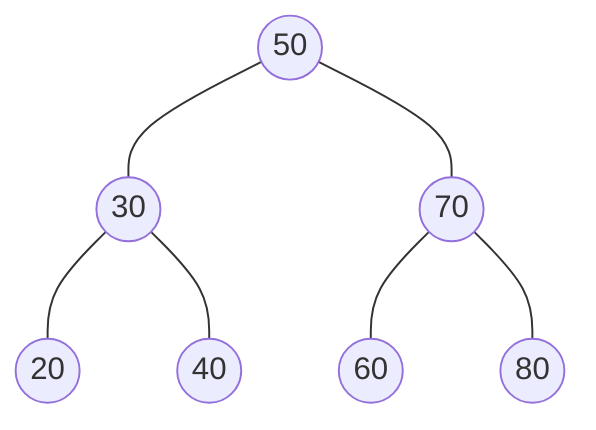
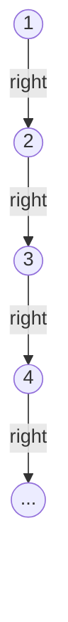

# 20.3 Traversals and the balance problem

Search visits one path; sometimes you need *every* node — to print a tree,
copy it, free it, or check it. A systematic visit of all nodes is called a
**traversal**, and for binary trees there are three recursive classics plus
one queue-powered outsider.

Then this section delivers the chapter's honest ending: the experiment
showing that a BST fed sorted input silently becomes a linked list, and what
that does to every $O(\log n)$ promise made so far.

## Three traversals, one line apart

A recursive traversal makes the same three moves at every node — recurse
left, recurse right, and *visit* (here: print). The only question is
**when** to visit, and the three answers name the three traversals:

- **pre-order**: visit, then left, then right — the node comes *before*
  its subtrees;
- **in-order**: left, then visit, then right — the node comes *in between*;
- **post-order**: left, then right, then visit — the node comes *after*.

All three walk this tree (our friend from
[section 20.2](02-bst-ops.md)):



```python
class Node:
    def __init__(self, value):
        self.value = value
        self.left = None
        self.right = None

def insert(root, value):
    if root is None:
        return Node(value)
    if value < root.value:
        root.left = insert(root.left, value)
    elif value > root.value:
        root.right = insert(root.right, value)
    return root

root = None
for v in [50, 30, 70, 20, 40, 60, 80]:
    root = insert(root, v)

def pre_order(node):
    if node is None:
        return
    print(node.value, end=" ")      # visit FIRST ...
    pre_order(node.left)
    pre_order(node.right)

def in_order(node):
    if node is None:
        return
    in_order(node.left)
    print(node.value, end=" ")      # ... visit BETWEEN ...
    in_order(node.right)

def post_order(node):
    if node is None:
        return
    post_order(node.left)
    post_order(node.right)
    print(node.value, end=" ")      # ... visit LAST

print("pre-order :", end=" ")
pre_order(root)
print()
print("in-order  :", end=" ")
in_order(root)
print()
print("post-order:", end=" ")
post_order(root)
print()
```

The output:

```text
pre-order : 50 30 20 40 70 60 80 
in-order  : 20 30 40 50 60 70 80 
post-order: 20 40 30 60 80 70 50 
```

Same tree, same four-line function — only the position of the `print`
moved. Trace one of them by hand against the diagram (say, post-order: all
of 30's family, then all of 70's, then 50 last) until the pattern clicks.

## In-order on a BST is sorted order — always

Look at the in-order line above: `20 30 40 50 60 70 80`. That is not a
coincidence of this example. In-order prints *everything smaller than the
node* (its whole left subtree), then the node, then everything larger — at
every level of the recursion.

!!! note "The freebie"
    BST invariant + in-order traversal = sorted output, at no extra cost.

Test it on random data:

```python
# continues
import random

random.seed(2026)
values = random.sample(range(1000), 12)

rand_root = None
for v in values:
    rand_root = insert(rand_root, v)

collected = []
def collect_in_order(node):
    if node is None:
        return
    collect_in_order(node.left)
    collected.append(node.value)
    collect_in_order(node.right)

collect_in_order(rand_root)
print("insertion order :", values)
print("in-order walk   :", collected)
print("matches sorted()?", collected == sorted(values))
```

The last new line is `matches sorted()? True` — and it will be `True` for
*any* seed, any values. Twelve numbers went in scrambled; the tree's shape
absorbed the scramble, and in-order read them back sorted.

(A tree-based sort is real: insert everything, walk in-order. That is the
idea behind "tree sort", and behind why databases keep indexes in trees.)

## What pre-order and post-order are for

Each order matches a job:

- **Pre-order — copying and saving.** Parent before children means that if
  you re-insert values in pre-order, each parent is recreated before its
  children arrive — the copy grows the *same shape*. Pre-order is the
  natural "serialize this tree to a file" order.
- **Post-order — demolition.** Children before parent means nothing is
  visited after its subtree is gone — the right order for deleting nodes,
  freeing memory, or computing a folder's size from its files (a folder's
  total needs its children's totals first).

The pre-order claim is checkable in a few lines:

```python
# continues
def collect_pre(node, out):
    if node is None:
        return
    out.append(node.value)
    collect_pre(node.left, out)
    collect_pre(node.right, out)

saved = []
collect_pre(root, saved)                 # "save the tree to a list"
print("saved pre-order:", saved)

rebuilt = None
for v in saved:                          # "load" it back, in saved order
    rebuilt = insert(rebuilt, v)

check = []
collect_pre(rebuilt, check)
print("rebuilt matches?", check == saved)
```

The new lines are `saved pre-order: [50, 30, 20, 40, 70, 60, 80]` and
`rebuilt matches? True` — insert-in-pre-order rebuilt an identical tree.

(Try the same experiment with the in-order list and see what shape you get —
that disaster is the second half of this section.)

## Level-order: the queue's cameo

The fourth traversal is not recursive at all. **Level-order** visits the
root, then everything at depth 1, then depth 2 — reading the tree like a
book, line by line. The engine is the queue from
[Chapter 19](../ch19-stacks-queues/03-queues.md): visit a node, enqueue its
children; the FIFO discipline guarantees a whole level is served before the
next one starts.

```python
# continues
from collections import deque

def print_levels(root):
    queue = deque([root])
    level = 0
    while queue:
        this_level = []
        for _ in range(len(queue)):        # everyone in line right now = one level
            node = queue.popleft()
            this_level.append(node.value)
            if node.left is not None:
                queue.append(node.left)
            if node.right is not None:
                queue.append(node.right)
        print(f"level {level}: {this_level}")
        level += 1

print_levels(root)
```

The new output:

```text
level 0: [50]
level 1: [30, 70]
level 2: [20, 40, 60, 80]
```

Swap the deque for a stack and the same loop becomes a depth-first walk —
the container's discipline *is* the algorithm's strategy.

Level-order generalised to arbitrary graphs is breadth-first search, built
in full in [Section 37.2](../ch37-graphs/02-traversal.md) with this same
loop plus one extra line: a `visited` set, because a graph — unlike a tree —
can lead you back where you started.

### All four at a glance

| Traversal | Order of moves | On our tree | Reach for it when you want to … |
| --- | --- | --- | --- |
| **pre-order** | visit, left, right | `50 30 20 40 70 60 80` | save or copy a tree *with its shape* |
| **in-order** | left, visit, right | `20 30 40 50 60 70 80` | read a BST's values in sorted order |
| **post-order** | left, right, visit | `20 40 30 60 80 70 50` | delete or total up children before parents |
| **level-order** | queue: root, depth 1, depth 2, … | `50 · 30 70 · 20 40 60 80` | print or inspect a tree level by level |

The first three are one recursive function with the `print` in a different
place; only level-order needs a container of its own.

## The balance problem: a linked list in disguise

Every promise in this chapter carried the same fine print: costs are
$O(h)$. So far, $h$ has been kind — random-looking insertions built bushy
trees. Now feed a BST the friendliest-looking input imaginable, the values
`1, 2, 3, ..., n` in order, and watch the shape:



Every new value is larger than everything before it, so every insertion
walks all the way down the right spine and attaches at the bottom. No node
ever gets a left child.

The "tree" is a linked list wearing a costume, with $h = n - 1$. Measure it:

```python
import math
import random

class Node:
    def __init__(self, value):
        self.value = value
        self.left = None
        self.right = None

def insert(root, value):
    """Iterative insert - comfortable even in pathologically deep trees."""
    if root is None:
        return Node(value)
    node = root
    while True:
        if value < node.value:
            if node.left is None:
                node.left = Node(value)
                return root
            node = node.left
        elif value > node.value:
            if node.right is None:
                node.right = Node(value)
                return root
            node = node.right
        else:
            return root

def height(node):
    """Height measured level by level (no recursion-depth worries)."""
    if node is None:
        return -1
    h = -1
    level = [node]
    while level:
        h += 1
        level = [kid for n in level for kid in (n.left, n.right) if kid]
    return h

random.seed(4)
print(f"{'n':>5} | {'random order':>12} | {'sorted order':>12} | {'log2(n+1)':>9}")
for n in [15, 127, 511]:
    values = list(range(n))
    shuffled = values[:]
    random.shuffle(shuffled)

    rand_root = None
    for v in shuffled:
        rand_root = insert(rand_root, v)

    sorted_root = None
    for v in values:
        sorted_root = insert(sorted_root, v)

    print(f"{n:>5} | {height(rand_root):>12} | {height(sorted_root):>12} "
          f"| {math.log2(n + 1):>9.1f}")
```

The output:

```text
    n | random order | sorted order | log2(n+1)
   15 |            5 |           14 |       4.0
  127 |           12 |          126 |       7.0
  511 |           18 |          510 |       9.0
```

Read the middle columns as a verdict.

- **Random order is fine.** It stays within about twice the theoretical
  minimum height $\log_2(n+1) - 1$; the known result is that random BSTs
  average roughly $2.99 \log_2 n$ in height.
- **Sorted order hits the worst case exactly.** Height $n - 1$: a chain. On
  the chain, search, insert, and delete are all $O(n)$, so "a million items
  in twenty steps" becomes "a million items in a million steps".

And sorted (or nearly sorted) input is not exotic — log files by timestamp,
IDs issued in sequence, alphabetized imports. The failure mode is the
*common* case.

## The fix exists: self-balancing trees

The repair is one idea: detect when a subtree leans too far and *rotate* —
a local, $O(1)$ re-linking that lifts the middle value up and restores
bushiness, without breaking the BST invariant. Trees that rotate on every
insert and delete are called **self-balancing**. Two you will meet by name:

- **AVL trees** — strictest balance, invented 1962. Shortest trees, so the
  fastest searches, at the cost of more rotation work per write.
- **Red-black trees** — looser balance, fewer rotations per write, and the
  industry default.

Both guarantee $h = O(\log n)$ *no matter what order the input arrives in*.

You do not have to take that on faith or wait for another book:
[Chapter 35](../ch35-balanced-trees/index.md) picks up exactly here.

- [Section 35.1](../ch35-balanced-trees/01-rotations.md) — implements the
  rotation and proves it preserves the invariant.
- [Section 35.2](../ch35-balanced-trees/02-avl.md) — builds a complete AVL
  tree.
- [Section 35.3](../ch35-balanced-trees/03-red-black.md) — builds the
  red-black tree that `TreeMap` is.
- [Section 35.4](../ch35-balanced-trees/04-b-trees.md) — generalises the
  idea to the B-trees that databases and file systems keep on disk.

You already understand the disease; that chapter is the cure.

!!! info "Java corner"

    You have already used a red-black tree if you have touched Java's
    `TreeMap` or `TreeSet` — each is a red-black tree underneath, which is
    why their documentation promises "guaranteed $O(\log n)$" for `get`,
    `put`, `containsKey`, and friends, and why iterating a `TreeMap` yields
    keys in sorted order: iteration is an in-order traversal. Python has no
    balanced tree in its standard library — `dict` and `set` use hash
    tables ([Chapter 14](../ch14-beyond/01-collections-tour.md)) — so
    Python programmers reach for the `sortedcontainers` package when they
    need one.

!!! warning "Common mistakes"

    - **Mixing up the traversal names.** The prefix names *when the node
      itself is visited*: pre = before its subtrees, in = between, post =
      after. The left-before-right part never changes.
    - **Expecting in-order to reveal the tree's shape.** It cannot — every
      BST on the same values has the *same* in-order output. That is the
      point of sortedness, but it means saving a BST needs pre-order, not
      in-order.
    - **Assuming "my data arrives sorted" is the easy case.** For a plain
      BST it is the *worst* case: a chain of height $n-1$. If sorted-ish
      input is likely and you have no balancing, you do not have a tree.
    - **Writing deep recursion on degenerate trees.** A recursive traversal
      of a 10,000-node chain means 10,000 nested calls —
      `RecursionError`. (That is why the measuring code above uses loops.)

## Check your understanding

1. Without running anything: what is the in-order traversal of *any* BST
   containing the values 3, 1, 4, 1, 5, 9, 2, 6 (duplicates ignored)?

    ??? success "Answer"
        `1 2 3 4 5 6 9` — in-order output of a BST is the sorted values,
        regardless of insertion order or tree shape.

2. Give the pre-order and post-order traversals of the six-node BST built
   by inserting `8, 3, 10, 1, 6, 14` in that order.

    ??? success "Answer"
        The tree: 8 at the root; 3 left with children 1 and 6; 10 right
        with right child 14. Pre-order: `8 3 1 6 10 14`. Post-order:
        `1 6 3 14 10 8`.

3. Which traversal would you use to compute the total size of every folder
   in a file system, and why?

    ??? success "Answer"
        Post-order — a folder's total is the sum of its children's totals,
        so every child must be visited (and totalled) before its parent.

4. You must store a BST to a file tonight and rebuild it identically
   tomorrow. Which traversal do you save, and what goes wrong with the
   obvious alternative?

    ??? success "Answer"
        Save pre-order and re-insert in that order: each parent is
        recreated before its children, reproducing the shape exactly.
        Saving in-order gives the *sorted* list — re-inserting that builds
        the worst-case chain of height $n-1$.
