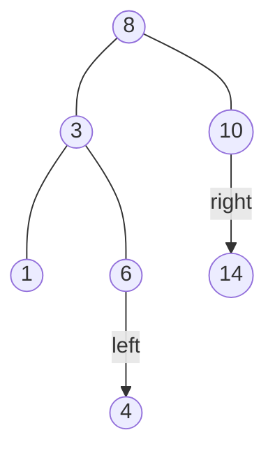
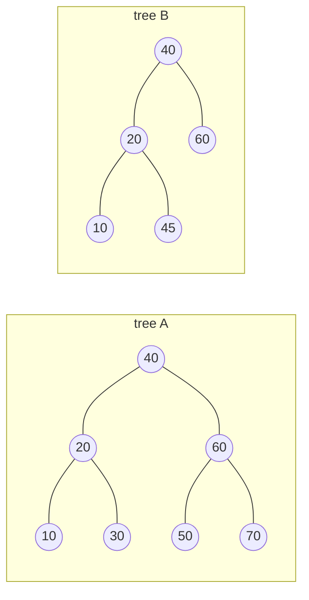

# Exercises

The first three exercises need only pencil and paper (verify with code
afterwards); the rest grow your own tree toolkit. Several solutions share
this minimal kit — a `Node` class and an `insert`/`build` pair — which is
repeated in each solution so every block runs on its own.

### Exercise 20.1 — Read the tree ●

For the BST below, list: (a) the root, (b) the leaves, (c) the internal
nodes, (d) all sibling pairs, (e) the height of the tree, and (f) the depth
of node 4.



??? success "Solution"

    (a) Root: 8. (b) Leaves: 1, 4, 14. (c) Internal: 8, 3, 10, 6.
    (d) Siblings: {3, 10} and {1, 6} — 14 and 4 are only children, so they
    have no siblings. (e) Height 3: the longest root-to-leaf path is
    8 → 3 → 6 → 4, three edges. (f) Depth of 4 is 3 — the same three edges,
    counted from the root. Code can confirm the measurable parts:

    ```python
    class Node:
        def __init__(self, value):
            self.value = value
            self.left = None
            self.right = None

    def insert(root, value):
        if root is None:
            return Node(value)
        if value < root.value:
            root.left = insert(root.left, value)
        elif value > root.value:
            root.right = insert(root.right, value)
        return root

    root = None
    for v in [8, 3, 10, 1, 6, 14, 4]:
        root = insert(root, v)

    def leaves(node, out):
        if node is None:
            return
        if node.left is None and node.right is None:
            out.append(node.value)
        leaves(node.left, out)
        leaves(node.right, out)

    def height(node):
        if node is None:
            return -1
        return 1 + max(height(node.left), height(node.right))

    def depth_of(node, value, d=0):
        if value == node.value:
            return d
        return depth_of(node.left if value < node.value else node.right,
                        value, d + 1)

    found = []
    leaves(root, found)
    print("leaves    :", found)
    print("height    :", height(root))
    print("depth of 4:", depth_of(root, 4))
    ```

    This prints `leaves    : [1, 4, 14]`, `height    : 3`, and
    `depth of 4: 3` — matching the pencil-and-paper answers.

### Exercise 20.2 — Predict the traversals ●

Using the same tree as Exercise 20.1, write down its pre-order, in-order,
and post-order traversals *before* running any code. Then check yourself by
building the tree (insertion order `8, 3, 10, 1, 6, 14, 4` works) and
printing all three.

??? success "Solution"

    Pre-order: `8 3 1 6 4 10 14` — node before subtrees. In-order:
    `1 3 4 6 8 10 14` — sorted, as always for a BST. Post-order:
    `1 4 6 3 14 10 8` — node after subtrees.

    ```python
    class Node:
        def __init__(self, value):
            self.value = value
            self.left = None
            self.right = None

    def insert(root, value):
        if root is None:
            return Node(value)
        if value < root.value:
            root.left = insert(root.left, value)
        elif value > root.value:
            root.right = insert(root.right, value)
        return root

    def build(values):
        root = None
        for v in values:
            root = insert(root, v)
        return root

    def walk(node, when, out):
        if node is None:
            return
        if when == "pre":
            out.append(node.value)
        walk(node.left, when, out)
        if when == "in":
            out.append(node.value)
        walk(node.right, when, out)
        if when == "post":
            out.append(node.value)

    root = build([8, 3, 10, 1, 6, 14, 4])
    for when in ["pre", "in", "post"]:
        out = []
        walk(root, when, out)
        print(f"{when + '-order':>10}: {out}")
    ```

    The one `walk` function with three `if`s makes the pattern explicit:
    the three traversals differ only in *when* the node is recorded.

### Exercise 20.3 — Spot the broken BST ●

One of these two trees is a valid BST; the other violates the invariant.
Which is which — and exactly which rule does the guilty node break?



??? success "Solution"

    Tree A is valid — check every node against both subtrees and every
    comparison holds. Tree B is broken: 45 sits to the *right of 20*, which
    looks fine locally ($45 > 20$), but 45 lives inside the **left subtree
    of 40**, where every value must be *less than 40*. The invariant
    constrains whole subtrees, not just parent–child pairs. And a broken
    invariant has consequences — watch a standard BST search fail to find a
    value that is really there:

    ```python
    class Node:
        def __init__(self, value):
            self.value = value
            self.left = None
            self.right = None

    # Tree B, wired by hand (insert would never build this)
    root = Node(40)
    root.left = Node(20)
    root.right = Node(60)
    root.left.left = Node(10)
    root.left.right = Node(45)

    def bst_search(node, value):
        while node is not None:
            if value == node.value:
                return True
            node = node.left if value < node.value else node.right
        return False

    def really_in_tree(node, value):       # brute force: look everywhere
        if node is None:
            return False
        return (node.value == value
                or really_in_tree(node.left, value)
                or really_in_tree(node.right, value))

    print("BST search finds 45?  ", bst_search(root, 45))
    print("45 is really in there?", really_in_tree(root, 45))
    ```

    This prints `False` then `True`: the search trusts the invariant, turns
    right at 40 (since $45 > 40$), and never visits the left subtree where
    45 is hiding. A BST that lies to its own search is not a BST.

### Exercise 20.4 — Count the leaves ●●

Write a recursive function `count_leaves(node)` returning the number of
leaves in a binary tree. Test it on the tree built from
`[50, 30, 70, 20, 40, 60, 80]` (expect 4) and on a single-node tree
(expect 1).

??? success "Solution"

    ```python
    class Node:
        def __init__(self, value):
            self.value = value
            self.left = None
            self.right = None

    def insert(root, value):
        if root is None:
            return Node(value)
        if value < root.value:
            root.left = insert(root.left, value)
        elif value > root.value:
            root.right = insert(root.right, value)
        return root

    def build(values):
        root = None
        for v in values:
            root = insert(root, v)
        return root

    def count_leaves(node):
        if node is None:
            return 0                     # empty tree: no leaves
        if node.left is None and node.right is None:
            return 1                     # a leaf: count itself
        return count_leaves(node.left) + count_leaves(node.right)

    print(count_leaves(build([50, 30, 70, 20, 40, 60, 80])))   # 4
    print(count_leaves(build([50])))                           # 1
    ```

    This prints `4` (leaves 20, 40, 60, 80) and `1`. The function is the
    recursive tree definition transcribed: one base case per kind of
    "smallest tree" (empty, leaf), and the recursive case trusts the
    subtree calls completely.

### Exercise 20.5 — Measure the height ●●

Write a recursive `tree_height(node)` returning the height in edges, using
the convention that an empty tree has height $-1$. Verify: the tree from
`[50, 30, 70, 20, 40, 60, 80]` has height 2, and the chain built from
`[10, 20, 30, 40]` has height 3.

??? success "Solution"

    ```python
    class Node:
        def __init__(self, value):
            self.value = value
            self.left = None
            self.right = None

    def insert(root, value):
        if root is None:
            return Node(value)
        if value < root.value:
            root.left = insert(root.left, value)
        elif value > root.value:
            root.right = insert(root.right, value)
        return root

    def build(values):
        root = None
        for v in values:
            root = insert(root, v)
        return root

    def tree_height(node):
        if node is None:
            return -1                    # the convention pays off here
        return 1 + max(tree_height(node.left), tree_height(node.right))

    print(tree_height(build([50, 30, 70, 20, 40, 60, 80])))   # 2
    print(tree_height(build([10, 20, 30, 40])))               # 3
    ```

    This prints `2` and `3`. The $-1$ convention makes a leaf work out
    automatically: $1 + \max(-1, -1) = 0$, no special case needed — and the
    second test shows sorted input building a chain whose height is
    $n - 1$.

### Exercise 20.6 — Delete drills ●●

Start from the BST built by inserting `[50, 30, 70, 20, 40, 60, 80]`.
*Predict on paper*, then verify with code:

1. after `delete(70)` — which value takes 70's place, and why that one?
2. then `delete(50)` — which value becomes the root?
3. what is the pre-order traversal after both deletes?

??? success "Solution"

    Both deleted nodes have two children, so each is replaced by its
    **in-order successor** — the minimum of its right subtree. For 70 that
    is 80 (its right subtree holds only 80); for 50 it is 60 (the right
    subtree now holds 80 and 60, and 60 is its minimum). Final pre-order:
    `60 30 20 40 80`.

    ```python
    class Node:
        def __init__(self, value):
            self.value = value
            self.left = None
            self.right = None

    def insert(root, value):
        if root is None:
            return Node(value)
        if value < root.value:
            root.left = insert(root.left, value)
        elif value > root.value:
            root.right = insert(root.right, value)
        return root

    def delete(node, value):
        if node is None:
            return None
        if value < node.value:
            node.left = delete(node.left, value)
        elif value > node.value:
            node.right = delete(node.right, value)
        else:
            if node.left is None:
                return node.right
            if node.right is None:
                return node.left
            succ = node.right
            while succ.left is not None:
                succ = succ.left
            node.value = succ.value
            node.right = delete(node.right, succ.value)
        return node

    def pre_order(node, out):
        if node is None:
            return
        out.append(node.value)
        pre_order(node.left, out)
        pre_order(node.right, out)

    root = None
    for v in [50, 30, 70, 20, 40, 60, 80]:
        root = insert(root, v)

    root = delete(root, 70)
    root = delete(root, 50)
    out = []
    pre_order(root, out)
    print(out)
    ```

    This prints `[60, 30, 20, 40, 80]`. Note what the in-order traversal
    would show after the deletes: `20 30 40 60 80` — still sorted, as it
    must be, which is exactly why in-order alone cannot tell you whether
    your delete rewired the shape correctly. Pre-order can.

### Exercise 20.7 — How common is the worst case? ●●

Section 20.3 showed that sorted input builds a worst-case chain. But how
unlucky do you have to be? Enumerate **all 24 insertion orders** of
`[1, 2, 3, 4]` (use `itertools.permutations`), build the BST for each, and
count how many orders produce each possible height. What fraction hit the
worst case?

??? success "Solution"

    ```python
    from itertools import permutations

    class Node:
        def __init__(self, value):
            self.value = value
            self.left = None
            self.right = None

    def insert(root, value):
        if root is None:
            return Node(value)
        if value < root.value:
            root.left = insert(root.left, value)
        elif value > root.value:
            root.right = insert(root.right, value)
        return root

    def tree_height(node):
        if node is None:
            return -1
        return 1 + max(tree_height(node.left), tree_height(node.right))

    counts = {}
    for order in permutations([1, 2, 3, 4]):
        root = None
        for v in order:
            root = insert(root, v)
        h = tree_height(root)
        counts[h] = counts.get(h, 0) + 1

    print(counts)
    ```

    This prints `{3: 8, 2: 16}` (possibly in the other order): 16 of the
    24 insertion orders give height 2, and **8 of 24 — a full third —
    build a worst-case chain** of height 3. Chains need the insertions to
    pick the current minimum or maximum at every step, which is rare for
    big $n$ but common for small $n$ — and *guaranteed* whenever data
    arrives already sorted, which is why the balance problem cannot be
    dismissed as bad luck.

### Exercise 20.8 — Validate the invariant properly ●●●

Write `is_valid_bst(node)` that returns whether a binary tree satisfies the
BST invariant. The trap: checking only that each child compares correctly
with its parent will wrongly approve tree B from Exercise 20.3. The
standard fix passes *bounds* down the recursion: each node must lie within
`(low, high)`, and the bounds tighten at every step — left of a node, the
`high` becomes the node's value; right of it, the `low` does.

Build tree B by hand (wiring `Node` objects directly, since a correct
`insert` refuses to build it) and show that a naive parent–child checker
says `True` while your bounded checker says `False`.

??? success "Solution"

    ```python
    class Node:
        def __init__(self, value):
            self.value = value
            self.left = None
            self.right = None

    def naive_check(node):
        """WRONG: only compares each node with its direct children."""
        if node is None:
            return True
        if node.left is not None and node.left.value >= node.value:
            return False
        if node.right is not None and node.right.value <= node.value:
            return False
        return naive_check(node.left) and naive_check(node.right)

    def is_valid_bst(node, low=float("-inf"), high=float("inf")):
        if node is None:
            return True
        if not (low < node.value < high):
            return False
        return (is_valid_bst(node.left, low, node.value)
                and is_valid_bst(node.right, node.value, high))

    # Tree B from Exercise 20.3, wired by hand: 45 hides in 40's left subtree
    root = Node(40)
    root.left = Node(20)
    root.right = Node(60)
    root.left.left = Node(10)
    root.left.right = Node(45)     # the impostor

    print("naive check :", naive_check(root))
    print("bounded check:", is_valid_bst(root))
    ```

    This prints `naive check : True` then `bounded check: False`. Walking
    down to 45, the bounds have tightened to $(20, 40)$ — "you are right
    of 20 but left of 40" — and $45$ fails the upper bound it inherited
    from its *grandparent*. The bounds are how the recursion remembers
    every ancestor's constraint, which is exactly what "the invariant holds
    everywhere" means.
