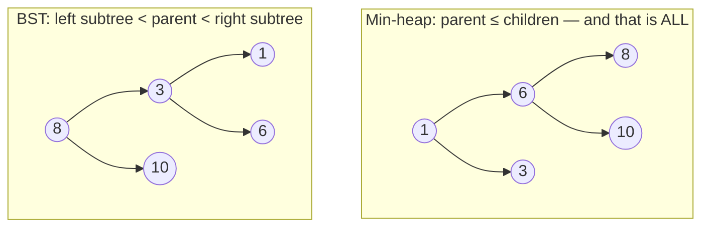
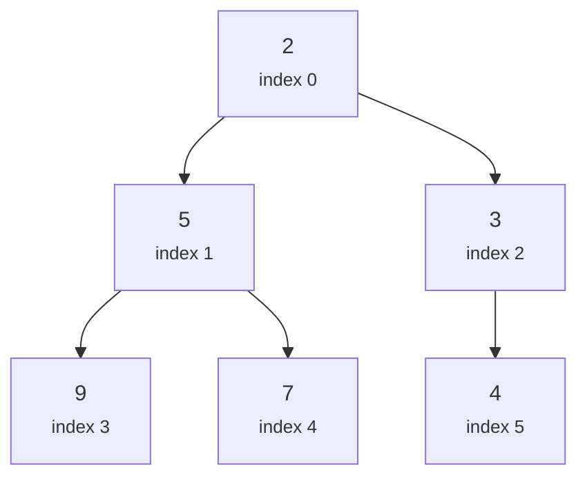

# 21.1 The heap property

Suppose your program must answer, over and over, one specific question:
*"what is the smallest item right now?"* — while new items keep arriving in
between questions. A hospital triage system asks it (most urgent patient
next), an operating system asks it (highest-priority task next), and a
simulation asks it (earliest event next).

This section shows why the data structures you already know handle this
badly, and introduces the beautifully lazy invariant — the **heap
property** — that handles it well.

## The problem: smallest item, moving target

Let's make the problem precise. We need a collection supporting three
operations, called many times in any order:

- **insert** a new item;
- **peek-min** — report the smallest item without removing it;
- **extract-min** — remove and return the smallest item.

Try the structures from earlier chapters:

| Structure | insert | peek-min | extract-min | The problem |
| --------- | ------ | -------- | ----------- | ----------- |
| Unsorted list | $O(1)$ append | $O(n)$ scan | $O(n)$ scan + remove | Every question re-scans everything |
| Sorted list | $O(n)$ shift | $O(1)$ | $O(1)$ at the right end | Every arrival pays the full shifting cost |
| Balanced BST ([Ch 20](../ch20-bst/index.md)) | $O(\log n)$ | $O(\log n)$ walk left | $O(\log n)$ | Works — but stores parent/child pointers and full ordering we never use |

Read the table as three verdicts. The unsorted list makes *questions*
expensive; the sorted list makes *arrivals* expensive; the BST is fast at
both, and overkill.

Why overkill? A BST can list *all* items in order, find *any* key, and
report predecessors and successors — and we only ever ask for the minimum.
We would be paying, in node objects and pointers and balancing complexity,
for power we never use.

The heap is the "just enough" structure: $O(\log n)$ insert, $O(1)$
peek-min, $O(\log n)$ extract-min — with no node objects, no pointers, and
no balancing code at all.

## The heap property: one modest rule

A **min-heap** is a binary tree that obeys a single rule:

!!! note "The min-heap property"
    Every parent is **less than or equal to** each of its children.

That's all. Read it again and notice what it does *not* say — nothing about
left versus right. In a min-heap the left child may be larger than the right
child, or smaller; the rule never compares siblings, only parent against
child.

(A **max-heap** is the mirror image: every parent $\ge$ its children.
Everything in this chapter flips symmetrically.)

### Heap property versus BST invariant

This is the number-one point of confusion with the binary search tree, so
let's put the two invariants side by side:



Both trees hold the same five numbers.

In the BST, position encodes total order: everything left of 8 is smaller,
everything right is larger, and an in-order traversal reads out 1, 3, 6, 8,
10.

In the min-heap, the root's left child is 6 and its right child is 3 — the
*bigger* one sits on the left, and that is perfectly legal, because the only
promises made are $1 \le 6$, $1 \le 3$, $6 \le 8$, and $6 \le 10$.

| | BST invariant | Min-heap property |
| --- | --- | --- |
| Compares | parent vs *entire* left and right subtrees | parent vs its (at most two) children only |
| Left vs right | left < parent < right — order matters | no rule between siblings at all |
| What's fast | search for *any* key, in-order listing | find the *minimum* (it's always the root) |
| Where's the minimum | leftmost node — walk down to find it | the root, always, by definition |

One consequence falls out immediately: **in a min-heap, the smallest item is
always the root**. Its children are $\ge$ it, their children are $\ge$ them, and the
guarantee cascades down every path. That is why peek-min is $O(1)$: just
look at the top.

!!! warning "A heap is not 'sorted-ish'"
    The heap property does **not** mean the tree is nearly sorted. Reading a
    heap level by level gives 1, 6, 3, 8, 10 — not sorted. Where is the
    *second*-smallest item? Somewhere among the root's children — but the
    third-smallest could be a grandchild on either side. A heap knows its
    minimum crisply and is vague about everything else. That vagueness is
    exactly what it charges so little for.

## The shape rule: complete trees

The heap property alone is not enough — a degenerate "chain" of nodes could
satisfy it while being $n$ levels tall, and then nothing would be
logarithmic. So a binary heap adds a second invariant, this one about
*shape*:

!!! note "The shape property"
    A heap is a **complete** binary tree: every level is completely full,
    except possibly the last, which is filled strictly **left to right**
    with no gaps.

Completeness is stricter than the "balanced" trees of
[Chapter 20](../ch20-bst/03-traversals-balance.md): there is exactly *one*
legal shape for each size $n$. Six nodes? Full levels of 1 and 2, then three
nodes packed into the leftmost slots of the third level. No choice, no
lopsidedness — ever.

And a complete tree with $n$ nodes has height $\lfloor \log_2 n \rfloor$,
because each full level doubles the node count.

```python
import math

for n in [1, 3, 7, 15, 100, 1000, 1_000_000]:
    height = math.floor(math.log2(n))
    print(f"n = {n:>9,}  ->  height {height}")
```

A million items, and any leaf is at most 19 steps from the root.

Every heap operation we build in [section 21.2](02-priority-queues.md) walks
a single root-to-leaf path, so every one of them is $O(\log n)$ —
*guaranteed*, with no balancing act required, because completeness makes
imbalance impossible.

## The trick: storing the tree in a plain list

Completeness buys something even better than guaranteed height. Number the
nodes level by level, top to bottom, left to right — 0, 1, 2, 3, … Because a
complete tree has no gaps, this numbering has no gaps either. So we can drop
the nodes straight into a Python list and *throw the tree away*:



The same heap, as a list:

```text
index:  0  1  2  3  4  5
value: [2, 5, 3, 9, 7, 4]
```

There are no `Node` objects and no `left`/`right` references — the *shape
lives in the arithmetic*. For the node at index $i$:

$$
\mathtt{parent}(i) = \left\lfloor \frac{i-1}{2} \right\rfloor
\qquad
\mathtt{left}(i) = 2i + 1
\qquad
\mathtt{right}(i) = 2i + 2
$$

Check it against the picture: index 1 (value 5) has children at
$2(1)+1 = 3$ and $2(1)+2 = 4$ — values 9 and 7. Index 5 (value 4) has parent
$(5-1)//2 = 2$ — value 3. The following block verifies every relationship in
the whole list:

```python
heap = [2, 5, 3, 9, 7, 4]

for i, value in enumerate(heap):
    if i == 0:
        parent_info = "root, no parent"
    else:
        p = (i - 1) // 2
        parent_info = f"parent heap[{p}] = {heap[p]}"
    kids = [f"heap[{c}] = {heap[c]}"
            for c in (2 * i + 1, 2 * i + 2) if c < len(heap)]
    kid_info = ", ".join(kids) if kids else "leaf, no children"
    print(f"index {i} (value {value}): {parent_info} | {kid_info}")
```

Every parent–child pair the output lists satisfies parent $\le$ child, so the
list is a valid min-heap.

Notice the boundary rule the code uses: a computed child index that is
`>= len(heap)` simply does not exist. That is how "the last level is filled
left to right" looks in list form — the list just *ends*, with no `None`
placeholders needed.

!!! info "Java corner"
    Java's `java.util.PriorityQueue` uses exactly this representation
    internally: an `Object[]` array plus the same index formulas. Some
    textbooks instead start the array at index 1, which shifts the formulas
    to $2i$, $2i+1$, and $\lfloor i/2 \rfloor$ — slightly prettier math at
    the cost of a wasted slot. We stick with 0-based throughout.

## Spotting heaps: a validity checker

Since the heap property is "every parent $\le$ its children", checking a list is
one loop: for each index from 1 up, compare against the parent.

```python
def is_min_heap(items):
    for i in range(1, len(items)):
        if items[(i - 1) // 2] > items[i]:
            return False
    return True

candidates = [
    [1, 4, 2, 8, 5, 3],
    [1, 9, 2, 3, 10, 5],
    [2, 1, 3],
    [1, 2, 3, 4, 5, 6, 7],
    [7],
]
for c in candidates:
    print(f"{str(c):<24} -> {is_min_heap(c)}")
```

Before you press Run, judge each list yourself; the traps are instructive.

- `[1, 4, 2, 8, 5, 3]` — valid. Yes, `4` at index 1 is bigger than `2` at
  index 2, but those are *siblings*, and siblings have no rule.
- `[1, 9, 2, 3, 10, 5]` — invalid: index 3 holds `3`, and its parent at
  index 1 holds `9`. A parent exceeds its child.
- `[2, 1, 3]` — invalid: the root `2` exceeds its child `1`. The minimum
  must be at index 0, and here it is not.
- `[1, 2, 3, 4, 5, 6, 7]` — valid. Every *sorted* list is automatically a
  min-heap (parents always come before children in the numbering, and in a
  sorted list earlier $\le$ later). The reverse is false, as `[1, 4, 2, 8, 5, 3]`
  just showed.
- `[7]` — valid: a single node has no parent–child pairs to violate.

!!! tip "Reading a heap out of a flat list"
    With practice you can sketch the tree from the list in seconds: index 0
    is the root, the next two indices are level 1, the next four are level 2,
    and so on — each level is a slice of the list twice as long as the one
    before. Sketching the tree is the fastest way to spot a violation by eye.

!!! warning "Common mistakes"
    - **BST thinking.** Assuming the left child must be smaller than the
      right, or that "smaller keys go left". The heap property says nothing
      about siblings — `[1, 6, 3, ...]` is a perfectly valid min-heap even
      though 6 > 3. In a heap, smaller keys go *up*, not left.
    - **Expecting the list to be sorted.** A valid min-heap's list form is
      generally not sorted — only the root's position is fully determined.
    - **Off-by-one index formulas.** With 0-based lists the children of $i$
      are $2i+1$ and $2i+2$. Writing $2i$ and $2i+1$ (the 1-based formulas)
      silently pairs every node with the wrong family.
    - **This chapter's heap is not "the heap" of memory.** The dynamic-memory
      region from [Chapter 5](../ch05-under-the-hood/03-stack-heap.md) shares
      the name and nothing else — an unfortunate historical collision.

## Check your understanding

1. In the min-heap `[2, 5, 3, 9, 7, 4]`, which single value could you change
   to `1` *without* breaking the heap property?

    ??? success "Answer"
        Only the root, `2` (index 0). The root has no parent, so making it
        smaller can never violate anything, and $1 \le 5$, $1 \le 3$ keeps
        its children legal. Changing any *other* entry to `1` would make it
        smaller than its parent — e.g. turning the `4` at index 5 into `1`
        breaks the pair with its parent `3` at index 2.

2. A node lives at index 12 of a heap list. What are the indices of its
   parent and its children? Can it have a right child but no left child?

    ??? success "Answer"
        Parent: $(12-1)//2 = 5$. Children: $2(12)+1 = 25$ and
        $2(12)+2 = 26$. And no node in any heap can have a right child
        without a left one: the right child's index $2i+2$ comes *after* the
        left's $2i+1$, and completeness forbids gaps, so if index 26 is
        occupied, index 25 must be too.

3. True or false: in a valid min-heap, the *largest* item is always the last
   element of the list.

    ??? success "Answer"
        False. The largest item must be a *leaf* (if it had a child, that
        child would have to be $\ge$ it, making the child at least as large),
        but it can be any leaf, not necessarily the final one. Example:
        `[1, 9, 2]` is a valid min-heap whose largest element, 9, sits in
        the middle of the list.

4. Your friend claims: "I checked that `heap[0]` is the smallest element of
   the list, so the list is a valid min-heap." What's the flaw?

    ??? success "Answer"
        The heap property must hold at *every* parent–child pair, not just
        at the root. `[1, 9, 2, 3]` has the minimum at index 0, yet it is
        not a heap: index 3 (value 3) has parent 9. The checker loops over
        all indices for exactly this reason.
