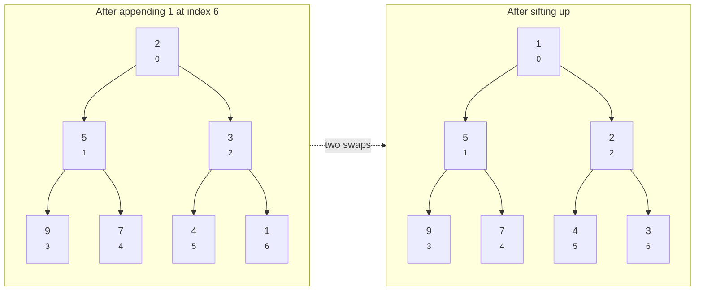

# 21.2 Priority queues and heapsort

[Section 21.1](01-heap-property.md) gave us a promise: a complete tree in a
plain list, minimum at index 0, every leaf within $\log_2 n$ steps of the
root. Now we collect on the promise.

This section builds the two repair operations that keep the heap property
alive while items come and go, grows them into a `MinHeap` class, then hands
the job to Python's built-in `heapq`. It finishes with the two most famous
things heaps are used for: sorting and top-k selection.

## The PriorityQueue ADT

A **priority queue** is an abstract data type
(an ADT, in the sense of [Chapter 18](../ch18-linked-lists/01-adts-generics.md)):
it names *what* the operations do, not *how*. The contract:

| Operation | Meaning | With a binary heap |
| --------- | ------- | ------------------ |
| `push(item)` | insert an item | $O(\log n)$ |
| `peek()` | return the smallest item, don't remove | $O(1)$ |
| `pop()` | remove and return the smallest item | $O(\log n)$ |

It is a queue in spirit — items in, items out — but where the queues of
[Chapter 19](../ch19-stacks-queues/03-queues.md) serve whoever waited
longest, a priority queue serves whoever *matters most* (for a min-heap:
the smallest value; think "priority 1 beats priority 5").

Both `push` and `pop` disturb the heap and must then repair it. Each has a
dedicated repair move, and both moves walk one vertical path through the
tree — which is why both cost $O(\log n)$.

## Insert: sift up

To insert, we first satisfy the *shape* rule, then fix the *heap* rule:

1. Append the new item at the end of the list — the one legal place a
   complete tree can grow, the next free slot in the bottom level.
2. The new item may now be smaller than its parent. While it is, swap it
   with its parent. This is called **sift-up** (or *bubble-up*): the new
   item rises until its parent is $\le$ it, or it reaches the root.

Let's insert `1` into the heap from last section, `[2, 5, 3, 9, 7, 4]`:

| Step | List | What happened |
| ---- | ---- | ------------- |
| append | `[2, 5, 3, 9, 7, 4, 1]` | `1` lands at index 6; parent is index 2 (value 3) |
| swap 6 ↔ 2 | `[2, 5, 1, 9, 7, 4, 3]` | $3 > 1$, so they swap; `1` is at index 2, parent is index 0 (value 2) |
| swap 2 ↔ 0 | `[1, 5, 2, 9, 7, 4, 3]` | $2 > 1$, so they swap; `1` is the root — done |



Only the nodes on the path 6 → 2 → 0 moved; the rest of the heap never
looked up from its desk. In code:

```python
def sift_up(heap, i):
    while i > 0:
        parent = (i - 1) // 2
        if heap[parent] <= heap[i]:
            break                      # parent is fine -> heap repaired
        heap[parent], heap[i] = heap[i], heap[parent]
        print(f"  swapped indices {i} and {parent}: {heap}")
        i = parent

heap = [2, 5, 3, 9, 7, 4]
heap.append(1)
print(f"appended:  {heap}")
sift_up(heap, len(heap) - 1)
print(f"repaired:  {heap}")
```

The output replays the trace table line for line.

Why is the result a valid heap? Two reasons, together:

- **Pairs off the path stay legal.** Each swap can only *shrink* the value
  sitting in the parent slot, and a smaller parent never breaks anything.
- **Pairs on the path end up legal.** The loop stops only when the risen
  item's parent is $\le$ it (or it becomes the root).

The path has at most $\lfloor \log_2 n \rfloor$ edges — that is the whole
cost.

## Extract-min: sift down

Removing the root is trickier, because the root is exactly the item
everyone points at. Again: shape first, then repair.

1. Remember `heap[0]` — the answer we will return.
2. Move the *last* element of the list into slot 0 and shrink the list by
   one. Shape is instantly legal again (we removed the one slot a complete
   tree may lose).
3. The transplanted value is probably too big for the root. While it is
   larger than its smallest child, swap it with that child. This is
   **sift-down** (or *sink*).

Take the heap we just built, `[1, 5, 2, 9, 7, 4, 3]`, and extract the `1`:

| Step | List | What happened |
| ---- | ---- | ------------- |
| remove min | — | `1` saved for returning |
| last → root | `[3, 5, 2, 9, 7, 4]` | `3` teleports from the last slot to index 0 |
| swap 0 ↔ 2 | `[2, 5, 3, 9, 7, 4]` | children of `3` are 5 and 2; smallest child 2 < 3, swap |
| stop | `[2, 5, 3, 9, 7, 4]` | `3`'s only child is now 4, and $4 \ge 3$ — done |

!!! warning "Always swap with the *smaller* child"
    Swap with the larger one instead and it becomes the parent of its
    smaller sibling — instantly illegal. This is step 3's whole subtlety.

```python
def sift_down(heap, i):
    n = len(heap)
    while True:
        left, right = 2 * i + 1, 2 * i + 2
        smallest = i
        if left < n and heap[left] < heap[smallest]:
            smallest = left
        if right < n and heap[right] < heap[smallest]:
            smallest = right
        if smallest == i:
            break                      # neither child is smaller -> done
        heap[i], heap[smallest] = heap[smallest], heap[i]
        print(f"  swapped indices {i} and {smallest}: {heap}")
        i = smallest

heap = [1, 5, 2, 9, 7, 4, 3]
minimum = heap[0]
heap[0] = heap[-1]     # last element takes over the root...
heap.pop()             # ...and leaves its old slot
print(f"extracted {minimum}, moved last to root: {heap}")
sift_down(heap, 0)
print(f"repaired: {heap}")
```

We got `[2, 5, 3, 9, 7, 4]` back — the exact heap we started 21.1 with,
which is a nice check that insert and extract really are inverses here.

Sift-down also walks one root-to-leaf path at worst: $O(\log n)$.

## A MinHeap class

Wrap both moves and the list behind the ADT's interface and we have a real
priority queue — about forty lines, no `Node` class in sight:

```python
class MinHeap:
    def __init__(self):
        self._items = []

    def __len__(self):
        return len(self._items)

    def push(self, value):
        self._items.append(value)
        self._sift_up(len(self._items) - 1)

    def peek(self):
        if not self._items:
            raise IndexError("peek at an empty heap")
        return self._items[0]

    def pop(self):
        if not self._items:
            raise IndexError("pop from an empty heap")
        items = self._items
        minimum = items[0]
        last = items.pop()
        if items:                      # heap not empty after removal
            items[0] = last
            self._sift_down(0)
        return minimum

    def _sift_up(self, i):
        items = self._items
        while i > 0:
            parent = (i - 1) // 2
            if items[parent] <= items[i]:
                break
            items[parent], items[i] = items[i], items[parent]
            i = parent

    def _sift_down(self, i):
        items = self._items
        n = len(items)
        while True:
            left, right = 2 * i + 1, 2 * i + 2
            smallest = i
            if left < n and items[left] < items[smallest]:
                smallest = left
            if right < n and items[right] < items[smallest]:
                smallest = right
            if smallest == i:
                break
            items[i], items[smallest] = items[smallest], items[i]
            i = smallest

h = MinHeap()
for value in [7, 2, 9, 4, 1, 8]:
    h.push(value)
print("peek:", h.peek())
print("popped in order:", [h.pop() for _ in range(len(h))])
```

Push six values in scrambled order, pop six times, and out they come
ascending: `[1, 2, 4, 7, 8, 9]`.

The heap never *stored* them in sorted order — it just always knew the
minimum, six times in a row. Hold that thought for heapsort below.

## heapq: the standard library says "just use a list"

Python ships this exact machinery as the
[`heapq`](https://docs.python.org/3/library/heapq.html) module — with one
stylistic twist: there is no heap *class*. The functions operate directly on
a plain list that you keep, and the list's contents are exactly our
`_items` array.

| Our `MinHeap` | `heapq` equivalent |
| ------------- | ------------------ |
| `h = MinHeap()` | `heap = []` |
| `h.push(x)` | `heapq.heappush(heap, x)` |
| `h.peek()` | `heap[0]` |
| `h.pop()` | `heapq.heappop(heap)` |
| — | `heapq.heapify(lst)` — turn *any* list into a heap, in place |

```python
import heapq

heap = []
for value in [7, 2, 9, 4, 1, 8]:
    heapq.heappush(heap, value)

print("peek:", heap[0])
print("pop :", heapq.heappop(heap))
print("pop :", heapq.heappop(heap))
print("the list between pops:", heap)
```

The final line prints `[4, 7, 8, 9]` — a valid min-heap that merely
*happens* to look sorted because so few items remain. (Print the list right
after the six pushes and you'll see `[1, 2, 8, 7, 4, 9]`.)

And popping an empty heap is an error, same as our class:

```python
# raises IndexError
import heapq

heap = []
heapq.heappop(heap)    # nothing to pop -> IndexError: index out of range
```

!!! tip "`heapify` is cheaper than pushing one by one"
    It repairs an arbitrary list into a heap in $O(n)$, not the
    $O(n \log n)$ of $n$ separate pushes — thanks to a bottom-up sweep of
    sift-downs, in which most nodes are near the bottom and sink only a step
    or two.

### Priorities attached to data: the tuple pattern

Real queue entries are rarely bare numbers — they are *jobs with
priorities*. The idiom: push `(priority, item)` tuples. Python compares
tuples element by element, so the smallest priority wins, and the item rides
along.

```python
import heapq

todo = []
heapq.heappush(todo, (2, "write report"))
heapq.heappush(todo, (1, "fix server outage"))
heapq.heappush(todo, (3, "water office plants"))

while todo:
    priority, task = heapq.heappop(todo)
    print(f"priority {priority}: {task}")
```

The outage comes out first even though it was pushed second.

Tied priorities fall through to comparing the items themselves — fine for
strings, a `TypeError` for uncomparable objects. The standard fix is
`(priority, counter, item)` with an ever-increasing counter, which breaks
every tie before the item is ever consulted.

### Max-heaps by negation

`heapq` only does min-heaps. Need the *largest* first? Push the
**negations**: the largest value has the smallest negation, so a min-heap
of negatives behaves as a max-heap of the originals — just remember to
negate again on the way out.

```python
import heapq

scores = [31, 88, 12, 95, 47]
negated = [-s for s in scores]
heapq.heapify(negated)

print("largest :", -heapq.heappop(negated))
print("runner-up:", -heapq.heappop(negated))
```

=== "Python"

    ```python
    import heapq

    heap = []
    heapq.heappush(heap, 7)     # min-heap only; negate for max
    smallest = heapq.heappop(heap)
    print(smallest)
    ```

=== "Java"

    ```java
    import java.util.PriorityQueue;
    import java.util.Comparator;

    PriorityQueue<Integer> pq = new PriorityQueue<>();   // min-heap
    pq.add(7);                       // like heappush
    Integer top = pq.peek();         // like heap[0]
    Integer smallest = pq.poll();    // like heappop

    // Java gets a real max-heap via a comparator -- no negation trick:
    PriorityQueue<Integer> maxPq =
        new PriorityQueue<>(Comparator.reverseOrder());
    ```

## Heapsort: pop your way to sorted

We saw it with the `MinHeap` demo: push everything, pop everything, and the
pops emerge in ascending order. That *is* a sorting algorithm — **heapsort**.
Building the heap costs $O(n)$ with `heapify`, and each of the $n$ pops
costs $O(\log n)$: total $O(n \log n)$, **guaranteed**, on every input —
no lucky-pivot fine print (a contrast that will matter in
[Chapter 22](../ch22-sorting/02-merge-quick.md)).

```python
import heapq
import random

def heapsort(items):
    heap = list(items)
    heapq.heapify(heap)
    return [heapq.heappop(heap) for _ in range(len(heap))]

random.seed(21)
data = random.sample(range(100), 12)
print("data:    ", data)
print("heapsort:", heapsort(data))
print("sorted():", sorted(data))
print("agree?   ", heapsort(data) == sorted(data))
```

(The classic in-place version builds a *max*-heap inside the array and swaps
the root to the back instead of using a second list, but the idea is
identical.)

In practice you will keep calling `sorted()` — it's Timsort, faster in real
workloads. But heapsort's guaranteed bound and $O(1)$ extra memory keep it a
serious tool, and it is the standard library's own engine behind
`heapq.nlargest`.

## The top-k pattern

The everyday heap superpower: find the **k largest** items in a huge stream
*without sorting it* — and without even holding it all, if it truly is a
stream. Keep a **min**-heap of size $k$ holding the best $k$ seen so far;
its root is the *weakest of the elite*, i.e. exactly the item a newcomer
must beat:

```python
import heapq
import random

random.seed(7)
readings = [random.randint(0, 10_000) for _ in range(5000)]
k = 5

elite = readings[:k]
heapq.heapify(elite)              # min-heap: elite[0] = weakest of the top k
for value in readings[k:]:
    if value > elite[0]:          # beats the weakest?
        heapq.heapreplace(elite, value)   # out with the weakest, in with the new

print("size-k heap:", sorted(elite, reverse=True))
print("full sort  :", sorted(readings, reverse=True)[:k])
print("nlargest   :", heapq.nlargest(k, readings))
```

All three lines agree — but the costs differ wildly:

- **Full sort** — $O(n \log n)$ time, and all $n$ values in memory at once.
- **Size-$k$ heap** — $O(n \log k)$ time, and only $k$ values in memory.

For "top 10 of a billion log lines" that is $\log_2 10 \approx 3.3$ versus
$\log_2 10^9 \approx 30$ per item — and a 10-element list versus a billion.
The one-liner `heapq.nlargest(k, ...)` (and its twin `nsmallest`) does
exactly this under the hood.

## Where priority queues run the world

Once you know the shape of the problem — *many pending things, always serve
the most urgent* — you see it everywhere:

- **Process scheduling.** An operating system picks the highest-priority
  runnable task ([Section 23.1](../ch23-os/01-os-processes.md)).
- **Shortest paths.** Dijkstra's algorithm always expands the closest
  unexplored node — the beating heart of route navigation.
- **Discrete-event simulation.** Future events sit in a heap keyed by
  timestamp; the loop repeatedly pops the earliest one.
- **And more of the same shape:** bandwidth managers, A\* game pathfinding,
  and Huffman compression all queue up on this structure.

Two of them arrive later in this book, and the heap you just built is the
reason they are fast:
[Section 37.3](../ch37-graphs/03-shortest-paths.md) implements Dijkstra's
algorithm with a `heapq` priority queue, and
[37.4](../ch37-graphs/04-mst.md) does the same for Prim's
minimum-spanning-tree algorithm. In both, replacing the heap with a linear
scan for the minimum is exactly what turns an $O(E \log V)$ algorithm into an
$O(V^2)$ one.

!!! warning "Common mistakes"
    - **Sifting down with the larger child.** Swap the sinking node with its
      *smallest* child, or the smaller sibling ends up below its bigger
      sibling and the heap breaks. (Symmetrically: max-heaps sift down with
      the largest child.)
    - **Forgetting the empty-after-pop case.** In `pop()`, if you remove the
      last remaining element, there is nothing to move into slot 0 — guard
      it, or you'll write the popped item right back.
    - **Treating the heap list as sorted output.** After `heapify`, the
      list satisfies the heap property, nothing more. To get sorted order
      you must pop repeatedly; printing the raw list gives interleaved
      levels.
    - **Pushing `(item, priority)` instead of `(priority, item)`.** Tuples
      compare first element first, so priority must come first — otherwise
      you've built an alphabetical queue of task names.

## Check your understanding

1. `pop()` moves the *last* list element to the root before sifting down.
   Why the last element specifically, and not, say, the root's smaller
   child?

    ??? success "Answer"
        Shape. A complete tree may only shrink by losing the final slot of
        its bottom level — the last list element. Promoting the smaller
        child instead would leave a hole in the *middle* of the tree, and
        the list representation (which tolerates no gaps) would fall apart.
        The index math only works over a gap-free, complete tree.

2. Predict the output order: `heapq.heappush` the tuples `(3, "c")`,
   `(1, "b")`, `(1, "a")`, `(2, "d")`, then pop all four.

    ??? success "Answer"
        `(1, "a")`, `(1, "b")`, `(2, "d")`, `(3, "c")`. The two
        priority-1 entries tie on the first tuple element, so Python
        compares the second: `"a" < "b"`.

3. You need the 20 *smallest* of 10 million readings. Sketch the heap-based
   approach and its cost. (Careful — it's the mirror image of the demo
   above.)

    ??? success "Answer"
        Keep a size-20 **max**-heap of the best-so-far (via negation in
        `heapq`): its root is the *largest* of the current 20 smallest —
        the one a newcomer must undercut. For each reading, if it is
        smaller than the root, replace the root. Cost: $O(n \log 20)$ time,
        20 items of memory. Or just call `heapq.nsmallest(20, readings)`.

4. Both `push` and `pop` are $O(\log n)$. What single fact about the heap's
   *shape* makes that bound guaranteed rather than merely typical (as it
   was for the BSTs of Chapter 20)?

    ??? success "Answer"
        Completeness. A complete tree with $n$ nodes has height exactly
        $\lfloor \log_2 n \rfloor$ — there is no legal way for it to grow
        lanky, so there is no bad shape to hit. A BST's $O(\log n)$ holds
        only while the tree stays balanced; insert sorted data and it
        degrades to a $O(n)$ chain. The heap's shape rule makes that
        degradation structurally impossible.
