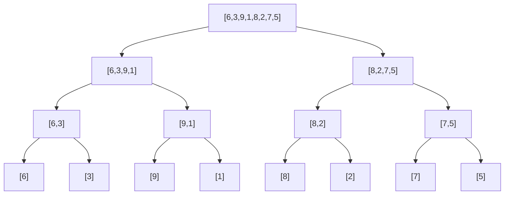

# 22.2 Merge sort and quicksort

The elementary sorts all share a ceiling: they move one element into place
per pass, so they cannot beat roughly $n^2/2$ comparisons on unfriendly
input. Breaking that ceiling takes a different *strategy*, and it is one
you already own: **divide and conquer**, the recursive pattern from
[Chapter 17](../ch17-recursion/index.md). Split the problem in half, sort
the halves by recursion, combine. Both of this section's algorithms follow
that script — merge sort does its real work in the *combine* step,
quicksort in the *split* step — and both reach $O(n \log n)$, which for
$n = 400$ means roughly 3,500 comparisons where selection sort spent
79,800.

## The merge: a two-finger walk

Merge sort rests on one humble observation: **combining two already-sorted
lists into one sorted list is easy and fast**. Put a finger under the first
element of each list; whichever finger points at the smaller value, copy
that value out and advance that finger. Repeat until one list runs dry,
then copy the survivor's remainder wholesale.

Merging `[2, 5, 9]` and `[1, 4, 8]`:

| Left finger | Right finger | Comparison | Output so far |
| ----------- | ------------ | ---------- | ------------- |
| **2**, 5, 9 | **1**, 4, 8 | 2 vs 1 → take 1 | `[1]` |
| **2**, 5, 9 | 1, **4**, 8 | 2 vs 4 → take 2 | `[1, 2]` |
| 2, **5**, 9 | 1, **4**, 8 | 5 vs 4 → take 4 | `[1, 2, 4]` |
| 2, **5**, 9 | 1, 4, **8** | 5 vs 8 → take 5 | `[1, 2, 4, 5]` |
| 2, 5, **9** | 1, 4, **8** | 9 vs 8 → take 8 | `[1, 2, 4, 5, 8]` |
| 2, 5, **9** | — empty — | right ran dry → copy rest | `[1, 2, 4, 5, 8, 9]` |

Six elements merged with five comparisons — never more than $n - 1$ for
$n$ total elements, because every comparison permanently retires one
element. Each finger only ever moves forward: the walk is *linear*, $O(n)$.

```python
def merge(left, right):
    merged = []
    i = j = 0
    while i < len(left) and j < len(right):
        if left[i] <= right[j]:        # ties take from the LEFT: stability!
            merged.append(left[i])
            i += 1
        else:
            merged.append(right[j])
            j += 1
    merged.extend(left[i:])            # at most one of these
    merged.extend(right[j:])           # has anything left
    return merged

print(merge([2, 5, 9], [1, 4, 8]))
```

## Merge sort: split until trivial, merge on the way back

But wait — merging requires the halves to *already be sorted*. Who sorts
the halves? The same algorithm, recursively. And the base case is the
secret of the whole design: **a list of one element is already sorted**.
Split all the way down to singletons, then let `merge` do every scrap of
real work on the way back up.

```python
# continues
def merge_sort(items):
    if len(items) <= 1:                    # base case: trivially sorted
        return list(items)
    mid = len(items) // 2
    left = merge_sort(items[:mid])         # sort the left half...
    right = merge_sort(items[mid:])        # ...and the right half...
    return merge(left, right)              # ...then combine them

print(merge_sort([6, 3, 9, 1, 8, 2, 7, 5]))
```

Here is the full recursion tree for that call — splits flowing downward,
every leaf a singleton, merges happening as the calls return:



### Why $n \log n$: levels $\times$ work

Now count the cost straight off the picture. Group the merges by **level**
of the tree:

```text
level 0:  one merge of 8        -> touches 8 elements
level 1:  two merges of 4       -> touches 8 elements
level 2:  four merges of 2      -> touches 8 elements
              every level does O(n) total merge work
```

Each level's merges, added together, process every element exactly once —
$O(n)$ work per level, no matter how the level is chopped up. And how many
levels are there? Halving $n$ down to 1 takes $\log_2 n$ halvings — 3
levels for 8 elements, about 17 for 100,000. So the total is

$$
\underbrace{O(n)}_{\text{work per level}} \times
\underbrace{O(\log n)}_{\text{number of levels}} = O(n \log n),
$$

and — this is merge sort's signature — the analysis never mentioned the
input's *values*. Sorted, reversed, adversarial: the tree has the same
shape and the same bill. Merge sort is $O(n \log n)$ **always**. It shares
that guarantee with [heapsort](../ch21-heaps/02-priority-queues.md), and
we are about to meet a famous algorithm that *doesn't* have it.

## Quicksort: divide by value, not by position

Merge sort splits blindly down the middle and works while re-combining.
Quicksort inverts the plan: put the work into a *smart split*, and then
combining is free. The split is called **partitioning**:

1. Choose some element as the **pivot**.
2. Rearrange the list so everything smaller than the pivot sits to its
   left and everything greater-or-equal sits to its right.
3. The pivot is now in its **final sorted position** — recurse on the left
   chunk and the right chunk, and there is nothing left to do at the end.

The classic in-place partition (Lomuto's scheme) keeps a "small zone" at
the front and grows it as one scan finds small elements. Take
`[4, 8, 1, 6, 3, 7, 5]` with the last element, `5`, as pivot; `j` scans,
and `i` marks the end of the small zone:

| Scan | Is it < 5? | Action | List after |
| ---- | ---------- | ------ | ---------- |
| `j=0`: 4 | yes | grow zone, swap 4 with itself | `[4, 8, 1, 6, 3, 7, 5]` |
| `j=1`: 8 | no | nothing | `[4, 8, 1, 6, 3, 7, 5]` |
| `j=2`: 1 | yes | grow zone, swap 1 ↔ 8 | `[4, 1, 8, 6, 3, 7, 5]` |
| `j=3`: 6 | no | nothing | `[4, 1, 8, 6, 3, 7, 5]` |
| `j=4`: 3 | yes | grow zone, swap 3 ↔ 8 | `[4, 1, 3, 6, 8, 7, 5]` |
| `j=5`: 7 | no | nothing | `[4, 1, 3, 6, 8, 7, 5]` |
| end | — | pivot ↔ first non-small: 5 ↔ 6 | `[4, 1, 3, 5, 8, 7, 6]` |

One linear pass, and the list is now `small stuff | 5 | big stuff`. The
`5` will never move again — index 3 is where it belongs in the final
sorted order. Notice neither side is itself sorted; that is the
recursion's job.

```python
def partition(a, lo, hi):
    pivot = a[hi]                      # last element is the pivot
    i = lo - 1                         # end of the "smaller than pivot" zone
    for j in range(lo, hi):
        if a[j] < pivot:
            i += 1
            a[i], a[j] = a[j], a[i]    # pull the small element into the zone
    a[i + 1], a[hi] = a[hi], a[i + 1]  # drop the pivot just after the zone
    return i + 1                       # the pivot's final resting index

def quicksort(a, lo=0, hi=None):
    if hi is None:
        hi = len(a) - 1
    if lo < hi:                        # 0 or 1 elements: already sorted
        p = partition(a, lo, hi)
        quicksort(a, lo, p - 1)        # everything left of the pivot
        quicksort(a, p + 1, hi)        # everything right of it

data = [4, 8, 1, 6, 3, 7, 5]
quicksort(data)
print(data)
```

Note the contrast with merge sort's code: `quicksort` returns nothing. It
rearranges the one and only list **in place** — no `merged` lists, no
slices, no copies.

## The pivot gamble

Quicksort's cost analysis is a *gamble on the pivot*. If pivots land near
the middle of their range, the two sides are balanced, the recursion tree
looks like merge sort's — $\log n$ levels of $O(n)$ partitioning:
$O(n \log n)$. But if the pivot is the *smallest or largest* element, the
"split" peels off a single element and recurses on all the rest: $n$
levels of shrinking scans, $(n-1) + (n-2) + \dots + 1 = n(n-1)/2$
comparisons. That is $O(n^2)$ — selection-sort money.

When does the nightmare pivot happen *every single time*? With
depressing ease: take the first (or last) element as pivot and feed in
**already-sorted data** — one of the most common inputs in real life.
Watch the counter catch the collapse; note we sort *sorted* lists here:

```python
import random

def quicksort_comparisons(items, pivot_strategy):
    a = list(items)
    count = 0

    def partition(lo, hi):
        nonlocal count
        if pivot_strategy == "random":
            k = random.randint(lo, hi)     # move a random element...
            a[k], a[hi] = a[hi], a[k]      # ...into the pivot seat
        elif pivot_strategy == "first":
            a[lo], a[hi] = a[hi], a[lo]    # first element takes the seat
        pivot = a[hi]
        i = lo - 1
        for j in range(lo, hi):
            count += 1
            if a[j] < pivot:
                i += 1
                a[i], a[j] = a[j], a[i]
        a[i + 1], a[hi] = a[hi], a[i + 1]
        return i + 1

    def sort(lo, hi):
        if lo < hi:
            p = partition(lo, hi)
            sort(lo, p - 1)
            sort(p + 1, hi)

    sort(0, len(a) - 1)
    assert a == sorted(items)              # it still sorts correctly...
    return count                           # ...the question is the price

random.seed(22)
print(f"{'n':>4} | {'random pivot':>12} | {'first pivot':>11} | {'n(n-1)/2':>9}")
for n in [50, 100, 200]:
    data = list(range(n))                  # ALREADY SORTED input
    r = quicksort_comparisons(data, "random")
    f = quicksort_comparisons(data, "first")
    print(f"{n:>4} | {r:>12,} | {f:>11,} | {n*(n-1)//2:>9,}")
```

The first-element pivot matches $n(n-1)/2$ *exactly* — on sorted input it
is a quadratic algorithm, full stop, and doubling $n$ quadruples its
column while the random-pivot column only a little more than doubles. The
random pivot has no such weakness: no *particular input* is bad for it,
because the danger was moved from the data to the dice. A run can still
get unlucky, but the *expected* cost is $O(n \log n)$ on every input, and
catastrophically bad luck at scale is statistically negligible. That is
why library quicksorts randomise or use median-style pivot selection —
never "just take the first element".

## The rematch: memory and stability

Speed is a tie (both $O(n \log n)$ in the cases that matter), so the
professional tie-breakers are elsewhere:

| | Merge sort | Quicksort |
| --- | --- | --- |
| Time, typical | $O(n \log n)$ | $O(n \log n)$, usually with a smaller constant |
| Time, worst | $O(n \log n)$ — guaranteed | $O(n^2)$ — must be defused with pivot strategy |
| Extra memory | $O(n)$ buffer for merging | in place; only the recursion stack, expected $O(\log n)$ |
| Stable? | **Yes** (with `<=` taking left on ties) | **No** (as normally implemented) |

The memory line: our `merge` cannot interleave two halves in place — it
needs somewhere to put the output, so merge sort carries an $n$-sized
buffer (our slicing version allocates even more freely; tuned versions
recycle a single scratch list). Quicksort's partition just swaps within
the original list; its only overhead is the stack of recursive calls,
$O(\log n)$ deep when splits are healthy.

The stability line: merge honours ties by construction — when
`left[i] <= right[j]`, the left (earlier) element goes first, so equal
keys keep their order. Quicksort's partition, like selection sort's swap,
flings elements across the whole span, and equal keys land in whatever
order the swaps dictate.

!!! info "What real libraries actually run"
    Python's `sorted()` and `list.sort()` use **Timsort** — a
    merge-sort/insertion-sort hybrid invented for CPython by Tim Peters. It
    hunts for *runs* (stretches already in order), extends short ones with
    insertion sort, then merges runs — so it is stable, $O(n \log n)$
    worst case, and drops to $O(n)$ on already-sorted data. Java splits
    the difference: `Arrays.sort` on **primitives** (`int[]`, `double[]`)
    uses dual-pivot quicksort — fast, in place, and stability is
    meaningless when equal `int`s are indistinguishable — while
    `Arrays.sort` on **objects** and `Collections.sort` use Timsort,
    because equal objects *are* distinguishable and Java promises a stable
    sort exactly where it matters. Every design decision in this section —
    stability, memory, guaranteed vs expected bounds — is visible in that
    one pair of choices.

!!! warning "Common mistakes"
    - **Forgetting merge's leftovers.** After the two-finger loop, one list
      still has elements — skip the `extend`s and they vanish. (Both
      `extend`s are safe to write: one is always empty.)
    - **Recursing on the pivot's index.** After `p = partition(...)`,
      recurse on `lo..p-1` and `p+1..hi`. Including `p` in either side
      recurses forever on lists that never shrink — the pivot is *done*.
    - **Testing quicksort only on random data.** Random input hides the
      $O(n^2)$ trap; sorted and reversed inputs (plus all-equal elements)
      are the test cases that expose a naive pivot.
    - **Believing "merge sort always beats insertion sort".** At $n = 20$,
      insertion sort's tiny constant wins — which is why Timsort and Java's
      sorts hand small subarrays to insertion sort instead of recursing to
      singletons.

## Check your understanding

1. Merging two sorted lists of 500 elements each: what are the minimum and
   maximum possible numbers of comparisons?

    ??? success "Answer"
        Minimum 500: if every element of one list precedes the other
        (e.g. `1..500` vs `501..1000`), each of the first list's elements
        is compared once, then the loop ends and the rest is copied
        comparison-free. Maximum 999 — that is $n - 1$ for $n = 1000$ —
        when the lists interleave perfectly: every comparison retires one
        element, and the last element arrives unopposed.

2. In the partition trace of `[4, 8, 1, 6, 3, 7, 5]`, index 3 ends up
   holding `5`. Without any further sorting, what do you know *for
   certain* about the final sorted list?

    ??? success "Answer"
        That its index 3 is `5`. Partitioning parks the pivot in its final
        sorted position: exactly three elements (`4, 1, 3`) are smaller,
        so `5` belongs at index 3 and will never move again. Nothing is
        yet known about the internal order of either side.

3. Quicksort with a first-element pivot receives *reverse*-sorted input.
   Good case or bad case?

    ??? success "Answer"
        Bad — the first element is the *maximum*, an extreme pivot, so
        each partition splits off just one element: $O(n^2)$ again. Any
        input that keeps handing the pivot seat to an extreme value
        triggers the collapse; sorted ascending and sorted descending are
        both worst cases for first-element pivots.

4. Your task: sort a 2 GB array of records on a machine with 2.2 GB of
   free memory, and equal keys must keep their original order. Merge sort
   or in-place quicksort — and what's the conflict?

    ??? success "Answer"
        The requirements collide: stability demands merge sort (quicksort
        reorders ties), but merge sort's $O(n)$ buffer wants another
        ~2 GB you don't have. Practical outs: an external / chunked merge
        sort that buffers on disk, or make quicksort effectively stable by
        appending each record's original index to its sort key — spending
        a little memory per record instead of a full copy.
