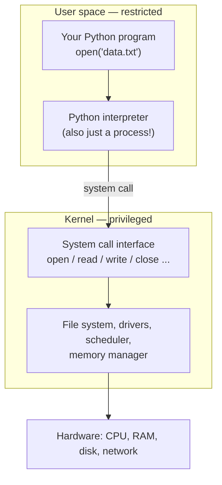

# 23.1 What an operating system does

Right now, your computer is running dozens of programs: a browser with many
tabs, a music player, a chat app, background services you have never heard
of. Yet it may have only a handful of CPU cores, one pool of RAM, and one
disk. Nothing you learned in Chapters 0–22 explains how that is possible —
programs, as we wrote them, assume they own the machine. The piece of
software that makes sharing possible, and safe, is the **operating system**
(OS): Windows, macOS, Linux, Android, iOS. This section is about what it
actually does, because "it runs the computer" is not an answer.

## The landlord and the illusionist

An OS has two jobs, and both are easy to state.

### Job 1: the resource landlord

The machine has a fixed stock of scarce resources — CPU time, RAM, disk
space, the network card, the screen, the keyboard. Programs all want them,
often at the same time. The OS decides who gets what, for how long, and steps
in when someone misbehaves.

Like any good landlord it also keeps tenants out of each other's apartments:
one program cannot read another program's memory, and a crashing game does
not take your half-written essay down with it.

### Job 2: the abstraction factory

Hardware is awkward. A disk is a device that reads and writes fixed-size
blocks of bytes at numbered positions; a screen is a grid of pixels; a
network card moves packets. The OS wraps this awkwardness in friendlier
made-up objects:

- a **file** — a named stream of bytes, with the disk blocks hidden;
- a **window** — a rectangle you can draw in, with the pixel grid managed
  for you;
- and, most importantly for us, a **process** — the illusion that your
  program has a whole computer to itself.

Both jobs come down to the same trick: the OS sits *between* your program
and the hardware, and everything your program thinks it knows about the
machine is a story the OS is telling it.

## Processes: a program, running

A **program** is a file of instructions sitting on disk — passive, doing
nothing. A **process** is that program *in motion*, and it has three parts:

- **the instructions**, loaded from the file into memory;
- **the memory the running code is using** — its variables, its call stack,
  its objects;
- **the OS's bookkeeping** — which instruction runs next, which files are
  open, how much CPU time it has consumed.

One program can give rise to many processes: every extra window of your
terminal, and (in most browsers) every tab, is a separate process running the
same program file.

Python can ask the OS about the process it is running in:

```python
import os
import sys

print("os.name      :", os.name)        # 'posix' or 'nt' (Windows)
print("sys.platform :", sys.platform)   # 'linux', 'darwin', 'win32', ...
print("process id   :", os.getpid())
```

Every process gets a **process id** (PID), a number the OS uses to track it
— the same number you see in Task Manager or Activity Monitor next to each
running app.

Now, the fine print — and it teaches more than the happy path would. If you
pressed ▶ Run on this page, `sys.platform` almost certainly printed
`emscripten`, which is not a kind of computer you can buy.

That is because the Python running on this page is not a normal process on
your machine. It runs *inside your browser tab*, in a **sandbox** — a
deliberately sealed box with no access to your real files, your real devices,
or other processes. The "operating system" it talks to is a small imitation
provided by the sandbox, so the platform name is the sandbox's name and the
PID is whatever the imitation chooses to report.

!!! note "You are watching this section's idea happen live"
    A program cannot see the machine directly. It sees whatever the layer
    beneath it chooses to present.

(Run the same three lines in Python installed on your own computer and you
will see your real platform and a real PID that changes on every run.)

## Sharing one core: time-slicing

Suppose the machine has one CPU core and three processes want to run. The
core, as Chapter 0 showed, can only do one thing at a time.

The OS's **scheduler** solves this by rapid turn-taking:

1. Let one process run for a few milliseconds — a **time slice**.
2. Interrupt it and save its complete state: every register, including which
   instruction was to run next.
3. Restore another process's saved state and hand it the core. Saving one
   state and loading another is a **context switch**, and it happens
   hundreds of times per second.

```mermaid
gantt
    title One core, three processes — each block is one time slice (ms)
    dateFormat X
    axisFormat %L
    section Browser
    runs : 0, 10
    runs : 30, 40
    section Music player
    runs : 10, 20
    runs : 40, 50
    section Your Python
    runs : 20, 30
    runs : 50, 60
```



No process ever sees this happen. When your program is paused, it is not
told; when it resumes, every variable is exactly as it left it. From the
inside, each process experiences a private, slightly slower computer.

Human perception is far too slow to catch the switching, so the music never
stutters and the cursor never freezes — the illusion of simultaneity is
complete. (With four cores, four processes genuinely run at once, and the
scheduler juggles the rest on top of that.)

The scheduler also enforces fairness and priorities. Your video call gets
slices more urgently than a background backup, and a process stuck in an
infinite loop cannot hog the machine — its slice simply expires and its turn
ends.

This is why, in [Chapter 6](../ch06-loops/index.md), an accidental
`while True:` froze *your program* but not *your computer*.

## Threads: sharing the apartment

A process, we said, is an apartment: private memory, sealed walls. Sometimes
one program wants to do several things at once *within* one apartment — a
word processor spell-checking while you type. For that, the OS offers
**threads**: multiple independent streams of execution *inside a single
process*, each with its own call stack, all sharing the same memory.

| | Two **processes** | Two **threads** (one process) |
| --- | --- | --- |
| Memory | Isolated — each has its own | **Shared** — same variables, same heap |
| If one crashes | The other survives | Usually both die |
| Communication | Deliberate and explicit (files, pipes, sockets) | Trivially easy — just read the same variable |
| Cost to create | Heavier | Lighter |

"Trivially easy communication" sounds like a pure win. It is also the danger.
When two threads read and write the same variable, and the scheduler can
pause either one at *any* instruction, the result can depend on the exact
interleaving of their steps — a **race condition**.

The classic disaster is both threads adding 1 to a shared counter. "Add 1" is
not one step; it is three:

1. **read** the current value,
2. **compute** value + 1,
3. **write** the result back,

and the scheduler may switch threads *between* any two of them.

We will not write real threads (and in this sandbox we could not anyway).
Instead, here is a simulation: two pretend threads, each holding its private
scratch value, with a seeded random "scheduler" choosing who performs their
next step. Watch what happens between B's *read* and B's *write*:

```python
import random

random.seed(1)   # deterministic, so everyone sees the same interleaving

counter = 0                       # the shared variable
steps = {"A": ["read", "add 1", "write"],
         "B": ["read", "add 1", "write"]}
scratch = {}                      # each thread's private temporary value

while any(steps.values()):
    ready = [name for name in steps if steps[name]]
    name = random.choice(ready)   # the "scheduler" picks who runs next
    action = steps[name].pop(0)
    if action == "read":
        scratch[name] = counter
    elif action == "add 1":
        scratch[name] += 1
    elif action == "write":
        counter = scratch[name]
    print(f"thread {name} does {action:6}   counter={counter}   scratch={scratch}")

print("final counter:", counter, "  (each thread added 1, so we expected 2)")
```

The final counter is **1**, not 2. Thread B read the counter *before* thread
A wrote its result back, so B's later write simply overwrote A's — one
increment vanished without any error message.

That is what makes race conditions feared. The code looks correct, passes
most test runs (change the seed and the bug may disappear!), and fails
rarely, silently, and unreproducibly.

Real concurrent programming is largely the discipline of *locking* shared
data so that read–modify–write sequences cannot be interleaved — a topic for
a later course, but you now know precisely what the problem is.

!!! note "Python's GIL, in one paragraph"

    CPython has a famous quirk here: the **Global Interpreter Lock** (GIL),
    a single internal lock that allows only one thread at a time to execute
    Python bytecode. Threads in Python are still useful when tasks spend
    their time *waiting* (for the network, for a file), but two Python
    threads cannot crunch numbers on two cores simultaneously — for that,
    Python programs traditionally use multiple *processes* instead. The GIL
    makes whole categories of race condition rarer in Python, though not
    impossible — and recent Python versions are experimenting with removing
    it.

## System calls: the OS's API

Your program runs in **user space**: a restricted mode where it can compute
all it likes with its own memory but cannot touch hardware, other processes,
or files directly. The OS core — the **kernel** — runs in a privileged mode
with full power over the machine.

Whenever your program needs something only the kernel may do, it makes a
**system call**: a formal, checked request across the boundary.



The kernel's menu of system calls *is* the operating system's API — the same
idea as the methods of a class from [Chapter 12](../ch12-classes/index.md),
applied to the whole machine. A few dozen calls do most of the work: `open`,
`read`, `write`, `close` for files, plus calls to create processes, allocate
memory, and send network data.

When you wrote `open("data.txt")` in
[Chapter 11](../ch11-files/02-read-write.md), Python was wrapping the
kernel's `open` system call in a comfortable Python-shaped object. The `os`
module exposes the thin, uncomfortable version — worth seeing once:

```python
import os

# The low-level, close-to-the-kernel way to write and read a file.
fd = os.open("note.txt", os.O_WRONLY | os.O_CREAT)   # ask the OS to open
os.write(fd, b"hello from the low level\n")          # raw bytes only
os.close(fd)

fd = os.open("note.txt", os.O_RDONLY)
data = os.read(fd, 100)
os.close(fd)

print("the OS handed us a file descriptor:", fd)
print("bytes read back:", data)
```

The `fd` is a **file descriptor** — a small integer the kernel uses as a
ticket number for the open file. No strings, no encodings, no line-by-line
reading: those comforts are all built by Python *on top of* `open`, `read`,
`write`, `close`.

(On this page the "kernel" answering is the browser sandbox's in-memory
imitation — the interface is the same, which is rather the point.)

The boundary is also where security lives. Every system call is a checkpoint
where the kernel can say *no*: no, you may not read that file; no, you may
not touch that memory.

!!! note "The one sentence to keep"
    A program can compute anything it likes in user space, but it cannot
    *affect the world* except through system calls — and every one of them
    is inspected.

!!! warning "Common mistakes"

    - **Thinking the OS is the same thing as the user interface.** The
      desktop, dock, and window chrome are ordinary programs. The OS proper
      is the kernel underneath: scheduler, memory manager, file systems,
      drivers.
    - **Thinking "multitasking" means the core does two things at once.**
      One core runs one instruction stream; the scheduler's fast
      turn-taking creates the appearance of simultaneity. Only multiple
      cores give true parallelism.
    - **Confusing programs with processes.** A program is a file; a process
      is one *running instance* of it, with its own memory and PID. Double-
      click twice, get two processes.
    - **Assuming threads are just "faster processes."** The defining
      difference is *shared memory* — which is exactly what makes race
      conditions possible. Isolation is a feature you give up, not just
      overhead you save.

## Check your understanding

1. Your laptop has 4 cores but comfortably runs 60 processes. Explain, using
   the terms *scheduler*, *time slice*, and *context switch*.

    ??? success "Answer"
        The OS scheduler gives each core to one process at a time for a
        short time slice (a few milliseconds). When a slice ends, the OS
        performs a context switch: it saves the running process's complete
        state and restores another's. Rotating 60 processes across 4 cores
        hundreds of times per second makes all of them progress, and the
        switching is far too fast for humans to notice.

2. In the race-condition simulation, the final counter was 1 instead of 2.
   Name the exact moment where the update was lost.

    ??? success "Answer"
        Thread B performed its *read* (getting 0) after thread A had read
        but *before* A wrote back 1. From then on B was working with a
        stale value: B computed 0 + 1 = 1 and its final *write* stored 1,
        overwriting the 1 that A had already written — so A's increment was
        lost. The fix in real code is to make read–add–write one
        uninterruptible (locked) unit.

3. Why does `sys.platform` on this page print `emscripten` instead of the
   name of your actual operating system?

    ??? success "Answer"
        The Python interpreter here runs inside the browser's sandbox, not
        as a normal process on your machine. It cannot see your real OS;
        the sandbox supplies its own small imitation of one, so Python
        reports the sandbox's platform name. It is a live demonstration
        that a program only knows what the layer beneath it chooses to
        reveal.

4. `print(2 + 2)` needs no system call to compute 4, but it still needs one
   before you can see the answer. Which job needs the kernel, and why?

    ??? success "Answer"
        The arithmetic happens in user space, in the process's own memory —
        no kernel needed. But *displaying* the result means writing bytes
        to the terminal (or the page), which is an I/O device the process
        may not touch directly — so `print` ultimately issues a `write`
        system call and the kernel does the touching.
