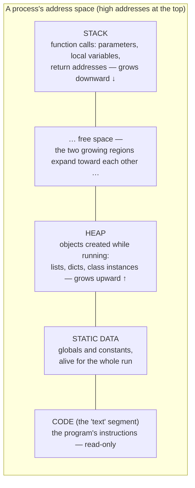

# 23.2 The memory layout of a program

[Section 23.1](01-os-processes.md) said every process gets "its own memory."
This section maps that memory. The map explains things you have already
bumped into: why deep recursion dies with `RecursionError` while a
million-element list is fine, why two variables can point at the *same*
object ([Chapter 9](../ch09-collections/01-references.md)), and what Python
is doing behind your back so that you never have to say "free this memory" —
plus the one way programs manage to leak memory anyway.

## The address space: one process's private map

To a process, memory looks like a single enormous numbered row of bytes —
its **address space** — and the process's contents are laid out in it in a
few conventional regions, called **segments**:



Reading bottom-up:

- **Code** — the machine instructions (for Python: the interpreter's
  instructions, plus your compiled bytecode). Loaded once, marked
  read-only so a bug cannot overwrite the program itself.
- **Static data** — things whose size and lifetime are known for the whole
  run: global constants, string literals baked into the program.
- **Heap** — the open floor where objects are created *while the program
  runs*, in an order and quantity no one can predict in advance. Every
  Python list, string, dict, and object you have ever made lived here.
- **Stack** — the perfectly disciplined region from
  [Chapter 17](../ch17-recursion/01-call-stack.md): one frame per active
  function call, pushed on call, popped on return.

The two dynamic regions grow toward each other through the free space
between them, which is why the classic picture draws them facing off. This
is the same stack-versus-heap distinction you first met in
[Chapter 5](../ch05-under-the-hood/03-stack-heap.md) — now placed on the
full map. And one process's map is invisible to every other process: the OS
gives each one its own address space, which is what "isolated memory" in
the last section physically means.

## The stack grows with calls

Every function call pushes a **frame** — parameters, locals, and where to
resume afterwards — and every return pops one. The stack region is fast and
tidy but deliberately small (a few megabytes is typical), because a healthy
program never nests calls very deep. Recursion is exactly the thing that
can: each recursive call adds a frame without popping any. Python therefore
enforces a hard ceiling long before the OS would have to step in. Let's
measure it — this probe dives until Python says stop, counting frames:

```python
import sys

print("Python's ceiling:", sys.getrecursionlimit(), "frames")

depth = 0
def dive():
    global depth
    depth += 1
    dive()                     # push another frame, forever

try:
    dive()
except RecursionError:
    pass                       # the stack unwinds; all frames are popped

print("frames actually reached:", depth)
```

The reached depth lands just under the ceiling (the interpreter and the
code around `dive()` already occupy a few frames; the exact ceiling also
varies between Python builds — the browser build may choose a different
number than your desktop). When the ceiling is hit, you get the exception
you may have already met by accident:

```python
# raises RecursionError
def countdown(n):
    return countdown(n - 1)    # no base case — every call pushes a frame

countdown(10)
```

`RecursionError: maximum recursion depth exceeded` is a *stack* diagnosis:
too many frames alive at once. It has nothing to do with how much RAM the
machine has — the heap may be nearly empty when it happens.

## The heap grows with objects

The heap has no ceiling of frames — it grows as you create objects, limited
only by available memory. Python will even tell you how big each object is:
`sys.getsizeof(x)` reports the bytes an object occupies (the exact numbers
depend on the Python build — the browser runs a 32-bit build with smaller
pointers than a 64-bit desktop — but the *pattern* is what matters):

```python
import sys

print("int 0          :", sys.getsizeof(0), "bytes")
print("int 2**30      :", sys.getsizeof(2 ** 30), "bytes")
print("int 2**300     :", sys.getsizeof(2 ** 300), "bytes")
print()
print("empty string   :", sys.getsizeof(""), "bytes")
print("'a'            :", sys.getsizeof("a"), "bytes")
print("'a' * 100      :", sys.getsizeof("a" * 100), "bytes")
print()
print("empty list     :", sys.getsizeof([]), "bytes")
print("[0, 1, 2]      :", sys.getsizeof([0, 1, 2]), "bytes")
```

Three observations. Even an empty object costs dozens of bytes — every
Python object carries a header (its type, its reference count) before any
payload. Integers grow as they need more digits: Python's unlimited-size
`int` ([Chapter 5](../ch05-under-the-hood/01-numeric-pitfalls.md)) is
possible precisely because ints live on the heap and can take as many bytes
as required. And a list's reported size counts the list's own structure —
its array of *references* to elements — not the elements themselves.

### The over-allocation staircase

Here is a subtler experiment. Append to a list one element at a time and
watch `getsizeof` — it does **not** creep up by one slot per append:

```python
import sys

lst = []
previous = sys.getsizeof(lst)
print(f"length  0: {previous} bytes")

for n in range(1, 65):
    lst.append(n)
    size = sys.getsizeof(lst)
    if size != previous:                       # only print when it jumps
        print(f"length {len(lst):2}: {size} bytes   (jumped +{size - previous})")
        previous = size
```

The size stays flat for a while, then *jumps*, stays flat, jumps again — a
staircase. When a list runs out of room, Python does not ask the heap for
one more slot; it **over-allocates**, grabbing a block bigger than needed
(roughly proportional to the current length) so that the next many appends
are free. Plotting it makes the staircase unmistakable:

```python
import sys
import matplotlib.pyplot as plt

lengths, sizes = [], []
lst = []
for n in range(65):
    lengths.append(len(lst))
    sizes.append(sys.getsizeof(lst))
    lst.append(n)

plt.step(lengths, sizes, where="post")
plt.xlabel("list length (elements)")
plt.ylabel("sys.getsizeof(list) (bytes)")
plt.title("List over-allocation: capacity grows in jumps")
```

This staircase is the physical mechanism behind a claim from
[Chapter 16](../ch16-complexity/03-complexity-zoo.md): `append` is
**amortized** $O(1)$. Most appends drop into a pre-paid empty slot
(constant time); occasionally one append triggers a copy of everything into
a bigger block ($O(n)$ that one time); averaged over the whole sequence,
the cost per append stays constant. You are looking at the receipt for
that bargain.

### `id()`: where an object lives

Every object has an identity number, `id(x)` — in CPython it is effectively
the object's *address* in the address space. It is the machinery under the
`is` operator from [Chapter 4](../ch04-branching/03-equality-identity.md):

```python
a = [1, 2, 3]
b = a               # second name, same object
c = [1, 2, 3]       # equal contents, different object

print("id(a):", id(a))
print("id(b):", id(b), "  same as a?", id(a) == id(b))
print("id(c):", id(c), "  same as a?", id(a) == id(c))
print("a is b:", a is b, "   a is c:", a is c, "   a == c:", a == c)
```

The actual numbers differ on every run — the heap hands out whatever
addresses are free — but `a` and `b` always share one id (one object, two
names, as in [Chapter 9](../ch09-collections/01-references.md)) while `c`
has its own. Two equal values, two different residents of the heap.

## Who cleans up? Garbage collection

In C, the programmer must explicitly free every heap allocation, and
forgetting is a legendary source of bugs. Python (like Java) instead uses
**garbage collection** (GC): the runtime itself detects objects that can no
longer be reached and reclaims their memory.

CPython's main mechanism is **reference counting**: every object's header
stores how many references currently point at it. Assignment increments the
count; a name going away decrements it; *the instant the count hits zero,
the object is freed*. We can watch, using a `weakref` — a special reference
that lets us peek at an object *without* keeping it alive:

```python
import gc
import weakref

class Node:
    def __init__(self, name):
        self.name = name
        self.partner = None

# Case 1: plain reference counting — death is instant.
a = Node("a")
peek = weakref.ref(a)          # a weak reference does not count!
print("before del:", peek())
del a                          # last real reference gone -> count = 0
print("after  del:", peek())   # None: freed immediately

# Case 2: a reference cycle — counting alone fails.
x = Node("x")
y = Node("y")
x.partner = y                  # x points at y ...
y.partner = x                  # ... and y points back at x
peek_x = weakref.ref(x)
del x, y                       # no *outside* references remain, BUT
print("cycle after del:", peek_x())   # still alive! each holds the other

freed = gc.collect()           # run the cycle detector by hand
print("gc.collect() reclaimed", freed, "objects")
print("cycle after collect:", peek_x())
```

Case 1 shows the elegance: no pauses, no waiting — memory returns the
moment the last reference disappears. Case 2 shows the famous blind spot.
`x` and `y` point at *each other*, so even with no outside references,
each object's count is still 1 — reference counting alone would leak them
forever. For this, CPython runs a second, occasional **cycle collector**
that hunts groups of objects reachable only from each other; `gc.collect()`
invokes it on demand, and you can see it free the pair (the exact reclaimed
count varies by Python version — it counts our two `Node` objects and, on
some versions, their attribute dictionaries too).

!!! info "Java corner"

    The JVM takes the opposite approach: no reference counts at all.
    Periodically, a **tracing** collector starts from the *roots* — stack
    variables, globals — and follows every reference, marking each object
    it can reach; everything unmarked is garbage, cycles included, and is
    swept away. The trade-off is timing: Java objects are not freed at a
    predictable instant, and the collector runs in (nowadays very short)
    pauses. Both designs answer the same question — *"can the program
    still reach this object?"* — by different means, and neither asks the
    programmer to free anything.

## Leaks in a garbage-collected language

If the collector frees everything unreachable, can Python leak memory?
Yes — by *accidental retention*: memory that is reachable, so the collector
must keep it, but that the program will never actually use again. The
collector cannot read your intentions; reachability is all it has. The
classic culprit is a global cache that only ever grows:

```python
import sys

cache = {}                         # global: lives as long as the program

def render_page(request_id):
    html = f"<html>page for request {request_id}</html>" * 20
    cache[request_id] = html       # "save it for next time!"
    return html

# A long-running server handles a stream of *distinct* requests ...
for request_id in range(2000):
    render_page(request_id)

print("cache entries still alive:", len(cache))
print("bytes held by cached pages:",
      sum(sys.getsizeof(page) for page in cache.values()))
```

Every entry is reachable through `cache`, so nothing is ever collected —
yet request 17 will never be asked for again. In a program that runs for
five seconds, nobody notices; in a server that runs for five months, this
is the leak that slowly eats the machine. The fix is a policy: bound the
cache's size and evict old entries (real systems use a
*least-recently-used* cache, such as the standard library's
`functools.lru_cache(maxsize=...)`). The lesson generalizes: in a GC'd
language, a "memory leak" is not memory the runtime lost — it is memory
your design forgot to let go of.

!!! warning "Common mistakes"

    - **Blaming `RecursionError` on RAM.** It is a stack-depth limit — too
      many frames alive at once — not an out-of-memory condition. Buying
      more RAM changes nothing; converting the recursion to a loop
      ([Chapter 17](../ch17-recursion/03-vs-iteration.md)) does.
    - **Expecting `sys.getsizeof(a_list)` to include the elements.** It
      measures only the list structure itself (header + array of
      references). The elements are separate heap objects; summing sizes
      honestly requires walking the whole structure.
    - **Treating `id()` values as meaningful or stable.** They are valid
      only while the object is alive, differ between runs, and may be
      *reused* after an object dies. Use `is` for identity questions, and
      `==` for equality.
    - **Believing garbage collection makes leaks impossible.** Anything
      still reachable — from a global dict, a long-lived list, a default
      argument — is kept, needed or not. Growth without eviction is a leak
      with extra steps.

## Check your understanding

1. A program crashes with `RecursionError`, yet a memory monitor shows it
   was using almost no RAM. Which segment filled up, and why is its limit
   so much smaller than total memory?

    ??? success "Answer"
        The stack. Each unreturned call holds a frame, and the stack region
        (plus Python's own recursion ceiling) is kept deliberately small —
        deep call nesting almost always means a bug like a missing base
        case, so the small limit converts a would-be memory disaster into a
        clean, early exception. The heap, where big data lives, was barely
        touched.

2. Appending one element to a list of length 9 might cost far more than
   appending to a list of length 10,000. Explain how both facts fit the
   claim "append is amortized $O(1)$."

    ??? success "Answer"
        If length 9 is exactly where the list's over-allocated block is
        full, that append triggers a resize: allocate a bigger block and
        copy all elements — $O(n)$ for that single call. The list of
        10,000 probably has spare pre-paid slots, so its append is a
        constant-time drop-in. Amortized analysis averages the rare
        expensive resizes over the many cheap appends between them; the
        average per append is constant.

3. Why does reference counting alone fail on `x.partner = y;
   y.partner = x`, and what does CPython do about it?

    ??? success "Answer"
        After `del x, y`, each object is still pointed at by the other, so
        both reference counts are 1, never 0 — counting sees them as alive
        even though the program can no longer reach them. CPython's
        separate cycle collector periodically searches for such groups
        that are only reachable from within themselves and frees them
        (as `gc.collect()` did in the demo).

4. A web server stores every session object in a module-level dict "so
   lookups are fast" and never removes entries. Is this a memory leak?
   The garbage collector is working perfectly.

    ??? success "Answer"
        Yes — a leak by accidental retention. Every session is reachable
        via the global dict, so the (correctly functioning) collector must
        preserve it forever, including sessions that ended weeks ago.
        The fix is a policy the collector cannot invent: evict entries on
        logout, after a time limit, or with a bounded LRU cache.
