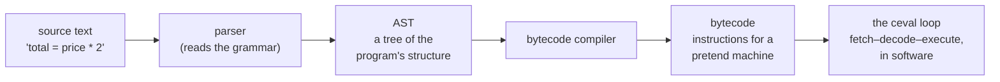
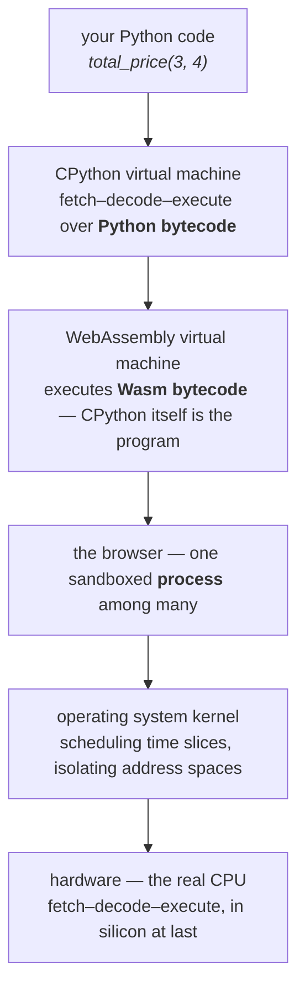

# 23.3 Interpreters and virtual machines

[Chapter 0](../ch00-machine/03-programs.md) told you, honestly but briefly,
that Python "reads your code and carries it out." Twenty-three chapters
later you are owed the real story — and it is better than the summary. In
this section you will watch your own code pass through every stage of the
CPython pipeline, compare it with Java's, discover that "compiled versus
interpreted" is a spectrum rather than a war, and end at a genuinely
vertiginous fact about the page you are reading right now.

## The CPython pipeline: source → AST → bytecode → execution

When you press ▶ Run, the text of your program goes through four stages
inside CPython (the standard Python implementation — the "C" is because it
is written in C):



**Stage 1–2: parsing.** The parser reads your characters and builds an
**abstract syntax tree** (AST) — a data structure capturing what the code
*means* grammatically: this is an assignment; its target is `total`; its
value is a multiplication of a name and a constant. Python will happily
show you the tree for any code you like:

```python
import ast

tree = ast.parse("total = price * 2 + tax")
print(ast.dump(tree, indent=2))
```

Read the output inside-out: a `BinOp` multiplying `price` by `2`, nested as
the left side of a `BinOp` adding `tax`, all wrapped in an `Assign` whose
target is `total`. Notice what has already happened: precedence rules from
[Chapter 2](../ch02-data/03-operators.md) are *resolved* — the tree's shape
says `(price * 2) + tax`, and no parenthesis question can ever arise again.
Syntax errors are simply the parser failing to build this tree, which is
why a `SyntaxError` arrives before a single line runs.

**Stage 3: compiling to bytecode.** Yes — *compiling*. CPython translates
the AST into **bytecode**: compact instructions, not for any physical CPU,
but for an imaginary, simplified processor. Bytecode is literally bytes:

```python
code = compile("total = price * 2 + tax", "<demo>", "exec")

print(type(code))
print("raw bytes :", list(code.co_code)[:16], "...")
print("names used:", code.co_names)
print("constants :", code.co_consts)
```

The exact byte values shift between Python versions, but there it is — your
one line of Python, reduced to a numbered instruction stream plus tables of
the names and constants it mentions. (This explains the `.pyc` files and
`__pycache__` folders Python scatters around real projects: cached
bytecode, saved so unchanged files skip stages 1–3 next time.)

**Stage 4: the ceval loop.** The heart of CPython is one function (in
`ceval.c`) that does, in software, exactly what Chapter 0's processor does
in silicon: **fetch** the next bytecode instruction, **decode** which
operation it is, **execute** it, repeat. For this reason CPython is called
a **virtual machine** (VM) — a machine made of code, with its own
instruction set, running on the real one.

### Reading real bytecode with `dis`

The standard library's `dis` module *disassembles* bytecode into readable
form. Here is a small function and its true contents:

```python
import dis

def total_price(quantity, unit_price):
    subtotal = quantity * unit_price
    return subtotal + 5        # flat shipping fee

dis.dis(total_price)
```

The listing's exact details vary slightly between Python versions (newer
versions fuse some instruction pairs and add hints), but the shape is
always this, and it is worth reading instruction by instruction. The
leftmost numbers are source line numbers; each row is one instruction for
the virtual machine, which keeps a little working stack of values:

- `RESUME` — version-dependent housekeeping as the call starts; ignore it.
- `LOAD_FAST quantity` and `LOAD_FAST unit_price` — push the values of the
  two local variables onto the working stack. "FAST" because locals live
  in numbered slots, found by index rather than by name lookup.
- `BINARY_OP *` — pop two values, multiply them, push the result. The `*`
  you typed has become one instruction.
- `STORE_FAST subtotal` — pop the result into local slot `subtotal`. Line
  one of the function is done.
- `LOAD_FAST subtotal`, then `LOAD_CONST 5` — push the local back, then
  push the constant `5` from the function's constants table.
- `BINARY_OP +`, then `RETURN_VALUE` — pop, add, push; then pop the final
  value and hand it to the caller, destroying this call's frame
  ([Section 23.2](02-memory-layout.md)).

That is your function, the way the machine that runs it actually sees it:
push, operate, pop. Every Python program you have ever written unravels
into sequences like this.

## The JVM: the same idea, industrialized

Java's toolchain makes identical moves, arranged differently. You compile
*explicitly*, ahead of time, with `javac`, producing a `.class` file of
**JVM bytecode** — instructions for Java's virtual machine, the direct
counterpart of CPython's. Java even has its own `dis`: the `javap -c` tool.
Here is the same function in Java, and its real disassembly:

=== "Java source"

    ```java
    int totalPrice(int quantity, int unitPrice) {
        int subtotal = quantity * unitPrice;
        return subtotal + 5;   // flat shipping fee
    }
    ```

=== "JVM bytecode (javap -c)"

    ```text
    int totalPrice(int, int);
      Code:
         0: iload_1        // push local 1 (quantity)
         1: iload_2        // push local 2 (unitPrice)
         2: imul           // pop two, multiply, push
         3: istore_3       // pop into local 3 (subtotal)
         4: iload_3        // push subtotal
         5: iconst_5       // push the constant 5
         6: iadd           // pop two, add, push
         7: ireturn        // pop and return the int
    ```

Squint, and it is the *same program* as the `dis` output: load, load,
multiply, store; load, constant, add, return. Two ecosystems, independently
converging on a stack-shaped pretend machine. (The `i` prefixes mean these
instructions work on `int`s — the JVM's bytecode is typed, just as Java is.)

The JVM adds one spectacular trick: **just-in-time (JIT) compilation**.
While bytecode runs, the JVM watches for *hot* code — a method called
thousands of times, a tight loop — and compiles exactly those parts into
genuine machine code for your actual CPU, on the fly, optimizing them using
facts observed at runtime. This is why long-running Java services are fast:
the program *warms up*, and its hot paths end up running as native code,
often near the speed of C.

## A spectrum, not a war

"Is Python interpreted or compiled?" You can now see the question is badly
posed. Python **compiles** (to bytecode) and then **interprets** (the
bytecode). Java compiles to bytecode, interprets briefly, then compiles
*again* at runtime. The real landscape is a spectrum of strategies:

| Approach | Example | What happens before running | What executes on the real CPU |
| --- | --- | --- | --- |
| Ahead-of-time compilation | C, C++, Rust | Full translation to machine code for one specific CPU + OS | Your program's own machine code |
| Bytecode + JIT | Java (JVM), C# | Compile to portable bytecode; VM compiles hot parts to machine code while running | The VM, then increasingly your JIT-compiled code |
| Bytecode + interpretation | CPython | Compile to bytecode automatically, behind the scenes | The VM's fetch–decode–execute loop |
| Bytecode + JIT, for Python | PyPy | Same source language as CPython, JIT strategy like the JVM | The VM, then JIT-compiled hot loops |

The trade is always the same: the more translation you do ahead of time,
the faster it runs but the more tied to one machine the result is; the more
you interpret, the more portable and flexible everything stays. PyPy's row
is the proof that this is a choice of *strategy*, not a property of the
language: the same Python programs, run with a JIT, are often several times
faster.

Portability is the VM's superpower, and it is why Java's slogan was
**"write once, run anywhere."** A C program compiled for an x86 Windows
machine is meaningless noise to an ARM Mac — machine code names one
specific CPU's instructions. But `.class` files and `.pyc` bytecode target
the *virtual* machine, and the virtual machine is just a program: implement
it once per platform, and every bytecode file ever produced runs on all of
them. The pretend machine is the same everywhere; only the pretender
changes.

## The tower under this page

Now for the punchline the whole handbook has been walking toward. Every
runnable Python block on this site runs on **Pyodide** — the CPython interpreter
(that C program with the ceval loop) *itself compiled* to **WebAssembly**
(Wasm), a portable bytecode that browsers can execute. WebAssembly is — say
it with me — a virtual machine. Which means that when you pressed ▶ Run on
the `dis` example above, the actual arrangement was:



Walk it once, slowly, with everything this chapter gave you. Your function
became Python bytecode, executed by the ceval loop — but the ceval loop is
not machine code here; it is Wasm bytecode, executed (and JIT-compiled, when
hot) by the browser's WebAssembly VM. The browser doing that is an ordinary
process in user space, holding its own stack and heap in its own address
space, allowed to touch nothing except through system calls, running only
in the time slices the scheduler grants — sharing the machine, that whole
time, with your music player. And at the bottom, for the first time since
your keystroke, a physical CPU performs the fetch–decode–execute cycle from
[Chapter 0](../ch00-machine/01-hardware.md) — the cycle every layer above
it has been *imitating in software*.

A virtual machine, inside a virtual machine, inside a sandboxed process,
on a time-sliced kernel, on silicon. Five stories of the same simple loop,
each layer pretending to be a computer for the benefit of the layer above —
and it is turtles most of the way down, until, at the bottom, one real
turtle. That this tower not only works but runs fast enough that you never
suspected it existed is among the great engineering achievements of our
time. You now know every floor of it by name.

!!! warning "Common mistakes"

    - **"Python is interpreted, so it isn't compiled."** CPython always
      compiles your source to bytecode first (that is what `.pyc` files
      and `SyntaxError`-before-anything-runs are telling you). What it
      does not do, by default, is compile to *machine* code.
    - **"Compiled languages are always faster, period."** Strategy, not
      destiny: JIT-compiled Java can rival C on long-running hot paths,
      and PyPy shows Python itself speeds up several-fold under a JIT.
      What is true: CPython's plain interpretation is the slowest of the
      strategies for CPU-heavy loops.
    - **Confusing the two bytecodes.** Python bytecode runs on CPython's
      VM; JVM bytecode runs on the JVM; Wasm runs on the browser's VM.
      "Bytecode" is a category (instructions for a pretend machine), not
      one format — none of the three can run on another's VM.
    - **Thinking `dis` output is fixed forever.** The instruction set is
      an internal detail that changes between Python versions (pairs get
      fused, opcodes renamed). Read the shape, not the exact listing —
      and never write programs that depend on it.

## Check your understanding

1. Put these in the order they happen when you run a Python file, and name
   the stage that catches a `SyntaxError`: bytecode execution, parsing to
   an AST, compiling to bytecode.

    ??? success "Answer"
        Parsing to an AST → compiling to bytecode → bytecode execution in
        the ceval loop. A `SyntaxError` comes from the parsing stage — the
        grammar cannot be built into a tree — which is why it appears
        before any line of the program has executed.

2. In the `dis` output for `subtotal = quantity * unit_price`, why are
   there *two* `LOAD_FAST` instructions before the `BINARY_OP`?

    ??? success "Answer"
        The bytecode machine is a stack machine: `BINARY_OP *` takes no
        named operands — it multiplies whatever two values sit on top of
        the working stack. So both variables' values must be pushed first,
        one `LOAD_FAST` each, and the result is pushed back for
        `STORE_FAST` to pop.

3. Your Java service is slow for the first minute after startup, then
   noticeably fast. Explain using the JVM's execution strategy.

    ??? success "Answer"
        The JVM starts by interpreting bytecode while profiling it. As it
        identifies hot methods and loops, the JIT compiler translates
        those into optimized machine code for the actual CPU, using
        runtime observations. After this warm-up, the hot paths no longer
        go through interpretation at all — hence the speed-up.

4. Pyodide's slogan could be "write once, run anywhere, squared." Using
   the tower diagram, justify the "squared."

    ??? success "Answer"
        Python bytecode already runs anywhere a CPython VM exists — that
        is the first "write once, run anywhere." Pyodide then compiles the
        CPython VM itself to WebAssembly, which runs anywhere a browser's
        Wasm VM exists. Two layers of virtual machine, each solving
        portability once: your code is portable across CPythons, and
        CPython is portable across browsers and operating systems.
