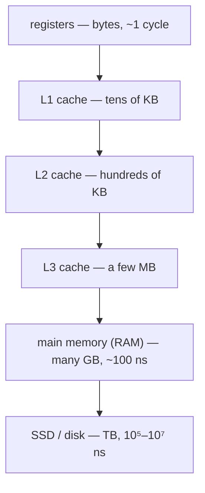

# 23.4 The memory hierarchy and caches

[Section 23.2](02-memory-layout.md) drew a process's address space — one clean
numbered row of bytes with a stack at the top and a heap at the bottom. That
map is a comforting fiction. Underneath it, the hardware is nothing like a
single uniform row: it is a stack of memories, each a different size and a
different speed, with data racing up and down between them so fast you never
notice. This section is the layer *beneath* the address space — the physical
memory hierarchy, the caches that make it fast, and the trick (virtual memory)
that turns the messy hardware back into that clean row. It is the beginner's
tour of one of computing's deepest chapters: Patterson & Hennessy's
*Computer Organization and Design*, Chapter 5.

## Why a hierarchy at all

!!! abstract "In plain words"

    - **What it is.** Real machines stack several kinds of memory — a few
      tiny-and-instant ones on top of ever bigger-and-slower ones — instead
      of using one kind for everything.
    - **Picture it.** Your workspace: a fact in your head (instant), a note
      in your hand, papers on your desk, books on a shelf, boxes in the
      basement archive. Each step holds more but takes longer to reach.
    - **Why it matters.** Fast memory is small and expensive; big memory is
      slow and cheap. You cannot have all three — fast, big, cheap — so
      engineers *layer* them and keep the data you need next near the top.

[Section 0.1](../ch00-machine/01-hardware.md) already sketched this speed
hierarchy. Now we make it quantitative, the way *Computer Organization and
Design* (COD) does. The numbers below are order-of-magnitude — they differ by
machine — but the *shape* is universal, and the shape is the whole point.

The gaps are impossible to feel in nanoseconds (a **nanosecond**, ns, is a
billionth of a second), so we borrow COD's favourite trick: scale time up
until one nanosecond lasts one second, and read the last column as human
errands.

```python
# Access times down the hierarchy, with a "scale it to human time" column:
# pretend one nanosecond lasted one whole second.
def human_time(seconds):
    if seconds < 90:
        return f"{seconds:.1f} seconds" if seconds < 10 else f"{seconds:.0f} seconds"
    minutes = seconds / 60
    if minutes < 90:
        return f"{minutes:.0f} minutes"
    hours = seconds / 3600
    if hours < 36:
        return f"{hours:.0f} hours"
    days = seconds / 86400
    if days < 60:
        return f"{days:.0f} days"
    return f"{days / 30:.0f} months"

levels = [
    ("CPU register",      0.3),
    ("L1 cache",          1),
    ("L2 cache",          4),
    ("L3 cache",          15),
    ("main memory (RAM)", 100),
    ("SSD",               100_000),
    ("hard disk",         10_000_000),
]

print(f"{'level':<20}{'latency (ns)':>16}{'if 1 ns = 1 s':>18}")
print("-" * 54)
for name, ns in levels:
    print(f"{name:<20}{ns:>16,.1f}{human_time(ns):>18}")
```

Read the last column and the hierarchy stops being abstract. If a **register**
access felt like *0.3 seconds*, then reaching **RAM** would take *2 minutes* of
walking, an **SSD** read would eat *most of a day and a night*, and spinning up
a **hard disk** would be a *four-month* expedition. A modern CPU can do
hundreds of register or L1 operations in the time one trip to RAM costs — which
is exactly why the layers between them exist.



Each level down is bigger and cheaper per byte but roughly an order of
magnitude slower. The registers you met in
[Section 0.1](../ch00-machine/01-hardware.md) — the handful of ultra-fast slots
inside the CPU that feed the fetch–decode–execute cycle — sit at the very top.
Everything below them exists to keep those slots supplied without stalling.

## Locality: the reason the trick works

Stacking memories would be useless if programs touched their data at random —
you would miss the small fast levels almost every time. The reason the
hierarchy *works* is that real programs are wonderfully predictable.

!!! abstract "In plain words"

    - **What it is.** Programs tend to reuse the same data soon
      (**temporal locality**) and to use data that sits near data they just
      touched (**spatial locality**).
    - **Picture it.** A book you are reading: you reread the current
      paragraph (temporal) and the next words you need are on the same page,
      not scattered across the library (spatial).
    - **Why it matters.** Both patterns mean the data you want next is
      *probably close to* the data you just used — so keeping a small
      recent-and-nearby working set near the CPU catches most accesses.

Loops reuse the loop variable and counters (temporal); scanning an array
touches element `i`, then `i+1`, then `i+2` (spatial). Hardware bets on both:
memory is moved up the hierarchy not one byte at a time but in **blocks** (also
called **cache lines**, typically 64 bytes), so fetching one byte drags its
neighbours along for free.

We can *see* spatial locality decide performance. The demo below sums the same
numbers two ways: walking a big array in order, versus visiting the exact same
elements in a shuffled order. Same work, same total — only the *access pattern*
differs.

```python
import numpy as np
import time

rng = np.random.default_rng(0)
n = 2_000_000
data = rng.random(n)

in_order = np.arange(n)          # 0, 1, 2, ...  -> neighbours in memory
shuffled = rng.permutation(n)    # same indices, random order -> no locality

start = time.perf_counter()
total_seq = data[in_order].sum()
t_seq = time.perf_counter() - start

start = time.perf_counter()
total_rand = data[shuffled].sum()
t_rand = time.perf_counter() - start

print(f"sequential walk: {t_seq * 1000:6.1f} ms")
print(f"shuffled walk  : {t_rand * 1000:6.1f} ms")
print(f"shuffled is about {t_rand / t_seq:.1f}x slower")
print("same total?", np.isclose(total_seq, total_rand))
```

The two totals match to the last decimal, yet the shuffled walk is reliably
slower — usually somewhere between 1.5× and 4× on this page's runner. The exact
ratio wobbles from run to run (your number will differ), because in Python and
numpy the raw memory effect is *muddied* by interpreter and array-indexing
overhead. Be honest about that: this is a real COD lesson wearing a Python
disguise. In a low-level language like C, where nothing sits between your loop
and the memory system, the same experiment shows the sequential version several
times faster still — the gap is *starker*, not smaller. The point survives the
disguise: **the access pattern, not the amount of work, often decides the
speed.**

## How a cache works

!!! abstract "In plain words"

    - **What it is.** A **cache** is a small, fast copy of the slice of
      memory you are most likely to want next, sitting closer to the CPU
      than the real thing.
    - **Picture it.** The stack of papers on your desk: not your whole
      filing cabinet, just the few documents you are actively using, within
      arm's reach.
    - **Why it matters.** If the data you ask for is already in the cache
      (a **hit**), you get it at desk speed; if not (a **miss**), you pay the
      slow trip to the cabinet — so the fraction of hits governs real speed.

When the CPU needs an address, it checks the cache first. A **hit** means the
block is there — answered fast. A **miss** means it is not — the block is
fetched from the next level down (paying the **miss penalty**) and copied in,
evicting some older block to make room. The **hit rate** is the fraction of
accesses that hit; the **miss rate** is `1 − hit rate`.

### Average memory access time

How much do misses really cost? COD packs the answer into one formula, the
**average memory access time** (AMAT):

$$\text{AMAT} = t_{\text{hit}} + \text{miss rate} \times \text{miss penalty}$$

Read aloud: *every access pays the fast hit time; the unlucky fraction that
miss pay the big penalty on top.* Here `t_hit` is the time to check the cache
and get a hit, `miss rate` is the fraction that miss, and `miss penalty` is the
extra time a miss costs to fetch from the slower level.

The formula hides a brutal surprise — a *few* percent of misses dominate the
average, because the penalty is so large:

```python
def amat(t_hit, miss_rate, miss_penalty):
    return t_hit + miss_rate * miss_penalty

t_hit = 1        # 1 cycle to serve a hit
penalty = 100    # 100 cycles to fetch from RAM on a miss

for hit_rate in (1.00, 0.99, 0.95, 0.90):
    a = amat(t_hit, 1 - hit_rate, penalty)
    print(f"hit rate {hit_rate:5.0%}  ->  AMAT = {a:5.2f} cycles")

fast = amat(t_hit, 0.01, penalty)   # 99% hits
slow = amat(t_hit, 0.05, penalty)   # 95% hits
print(f"\ngoing from 95% to 99% hit rate speeds memory up {slow / fast:.1f}x")
```

At a 1-cycle hit and a 100-cycle penalty, a **95%** hit rate gives an AMAT of
**6.0 cycles**; nudging it to **99%** gives **2.0 cycles**. Four percentage
points of hit rate made memory **3× faster**. This is the punchline of the
whole chapter: with a big miss penalty, the last few percent of hit rate matter
enormously — which is why caches are engineered so obsessively.

### A tiny cache simulator

Let's build a cache and watch locality turn into hits. A cache is organised
into **sets**; an address is split so that its block number picks a set (the
**index**) and the rest identifies the block (the **tag**). A **direct-mapped**
cache has one slot per set; a **set-associative** cache has several slots per
set and evicts the **least-recently-used** (LRU) one when full. The simulator
below is all three at once — `ways=1` is direct-mapped.

```python
class Cache:
    def __init__(self, num_sets, ways, block_size):
        self.num_sets = num_sets
        self.ways = ways
        self.block_size = block_size
        self.sets = [[] for _ in range(num_sets)]   # each set: tags, LRU first
        self.hits = 0
        self.misses = 0

    def access(self, addr):
        block = addr // self.block_size     # which block of memory
        index = block % self.num_sets       # which set it maps to
        tag = block // self.num_sets        # what identifies it within the set
        line = self.sets[index]
        if tag in line:                     # HIT
            self.hits += 1
            line.remove(tag)                # move to most-recently-used
            line.append(tag)
        else:                               # MISS
            self.misses += 1
            if len(line) >= self.ways:
                line.pop(0)                 # evict least-recently-used
            line.append(tag)

    @property
    def hit_rate(self):
        total = self.hits + self.misses
        return self.hits / total if total else 0.0

BLOCK = 16   # 16-byte cache lines

# A sequential sweep: rich in spatial locality.
seq_cache = Cache(num_sets=64, ways=1, block_size=BLOCK)
for addr in range(20_000):
    seq_cache.access(addr)
print(f"sequential stream : hit rate {seq_cache.hit_rate:6.2%}")

# A random stream over a large range: no locality at all.
import random
random.seed(0)
rand_cache = Cache(num_sets=64, ways=1, block_size=BLOCK)
for _ in range(20_000):
    rand_cache.access(random.randrange(0, 1_000_000))
print(f"random stream     : hit rate {rand_cache.hit_rate:6.2%}")
```

The sequential stream hits **93.75%** of the time — and that number is not
luck, it is `(BLOCK − 1) / BLOCK = 15/16`. Every 16-byte block costs one miss
to load, after which the next 15 byte-addresses in it are hits: spatial
locality, made of cache lines, made visible. The random stream, ranging over a
million addresses with a cache that holds only a thousand, hits essentially
**never** (about 0.1%) — almost every access is a block it has not seen. Same
cache, same size; only the *pattern* changed.

Associativity earns its keep on patterns that make a direct-mapped cache
thrash. Here two blocks map to the *same* set and are accessed alternately:

```python
# continues
addr_a = 0
addr_b = 64 * BLOCK              # different block, but same set index as addr_a

direct = Cache(num_sets=64, ways=1, block_size=BLOCK)
assoc  = Cache(num_sets=64, ways=2, block_size=BLOCK)
for _ in range(1000):
    direct.access(addr_a); direct.access(addr_b)   # ping-pong
    assoc.access(addr_a);  assoc.access(addr_b)

print(f"ping-pong, direct-mapped : hit rate {direct.hit_rate:6.2%}")
print(f"ping-pong, 2-way LRU     : hit rate {assoc.hit_rate:6.2%}")
```

The direct-mapped cache hits **0%** — each access evicts the very block the
next access wants. A **2-way** cache holds both blocks in the set at once, so
after two cold misses it hits **99.9%** of the time. Both blocks are tiny and
reused constantly (temporal locality); the direct-mapped cache simply had
nowhere to keep them side by side.

## Virtual memory: another level of the hierarchy

We have climbed from registers down to disk. One layer remains — and it is the
one that connects back to the clean address space of
[Section 23.2](02-memory-layout.md).

!!! abstract "In plain words"

    - **What it is.** **Virtual memory** gives each process its own private,
      full-sized address space, and the hardware+OS translate its
      **virtual addresses** into real **physical addresses** in RAM, one
      **page** (a fixed block, typically 4 KB) at a time.
    - **Picture it.** Everyone in an office uses "Room 1, Room 2, Room 3…"
      for their own floor plan; a receptionist's map turns each person's
      "Room 2" into a different real room in the building. No two tenants
      collide, and the building can be bigger than any one floor plan.
    - **Why it matters.** It **isolates** processes (yours cannot name
      another's memory) and lets a program use **more memory than physically
      exists** — cold pages sit on disk until needed.

Here is COD's unifying idea, the sentence to remember: **virtual memory is just
another level of the memory hierarchy — a cache for the disk.** RAM caches the
disk exactly as an L1 cache caches RAM. The vocabulary even rhymes: a block is
a **page**, a miss is a **page fault**, and the fetched block comes from disk
instead of from the next cache.

The map from virtual pages to physical frames is the **page table**. Because
walking it on every access would be slow, the CPU keeps a small hardware cache
of recent translations — the **TLB** (translation lookaside buffer), a cache of
the *map* itself. A virtual address splits cleanly: the low bits are the
**offset** within a page, the high bits are the **page number** to translate.

```python
PAGE_SIZE = 4096          # 4 KB pages, so the low 12 bits are the offset
OFFSET_BITS = 12

# page table: virtual page -> physical frame, or None if the page is on disk
page_table = {0: 5, 1: None, 2: 9, 3: 12}
tlb = {}                  # a cache of recent translations
next_free_frame = 13

def translate(va):
    global next_free_frame
    page = va >> OFFSET_BITS                 # high bits: which page
    offset = va & (PAGE_SIZE - 1)            # low bits: where inside the page
    if page in tlb:                          # fastest: TLB hit
        frame, source = tlb[page], "TLB hit"
    else:
        frame = page_table.get(page)
        if frame is None:                    # a PAGE FAULT
            frame = next_free_frame          # OS finds a free frame ...
            next_free_frame += 1
            page_table[page] = frame         # ... loads the page from disk ...
            source = "PAGE FAULT -> load from disk"
        else:
            source = "page-table hit"
        tlb[page] = frame                    # remember it for next time
    physical = frame * PAGE_SIZE + offset
    return page, offset, frame, physical, source

for va in (0x2005, 0x1234, 0x1300):
    page, offset, frame, physical, source = translate(va)
    print(f"VA {va:#06x} -> page {page}, offset {offset:#05x} "
          f"| frame {frame} -> PA {physical:#07x}   [{source}]")
```

Follow the three lines:

- `VA 0x2005` splits into **page 2, offset 5**. Page 2 lives in physical frame
  9, so the physical address is `9 × 4096 + 5 = 0x09005` — a plain
  **page-table hit**, a translation and nothing more.
- `VA 0x1234` is **page 1**, which the table marked `None`: it is on disk. That
  is a **page fault** — the OS grabs a free frame, loads the page, records the
  mapping, and retries. Slow, but invisible to the program, which just sees its
  data.
- `VA 0x1300` is **page 1 again**. This time the translation is already in the
  **TLB**, so it skips the page table entirely — the same locality that helps
  caches helps address translation.

That is the entire idea, in miniature. A real OS adds permission bits,
multi-level page tables, and eviction policies, but the mechanism is exactly
this: split, look up, translate — or fault and fetch. This is a *model*, not an
operating system; but every real machine does what these twenty lines do,
billions of times a second.

## Putting it in the tower

Step back and the chapter closes on itself. The tidy address space of
[Section 23.2](02-memory-layout.md) — the one with `id()` addresses and a stack
facing a heap — is **virtual**. Beneath it, the hardware is doing something
frantic and invisible: translating every address through the TLB and page
table, and racing blocks of data up a hierarchy of caches so the registers
never starve while the fetch–decode–execute loop from
[Section 0.1](../ch00-machine/01-hardware.md) runs flat out. The clean row you
program against is a story the caches and the page table tell you so
convincingly that, until this section, you never suspected it was a story.

To go deeper — set-associativity in full, write policies, multi-level page
tables, the arithmetic of cache design — the canonical treatment is Patterson &
Hennessy, *Computer Organization and Design*, Chapter 5, "Large and Fast:
Exploiting Memory Hierarchy." This section is its beginner's on-ramp.

!!! warning "Common mistakes"

    - **Thinking a cache is something you allocate or manage.** The CPU
      caches (L1/L2/L3) are automatic hardware — you never `malloc` them or
      address them directly. You *influence* them only indirectly, by giving
      your code good locality. (A `functools.lru_cache` in your program is a
      *software* cache — same idea, different level.)
    - **Assuming a bigger cache is what makes code fast.** Past a point,
      **hit rate** — driven by your access *pattern* — decides speed far more
      than raw size. A cache-friendly loop on a small cache routinely beats a
      cache-hostile loop on a big one; see the shuffled-walk demo.
    - **Confusing virtual and physical addresses.** The number from `id()` or
      a pointer is a *virtual* address, private to your process. Two
      processes can hold the same virtual address pointing at completely
      different physical memory — that is the isolation, not a bug.
    - **Believing a page fault is an error.** A page fault is the *normal*
      mechanism for loading a page on demand; it is only a problem when it
      happens so often the machine spends all its time paging (*thrashing*).

## Check your understanding

1. A cache has a 2-cycle hit time and a 150-cycle miss penalty. Compute the
   AMAT at a 90% hit rate and at a 98% hit rate. Which change to the hit rate
   bought more speed per percentage point?

    ??? success "Answer"
        AMAT = t_hit + miss_rate × miss_penalty.
        At 90%: $2 + 0.10 \times 150 = 17$ cycles.
        At 98%: $2 + 0.02 \times 150 = 5$ cycles.

        ```python
        def amat(t_hit, miss_rate, penalty):
            return t_hit + miss_rate * penalty
        print("90%:", amat(2, 0.10, 150), "cycles")
        print("98%:", amat(2, 0.02, 150), "cycles")
        ```

        Eight points of hit rate cut the average from 17 to 5 cycles — a 3.4×
        speed-up. Because the miss penalty is large, each percentage point of
        hit rate near the top is worth a great deal; the last few percent
        dominate.

2. You run the cache simulator on a sequential stream and again on a shuffled
   stream of the *same* addresses. Predict which has the higher hit rate and
   why, before you run it.

    ??? success "Answer"
        The sequential stream wins. Because memory moves in blocks (cache
        lines), a sequential walk pays one miss per block and then hits every
        remaining byte in that block — spatial locality. Shuffling destroys
        that: consecutive accesses land in different, mostly-unseen blocks, so
        almost every access misses. Same addresses, same amount of work — only
        the *order* changed, and order is what the cache rewards.

3. With 4 KB pages (offset = low 12 bits), translate the virtual address
   `0x3ABC` given the page-table entry "virtual page 3 → physical frame 7."
   What are the page number, offset, and physical address?

    ??? success "Answer"
        Split off the low 12 bits for the offset and shift the rest for the
        page number.

        ```python
        PAGE_SIZE = 4096
        va = 0x3ABC
        page = va >> 12            # 3
        offset = va & (PAGE_SIZE - 1)   # 0xABC = 2748
        frame = 7                  # from the page table
        pa = frame * PAGE_SIZE + offset
        print(f"page {page}, offset {offset:#05x}, PA {pa:#07x} = {pa}")
        ```

        Page 3, offset `0xABC` (2748), physical address
        `7 × 4096 + 2748 = 0x7ABC` (31420). Notice the offset is unchanged by
        translation — only the page-number part of the address is remapped.

4. Two different processes both read from virtual address `0x1000` and get
   different data. Nothing is broken. Explain.

    ??? success "Answer"
        Virtual addresses are private per process. Each process has its own
        page table, so process A's virtual page containing `0x1000` maps to
        one physical frame while process B's maps to a *different* frame. The
        identical virtual address names different physical memory in each —
        which is exactly how virtual memory isolates processes from one
        another. (This is also why an `id()` value from one program means
        nothing in another.)
