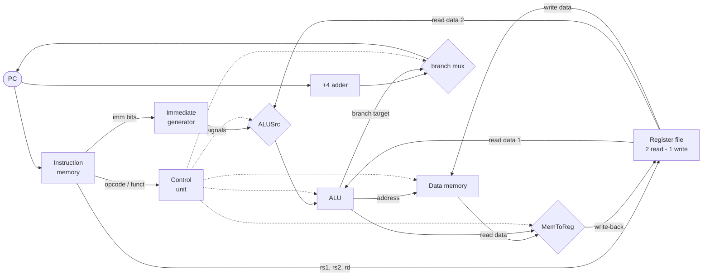

# 23.5.4 · The datapath and control

Back in [0.4](../ch00-machine/04-machine-instructions.md) you built a working
CPU, and its heart was a Python function called `execute()` — a big `if/elif`
chain that read an instruction and *did* what it said. That function was a
convenient lie. Real hardware has no `if/elif`; it has wires, adders, memories,
and multiplexers, all switched on every clock tick. This section opens
`execute()` up and shows the machinery underneath: the **datapath** (the units
that hold and move data) and the **control** (the logic that steers them). We
build the classic single-cycle RISC-V datapath from COD Chapter 4 (the note at
the end of this section says where to read more), then run it — one real
instruction at a time — in your browser.

## From "execute" to actual hardware

!!! abstract "In plain words"

    - **What it is.** The **datapath** is the fixed set of hardware blocks a
      CPU uses to carry out any instruction — registers, an adder or two, an
      ALU, two memories — wired together with switches called **multiplexers**.
    - **Picture it.** A model-railway yard. The tracks (wires), stations
      (registers, memories), and the one big engine (the ALU) never move. What
      changes per instruction is only how the **switches** (muxes) are thrown,
      routing the data cars along a different path.
    - **Why it matters.** The CPU does not "interpret" your instruction the way
      `execute()` did. The same blocks are always present and always powered;
      an instruction is just a *setting of the switches*. Seeing that turns the
      diagram into a machine.

The single-cycle datapath is a handful of units, each doing one dumb job. Here
is the whole cast — every wire on the diagram below plugs two of these
together:

- **Program counter (PC)** — a register holding the address of the current
  instruction. Nothing more than a box that remembers a number.
- **Instruction memory** — give it the PC, it hands back the 32-bit
  instruction stored there. (In [0.4](../ch00-machine/04-machine-instructions.md)
  this was the `program` list; the index was the PC.)
- **`+4` adder** — computes `PC + 4`, the address of the *next* instruction in
  a straight line. (RISC-V instructions are 4 bytes wide.)
- **Register file** — the CPU's 32 fast registers, with **two read ports** (it
  can read `rs1` and `rs2` at the same time) and **one write port** (it can
  write `rd`, but only when the `RegWrite` signal says so). Register `x0` is
  wired to zero and can never be written.
- **Immediate generator** — pulls the constant out of the instruction's bits
  and sign-extends it to a full word (the `imm << 20 ...` unpacking you did by
  hand in [0.4](../ch00-machine/04-machine-instructions.md), now a circuit).
- **ALU** — the arithmetic/logic unit: adds, subtracts, compares. It also
  raises a **Zero** flag when its result is 0, which is how a branch decides.
- **Data memory** — the big, slow RAM. Only `lw` reads it and only `sw` writes
  it; every other instruction leaves it alone.
- **Multiplexers (muxes)** — the switches. Each takes two inputs and a control
  bit and passes one through. The three that matter: **ALUSrc** (feed the ALU
  a register or an immediate?), **MemToReg** (write back the ALU result or a
  value from memory?), and the **branch mux** (set the next PC to `PC+4` or to
  a branch target?).



Solid lines carry **data**; the dotted lines from the control unit carry
**signals** — one-bit switches, not values. Before we wire it all up, meet the
units on their own. Each is a few lines of Python that behaves exactly like the
box on the diagram:

```python
import numpy as np

# A register file: two read ports, one write port, x0 wired to zero.
x = np.zeros(32, dtype=np.int64)
x[1], x[2] = 10, 5                    # pretend earlier instructions left these
read1, read2 = int(x[1]), int(x[2])   # read ports 1 and 2, both at once
print("read ports return:", read1, read2)

def alu(op, a, b):                    # the ALU: one op, plus a Zero flag
    r = a + b if op == "add" else a - b
    return int(r), int(r == 0)

print("ALU add 10,5 ->", alu("add", read1, read2))   # (15, 0)
print("ALU sub 5,5  ->", alu("sub", 5, 5))           # (0, 1)  Zero flag set

x[3] = read1 + read2                  # write port stores 15 into x3
print("after write, x3 =", int(x[3]))
```

The ALU's `sub` of two equal numbers returns `(0, 1)`: result 0, **Zero flag
set**. Hold that thought — it is the entire mechanism behind `beq`.

## The five steps every instruction takes

!!! abstract "In plain words"

    - **What it is.** Every RISC-V instruction, however different, flows through
      the *same* five stages of the datapath in the *same* order.
    - **Picture it.** An assembly line with five stations. A car body visits
      every station; some stations just wave certain cars through untouched (a
      `beq` idles at the memory station; an `add` idles at write-back only if
      told not to write).
    - **Why it matters.** Fixing one order for all instructions is what makes
      the hardware buildable — and, in the [next section](05-pipelining.md), it
      is exactly what lets five instructions share the line at once.

The five steps, and which datapath unit does the work:

1. **Fetch** — read the instruction at the PC. *Units:* PC, instruction
   memory, and the `+4` adder (which pre-computes the fall-through address).
2. **Decode / read registers** — split the instruction into fields and read
   its source registers. *Units:* control unit (from opcode/funct), register
   file (both read ports), immediate generator.
3. **Execute** — do the arithmetic. For `add`/`addi` it computes the result;
   for `lw`/`sw` it computes a memory **address**; for `beq` it **subtracts**
   to test equality. *Units:* the ALUSrc mux, then the ALU.
4. **Memory access** — `lw` reads data memory, `sw` writes it; everyone else
   sits this one out. *Unit:* data memory.
5. **Write-back** — put a result into `rd`, if `RegWrite` is on. The MemToReg
   mux chooses whether that result is the ALU output or the loaded word. In
   parallel, the branch mux sets the next PC. *Units:* MemToReg mux, register
   file write port, branch mux.

| Step | Stage name | Datapath units used |
| --- | --- | --- |
| 1 | Fetch | PC, instruction memory, `+4` adder |
| 2 | Decode / read registers | control unit, register file (2 read ports), immediate gen |
| 3 | Execute | ALUSrc mux, ALU |
| 4 | Memory access | data memory (only `lw` / `sw`) |
| 5 | Write-back | MemToReg mux, register file (write port), branch mux |

## Control: the signaller that routes the data

!!! abstract "In plain words"

    - **What it is.** The **control unit** reads the instruction's opcode and
      `funct` fields and sets every switch on the datapath so the data flows
      the right way for *this* instruction.
    - **Picture it.** A railway signaller in a tower. The trains (data) and
      tracks (wires) are fixed; the signaller just throws the right levers so
      each train reaches its platform. Wrong lever, wrong destination.
    - **Why it matters.** This is where `execute()`'s `if/elif` actually went.
      The hardware does not branch on the opcode with code — it *decodes* the
      opcode into a handful of switch settings, once, in a small lookup table.

Each instruction is fully described by six one-bit signals plus which operation
the ALU should do. The table below is the whole control unit for our five
instructions — read a row as "for this opcode, throw these levers":

| Instruction | RegWrite | ALUSrc | MemRead | MemWrite | Branch | MemToReg | ALU op |
| --- | --- | --- | --- | --- | --- | --- | --- |
| `add`  | 1 | 0 (reg) | 0 | 0 | 0 | 0 (ALU) | add |
| `addi` | 1 | 1 (imm) | 0 | 0 | 0 | 0 (ALU) | add |
| `lw`   | 1 | 1 (imm) | 1 | 0 | 0 | 1 (mem) | add |
| `sw`   | 0 | 1 (imm) | 0 | 1 | 0 | – | add |
| `beq`  | 0 | 0 (reg) | 0 | 0 | 1 | – | sub |

- **RegWrite** — does this instruction write a register? (`sw` and `beq` do
  not, so they leave `rd` untouched.)
- **ALUSrc** — feed the ALU the second register (`0`) or the immediate (`1`)?
  `add`/`beq` compare two registers; `addi`/`lw`/`sw` need the constant.
- **MemRead / MemWrite** — only `lw` reads memory, only `sw` writes it.
- **Branch** — set only for `beq`; combined with the ALU's Zero flag, it
  decides whether the branch is *taken*.
- **MemToReg** — write back the ALU result (`0`) or the value just loaded from
  memory (`1`, only `lw`).

Here is that control unit as a lookup function — the same table, in code:

```python
def control(op):
    table = {
        "add":  dict(RegWrite=1, ALUSrc=0, MemRead=0, MemWrite=0, Branch=0, MemToReg=0, ALUOp="add"),
        "addi": dict(RegWrite=1, ALUSrc=1, MemRead=0, MemWrite=0, Branch=0, MemToReg=0, ALUOp="add"),
        "lw":   dict(RegWrite=1, ALUSrc=1, MemRead=1, MemWrite=0, Branch=0, MemToReg=1, ALUOp="add"),
        "sw":   dict(RegWrite=0, ALUSrc=1, MemRead=0, MemWrite=1, Branch=0, MemToReg=0, ALUOp="add"),
        "beq":  dict(RegWrite=0, ALUSrc=0, MemRead=0, MemWrite=0, Branch=1, MemToReg=0, ALUOp="sub"),
    }
    return table[op]

sigs = ["RegWrite", "ALUSrc", "MemRead", "MemWrite", "Branch", "MemToReg", "ALUOp"]
print(f"{'op':<5} " + " ".join(f"{s:>8}" for s in sigs))
for op in ["add", "addi", "lw", "sw", "beq"]:
    c = control(op)
    print(f"{op:<5} " + " ".join(f"{str(c[s]):>8}" for s in sigs))
```

Notice there is no arithmetic here at all — the control unit is *pure routing*.
The ALU does the adding; control just decides where the numbers come from and
where the answer goes.

## Build it: a single-cycle datapath you can run

!!! abstract "In plain words"

    - **What it is.** The whole datapath as one runnable model — real units,
      real control signals, and a `run_one` that walks the five steps and
      reports the value on every major wire.
    - **Picture it.** The [0.4](../ch00-machine/04-machine-instructions.md)
      mini-CPU with its lid off: instead of one `execute()` line per
      instruction, you watch the register file, ALU, and memory each take their
      turn, switched by the control signals.
    - **Why it matters.** Once you can trace one instruction through labelled
      wires, the datapath diagram stops being a picture and becomes a thing
      that *ran on your machine just now*.

The model below is the diagram, made of parts: a `RegisterFile` object with two
read ports and a gated write port, an `alu` function, a `DataMemory`, the
`control` table, and a `run_one(instr, pc)` that performs the five steps using
those signals. It runs a tiny program — an `addi`, an `add`, a `sw`/`lw` pair,
and a **taken** `beq` — and prints, per instruction, the control signals and
the value on each major wire.

```python
import numpy as np

# ---- the datapath units, each a small object or function -------------------
class RegisterFile:
    """32 registers, two read ports and one write port (x0 is hard-wired 0)."""
    def __init__(self):
        self.x = np.zeros(32, dtype=np.int64)
    def read(self, a, b):                       # two read ports at once
        return int(self.x[a]), int(self.x[b])
    def write(self, reg_write, rd, value):      # one write port, gated by RegWrite
        if reg_write and rd != 0:               # never overwrite x0
            self.x[rd] = value

def alu(op, a, b):                              # the ALU: add / sub, plus a Zero flag
    result = a + b if op == "add" else a - b
    return int(result), int(result == 0)

class DataMemory:
    """Word-addressed RAM, touched only by lw (read) and sw (write)."""
    def __init__(self):
        self.cells = {}
    def access(self, mem_read, mem_write, address, write_data):
        if mem_write:
            self.cells[address] = write_data
        return int(self.cells.get(address, 0)) if mem_read else 0

def control(op):
    table = {
        "add":  dict(RegWrite=1, ALUSrc=0, MemRead=0, MemWrite=0, Branch=0, MemToReg=0, ALUOp="add"),
        "addi": dict(RegWrite=1, ALUSrc=1, MemRead=0, MemWrite=0, Branch=0, MemToReg=0, ALUOp="add"),
        "lw":   dict(RegWrite=1, ALUSrc=1, MemRead=1, MemWrite=0, Branch=0, MemToReg=1, ALUOp="add"),
        "sw":   dict(RegWrite=0, ALUSrc=1, MemRead=0, MemWrite=1, Branch=0, MemToReg=0, ALUOp="add"),
        "beq":  dict(RegWrite=0, ALUSrc=0, MemRead=0, MemWrite=0, Branch=1, MemToReg=0, ALUOp="sub"),
    }
    return table[op]

# ---- one shared machine, then a run_one that walks the five steps ----------
regs = RegisterFile()
dmem = DataMemory()
regs.x[2] = 5        # preload x2 = 5
regs.x[5] = 100      # preload x5 = 100  (a base address)

def run_one(instr, pc):
    c = control(instr["op"])
    # STEP 1 - FETCH: instruction is at pc; the +4 adder makes the fall-through PC
    pc_plus_4 = pc + 4
    # STEP 2 - DECODE / READ REGISTERS: two read ports + the immediate generator
    read1, read2 = regs.read(instr["rs1"], instr["rs2"])
    imm = instr["imm"]
    # STEP 3 - EXECUTE: the ALUSrc mux picks immediate or read-data-2, then ALU
    alu_b = imm if c["ALUSrc"] else read2
    alu_out, zero = alu(c["ALUOp"], read1, alu_b)
    branch_target = pc + imm                     # a second adder computes the target
    # STEP 4 - MEMORY: only lw/sw touch data memory
    mem_data = dmem.access(c["MemRead"], c["MemWrite"], alu_out, read2)
    # STEP 5 - WRITE-BACK: the MemToReg mux picks memory or ALU; next-PC mux picks branch
    wb = mem_data if c["MemToReg"] else alu_out
    regs.write(c["RegWrite"], instr["rd"], wb)
    take = c["Branch"] and zero
    next_pc = branch_target if take else pc_plus_4
    wires = dict(read1=read1, read2=read2, imm=imm, alu_b=alu_b, alu_out=alu_out,
                 zero=zero, mem_data=mem_data, wb=wb, take=int(take), next_pc=next_pc)
    return c, wires

# ---- a tiny program in instruction memory, keyed by byte address -----------
imem = {
    0:  dict(op="addi", rd=1, rs1=0, rs2=0, imm=10, asm="addi x1, x0, 10"),
    4:  dict(op="add",  rd=3, rs1=1, rs2=2, imm=0,  asm="add  x3, x1, x2"),
    8:  dict(op="sw",   rd=0, rs1=5, rs2=3, imm=0,  asm="sw   x3, 0(x5)"),
    12: dict(op="lw",   rd=4, rs1=5, rs2=0, imm=0,  asm="lw   x4, 0(x5)"),
    16: dict(op="beq",  rd=0, rs1=3, rs2=4, imm=8,  asm="beq  x3, x4, +8"),
    20: dict(op="addi", rd=1, rs1=0, rs2=0, imm=999, asm="addi x1, x0, 999"),
}

SIGS = ["RegWrite", "ALUSrc", "MemRead", "MemWrite", "Branch", "MemToReg"]
pc = 0
while pc in imem:                    # the PC drives fetch, exactly like the hardware
    instr = imem[pc]
    c, w = run_one(instr, pc)
    print(f"PC={pc:>2}  {instr['asm']}")
    print("   control: " + "  ".join(f"{s}={c[s]}" for s in SIGS) + f"  ALUOp={c['ALUOp']}")
    print(f"   wires  : read1={w['read1']} read2={w['read2']} imm={w['imm']} "
          f"ALU_B={w['alu_b']} ALU_out={w['alu_out']} zero={w['zero']} "
          f"mem={w['mem_data']} writeback={w['wb']} -> next_pc={w['next_pc']}")
    pc = w["next_pc"]

print()
print("final registers: x1 =", int(regs.x[1]), " x3 =", int(regs.x[3]), " x4 =", int(regs.x[4]))
print("data memory[100] =", dmem.cells.get(100))
```

Read the trace against the five steps and the diagram:

- **`addi x1, x0, 10`** — `ALUSrc=1` throws the mux to the immediate, so
  `ALU_B=10`; the ALU adds `0 + 10`; `MemToReg=0` writes the ALU result back, so
  `x1` becomes `10`.
- **`add x3, x1, x2`** — `ALUSrc=0` this time, so `ALU_B=5` (the value of `x2`
  on read port 2); `10 + 5` writes back `15` into `x3`.
- **`sw x3, 0(x5)`** — the ALU computes the *address* `x5 + 0 = 100`;
  `MemWrite=1` stores read-data-2 (`x3`'s `15`) there; `RegWrite=0`, so no
  register changes.
- **`lw x4, 0(x5)`** — same address `100`, but now `MemRead=1` and
  `MemToReg=1`: the `15` comes back on `mem=15` and is written into `x4`.
- **`beq x3, x4, +8`** — `ALUOp=sub`, and since `x3 == x4` the ALU output is
  `0` and **`zero=1`**. `Branch=1 AND zero=1` throws the branch mux, so
  `next_pc=24` — the branch is **taken**, jumping *past* the `addi x1, x0, 999`
  at address 20. That is why the final `x1` is still `10`, not `999`: the branch
  skipped the instruction that would have clobbered it.

The last lines confirm the whole run: `x3 = 15`, `x4 = 15`,
`data memory[100] = 15`. You just executed a labelled datapath, wire by wire —
the same picture COD draws, only running.

## Single-cycle's flaw (why we will not stop here)

!!! abstract "In plain words"

    - **What it is.** In a single-cycle machine, *every* instruction takes one
      clock tick — and that tick must be long enough for the **slowest**
      instruction, `lw`, which walks all five stages.
    - **Picture it.** A cafeteria with one queue where everyone waits the time
      the most complicated order takes. The person buying a single apple still
      waits behind the full-tray timing.
    - **Why it matters.** Fast instructions are forced to idle for the slow
      one's benefit. That waste is the entire motivation for the
      [next section](05-pipelining.md).

Every unit has a delay. An instruction's clock must cover its *critical path* —
the sum of the units it passes through. But a single-cycle CPU uses **one clock
period for all instructions**, so it must be set to the worst case. Here is that
argument in numbers (illustrative COD-style component delays, in picoseconds):

```python
# Illustrative component delays in picoseconds (COD-style teaching numbers).
IMEM, REG, ALU, DMEM = 200, 100, 200, 200
paths = {                          # the units each instruction's critical path visits
    "addi": IMEM + REG + ALU + REG,
    "add":  IMEM + REG + ALU + REG,
    "beq":  IMEM + REG + ALU,
    "sw":   IMEM + REG + ALU + DMEM,
    "lw":   IMEM + REG + ALU + DMEM + REG,
}
clock = max(paths.values())        # single-cycle clock = the slowest instruction
print("critical path per instruction (ps):")
for op, d in paths.items():
    print(f"  {op:<4} needs {d:>4} ps   wastes {clock - d:>4} ps every cycle")
print(f"single-cycle clock period = {clock} ps (set by lw)")

# A realistic mix of 100 instructions: how much time is wasted on padding?
mix = {"add": 30, "addi": 20, "lw": 25, "sw": 15, "beq": 10}
ideal = sum(paths[op] * n for op, n in mix.items())
actual = sum(clock * n for op, n in mix.items())
print(f"100-instruction mix: ideal work {ideal} ps, single-cycle spends {actual} ps")
print(f"fraction of time wasted on padding: {100 * (actual - ideal) / actual:.0f}%")
```

The output makes the flaw concrete: `lw` sets the clock at `800 ps`, so a `beq`
that really needs only `500 ps` **wastes 300 ps every single cycle**. Over a
realistic mix, about **18%** of the machine's time is pure padding — cycles
stretched to fit an instruction that is not even running. Making the clock
faster is impossible (it is pinned to `lw`); the fix is to stop giving every
instruction a whole clock to itself. That is **pipelining**, and it is where we
go next. This same "the slowest stage sets the pace" idea returns for LLM
serving in
[27.3 Latency, throughput, and streaming](../ch27-inference/03-latency-streaming.md).

!!! warning "Common mistakes"

    - **Thinking the CPU "runs the `if/elif`".** There is no branching *code*
      in hardware. The opcode is decoded into switch settings once; all units
      are always powered, and the muxes route data. `execute()`'s `if/elif` is
      a software convenience, not what the silicon does.
    - **Believing every instruction uses every unit.** The units are all
      *present*, but control gates them: `beq` never writes a register
      (`RegWrite=0`) and `add` never touches data memory. Unused units simply
      pass data through or ignore it.
    - **Confusing the two adders with the ALU.** A single-cycle datapath has
      *three* arithmetic blocks: the `+4` adder (next PC), a branch-target
      adder, and the ALU (the instruction's real work). They run in parallel.
    - **Assuming a taken branch is decided by the opcode alone.** `beq` sets
      `Branch=1`, but the branch is taken only if the ALU's **Zero** flag also
      fires. `Branch AND Zero` is the actual condition, as the trace showed.

## Check your understanding

1. On the datapath, what is the job of the **ALUSrc** mux, and which of our
   five instructions set it to `1`?

    ??? success "Answer"
        ALUSrc chooses the ALU's second input: the value on read port 2
        (`ALUSrc=0`) or the sign-extended immediate (`ALUSrc=1`). `addi`, `lw`,
        and `sw` all need the constant, so they set `ALUSrc=1`; `add` and `beq`
        work on two registers, so they set `ALUSrc=0`.

2. `beq x3, x4, +8` was taken in the trace. Trace the two things that had to be
   true for `next_pc` to become the branch target.

    ??? success "Answer"
        First, control set `Branch=1` because the opcode is `beq`. Second, the
        ALU subtracted `x3 - x4`; since the two were equal (`15 - 15`), the
        result was `0` and the **Zero** flag went to `1`. The branch mux is
        thrown only when `Branch AND Zero` — both held, so `next_pc` became
        `PC + imm = 24` instead of `PC + 4`.

3. Why must a single-cycle CPU's clock period be set by `lw` rather than by the
   average instruction?

    ??? success "Answer"
        In a single-cycle design every instruction completes in exactly one
        clock tick, so the tick must be long enough for the *slowest* critical
        path. `lw` is the only instruction that visits all five stages
        (instruction memory → registers → ALU → data memory → register write),
        giving it the longest path — `800 ps` in our numbers — so the clock is
        pinned there even though `beq` finishes in `500 ps`.

4. Where did the `if/elif` chain from
   [0.4](../ch00-machine/04-machine-instructions.md)'s `execute()` "go" in the
   real hardware?

    ??? success "Answer"
        It became the **control unit** — a small lookup from opcode/funct to a
        fixed set of switch settings (RegWrite, ALUSrc, MemRead, …). The
        hardware never branches on the opcode with code; it decodes the opcode
        into control signals that throw the muxes and pick the ALU operation,
        while the always-present units do the actual work.

!!! info "Where to go deeper — Patterson & Hennessy, COD Chapter 4"

    The single-cycle datapath, its exact control signals, and the timing
    argument for why it wastes time are developed in full in **Patterson &
    Hennessy, *Computer Organization and Design* (RISC-V edition), Chapter 4**.
    COD builds the same datapath we ran here — instruction fetch, register file,
    ALU, data memory, and the control that steers them — then extends it into
    the pipeline of the [next section](05-pipelining.md). For the instruction
    encodings those fields come from, see
    [23.5.2 The instruction set](02-instruction-set.md); for the performance
    equation behind "wasted cycles", see [23.5.1 Performance](01-performance.md).
