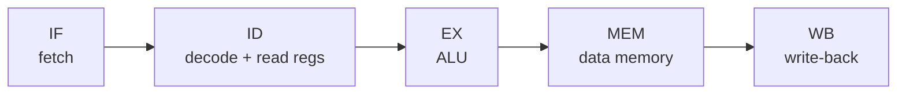

# 23.5.5 · Pipelining

The [previous section](04-datapath.md) ended on a complaint: a single-cycle CPU
stretches every clock tick to fit its slowest instruction, so simple
instructions sit idle while `lw` sets the pace. Pipelining fixes this the way a
factory does — not by making each step faster, but by working on several
instructions at once, each at a different stage. This is the single most
important idea in modern processor design, and it is the same
throughput-versus-latency trade you will meet again when serving language
models. We build a pipeline, run it, then spend the rest of the section on the
three ways it can go wrong — and how real CPUs cope. It all follows COD
Chapter 4 (the note at the end of this section says where to read more).

## The laundry analogy

!!! abstract "In plain words"

    - **What it is.** Pipelining overlaps the stages of consecutive tasks so a
      new task starts before the previous one finishes.
    - **Picture it.** Four loads of laundry. Naively, you wash-dry-fold one load
      completely before touching the next. Smarter: the moment load 1 leaves the
      washer for the dryer, load 2 goes *into* the washer. Now the washer,
      dryer, and folding table are all busy at once.
    - **Why it matters.** Any one load still takes just as long start to finish
      — that is its **latency**. But you *finish* a load far more often — that
      is **throughput** — and throughput is what a busy laundromat (or CPU)
      lives on.

The key insight is that overlapping does **not** speed up a single task. Watch
the two numbers move independently:

```python
def timings(loads, stages, minutes):
    sequential = loads * stages * minutes             # no overlap: each load start-to-finish
    pipelined  = (stages + loads - 1) * minutes       # fill, then one load finishes per stage-time
    latency    = stages * minutes                     # one load, unchanged either way
    return sequential, pipelined, latency

for loads in (4, 100):
    seq, pipe, lat = timings(loads, stages=3, minutes=30)
    print(f"{loads:>3} loads: sequential {seq:>5} min, pipelined {pipe:>5} min, "
          f"speedup {seq/pipe:.2f}x   (one load still takes {lat} min)")
print("throughput rises; latency of a single load does not.")
```

The output tells the whole story: with 4 loads, pipelining cuts the wall-clock
from 360 to 180 minutes — a **2.00x** speedup — yet **one load still takes 90
minutes**, exactly as before. Push to 100 loads and the speedup climbs to
**2.94x**, approaching the number of stages (3). More stages or more work, more
speedup; the latency of any single item never budges.

- **Latency** — how long *one* task takes end to end. Pipelining leaves it
  alone (often makes it slightly worse, from the extra staging registers).
- **Throughput** — how many tasks *complete* per unit time. Pipelining is all
  about this.

This is precisely the trade in
[27.3 Latency, throughput, and streaming](../ch27-inference/03-latency-streaming.md):
an LLM server batches requests to lift tokens-per-second (throughput) even
though any one user's response is not generated faster (latency). Same idea,
different machine — a pipeline is a throughput optimisation that any single
customer barely feels.

## The classic five stages

!!! abstract "In plain words"

    - **What it is.** RISC-V's pipeline cuts instruction execution into five
      stages — the same five steps from [23.5.4](04-datapath.md) — so five
      instructions can be in flight, one per stage.
    - **Picture it.** The datapath's five stations (fetch, decode, execute,
      memory, write-back), now each holding a *different* instruction every
      cycle, like five cars at five stations on the assembly line.
    - **Why it matters.** With a balanced pipeline, one instruction *finishes*
      every cycle even though each still takes five cycles to traverse — a
      near-5x throughput win over the single-cycle design.

The five stages map one-to-one onto the datapath units you already built:

- **IF — Instruction Fetch.** Read the instruction at the PC; increment the PC.
  *(PC, instruction memory, `+4` adder.)*
- **ID — Instruction Decode / register read.** Decode the opcode into control
  signals; read the source registers; generate the immediate. *(Control unit,
  register file read ports, immediate generator.)*
- **EX — Execute.** The ALU computes a result, an address, or a branch test.
  *(ALUSrc mux, ALU, branch-target adder.)*
- **MEM — Memory access.** `lw` reads and `sw` writes data memory; everyone
  else passes through. *(Data memory.)*
- **WB — Write-back.** Write the result into `rd`. *(MemToReg mux, register file
  write port.)*

Between every pair of stages sit **pipeline registers** that carry an
instruction's partial results forward each cycle — the staging tables the
laundry never had. Here are five instructions overlapping; read *down* a column
to see what all five stages are doing in one cycle:

```text
Cycle:    1    2    3    4    5    6    7    8    9
I1       IF   ID   EX  MEM   WB
I2            IF   ID   EX  MEM   WB
I3                 IF   ID   EX  MEM   WB
I4                      IF   ID   EX  MEM   WB
I5                           IF   ID   EX  MEM   WB
```

By cycle 5 the pipeline is **full**: all five stages are busy, and from then on
one instruction completes every cycle. The pipeline as a flow of stages:



The simulator below fills and drains the pipeline over a short instruction
stream, printing the stage-occupancy chart each cycle, then the speedup versus
running the same instructions on the single-cycle machine:

```python
stages = ["IF", "ID", "EX", "MEM", "WB"]
stream = ["lw  x1", "add x2", "sub x3", "or  x4", "and x5", "sw  x6"]
n, S = len(stream), len(stages)
total = n + S - 1                                     # fill (S-1) + one per instruction
print("cycle:      " + "".join(f"{c:>5}" for c in range(1, total + 1)))
for i, name in enumerate(stream):
    cells = []
    for c in range(1, total + 1):
        k = c - 1 - i                                # which stage this instr is in at cycle c
        cells.append(stages[k] if 0 <= k < S else "")
    print(f"{name:<10}" + "".join(f"{x:>5}" for x in cells))

single_cycle_units = n * S                           # each instr = one long clock of S stage-times
print(f"pipelined finishes in {total} cycles vs {single_cycle_units} stage-times single-cycle")
print(f"speedup = {single_cycle_units/total:.2f}x  (approaches {S}x for a long stream)")
for big in (100, 10000):
    print(f"  stream of {big:>5}: speedup {big*S/(big+S-1):.3f}x")
```

Six instructions finish in **10 cycles** instead of the equivalent of 30
single-cycle stage-times — a **3.00x** speedup already. The last two lines show
where it heads: a stream of 100 instructions reaches **4.808x**, and 10,000
reaches **4.998x** — the throughput of a five-stage pipeline tends to **5x** as
the fill/drain cost is amortised. That limit, the number of stages, is the whole
prize. The rest of this section is about the three things that keep real
pipelines below it.

## Hazards: when overlap goes wrong

!!! abstract "In plain words"

    - **What it is.** A **hazard** is any situation where the next instruction
      cannot safely run in the very next cycle — because the hardware, the data,
      or the control flow is not ready.
    - **Picture it.** The laundry again: a hazard is load 2 reaching the dryer
      before load 1 has vacated it (structural), or needing a shirt that is
      still wet in load 1 (data), or not knowing whether load 2 even exists until
      load 1 is half folded (control).
    - **Why it matters.** Hazards force **stalls** (idle cycles, called
      *bubbles*), and every bubble is throughput lost. Handling them well is the
      difference between the ideal 5x and reality.

There are exactly three kinds. We take them in order.

### Structural hazards

- **The problem:** two instructions need the *same* hardware unit in the same
  cycle. Example: if instruction fetch (IF) and memory access (MEM) shared one
  memory, a `lw` in MEM and a fetch in IF would collide every cycle.
- **The RISC-V answer:** the ISA is designed so this almost never happens.
  Instruction fetch and data access use **separate** memories (really, separate
  caches), so IF and MEM never fight. The register file is built to **write in
  the first half of a cycle and read in the second half**, so a WB and an ID can
  share it in the same cycle without conflict.
- **Why RISC helps:** fixed 4-byte instructions and a load/store design mean
  each stage touches a predictable, disjoint set of units. Structural hazards
  are mostly *designed away* rather than handled at run time — one payoff of the
  "reduced" in RISC.

### Data hazards

!!! abstract "In plain words"

    - **What it is.** An instruction needs a value that an earlier, still
      in-flight instruction has computed but not yet written back.
    - **Picture it.** Handing someone a form to sign before the ink on the line
      above has dried — they need what you just wrote, but it is not ready.
    - **Why it matters.** Without care, the second instruction reads a *stale*
      register and computes the wrong answer. This is the most common hazard.

Consider a dependent pair:

```text
add  x1, x2, x3     # x1 is produced in this instruction's EX stage (cycle 3)
sub  x4, x1, x5     # x1 is needed in this instruction's EX stage (cycle 4)
```

The `add` does not *write* `x1` until its WB stage (cycle 5), but the `sub`
wants `x1` in its EX stage (cycle 4) — one cycle too early. Two fixes, in order
of preference:

- **Forwarding (bypassing).** The result actually *exists* at the end of the
  `add`'s EX stage (cycle 3); it just has not been written to the register file
  yet. So route it straight from the EX/MEM pipeline register back into the
  ALU's input for the `sub`. No stall needed — the value takes a shortcut
  instead of a detour through the register file. Forwarding covers almost all
  ALU-to-ALU dependencies.
- **Stall (a bubble)** when forwarding cannot help. A `lw` produces its value
  only at the end of **MEM** (cycle 4), but a dependent instruction right behind
  it needs that value in **EX** (also cycle 4) — the data does not exist yet, so
  no wire can forward it in time. The pipeline must insert one **bubble**
  (a one-cycle stall), after which forwarding delivers the value. This is the
  famous **load-use hazard**, and it is why compilers try to slot an unrelated
  instruction right after a `lw`.

The detector below scans an instruction stream, finds each read-after-write
dependency, and reports whether it is covered by **forwarding** or needs a
**stall**:

```python
# each instr: name, op, dest register, source registers it reads
prog = [
    dict(name="add x1, x2, x3",  op="add", dst=1, src=[2, 3]),
    dict(name="sub x4, x1, x5",  op="sub", dst=4, src=[1, 5]),
    dict(name="lw  x6, 0(x7)",   op="lw",  dst=6, src=[7]),
    dict(name="add x8, x6, x9",  op="add", dst=8, src=[6, 9]),
    dict(name="or  x10, x1, x11", op="or", dst=10, src=[1, 11]),
]
for i, ins in enumerate(prog):
    notes = []
    for j in range(i - 1, -1, -1):                   # look back at in-flight instructions
        prod = prog[j]
        d = i - j                                    # pipeline distance
        if prod["dst"] in ins["src"] and d <= 2:
            reg = prod["dst"]
            if prod["op"] == "lw" and d == 1:
                notes.append(f"x{reg} from '{prod['name']}' -> STALL (load-use), then forward")
            else:
                stage = "EX/MEM" if d == 1 else "MEM/WB"
                notes.append(f"x{reg} from '{prod['name']}' -> FORWARD from {stage}")
    print(f"{ins['name']:<18} " + ("; ".join(notes) if notes else "no hazard"))
```

Reading the output:

- `sub x4, x1, x5` depends on the immediately preceding `add`'s `x1` — distance
  1 — and the detector says **FORWARD from EX/MEM**: no stall, the result is
  bypassed.
- `add x8, x6, x9` depends on the `lw` right in front of it — the load-use case
  — so the detector says **STALL (load-use), then forward**: one bubble, then
  the loaded value is bypassed.
- `or x10, x1, x11` also uses `x1`, but four instructions after the `add` that
  produced it — by then `x1` is long since written back, so **no hazard** at
  all.

### Control hazards

!!! abstract "In plain words"

    - **What it is.** A branch decides *which instruction comes next*, but that
      decision is not known until the branch has been partly executed — so the
      pipeline does not know what to fetch behind it.
    - **Picture it.** A fork in the road with the signpost a few metres *past*
      the fork. You must commit to a lane before you can read it; guess wrong
      and you back up.
    - **Why it matters.** Every loop and every `if` is a branch
      ([Chapter 6](../ch06-loops/index.md)). If the CPU stalled at each one,
      loops — the workhorse of all computing — would crawl.

- **The penalty.** A `beq` resolves its outcome in EX. The instructions fetched
  behind it in IF and ID were fetched *on a guess*; if the guess is wrong, they
  must be flushed and the correct target fetched — a **misprediction penalty**
  of a couple of cycles per wrong guess.
- **Branch prediction.** Rather than stall, the CPU *guesses* the outcome and
  fetches accordingly, flushing only when wrong. Guessing well is enormously
  valuable because branches are so frequent — every loop back-edge is one.
- **1-bit vs 2-bit predictors.** A **1-bit** predictor just remembers the last
  outcome of this branch. A **2-bit saturating counter** requires *two* wrong
  guesses in a row before it changes its mind — so a loop that is taken many
  times then falls through once (the exit) fools the 1-bit predictor *twice* per
  loop (on the exit, then again re-entering) but the 2-bit predictor only
  *once*.

The model runs both predictors over a loop whose back-edge is taken 9 times then
not taken once (the exit), repeated 5 times, and reports accuracy and the cycles
lost to mispredictions:

```python
# A loop whose back-edge is Taken 9 times then Not-taken once (the exit), 5 times.
outcomes = ([True] * 9 + [False]) * 5

def one_bit(seq):
    state, wrong = True, 0                            # remember last outcome; predict it again
    for actual in seq:
        if state != actual:
            wrong += 1
        state = actual
    return wrong

def two_bit(seq):
    ctr, wrong = 2, 0                                 # 2-bit saturating counter: 0..3
    for actual in seq:
        predict_taken = ctr >= 2
        if predict_taken != actual:
            wrong += 1
        ctr = min(3, ctr + 1) if actual else max(0, ctr - 1)
    return wrong

N = len(outcomes)
for label, wrong in [("1-bit", one_bit(outcomes)), ("2-bit", two_bit(outcomes))]:
    acc = 100 * (N - wrong) / N
    print(f"{label} predictor: {wrong:>2} mispredictions / {N} -> {acc:.0f}% accurate")
penalty = 2                                            # bubbles flushed per wrong guess
print(f"at {penalty} wasted cycles per misprediction:")
print(f"  1-bit costs {one_bit(outcomes)*penalty} wasted cycles, "
      f"2-bit costs {two_bit(outcomes)*penalty}")
```

The 1-bit predictor scores **82%** on this loop; the 2-bit **90%** — and at 2
wasted cycles per miss, that is **18** lost cycles versus **10**. The 2-bit
counter's stubbornness is exactly what a loop rewards: it refuses to abandon
"taken" just because the loop exited once. Real CPUs go much further (correlating
and tournament predictors), but the lesson is already here: a branch is
expensive only when you *guess wrong*, so guessing well is worth a lot of
silicon. This is the hardware reason a tight, predictable loop from
[Chapter 6](../ch06-loops/index.md) runs so much faster than its
branch-every-iteration structure would suggest.

## The cost model that results

!!! abstract "In plain words"

    - **What it is.** In an ideal pipeline, one instruction finishes per cycle —
      **CPI = 1**. Stalls and mispredictions push the *effective* CPI above 1.
    - **Picture it.** A checkout that rings up one customer per second on a good
      day, but every price-check (stall) and every abandoned cart (misprediction)
      adds dead time to the average.
    - **Why it matters.** CPI is the middle term of the performance equation from
      [23.5.1](01-performance.md); pipelining is a bet that drives it *toward* 1,
      and hazards are the tax that keeps it above.

The **cycles per instruction** an actual pipeline achieves is the ideal 1 plus
the penalties, each weighted by how often it happens:

$$
\text{CPI} = 1 + f_{\text{load}} \cdot p_{\text{use}} \cdot c_{\text{stall}}
           + f_{\text{branch}} \cdot p_{\text{miss}} \cdot c_{\text{penalty}}
$$

Read aloud: start from one cycle per instruction, then add the stall cycles from
load-use hazards (how often a load is followed by a use, times the stall cost)
and the flush cycles from branch mispredictions (how often a branch is
mispredicted, times its penalty).

```python
base_cpi = 1.0                                         # ideal filled pipeline: 1 instr/cycle
load_freq, load_use_prob, load_stall = 0.25, 0.30, 1  # 25% loads, 30% cause a 1-cycle load-use stall
br_freq, mispredict, br_penalty      = 0.20, 0.10, 2  # 20% branches, 10% mispredicted, 2-cycle penalty
load_penalty = load_freq * load_use_prob * load_stall
branch_penalty = br_freq * mispredict * br_penalty
cpi = base_cpi + load_penalty + branch_penalty
print(f"load-use stalls add   {load_penalty:.3f} to CPI")
print(f"branch mispredicts add {branch_penalty:.3f} to CPI")
print(f"effective CPI = {cpi:.3f}  (ideal is 1.000)")
IC, clock_ns = 1_000_000, 0.5                          # instr count, clock period (ns)
print(f"CPU time = IC x CPI x clock = {IC} x {cpi:.3f} x {clock_ns} ns "
      f"= {IC*cpi*clock_ns/1e6:.3f} ms")
```

Load-use stalls add `0.075`, branch mispredicts add `0.040`, so the effective
**CPI is 1.115** — the pipeline gets most of its ideal 1, and the hazards are the
small tax on top. Feed that into the performance equation from
[23.5.1](01-performance.md) — `CPU time = instructions × CPI × clock` — and this
workload runs in `0.557 ms`. Lower CPI *or* a shorter clock, and it drops.

- **Superscalar and out-of-order — being honest about real CPUs.** Everything
  above assumed the pipeline issues *one* instruction per cycle, so CPI bottoms
  out at 1. Real high-performance cores are **superscalar**: they fetch, decode,
  and issue *several* instructions per cycle (so their best-case CPI is *below*
  1), and **out-of-order**: they run independent later instructions while an
  earlier one waits on memory, then retire them in program order. These extract
  more **instruction-level parallelism** from the same code — the same overlap
  idea, widened. That is the subject of
  [23.5.6 Parallelism](06-parallelism.md).

!!! warning "Common mistakes"

    - **Thinking pipelining makes one instruction faster.** It does not — a
      single instruction still traverses all five stages. Pipelining raises
      *throughput* (instructions finished per second), not the *latency* of any
      one. This is the throughput-vs-latency split from
      [27.3](../ch27-inference/03-latency-streaming.md).
    - **Assuming forwarding removes every stall.** Forwarding handles a value
      that already exists in a pipeline register. A `lw`'s value does not exist
      until after MEM, so a use in the very next instruction still costs one
      bubble no matter how much forwarding you add.
    - **Believing a mispredicted branch is a crash.** It is not wrong *results*,
      only wasted *cycles*: the speculatively fetched instructions are flushed
      before they write anything, and the correct path is fetched. The cost is
      throughput, not correctness.
    - **Expecting a five-stage pipeline to give exactly 5x.** Fill/drain
      overhead, stalls, and mispredictions all keep it below the stage count.
      5x is the *limit* for a long, hazard-free stream, not a guarantee.

## Check your understanding

1. A colleague says pipelining "makes each instruction run five times faster."
   Correct them using latency and throughput.

    ??? success "Answer"
        Pipelining does not change an instruction's **latency** — it still takes
        five stages (five cycles) from fetch to write-back. What improves is
        **throughput**: once the pipeline is full, one instruction *completes*
        every cycle, so a long stream finishes up to ~5x sooner. The laundry
        makes this vivid: one load still takes 90 minutes, but you finish loads
        far more often. It is the same distinction as TTFT-vs-throughput in LLM
        serving ([27.3](../ch27-inference/03-latency-streaming.md)).

2. Why can a `lw` followed immediately by an instruction that uses the loaded
   value not be fixed by forwarding alone?

    ??? success "Answer"
        Forwarding can only route a value that *already exists* in a pipeline
        register. A `lw` produces its value at the end of the MEM stage, but the
        instruction right behind it needs that value in its own EX stage — which
        happens in the *same* cycle as the load's MEM. The data simply does not
        exist yet, so the pipeline must insert one bubble (a stall); only then
        can forwarding deliver it. This is the load-use hazard.

3. On the loop pattern (taken 9 times, then not taken, repeated), why does the
   2-bit predictor beat the 1-bit one?

    ??? success "Answer"
        The 1-bit predictor changes its mind on a single surprise, so the loop's
        one not-taken exit flips it to "not taken", and it then mispredicts the
        *next* iteration's taken back-edge too — two misses per loop. The 2-bit
        saturating counter needs two wrong guesses in a row to switch, so a
        single exit does not dislodge its "taken" prediction — one miss per loop.
        In the model that is 90% accuracy versus 82%.

4. A pipeline has ideal CPI 1 but the code is 25% loads (30% load-use) and 20%
   branches (10% mispredicted, 2-cycle penalty). Is its effective CPI closer to
   1 or to 2, and what does that say about pipelining?

    ??? success "Answer"
        Closer to 1: the penalties are `0.25 × 0.30 × 1 = 0.075` from load-use
        stalls and `0.20 × 0.10 × 2 = 0.040` from mispredictions, giving CPI
        `1.115`. Pipelining captures nearly the full one-instruction-per-cycle
        ideal; hazards are a modest tax, not a wall. That is why every modern CPU
        pipelines — and then goes superscalar to push CPI below 1
        ([23.5.6](06-parallelism.md)).

!!! info "Where to go deeper — Patterson & Hennessy, COD Chapter 4"

    The five-stage pipeline, forwarding and stall logic, branch prediction, and
    the hazard analysis in this section are developed in full in **Patterson &
    Hennessy, *Computer Organization and Design* (RISC-V edition), Chapter 4**,
    which builds the pipeline directly on top of the single-cycle datapath from
    [23.5.4](04-datapath.md). For the performance equation the CPI model feeds,
    see [23.5.1 Performance](01-performance.md); for the wider parallelism that
    pushes CPI below 1, see [23.5.6 Parallelism](06-parallelism.md).
