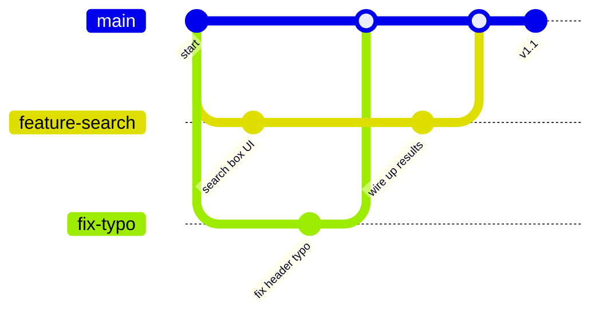

# 24.1 A real Git workflow

In [Chapter 1](../ch01-tools/03-git.md) you learned Git as a personal time
machine: `add`, `commit`, and a history you could rewind. That is Git at
maybe a tenth of its purpose.

Git was built so that *many people can change the same code at the same time
without destroying each other's work* — and the moment you join any team,
internship, or open-source project, that is the Git you will be living in.

This section is the missing nine tenths: branches, merges, conflicts, pull
requests, and the surprisingly important craft of describing your own
changes.

## Branches: parallel universes for code

A **branch** is an independent line of development — a movable label pointing
at a chain of commits. The default branch (usually `main`) holds the version
everyone trusts.

When you start a piece of work, you create a branch off `main`, commit freely
there, and `main` never sees your half-finished state. When the work is done
and reviewed, your branch is **merged** back.

Here is a week of a small project, drawn the way Git thinks of it:



Read the diagram: while the search feature was being built (two commits on
`feature-search`), someone else fixed a typo on their own branch and merged
it — and neither party waited for, or trampled, the other.

Branches are cheap: creating one is instant and takes almost no space. So the
norm is *one branch per task*, deleted after merging.

## The daily loop

Team Git settles into a rhythm you will repeat thousands of times. In
commands:

```console
$ git switch main
$ git pull                        # 1. start from everyone's latest work
$ git switch -c add-empty-cart-check   # 2. new branch, named for the task
... edit code, run tests ...
$ git add checkout.py test_checkout.py
$ git commit -m "Reject checkout when the cart is empty"
... repeat edit/commit in small steps ...
$ git push -u origin add-empty-cart-check   # 3. publish your branch
```

Then, on the hosting site (GitHub, GitLab, …), you open a **pull request**
(PR): a request that your branch be pulled into `main`.

A PR is not a Git command — it is a conversation attached to your branch.
Teammates see the **diff** (every changed line), comment on it, request
changes, and finally approve. Automated checks run on every push: the test
suite from [Section 24.2](02-testing.md), the style checks from
[Section 24.3](03-style-review.md). When all is green and approved, the branch
is merged, and the loop starts again.

Two habits make the loop pleasant:

- **Pull before you branch,** so you build on the newest code and minimize
  later surprises.
- **Commit small** — one logical change per commit — so reviews stay readable
  and any single step can be undone without collateral damage.

## Merge conflicts, demystified

Sooner or later, two branches edit *the same lines* of the same file, and
when the second one merges, Git refuses to guess. This is a **merge
conflict**, and it terrifies beginners mostly because of how it looks.

!!! note "A conflict is Git being careful, not Git being broken"
    Git only ever stops when a human decision is genuinely required.

First, appreciate how much Git merges silently. A merge is **three-way**: Git
compares your version and their version against the common **base** commit
you both started from.

- A line changed by **only one side** is taken automatically.
- A line changed by **both sides, differently**, becomes a conflict.

The logic is simple enough to fit in a code block. Here it is, run on a file
where you rewrote the greeting while a teammate both reworded it *and*
changed the return line:

```python
base   = ["def greet(name):",
          "    msg = 'Hello, ' + name",
          "    return msg"]
yours  = ["def greet(name):",
          "    msg = f'Hello, {name}!'",     # you changed line 2
          "    return msg"]
theirs = ["def greet(name):",
          "    msg = 'Hi, ' + name",         # they ALSO changed line 2
          "    return msg.upper()"]          # ... and line 3

merged = []
for b, y, t in zip(base, yours, theirs):
    if y == t:                 # same on both sides: keep it
        merged.append(y)
    elif b == y:               # only they changed it: take theirs
        merged.append(t)
    elif b == t:               # only you changed it: take yours
        merged.append(y)
    else:                      # both changed it differently: conflict!
        merged.append("<<<<<<< HEAD (your branch)")
        merged.append(y)
        merged.append("=======")
        merged.append(t)
        merged.append(">>>>>>> their branch")

print("\n".join(merged))
```

Line 3 merged itself — only they touched it. Line 2 is the conflict, and the
output shows exactly what Git writes into your file.

### Anatomy of the markers

- `<<<<<<< HEAD` — everything from here to `=======` is **your** side
  (`HEAD` is where you stand — your current branch).
- `=======` — the divider.
- `>>>>>>> their branch` — everything from the divider to here is the
  **incoming** side.

### Resolving one, in four steps

Resolving is editing, nothing more:

1. **Open the conflicted file** and find the marker block.
2. **Decide what the line *should* say** — yours, theirs, or a blend that
   honors both intents.
3. **Delete all three marker lines.**
4. **`git add` the file** to mark it resolved, then `git commit` to complete
   the merge.

In a terminal that looks like this:

```console
$ git merge feature-rewording
Auto-merging greet.py
CONFLICT (content): Merge conflict in greet.py
Automatic merge failed; fix conflicts and then commit the result.
$ code greet.py        # edit: keep "msg = f'Hi, {name}!'", remove markers
$ git add greet.py     # mark the file as resolved
$ git commit           # completes the merge
```

The one real danger is absent-mindedness: committing a file with marker lines
still in it. (Python will greet `<<<<<<< HEAD` with a `SyntaxError`, which is
at least honest.)

So two rules, every time: **search for `<<<` before committing**, and **rerun
the tests after resolving** — the merged whole can be wrong even when both
halves were right.

## Commit messages your future self will thank you for

Six months from now, someone runs `git log` on a broken file, trying to
understand *why* a line exists. That someone is probably you. A commit
message is a letter to that person. The convention:

- **Subject line**: at most ~50 characters, capitalized, no trailing
  period, in the **imperative mood** — "Add", "Fix", "Remove", as if
  completing the sentence *"If applied, this commit will …"*.
- **Body** (after a blank line, optional but golden): explain **why** the
  change was made — the bug, the constraint, the rejected alternative. The
  *what* is already visible in the diff; the *why* lives nowhere else.

Before and after, on a real change:

```text
BAD:  fixed stuff
BAD:  Fixed the bug where it crashed sometimes when clicking the button.
GOOD: Reject checkout when the cart is empty

      Checkout with an empty cart crashed in shipping_fee() with
      ZeroDivisionError (division by item count). Validating at the
      entrance keeps the invariant "carts at checkout are non-empty"
      in one place instead of guarding every downstream function.
```

The subject-line rules are mechanical enough that you can lint them — which
is exactly what many teams' commit hooks do:

```python
def check_subject(subject):
    problems = []
    words = subject.split()
    if len(subject) > 50:
        problems.append(f"too long ({len(subject)} chars; aim for 50 or fewer)")
    if subject.endswith("."):
        problems.append("drop the trailing period")
    if subject and subject[0].islower():
        problems.append("capitalize the first word")
    if words and (words[0].lower().endswith("ed") or words[0].lower().endswith("ing")):
        problems.append("use the imperative mood: 'Add', not 'Added'/'Adding'")
    return problems or ["looks good"]

subjects = [
    "Added stuff.",
    "fixing the checkout bug that kept crashing the cart page on mobile",
    "Add free-shipping threshold check to checkout",
]
for subject in subjects:
    print(repr(subject))
    for note in check_subject(subject):
        print("   -", note)
```

Only the third subject passes — and notice it would still read correctly in
`git log` a year from now, with zero context.

## Code review: the practice around the PR

A pull request review is not a gate where experts judge you. It is the single
highest-value habit teams have for sharing knowledge and catching bugs while
they are cheap.

Knowing what reviewers look for makes you both a better author and a better
reviewer:

- **Correctness**: does the change do what the PR says? Are edge cases
  (empty, boundary, invalid — see [Section 24.2](02-testing.md)) handled
  and *tested*?
- **Clarity**: could they maintain this code without you? Names, function
  size, comments — the material of [Section 24.3](03-style-review.md).
- **Scope**: one PR, one purpose. A bug fix with a surprise refactoring
  mixed in is twice as hard to review and to revert.
- **Tests**: does the new behavior come with tests that would fail without
  the fix?

Receiving comments has its own skill. Review comments are about the code, not
about you, and there are really only three good replies:

- "Good catch, fixed."
- "I did it this way because X — should I still change it?"
- The occasional "disagree, here's why", delivered with the same courtesy
  you'd want back.

The authors of graceful replies are the people everyone wants on their team.

And as a reviewer: ask questions rather than issue verdicts ("could this be
`max(0, total)`?" lands better than "wrong"), and say what you *like*, too —
reviews teach in both directions.

## Repository hygiene: .gitignore

Not everything in your project folder belongs in history. Build artifacts,
caches, editor settings, and — critically — secrets (API keys, passwords)
must stay out. The `.gitignore` file, itself committed, lists patterns Git
should never track:

```text
# .gitignore
__pycache__/        # Python's bytecode cache (Section 23.3!)
*.pyc
.venv/              # virtual environments are rebuilt, not shared
dist/               # build outputs
.DS_Store           # OS clutter
secrets.env         # NEVER commit credentials
```

!!! tip "The rule of thumb"
    Commit what humans write; ignore what machines can regenerate.

A useful check is `git status` before committing: if generated files show up
as "untracked", extend `.gitignore` instead of `git add`-ing around them.

And treat a leaked secret as compromised the moment it is pushed. Rotate the
key — deleting the file in a later commit does *not* remove it from history.

Finally, **tags**. When `main` reaches a state you ship, mark that exact
commit with an immutable name — `git tag v1.1.0` — and push the tag. Releases
on GitHub are built on tags, and version numbers in bug reports ("broken since
v1.1.0") become checkoutable points in history. A branch moves with every
commit; a tag is a pin that never does.

!!! tip "The machinery around the workflow"
    Branching and reviewing is half of a professional setup; the other half
    is the tooling it runs on.
    [Section 40.2](../ch40-toolchain/02-ssh-remote.md) covers SSH keys —
    which is also how you stop typing a password on every `git push` — plus
    working on a remote machine with `ssh`, `rsync`, and `tmux`.
    [Section 40.3](../ch40-toolchain/03-make.md) covers Make, whose
    dependency graph decides what actually has to be rebuilt after you pull
    someone else's commits. And
    [Appendix F](../appendix/F-toolchain-reference.md) collects the Git
    commands of this section on one page, grouped by task, for looking up
    later.

!!! warning "Common mistakes"

    - **Committing directly to `main`.** Even alone, branch per task: it
      keeps `main` always releasable and makes abandoning a bad idea as
      easy as deleting its branch.
    - **Giant, rare commits.** "Three days of work" in one commit is
      unreviewable and un-revertable. Commit each small, coherent step.
    - **Leaving conflict markers in the file.** If `<<<<<<<` reaches the
      test suite (or worse, `main`), the merge was finished by hope.
      Search the file before `git add`.
    - **Writing the diff into the message.** "Changed >= to >" restates
      *what* — the diff shows that. The message exists to record *why*.

## Check your understanding

1. Your teammate merged a change to `README.md` while you were editing
   `checkout.py` on your branch. Do you expect a conflict when you merge?
   Why or why not?

    ??? success "Answer"
        No. Conflicts arise only when both sides change the *same lines of
        the same file* relative to the common base. Different files (or
        different lines) merge automatically via the three-way rule: each
        change has only one author, so Git takes it without asking.

2. Decode this: `<<<<<<< HEAD`, then `rate = 0.15`, then `=======`, then
   `rate = 0.18`, then `>>>>>>> update-tax`. Which line is yours, and what
   are your options?

    ??? success "Answer"
        `rate = 0.15` is yours (the `HEAD` side — your current branch);
        `rate = 0.18` came from the `update-tax` branch. You may keep
        either line or write something new entirely — but you must delete
        all three marker lines, `git add` the file, and commit. The right
        choice is a human question (which rate is correct *now*?), which
        is exactly why Git refused to guess.

3. Rewrite this subject line to pass the linter from this section:
   `"updated the parser because it crashed on empty files."`

    ??? success "Answer"
        Something like `Fix parser crash on empty files` — imperative
        mood, capitalized, under 50 characters, no trailing period. The
        *because…* part belongs in the body, expanded: what crashed, why,
        and how the fix approaches it.

4. Why should `__pycache__/` be in `.gitignore`, and what section of the
   previous chapter explains what it even is?

    ??? success "Answer"
        It holds CPython's cached bytecode (`.pyc`) — machine-regenerated
        files that [Section 23.3](../ch23-os/03-interpreters-vms.md)
        explained are produced automatically from your source. They churn
        on every run, differ across Python versions, and carry no
        information the source doesn't; history should record what humans
        wrote.
