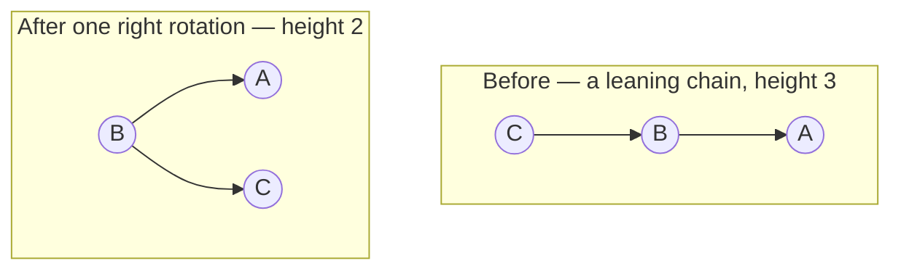
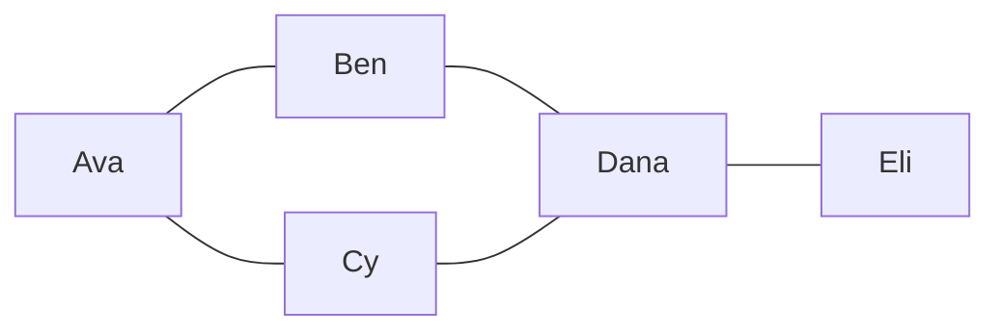

# 25.1 A preview of Programming III

The typical third course — often called *Data Structures and Algorithms* —
takes the structures you built in Part III and asks two ruthless questions:
*can we make the guarantees unconditional?* and *what else can we model?*

This section is the appetizer plate, and the meal is now served next door.
Everything previewed below is built properly in
[Part VI](../part6-overview.md), which picks up exactly where Chapter 22 left
off.

So read this page for two things: the reason each idea exists, and one small
taste you can run. Each section ends with a pointer to the chapter that
implements it in full.

## The balance problem, solved

[Section 20.3](../ch20-bst/03-traversals-balance.md) ended on a cliffhanger:
a binary search tree is $O(\log n)$ *only if it stays bushy*, and inserting
keys in sorted order quietly degrades it into a glorified linked list. Watch
it happen:

```python
class Node:
    def __init__(self, key):
        self.key, self.left, self.right = key, None, None

def insert(root, key):
    if root is None:
        return Node(key)
    if key < root.key:
        root.left = insert(root.left, key)
    else:
        root.right = insert(root.right, key)
    return root

def height(node):
    if node is None:
        return 0
    return 1 + max(height(node.left), height(node.right))

sorted_order = list(range(1, 16))
nice_order = [8, 4, 12, 2, 6, 10, 14, 1, 3, 5, 7, 9, 11, 13, 15]

for name, order in [("sorted", sorted_order), ("hand-picked", nice_order)]:
    root = None
    for k in order:
        root = insert(root, k)
    print(f"{name:>12} insert order → height {height(root)}")
```

Same 15 keys, height 15 versus height 4.

In Part III we dodged the problem by hand-picking a friendly insert order; a
*self-balancing* tree refuses to need your help. The tool it uses is the
**rotation**: a constant-time re-wiring of one parent–child link that lifts
the child up, drops the parent down, and hands one subtree across — without
ever breaking the BST ordering rule.



!!! note "What a self-balancing tree is, in one line"
    A BST plus a policy for when to rotate.

Three such policies are worth knowing by name.

### AVL trees — the strictest promise

At every node, the left and right subtree heights may differ by at most 1.
Every insert or delete walks back up the tree checking that rule and rotating
wherever it breaks.

The result is the shortest, fastest-to-search tree of the family — at the
price of a little more rotation work on every write. AVL trees are the ones
you will most likely implement by hand in a course, because the balance rule
is easy to state and check.

### Red-black trees — the library favourite

Here the rule is relaxed: each node is coloured red or black, and a handful
of colour constraints guarantee the tree's height is at most about twice the
optimal $\log_2 n$.

Looser balance means slightly deeper searches than AVL, but fewer rotations
per insert — which is why *library authors* love them. Java's `TreeMap` and
`TreeSet`, and the C++ `std::map`, are red-black trees under the hood. You
will probably study one and trust the other.

### B-trees — trees for disks

B-trees answer a different question: what if the tree lives on a *disk*,
where reading one node costs a thousand times more than comparing keys?

A B-tree node holds hundreds of keys and hundreds of children, so the whole
tree is only 3–4 levels deep and finding any record costs 3–4 disk reads.
That is why databases and filesystems can find one row among a billion almost
instantly.

### Where they get built

All three are drawn, traced, and implemented in
[Chapter 35 · Balanced Trees](../ch35-balanced-trees/index.md):

- [35.1](../ch35-balanced-trees/01-rotations.md) — rotations;
- [35.2](../ch35-balanced-trees/02-avl.md) — AVL trees;
- [35.3](../ch35-balanced-trees/03-red-black.md) — red-black trees;
- [35.4](../ch35-balanced-trees/04-b-trees.md) — B-trees.

## Hash tables: the $O(1)$ magic trick

Trees earn $O(\log n)$ lookup by keeping keys in order. Hash tables get
*average* $O(1)$ by abandoning order entirely. The trick has two steps:

1. A **hash function** turns any key into a big number.
2. A modulo squashes that number into a **bucket index** — a plain array
   position.

Finding a key is then just "compute the index, look in that slot." No
walking, no comparisons down a path: one arithmetic step, one array access.

Python's built-in `hash()` is such a function:

```python
print(hash(42))                    # small ints hash to themselves
print(hash("cat") == hash("cat"))  # always identical within one program run
print(hash("cat") % 8)             # squashed into one of 8 bucket slots
```

The int line prints `42`, and the comparison prints `True` — the same key must
always land in the same bucket, or you could never find it again.

We do not show the raw value of `hash("cat")` in prose, because CPython
deliberately randomises string hashes each time the interpreter starts, as a
security measure against attackers who craft colliding keys. Stable within a
run, different between runs — remember that if your output differs from a
friend's.

Two different keys can land in the same bucket — a **collision** — and any
honest hash table must handle it. The classic fix is **chaining**: each
bucket holds a little list of the pairs that landed there.

Here is an entire working hash table, small enough to read in one breath:

```python
def bucket_of(key, size=8):
    return sum(ord(ch) for ch in key) % size   # a (deliberately weak) hash

buckets = [[] for _ in range(8)]

def put(key, value):
    chain = buckets[bucket_of(key)]
    for pair in chain:
        if pair[0] == key:        # key already present: overwrite
            pair[1] = value
            return
    chain.append([key, value])    # new key: append to this bucket's chain

def get(key):
    for k, v in buckets[bucket_of(key)]:
        if k == key:
            return v
    raise KeyError(key)

put("cat", "meow"); put("act", "law"); put("dog", "woof")
print("cat →", bucket_of("cat"), "  act →", bucket_of("act"), "  dog →", bucket_of("dog"))
print(get("cat"), "/", get("act"), "/", get("dog"))
print(buckets)
```

`"cat"` and `"act"` contain the same letters, so our sum-of-characters hash
sends both to bucket 0 — a collision — yet `get` still returns the right value
for each, because it walks bucket 0's chain comparing actual keys.

That is the whole design: hash to jump straight to a bucket, then a tiny
linear search inside it. Keep the chains short — real tables *resize* when
they get about two-thirds full, and use far better hash functions than ours —
and the average cost stays $O(1)$.

!!! note "You have been using one since Chapter 14"
    Python's `dict` and `set`, and Java's `HashMap` and `HashSet`, are
    exactly this structure grown up: resizing, smarter collision handling,
    decades of tuning. Every `d[key]`, every `x in some_set`, every
    `counts.get(word, 0)` you have written was a hash-and-jump
    ([Chapter 14](../ch14-beyond/01-collections-tour.md)).

[Chapter 36](../ch36-hashing-tries/index.md) opens that box:

- [36.1](../ch36-hashing-tries/01-hash-tables.md) — what makes a hash
  function good, and what a load factor is;
- [36.2](../ch36-hashing-tries/02-collisions-resizing.md) — chaining versus
  open addressing, and why tables resize;
- [36.3](../ch36-hashing-tries/03-tries.md) — **tries**, which index by
  prefix;
- [36.4](../ch36-hashing-tries/04-skip-lists.md) — **skip lists**, which get
  tree-like performance out of coin flips.

## Graphs: nodes and edges model everything

A **graph** is just dots and lines: **nodes** (also called *vertices*) and
**edges** connecting pairs of them.

That sounds too simple to matter until you notice what it models: people and
friendships, cities and roads, web pages and links, tasks and dependencies,
airports and routes. Trees were graphs with rules — one parent, no cycles;
general graphs drop the rules.



The standard way to store one is an **adjacency list**: for each node, the
list of its neighbours. In Python that is nothing more exotic than a
dictionary of lists:

```python
friends = {
    "Ava":  ["Ben", "Cy"],
    "Ben":  ["Ava", "Dana"],
    "Cy":   ["Ava", "Dana"],
    "Dana": ["Ben", "Cy", "Eli"],
    "Eli":  ["Dana"],
}

print("Dana's neighbours:", friends["Dana"])
edges = sum(len(nbrs) for nbrs in friends.values()) // 2
print(len(friends), "people,", edges, "friendships")
```

Each friendship appears in two lists (Ava lists Ben, Ben lists Ava), which is
why halving the total count gives 5 edges. Notice the structure is a `dict` of
`list`s — two tools you have owned since Part II, composed.

The first real graph algorithm every course teaches is **breadth-first search
(BFS)**: explore the graph in rings — everyone 1 hop away, then everyone 2
hops away, and so on.

The engine that makes "rings" happen is a plain FIFO
[queue](../ch19-stacks-queues/03-queues.md): visit a person, and enqueue their
not-yet-seen neighbours to be processed *after* everyone already waiting.
Because nearer people always enter the queue before farther ones, the first
time you reach someone is guaranteed to be via a shortest path.

```python
from collections import deque

friends = {
    "Ava":  ["Ben", "Cy"],
    "Ben":  ["Ava", "Dana"],
    "Cy":   ["Ava", "Dana"],
    "Dana": ["Ben", "Cy", "Eli"],
    "Eli":  ["Dana"],
}

def hops_from(start):
    dist = {start: 0}            # also serves as the "seen" set
    queue = deque([start])
    while queue:
        person = queue.popleft()
        for nbr in friends[person]:
            if nbr not in dist:
                dist[nbr] = dist[person] + 1
                queue.append(nbr)
    return dist

print(hops_from("Ava"))
```

The output, `{'Ava': 0, 'Ben': 1, 'Cy': 1, 'Dana': 2, 'Eli': 3}`, reads as a
tiny social insight: Eli is three introductions away from Ava.

That loop — about ten lines — is the same algorithm that powers "degrees of
separation" features, shortest-move solvers for puzzles, and web crawlers.

Two close relatives complete the family:

- **Depth-first search (DFS)** swaps the queue for a
  [stack](../ch19-stacks-queues/02-stacks.md) — or uses
  [recursion](../ch17-recursion/index.md) and lets the call stack *be* the
  stack. Instead of rings, it dives down one path as far as it can before
  backtracking, which suits questions like "is there *any* route?", "does
  this dependency graph contain a cycle?", and "in what order must these
  tasks run?".
- **Dijkstra's algorithm** handles edges that carry *weights* — road
  distances, flight prices — where fewest hops is no longer shortest path.
  It is BFS with the queue upgraded to a
  [priority queue](../ch21-heaps/02-priority-queues.md): always expand the
  cheapest frontier node next. You already own every part it is made of.

[Chapter 37 · Graphs](../ch37-graphs/index.md) builds all of it:

- [37.1](../ch37-graphs/01-representations.md) — the three representations
  and their trade-offs;
- [37.2](../ch37-graphs/02-traversal.md) — BFS and DFS with five
  applications;
- [37.3](../ch37-graphs/03-shortest-paths.md) — Dijkstra, Bellman-Ford, and
  A\*, including a demonstration of Dijkstra returning a confidently wrong
  answer;
- [37.4](../ch37-graphs/04-mst.md) — minimum spanning trees.

Then [Project 9](../projects/09-route-finder/README.md) puts them together
into a working route finder over a city map.

## What else awaits

One more topic this book now covers, and three that genuinely belong to other
courses.

**Sorting faster than $O(n \log n)$** — covered here, in
[Chapter 38](../ch38-linear-sorting/index.md).
[Chapter 22](../ch22-sorting/index.md) left $O(n \log n)$ looking like the
floor for sorting, and for any algorithm that works by *comparing* keys it
is: [Section 38.1](../ch38-linear-sorting/01-lower-bound.md) proves it with a
decision-tree counting argument. Then
[38.2](../ch38-linear-sorting/02-counting-radix-bucket.md) beats the bound
anyway, with counting, radix, and bucket sort — three algorithms that never
compare two keys at all.

The other three belong to later courses:

**Dynamic programming** is recursion that stops re-solving the same
subproblem twice, by remembering answers in a table. It turns some
exponential-time recursions into polynomial ones, and it is the standard tool
for optimisation puzzles ("fewest coins", "best schedule").

**Concurrency** is making one program genuinely do several things at once,
with multiple threads or processes sharing time and memory. It buys speed and
responsiveness at the cost of a new class of bug — race conditions — that no
amount of rereading your own code will reveal. Courses teach the locks and
queues that tame them.

**Networks** explain what actually happens between your browser and a server:
how data is chopped into packets, addressed, routed, and reassembled (IP and
TCP), and how protocols like HTTP layer meaning on top. After one networking
course, "the request timed out" becomes a diagnosis instead of an incantation.
(The HTTP layer itself is [42.2](../ch42-web-gui/02-http-server.md) in this
book, where you build a server's brain; the packets underneath it are the
networking course's business.)

!!! warning "Common mistakes"

    - **Assuming `dict` keeps keys in sorted order because trees do.** Hash
      tables sacrifice ordering for speed — Python's `dict` remembers
      *insertion* order, not sorted order. If you need keys in order, that
      is a job for sorting or a tree (Java's `TreeMap`).
    - **Using BFS ideas with a stack and expecting shortest paths.** Swap
      the queue for a stack and you get DFS — it still *finds* Eli, but via
      whatever winding path it dives into first. Shortest-hop guarantees
      come specifically from the FIFO queue.
    - **Forgetting the `seen`/`dist` check in graph search.** Trees have no
      cycles, so tree code can skip it. Graphs do have cycles — omit the
      check and BFS happily walks Ava → Ben → Ava forever.
    - **Thinking hash tables are always faster than trees.** Average
      $O(1)$ beats $O(\log n)$, but hash tables give up ordered iteration
      and range queries ("all keys between 10 and 20"), and a bad hash
      function degrades them to $O(n)$. Every structure is a trade.

## Check your understanding

1. In one sentence: what does a rotation do, and what property does it
   carefully preserve?

    ??? success "Answer"
        A rotation re-wires one parent–child link so the child moves up and
        the parent moves down (handing one subtree across) — and it
        preserves the BST ordering rule, so an in-order traversal reads the
        same before and after.

2. Our toy hash sent `"cat"` and `"act"` to the same bucket. Why did
    `get("act")` still return the right value?

    ??? success "Answer"
        Chaining: the bucket holds a list of key–value *pairs*, and `get`
        walks that list comparing the actual keys with `==`. The hash only
        chooses which bucket to search; the keys themselves settle who is
        who.

3. Why does BFS use a queue rather than a stack, and what guarantee does
    that choice buy?

    ??? success "Answer"
        A queue is first-in, first-out, so all nodes at distance $k$ are
        processed before any node at distance $k+1$. That ordering is
        exactly why the first time BFS reaches a node is via a
        fewest-edges path. A stack would explore depth-first and lose the
        guarantee.

4. Java's `TreeMap` and `HashMap` both map keys to values. Name one
    concrete task where `TreeMap` is the better pick despite being
    $O(\log n)$.

    ??? success "Answer"
        Anything needing sorted order or ranges: "iterate keys
        alphabetically", "find the smallest key ≥ x", "all entries between
        two dates". A red-black tree keeps keys sorted as it goes; a hash
        table scatters them on purpose.
