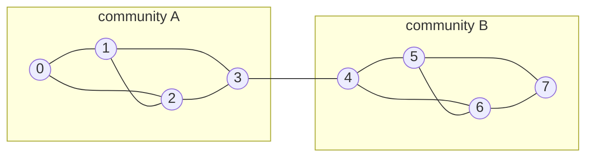

# 25.5.5 · Neural networks on graphs — a first GNN

Everything so far assumed the input was a neat row of numbers — a point with an
`x1` and an `x2`. But most interesting data is not shaped like that. Friends in
a social network, atoms in a molecule, pages linking to pages, roads between
towns: these are **graphs**, the structure from [Chapter
37](../ch37-graphs/index.md), and a plain MLP has no idea what to do with the
connections. A **graph neural network (GNN)** does. It is the same machinery
you already built — layers, activations, gradient descent — taught to respect
the wiring of a graph. And building one hands you the key insight of the whole
book: **attention is a graph neural network in disguise.**

!!! abstract "In plain words"

    - **What it is.** A GNN updates each node's vector by mixing in a summary of
      its neighbours' vectors, and repeats that a few times so information
      spreads across the graph.
    - **Picture it.** Gossip through a friend group. After one round of chatter
      you know your friends' news; after two rounds you know your
      friends-of-friends' news; after three it has spread further still. Each
      person's "state" is updated from whoever they are connected to.
    - **Why it matters.** The connections *are* the signal — who you know, what
      an atom is bonded to, which pages link to a page. A GNN is the neural
      network that learns from structure, and it turns out to be the same idea
      underneath convolutions and attention.

## The graph we will use

Eight nodes in two tight-knit communities, joined by a single **bridge** edge
(node 3 — node 4). Keep this picture in view; every number below refers to it.



As an adjacency map — the same `{vertex: [neighbours]}` shape from [Section
37.1](../ch37-graphs/01-representations.md):

```python
graph = {
    0: [1, 2], 1: [0, 2, 3], 2: [0, 1, 3], 3: [1, 2, 4],
    4: [3, 5, 6], 5: [4, 6, 7], 6: [4, 5, 7], 7: [5, 6],
}
n = len(graph)
print("nodes:", n, " edges:", sum(len(v) for v in graph.values()) // 2)
```

## Message passing: gossip on the graph

The core operation of every GNN is **message passing**: each node gathers a
summary from its neighbours and updates itself, then everyone does it again.
Start with a boolean version — a rumour — to see the *spread*, which is exactly
the ring-by-ring expansion of the breadth-first search in [Section
37.2](../ch37-graphs/02-traversal.md). A rumour starts at node 0; each round,
anyone next to someone who knows it, learns it.

```python
# continues
knows = {0}                      # node 0 starts the rumour
for round_num in range(1, 4):
    newly = set(knows)
    for v in knows:
        newly.update(graph[v])   # a node's neighbours hear it too
    knows = newly
    print(f"after round {round_num}: {sorted(knows)}  ({len(knows)} nodes know)")
```

The rumour spreads outward one hop per round: **`{0, 1, 2}`** after round 1,
`{0, 1, 2, 3}` after round 2, `{0, 1, 2, 3, 4}` after round 3 — it has just
crossed the bridge into community B. This "one more hop each round" is the
entire spatial behaviour of a GNN. Real message passing carries *vectors*
instead of a yes/no rumour, but the reach grows exactly the same way.

## A message-passing layer

To carry vectors we need two ingredients:

1. **Aggregate** — summarise a node's neighbourhood. The simplest honest
   summary is the **average** of the node's own vector and its neighbours'.
2. **Transform** — feed that summary through a small neural layer (a matrix
   plus an activation), *the exact layer from [Section
   25.5.1](01-neuron-and-layer.md)*.

The averaging is one matrix. Add a self-loop to every node (so a node includes
itself in its own average), then divide each row by its degree. Call that
row-normalised matrix $\hat{A}$; then $\hat{A}H$ replaces every node's vector
with the mean of its neighbourhood.

$$
H' = \operatorname{ReLU}\big(\hat{A}\,H\,W\big)
$$

Read aloud: *average each node with its neighbours ($\hat{A}H$), then apply a
shared neural layer ($W$ and a ReLU)*. The only new thing versus an MLP is the
$\hat{A}$ out front — the graph's wiring, doing the mixing. To *see* the mixing
clearly, give each node a distinct one-hot identity vector and watch, round by
round, whose identities have blended into node 3's vector:

```python
# continues
import numpy as np
np.set_printoptions(suppress=True)

A = np.zeros((n, n))
for u in graph:
    A[u, u] = 1.0                       # self-loop
    for v in graph[u]:
        A[u, v] = 1.0
Ahat = A / A.sum(axis=1, keepdims=True)  # each row averages self + neighbours

H = np.eye(n)                            # start: every node is its own identity
for round_num in range(1, 4):
    H = Ahat @ H                         # one aggregation round
    reached = [i for i in range(n) if H[3, i] > 1e-9]
    print(f"round {round_num}: node 3's vector now draws on nodes {reached}")
```

Watch node 3's **receptive field** grow: after round 1 its vector is a blend of
nodes **`[1, 2, 3, 4]`** (itself and its immediate neighbours); after round 2,
`[0, 1, 2, 3, 4, 5, 6]` (two hops out, now including community B's inner nodes);
after round 3, all eight nodes. Each round, a node's representation comes to
reflect a wider slice of the graph around it — *that* is what message passing
buys, and it is why a GNN with $k$ layers lets each node see $k$ hops away.

Swapping the identity features for real ones and adding the neural layer changes
nothing structural — it is the same $\hat{A}$, now followed by a learnable `W`
and a ReLU:

```python
# continues
rng = np.random.default_rng(2)
W = rng.normal(0, 0.5, size=(n, 4))      # a 25.5.1 layer: n features -> 4

def gnn_layer(H, W):
    return np.maximum(0.0, Ahat @ H @ W)  # aggregate, then transform + bend

reps = gnn_layer(np.eye(n), W)
print("node 0 representation:", np.round(reps[0], 3))
print("node 3 representation:", np.round(reps[3], 3))
print("node 7 representation:", np.round(reps[7], 3))
```

Each node now has a 4-number learned representation shaped by its
neighbourhood. Node 0 (deep in community A) and node 7 (deep in community B)
come out with very different vectors — `[0.378, 0.011, 0.04, 0.0]` versus
`[0.0, 0.0, 0.538, 0.0]` — while bridge node 3 sits between them. In a *trained*
GNN the `W` here would be tuned by the very gradient descent of [Section
25.5.4](04-learning.md); the forward pass is exactly what you see.

## Classifying nodes from their neighbourhood

Message passing makes nodes in the same community drift toward similar vectors,
which is exactly what you need to *label* them. Suppose we know just two labels
— node 0 is community A, node 7 is community B — and want to infer the rest.
Plant those two labels, run message passing a few rounds (clamping the two known
nodes each round so they keep broadcasting their label), and read off each
node's stronger signal:

```python
# continues
label = np.zeros((n, 2))
label[0] = [1, 0]                        # node 0 known: community A
label[7] = [0, 1]                        # node 7 known: community B

signal = label.copy()
for _ in range(6):
    signal = Ahat @ signal               # spread labels along edges
    signal[0] = [1, 0]                   # re-assert the two known labels
    signal[7] = [0, 1]

predicted = signal.argmax(axis=1)        # 0 = community A, 1 = community B
print("predicted:", predicted.tolist())
print("true     :", [0, 0, 0, 0, 1, 1, 1, 1])
print("all correct:", predicted.tolist() == [0, 0, 0, 0, 1, 1, 1, 1])
```

From two labelled nodes, message passing recovers **all eight** community
memberships correctly — the labels flowed along the dense within-community
edges faster than they leaked across the single bridge. This is
**semi-supervised node classification**, one of the things GNNs are genuinely
used for (fraud rings in transaction graphs, protein function from interaction
graphs), here in eight nodes you can check by eye.

## Three views of one idea

You now have message passing. Two famous architectures are secretly the same
thing on differently-shaped graphs — which is the payoff for building it.

**A convolution is message passing on a grid.** An image is a graph whose nodes
are pixels, and each pixel's neighbours are the handful of pixels touching it. A
convolution — the operation at the heart of every image model — replaces each
pixel with a weighted combination of that little neighbourhood, then applies a
shared transform. That is exactly $\hat{A}H W$ with the "graph" fixed to a grid
and the neighbourhood a small square. A CNN is a GNN that already knows its
graph is a grid.

**Attention is message passing on a fully-connected graph.** This is the
connection the whole of Part V turns on. Recall [Chapter 26's
attention](../ch26-llm-internals/02-attention.md): every token produced an
output that was a weighted blend of every other token's value vector, with the
weights coming from a softmax over query–key similarities. Read that again as a
GNN:

- The **tokens are nodes**, and the graph is **fully connected** — every token
  is a neighbour of every other.
- Each token **aggregates** its neighbours' value vectors — that is $\hat{A}H$.
- The attention weights **are** the aggregation weights — instead of a fixed
  uniform average, attention *learns how much of each neighbour's message to
  take*, and those weights differ per node and per pair.

So attention is a GNN on the complete graph with **learned, input-dependent
edge weights**. Our GNN averaged neighbours uniformly; attention decides,
softmax by softmax, which neighbours matter. That single reframing unites the
transformer of Part V with the graphs of Part VI: a transformer layer is a
message-passing layer where the graph is "everything attends to everything" and
the messages are weighted by relevance.

## What the real GNNs add

What you built is the true skeleton; production GNNs put muscle on it, and their
names describe the upgrade:

- **GCN** (Graph Convolutional Network) is essentially the $\hat{A}HW$ layer
  above, with a slightly more careful degree normalisation.
- **GraphSAGE** replaces the plain average with other **aggregators** (max,
  a small neural pooler) and *samples* a fixed number of neighbours so it scales
  to graphs with millions of nodes.
- **GAT** (Graph Attention Network) puts *attention* on the edges — exactly the
  learned neighbour-weighting described above — so a node can trust some
  neighbours more than others.

Libraries such as **PyTorch Geometric** and **DGL** implement these at scale,
with the autodiff and GPU support that [Section 25.5.4](04-learning.md)
described. But the engine inside all of them is the loop you just ran:
aggregate from neighbours, transform, repeat.

!!! warning "Common mistakes"

    - **Too many rounds — over-smoothing.** Keep averaging and *every* node's
      vector converges to the same graph-wide mean; after enough rounds you
      cannot tell communities apart at all. Real GNNs use only a few layers for
      exactly this reason. (Run the label-propagation loop for 100 rounds
      without the clamps and watch the two signals blur together.)
    - **Forgetting the self-loop.** Without adding `A[u, u] = 1`, a node's own
      features are dropped from its update, and it sees only its neighbours —
      often a real bug in hand-written GNNs.
    - **Confusing rounds with a bigger graph.** More message-passing rounds do
      not add nodes; they widen each node's *receptive field*. Three rounds let
      a node see three hops out — no more, no less.
    - **Thinking attention and GNNs are different families.** They are the same
      operation. Attention is message passing with learned edge weights on a
      complete graph; a GNN layer is attention with fixed weights on a sparse
      one.

## Check your understanding

1. A GNN has 3 message-passing layers. How many hops away can information from
   one node reach another node's representation?

    ??? success "Answer"

        Three hops. Each layer aggregates one ring of neighbours, so $k$ layers
        give each node a receptive field of $k$ hops — exactly the rumour
        spreading one edge further per round. To pass information between nodes
        five hops apart you need at least five layers.

2. In the attention-as-GNN view, what plays the role of the graph's edges, and
   what plays the role of the fixed averaging weights $\hat{A}$?

    ??? success "Answer"

        The "graph" is fully connected — every token is joined to every other,
        so the edges are all token pairs. The fixed uniform weights of a plain
        GNN are replaced by the **attention weights**: a learned, per-pair,
        input-dependent softmax that decides how much of each neighbour's value
        vector to blend in. Attention = message passing with learned edge
        weights.

3. Why did planting only two labels correctly classify all eight nodes, and when
   would that trick fail?

    ??? success "Answer"

        Because each community is densely connected internally and joined to the
        other by a single bridge, so a label spreads quickly *within* its
        community and only trickles across the bridge. If the two communities
        were joined by many edges (or the graph had no community structure),
        labels would leak across and the majority signal at each node would no
        longer match its true group — the classification would fail.
