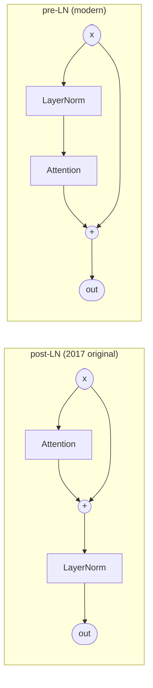
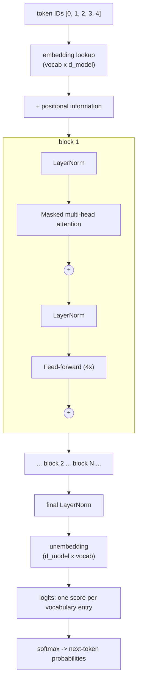
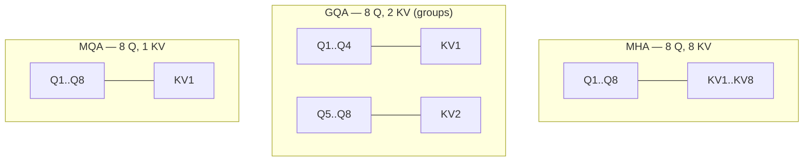

# 26.3 The decoder-only stack

Attention alone is not a language model. It is one operation — a mixer that
lets tokens exchange information. To get a model you wrap it in three
supporting pieces (a residual connection, a normalization, a small
feed-forward network), call the bundle a **block**, and stack the block $N$
times. This section builds each piece, assembles them, and then runs a
complete two-layer transformer forward pass on five tokens so you can watch
integers go in and a next-token probability distribution come out. Along the
way we fix a problem you may not have noticed yet: attention has no idea
what *order* the tokens are in.

## Residual connections: the highway through the stack

A deep stack of layers has a fatal habit. Each layer multiplies its input by
weights that are (deliberately) smaller than 1, so after twenty layers the
original signal — and the gradient that must travel back through them during
training — has shrunk towards nothing. The fix, from ResNets (2015), is
absurdly simple: instead of `x = f(x)`, write `x = x + f(x)`. Each layer now
proposes a *change* to a running signal rather than replacing it.

```python
import numpy as np

rng = np.random.default_rng(0)
d, n_layers = 8, 20
x0 = rng.normal(size=d)
Ws = [rng.normal(0, 0.5 / np.sqrt(d), size=(d, d)) for _ in range(n_layers)]

h_plain, h_res = x0.copy(), x0.copy()
print(f"{'layer':>5} {'plain ||h||':>12} {'residual ||h||':>15}")
print(f"{0:>5} {np.linalg.norm(h_plain):>12.4f} {np.linalg.norm(h_res):>15.4f}")
for i, W in enumerate(Ws, start=1):
    h_plain = np.tanh(h_plain @ W)          # replace the signal
    h_res = h_res + np.tanh(h_res @ W)      # add to the signal
    if i % 5 == 0:
        print(f"{i:>5} {np.linalg.norm(h_plain):>12.4f} {np.linalg.norm(h_res):>15.4f}")
```

The plain stack's signal collapses towards zero; the residual stack keeps a
healthy magnitude.

### Why the gradient needs the same highway

The same thing happens to gradients on the way back. In a plain chain the
gradient is a *product* of per-layer factors, so factors below 1 multiply
into oblivion — the classic **vanishing gradient**:

```python
import numpy as np

rng = np.random.default_rng(1)
factors = rng.uniform(0.4, 0.8, size=20)     # each layer's local derivative

grad_plain = np.prod(factors)                # d(output)/d(input): a product
grad_res = np.prod(1 + factors)              # residual adds 1 to every factor
print(f"plain 20-layer gradient   : {grad_plain:.3e}")
print(f"residual 20-layer gradient: {grad_res:.3e}")
print(f"ratio: {grad_res / grad_plain:.3e}")
```

About $1.6 \times 10^{-5}$ versus about $9.6 \times 10^{3}$: the residual
version delivers a gradient roughly $6 \times 10^{8}$ times larger, which is
the difference between "trains" and "does not train".

**The `+ x` turns a product of small numbers into a product of numbers
*above* 1**, and that is why transformers can be 32, 80, or 120 layers deep
at all. Every block in a transformer therefore has this shape:

```text
x = x + Attention(x)
x = x + FeedForward(x)
```

## Layer normalization: keeping numbers in range

Adding things repeatedly makes them drift — activations grow, some
dimensions dominate, training destabilises. **Layer normalization**
(Ba et al., 2016) rescales each token's vector to mean 0 and variance 1,
then applies two learned per-dimension parameters $\gamma$ (scale) and
$\beta$ (shift) so the model can undo the normalization if it wants:

$$
\operatorname{LN}(x) = \gamma \odot
\frac{x - \mu}{\sqrt{\sigma^2 + \epsilon}} + \beta,
\qquad
\mu = \frac{1}{d}\sum_i x_i, \quad
\sigma^2 = \frac{1}{d}\sum_i (x_i - \mu)^2
$$

Read aloud: *subtract the row's mean $\mu$, divide by its spread
$\sqrt{\sigma^2 + \epsilon}$ so every number lands on a standard scale, then let
the two learned knobs $\gamma$ (scale) and $\beta$ (shift) move them wherever
training prefers.*

```python
import numpy as np

def layer_norm(x, gamma, beta, eps=1e-5):
    mu = x.mean(axis=-1, keepdims=True)
    var = x.var(axis=-1, keepdims=True)
    return gamma * (x - mu) / np.sqrt(var + eps) + beta

x = np.array([[100.0, 102.0, 98.0, 300.0],     # wildly off-scale token
              [0.01, -0.02, 0.005, 0.0]])      # tiny token
gamma, beta = np.ones(4), np.zeros(4)
y = layer_norm(x, gamma, beta)

print("before:\n", x)
print("after :\n", np.round(y, 3))
print("\nrow means (~0)     :", np.round(y.mean(axis=-1), 6))
print("row std devs (~1)  :", np.round(y.std(axis=-1), 4))
```

Both rows come out on the same scale despite starting four orders of
magnitude apart. Note that it normalises *across the features of one token*,
not across the batch — which is why it works fine with sequences of any
length and any batch size.

### Pre-LN versus post-LN: where you put it matters

- **post-LN** (the original 2017 transformer): normalize *after* adding the
  residual.
- **pre-LN** (every large modern model): normalize the input to the
  sub-layer and leave the residual path clean.

Post-LN wins on paper and loses in practice: deep post-LN stacks need
learning-rate warm-up and still tend to diverge.



In pre-LN the residual path from input to output contains *no* normalization
at all — an uninterrupted highway from layer 1 to layer 80.

Many current models also swap LayerNorm for **RMSNorm**, which skips the mean
subtraction and divides by the root-mean-square only. It is cheaper, and it
works just as well.

## The feed-forward network: where the thinking happens

Attention moves information *between* tokens. The **feed-forward network**
(FFN) processes each token *individually*: expand to a wider space, apply a
non-linearity, project back.

$$
\operatorname{FFN}(x) = W_2 \, \phi(W_1 x + b_1) + b_2,
\qquad d_{\text{ff}} \approx 4 \, d_{\text{model}}
$$

Three design choices are packed into that one line:

- **The 4× expansion** is a convention that stuck because it works: the wide
  middle layer gives the network room to compute many independent features
  per token before compressing back.
- **The non-linearity $\phi$ is not optional.** Without it, two stacked
  matrix multiplies collapse into a single matrix and the FFN is pointless.
- **The choice of non-linearity is GELU or SwiGLU**, not ReLU, because their
  smooth curve near zero trains better.

```python
import numpy as np

def relu(x):
    return np.maximum(0.0, x)

def gelu(x):
    """Tanh approximation of the Gaussian Error Linear Unit."""
    return 0.5 * x * (1 + np.tanh(np.sqrt(2 / np.pi) * (x + 0.044715 * x ** 3)))

rng = np.random.default_rng(2)
d_model, d_ff = 8, 32                 # 4x expansion
W1, b1 = rng.normal(0, 0.3, (d_model, d_ff)), np.zeros(d_ff)
W2, b2 = rng.normal(0, 0.3, (d_ff, d_model)), np.zeros(d_model)

x = rng.normal(size=(5, d_model))     # 5 tokens
hidden = gelu(x @ W1 + b1)
out = hidden @ W2 + b2
print("token vectors :", x.shape, "-> hidden", hidden.shape, "-> out", out.shape)
print("\nx      : -2.0   -0.5    0.0    0.5    2.0")
xs = np.array([-2.0, -0.5, 0.0, 0.5, 2.0])
print("relu   :", " ".join(f"{v:>6.3f}" for v in relu(xs)))
print("gelu   :", " ".join(f"{v:>6.3f}" for v in gelu(xs)))
print("\nFFN parameters:", W1.size + W2.size,
      "vs attention parameters:", 4 * d_model * d_model)
```

Note the last line. With the 4× rule the FFN holds *twice* as many parameters
as the attention block it sits next to.

!!! note "Attention gets the fame; the FFN gets the storage"
    In most large models **roughly two-thirds of the weights live in
    feed-forward layers.** If you are budgeting memory, that is the term to
    look at first — and Exercise 26.5 makes you compute it for a 70B model.

!!! abstract "In plain words"

    - **What it is.** A *block* is one attention layer plus one small
      feed-forward network; a model is that same block stacked $N$ times, each
      copy refining the token vectors a little more.
    - **Picture it.** An assembly line, or editing an essay in passes. An early
      block might settle who "it" refers to; a later block, standing on that
      result, works out the tone of the sentence. Each pass starts from the
      previous pass's improved version.
    - **Why it matters.** No single layer understands a sentence. Depth is where
      simple, local operations compound into behaviour that looks like
      understanding — and because every block keeps the input's shape, you can
      stack as many as you can afford.

## Stacking blocks into a model

Put it together and a decoder-only transformer is embarrassingly regular:



Everything between the embedding and the final norm preserves the shape
`(n_tokens, d_model)`, which is exactly why blocks stack without any glue
code.

The last step, the **unembedding**, maps each token's vector back to one
score per vocabulary entry. Those scores are the **logits** of Section 26.4.

### A complete transformer forward pass

Here is the whole thing: 10-token vocabulary, $d_{\text{model}} = 8$, 2
layers, 2 heads, 5 input tokens, random weights. Every line is the real
computation a 70-billion-parameter model performs; only the numbers are
small.

```python
import numpy as np

rng = np.random.default_rng(7)
vocab = ["<bos>", "the", "cat", "sat", "on", "mat", "dog", "ran", ".", "<eos>"]
V, d_model, n_layers, n_heads, d_ff = len(vocab), 8, 2, 2, 32
d_head = d_model // n_heads

def softmax(z, axis=-1):
    z = z - z.max(axis=axis, keepdims=True)
    e = np.exp(z)
    return e / e.sum(axis=axis, keepdims=True)

def layer_norm(x, g, b, eps=1e-5):
    return g * (x - x.mean(-1, keepdims=True)) / np.sqrt(x.var(-1, keepdims=True) + eps) + b

def gelu(x):
    return 0.5 * x * (1 + np.tanh(np.sqrt(2 / np.pi) * (x + 0.044715 * x ** 3)))

def rand(*shape):
    return rng.normal(0, 0.3, size=shape)

E = rand(V, d_model)                       # token embeddings
P = rand(16, d_model)                      # learned positional embeddings
W_out = rand(d_model, V)                   # unembedding
blocks = [{"Wq": rand(d_model, d_model), "Wk": rand(d_model, d_model),
           "Wv": rand(d_model, d_model), "Wo": rand(d_model, d_model),
           "W1": rand(d_model, d_ff), "W2": rand(d_ff, d_model),
           "g1": np.ones(d_model), "b1": np.zeros(d_model),
           "g2": np.ones(d_model), "b2": np.zeros(d_model)} for _ in range(n_layers)]

def mha(x, blk, mask):
    n = x.shape[0]
    q = (x @ blk["Wq"]).reshape(n, n_heads, d_head).transpose(1, 0, 2)
    k = (x @ blk["Wk"]).reshape(n, n_heads, d_head).transpose(1, 0, 2)
    v = (x @ blk["Wv"]).reshape(n, n_heads, d_head).transpose(1, 0, 2)
    s = np.where(mask, -np.inf, q @ k.transpose(0, 2, 1) / np.sqrt(d_head))
    o = softmax(s) @ v                                  # (heads, n, d_head)
    return o.transpose(1, 0, 2).reshape(n, d_model) @ blk["Wo"]

def block(x, blk, mask):
    x = x + mha(layer_norm(x, blk["g1"], blk["b1"]), blk, mask)          # pre-LN
    x = x + gelu(layer_norm(x, blk["g2"], blk["b2"]) @ blk["W1"]) @ blk["W2"]
    return x

ids = [0, 1, 2, 3, 4]                      # "<bos> the cat sat on"
n = len(ids)
mask = np.triu(np.ones((n, n), dtype=bool), k=1)

h = E[ids] + P[:n]
print("after embedding :", h.shape)
for i, blk in enumerate(blocks):
    h = block(h, blk, mask)
    print(f"after block {i + 1}  : {h.shape}   ||h|| = {np.linalg.norm(h):.3f}")

logits = layer_norm(h, np.ones(d_model), np.zeros(d_model)) @ W_out
probs = softmax(logits[-1])                # only the LAST row predicts the next token
print("\nlogits shape    :", logits.shape, "(one row per position, one column per token)")
print("last-row logits :", np.round(logits[-1], 2))
print("\nnext-token distribution (untrained, so this is noise):")
for j in np.argsort(-probs)[:4]:
    print(f"   {vocab[j]:<7} {probs[j]:.3f}")
print("   probabilities sum to", round(float(probs.sum()), 6))
```

**You have just run a transformer.** Token IDs went in; a probability
distribution over the vocabulary came out.

The weights are random, so the prediction (`<eos>` at 0.198) is meaningless.
Training is the process of nudging those random numbers until the
distribution puts its mass on plausible continuations. But the architecture,
the data flow, and the shapes are the real thing, and nothing else is hidden
inside a production model.

!!! note "What is toy, what is faithful"
    Toy: dimensions (8 instead of 4096), depth (2 instead of 32+), vocabulary
    (10 instead of 128k), and the random untrained weights. Faithful:
    pre-LN block structure, residual connections, multi-head splitting and
    concatenation, causal masking, the unembedding, and the softmax over
    logits. A production model is this code with bigger arrays and trained
    values.

## Attention is order-blind

Now the problem promised at the top. Attention computes dot products between
token vectors — and a sum of dot products does not care what order the terms
came in. Shuffle the input and you get the same outputs, merely shuffled:

```python
import numpy as np

def softmax(z):
    e = np.exp(z - z.max(axis=-1, keepdims=True))
    return e / e.sum(axis=-1, keepdims=True)

rng = np.random.default_rng(3)
X = rng.normal(size=(4, 6))                 # 4 tokens, d = 6
Wq, Wk, Wv = (rng.normal(size=(6, 6)) for _ in range(3))

def attention(x):                           # no mask, no positions
    q, k, v = x @ Wq, x @ Wk, x @ Wv
    return softmax(q @ k.T / np.sqrt(6)) @ v

perm = [2, 0, 3, 1]                         # a shuffle of the four tokens
out_original = attention(X)
out_shuffled = attention(X[perm])

print("outputs of shuffled input == shuffled outputs of original input?")
print(np.allclose(out_shuffled, out_original[perm]))
print("\nSo 'cat sat on mat' and 'mat on sat cat' are the SAME to attention.")
```

`True`. Without extra help, "the cat chased the dog" and "the dog chased the
cat" are indistinguishable — clearly unacceptable.

### Three ways to inject position

Three fixes are in common use:

| Scheme | Idea | Used by |
| --- | --- | --- |
| **Sinusoidal** | add fixed sine/cosine waves of different frequencies to the embeddings | original 2017 transformer |
| **Learned** | a trainable vector per position, added to the embedding | GPT-2, BERT |
| **RoPE** | *rotate* each query and key by an angle proportional to its position | Llama, Mistral, Qwen, most current models |

The first two *add* a position signal; the third *rotates*, which turns out
to encode **relative** distance for free. Adding positional information also
fixes the shuffle problem immediately:

```python
# continues
positions = np.arange(4)[:, None]
dims = np.arange(6)[None, :]
angle = positions / (10000 ** (2 * (dims // 2) / 6))
PE = np.where(dims % 2 == 0, np.sin(angle), np.cos(angle))   # sinusoidal

out_original = attention(X + PE)
out_shuffled = attention(X[perm] + PE)      # positions stay put; tokens move
print("still permutation-equivalent?", np.allclose(out_shuffled, out_original[perm]))
print("\nposition 0 signal:", np.round(PE[0], 3))
print("position 1 signal:", np.round(PE[1], 3))
```

`False` — order now changes the answer, which is the entire point.

### RoPE: rotation carries relative distance

**Rotary position embedding** treats each pair of dimensions as a point in a
plane and rotates it by an angle proportional to the token's position:

$$
\begin{pmatrix} x'_{2k} \\ x'_{2k+1} \end{pmatrix} =
\begin{pmatrix} \cos m\theta_k & -\sin m\theta_k \\
                \sin m\theta_k & \phantom{-}\cos m\theta_k \end{pmatrix}
\begin{pmatrix} x_{2k} \\ x_{2k+1} \end{pmatrix},
\qquad \theta_k = 10000^{-2k/d}
$$

for a token at position $m$. The magic: rotating a query by $m$ and a key by
$n$ makes their dot product depend on $m - n$ only. Positions 100 and 98
interact exactly like positions 4 and 2.

```python
import numpy as np
import matplotlib.pyplot as plt

def rope(x, pos, base=10000.0):
    """Rotate each (2k, 2k+1) pair of x by an angle proportional to pos."""
    d = x.shape[-1]
    out = x.copy()
    for k in range(d // 2):
        theta = pos / (base ** (2 * k / d))
        c, s = np.cos(theta), np.sin(theta)
        a, b = x[2 * k], x[2 * k + 1]
        out[2 * k] = a * c - b * s
        out[2 * k + 1] = a * s + b * c
    return out

rng = np.random.default_rng(5)
q, k = rng.normal(size=8), rng.normal(size=8)

print("score for query/key pairs that are 2 apart:")
for m, n in [(2, 0), (5, 3), (50, 48), (500, 498)]:
    print(f"   positions ({m:>3}, {n:>3}) -> {rope(q, m) @ rope(k, n):+.6f}")

dists = np.arange(0, 40)
scores = [rope(q, 100 + dd) @ rope(k, 100) for dd in dists]
plt.plot(dists, scores, marker="o", markersize=3)
plt.axhline(0, color="grey", linewidth=0.8)
plt.xlabel("relative distance (query position - key position)")
plt.ylabel("attention score before softmax")
plt.title("RoPE: the score depends only on relative distance")
```

The four printed scores are identical to six decimal places even though the
absolute positions differ by hundreds. That property is why RoPE
extrapolates better to long contexts than learned position vectors, which
have simply never seen index 200,000.

## MHA, MQA, GQA: paying for the KV cache

During generation the model caches every token's keys and values so it does
not recompute them — the **KV cache**. That cache is proportional to the
number of **key/value heads**, so architects buy memory back by letting
several query heads *share* one KV head.



The three schemes differ in exactly one number, $H_{kv}$:

| Scheme | Query heads | KV heads | Cache versus MHA | Quality cost |
| --- | --- | --- | --- | --- |
| **MHA** — multi-head | $h$ | $h$ | baseline | none; it is the original |
| **GQA** — grouped-query | $h$ | $h / g$ | $g\times$ smaller | usually too small to measure |
| **MQA** — multi-query | $h$ | 1 | $h\times$ smaller | noticeable on some tasks |

The KV-cache size in bytes is

$$
\text{bytes} = 2 \times L \times H_{kv} \times d_{\text{head}} \times
n_{\text{tokens}} \times b \times B
$$

($2$ for K and V, $L$ layers, $b$ bytes per number, batch $B$):

```python
def kv_cache_bytes(layers, n_kv_heads, d_head, seq, bytes_per_number=2, batch=1):
    return 2 * layers * n_kv_heads * d_head * seq * bytes_per_number * batch

# a 7B-class model: 32 layers, 32 query heads, head dim 128, 4096-token context, fp16
base = kv_cache_bytes(32, 32, 128, 4096)
print(f"{'scheme':<6}{'KV heads':>9}{'cache':>12}{'saving':>9}")
for scheme, n_kv in [("MHA", 32), ("GQA", 8), ("MQA", 1)]:
    b = kv_cache_bytes(32, n_kv, 128, 4096)
    print(f"{scheme:<6}{n_kv:>9}{b / 2**20:>9.0f} MiB{base / b:>8.0f}x")
```

2 GiB of cache *per sequence* for plain MHA — on top of the weights, and
multiplied by every concurrent user. GQA with 8 KV heads cuts that exactly
4× for a quality loss usually too small to measure, which is why Llama-2-70B
and most models since use it. [Section 27.1](../ch27-inference/01-kv-cache.md)
turns this formula into a capacity plan.

## FlashAttention: same maths, different memory traffic

Look again at the $n \times n$ score matrix. At a 8,192-token context that
matrix is enormous — and it is written to GPU memory and read back several
times per layer:

```python
seq, heads, layers, bytes_per = 8192, 32, 32, 2
per_head = seq * seq * bytes_per
print(f"one {seq}x{seq} score matrix : {per_head / 2**20:>8.1f} MiB")
print(f"all {heads} heads of one layer : {per_head * heads / 2**30:>8.1f} GiB")
print(f"linear in seq instead of quadratic: "
      f"{2 * seq * 128 * bytes_per / 2**20:.2f} MiB of K/V per head")
print(f"quadratic/linear ratio at this length: {seq / 256:.0f}x")
```

**FlashAttention** (Dao et al., 2022) observes that GPUs are far more
limited by memory *traffic* than by arithmetic. It rearranges the same
computation in three moves:

1. **Tile** Q, K, and V into blocks that fit in the GPU's fast on-chip
   memory.
2. **Compute the softmax incrementally**, carrying a running maximum and a
   running sum from tile to tile.
3. **Accumulate the output tile by tile**, so the full $n \times n$ matrix is
   **never materialised**.

Memory use becomes linear in sequence length instead of quadratic. Three
things it is *not*: it is not an approximation (the numbers match the naive
version, bit-level differences aside), not a different model, and not
something you implement yourself — it ships inside PyTorch, vLLM, and every
serious inference engine.

## Counting parameters

"7B" is not marketing; it is arithmetic you can do yourself. Per block:

- attention: $4 d^2$ for MHA (Q, K, V, O), less if GQA shrinks K and V,
- feed-forward: $2 d \, d_{\text{ff}}$, or $3 d \, d_{\text{ff}}$ for gated
  variants like SwiGLU,
- norms: a handful of vectors, negligible.

Plus the embedding and unembedding, each $V \times d$.

```python
def transformer_params(layers, d_model, d_ff, vocab, n_heads, n_kv_heads,
                       gated=True, tied_embeddings=False):
    d_head = d_model // n_heads
    attn = 2 * d_model * d_model + 2 * d_model * (n_kv_heads * d_head)  # Q,O + K,V
    mlp = (3 if gated else 2) * d_model * d_ff
    norms = 2 * d_model                                   # 2 RMSNorm vectors
    per_block = attn + mlp + norms
    total = vocab * d_model + layers * per_block + d_model
    if not tied_embeddings:
        total += d_model * vocab
    return per_block, total

# Llama-2-7B's published shape
per_block, total = transformer_params(layers=32, d_model=4096, d_ff=11008,
                                      vocab=32000, n_heads=32, n_kv_heads=32)
print(f"per block : {per_block:>15,}")
print(f"total     : {total:>15,}")
print(f"matches the published 6,738,415,616: {total == 6_738_415_616}")
print(f"weights at fp16: {total * 2 / 2**30:.1f} GiB")
```

Exactly right — 6,738,415,616 parameters, which is what "7B" rounds to. Two
lessons:

- **The FFN dominates**: 135M of the 202M parameters per block.
- **Weight memory is just parameters × bytes per parameter**: 12.6 GiB in
  fp16, the number that decides whether the model fits on your GPU at all.

Storing each weight in 8 or 4 bits instead of 16 — **quantization** — is how
a 7B model is squeezed onto a laptop, and the footprint scales exactly
linearly with the bits.
[Section 27.4](../ch27-inference/04-quantization-deploy.md) measures what
that costs.

!!! warning "Common mistakes"
    - **Confusing $d_{\text{model}}$ with the vocabulary size.** One is the
      width of a token's vector (thousands); the other is how many distinct
      tokens exist (tens to hundreds of thousands).
    - **Thinking every position's logits are used.** During generation only
      the *last* row of the logits matters; the other rows are used during
      training, where every position predicts its own next token at once.
    - **Assuming attention holds most of the parameters.** With a 4×
      feed-forward, roughly two-thirds of a block's weights are FFN.
    - **Treating FlashAttention as an approximation.** It is exact — an
      I/O-aware reordering of the same computation.
    - **Forgetting that positional information is a separate ingredient.**
      Remove it and the model literally cannot tell a sentence from its
      shuffle.

## Check your understanding

1. Why does a pre-LN transformer keep a "clean" residual path, and why does
   that matter for an 80-layer model?

    ??? success "Answer"

        In pre-LN, normalization happens on the *branch* into attention or
        the FFN; the addition path from input to output has nothing on it.
        The gradient therefore flows from the loss to layer 1 essentially
        undamped, so very deep stacks train without the warm-up tricks
        post-LN needs.

2. A model has $d_{\text{model}} = 4096$ and $d_{\text{ff}} = 16384$. How
   many parameters are in one non-gated FFN, and how does that compare with
   the $4d^2$ of its attention block?

    ??? success "Answer"

        $2 \times 4096 \times 16384 = 134{,}217{,}728$ against
        $4 \times 4096^2 = 67{,}108{,}864$ — the FFN has exactly twice as
        many, so it holds two-thirds of the block.

3. You switch a 32-layer, 32-head model from MHA to GQA with 4 KV heads.
   What happens to the KV cache, and what does *not* change?

    ??? success "Answer"

        The cache shrinks 8× (32 KV heads → 4). The number of *query*
        heads, the attention arithmetic per token, and the parameter count
        for Q and O are unchanged; only the K and V projections and the
        cache get smaller.

4. Attention without positional information is permutation-equivariant.
   Which of sinusoidal, learned, and RoPE would you expect to behave best
   at a context length far beyond anything seen in training, and why?

    ??? success "Answer"

        RoPE, because its scores depend on *relative* distance, so
        position 200,000 is not a novel index — only the gap matters.
        Learned embeddings have no vector at all for unseen positions;
        sinusoidal ones are defined everywhere but still shift the
        absolute signal. (In practice long-context models also rescale
        RoPE's frequencies, but the relative property is the reason it is
        the default.)
