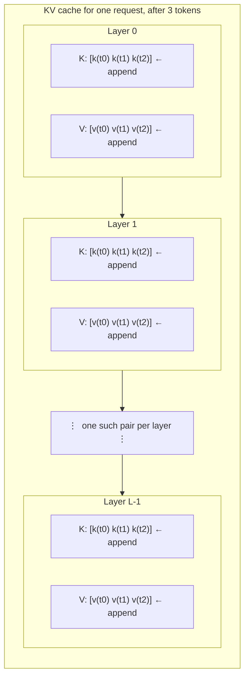

# 27.1 The KV cache

A language model generates text one token at a time, and each new token is
produced by a forward pass over *the whole conversation so far*. Written
naively, that means generating a 500-token answer runs the model 500 times
over a sequence that grows every step — and almost every number computed in
step 400 was already computed in step 399. The KV cache is the fix. It is a
dozen lines of code, it changes nothing about the model's output, and it turns
an unusable program into a usable one. It is also the reason your GPU runs out
of memory at long context lengths, which is the second half of this section.

## The redundant work, counted

Recall the shape of one attention layer from
[Section 26.2](../ch26-llm-internals/02-attention.md). Every token's vector is
projected into three vectors — a **query** $q$, a **key** $k$, and a **value**
$v$ — and the output for position $i$ is a weighted average of the values,
where the weights come from $q_i \cdot k_j$ for every $j \le i$ (causal
masking: a token may only look backwards).

Now watch what a naive generation loop does. At step $s$ it feeds the entire
sequence of $s$ tokens through the layer, producing $k$ and $v$ for all $s$
positions — but positions $0 \dots s-2$ are *exactly the same tokens with
exactly the same weights* as in the previous step, so their $k$ and $v$ are
bit-for-bit identical to what was computed a moment ago and thrown away. Only
the newest token is new.

Let us count, in the style of [Section 16.1](../ch16-complexity/01-big-o.md) —
operations first, stopwatch later. Two quantities matter: how many token
vectors get pushed through the projection matrices, and how many query-key
dot products get computed.

```python
def work(prompt_len, n_new):
    """Count the two kinds of work for generating n_new tokens."""
    no_cache_proj = no_cache_scores = cached_proj = cached_scores = 0
    for step in range(n_new):
        s = prompt_len + step                 # tokens already in the sequence
        # No cache: push the whole prefix through the projections again.
        no_cache_proj += s
        no_cache_scores += s * (s + 1) // 2   # causal: query i sees i+1 keys
        # With a cache: one new token in, one query against s stored keys.
        cached_proj += 1
        cached_scores += s
    return no_cache_proj, cached_proj, no_cache_scores, cached_scores

head = f"{'new':>6} | {'proj: none':>12} {'cached':>8} {'save':>8} | " \
       f"{'scores: none':>14} {'cached':>10} {'save':>7}"
print(head)
print("-" * len(head))
for n in [8, 32, 128, 512, 2048]:
    p_no, p_yes, s_no, s_yes = work(prompt_len=1, n_new=n)
    print(f"{n:>6} | {p_no:>12,} {p_yes:>8,} {p_no / p_yes:>7.1f}x | "
          f"{s_no:>14,} {s_yes:>10,} {s_no / s_yes:>6.1f}x")
```

Read the table as two separate Big-O stories.

**Projections.** Without a cache the count is $1 + 2 + \dots + n$, which is
$\Theta(n^2)$ — the same triangular sum that made bubble sort quadratic. With
a cache it is exactly $n$: $\Theta(n)$. At 2048 generated tokens that is
2,098,176 versus 2,048 — a factor of **1024.5**. This is the expensive half:
those projections are multiplications by the model's big weight matrices.

**Attention scores.** Without a cache, each step recomputes the full causal
score triangle: $\Theta(n^2)$ per step, $\Theta(n^3)$ overall. With a cache,
one query attends over $s$ keys: $\Theta(n)$ per step, $\Theta(n^2)$ overall.
The quadratic total is *irreducible* — attention genuinely looks at every
earlier token — but at $n = 2048$ the naive loop still computes 683× more
score entries than it needs to, and every one of the extras is a repeat.

!!! note "Two different quadratics"

    People say "attention is quadratic", and it is: total score computations
    grow as $\Theta(n^2)$ even with a perfect cache. That is a property of the
    algorithm. The quadratic the KV cache removes is a different one — the
    quadratic in *weight-matrix work* caused by re-projecting old tokens,
    which is an implementation accident. Fixing an accident is free; fixing
    the algorithm requires changing the model.

## What exactly is cached

The name is literal: the cache stores **K** and **V**. Not Q — a query is used
once, in the step that creates it, and never again. Not the attention output,
not the MLP activations: those depend on the current token and are cheap to
recompute for one token. Just two vectors per token, per layer, per KV head.



Every generated token appends **one column to every one of those arrays** and
never removes it. The cache is append-only, per request, and lives for the
entire lifetime of that request. That is the whole data structure — and, as
the next part shows, that is where the memory goes.

## The proof: one toy model, two loops, identical text

Here is the claim that matters: the KV cache is not an approximation. It
produces the same tokens, to floating-point round-off. The block below builds
a one-layer, single-head toy transformer with random weights (16-token vocab,
width 8) in the numpy style of
[Section 26.2](../ch26-llm-internals/02-attention.md), then generates greedily
twice — once recomputing everything, once with a cache — and compares.

```python
import numpy as np

rng = np.random.default_rng(0)
V, d, T_MAX = 16, 8, 64                      # vocab, model width, max positions
E = rng.normal(0, 0.6, size=(V, d))          # token embeddings (and unembedding)
POS = rng.normal(0, 0.1, size=(T_MAX, d))    # position vectors
Wq, Wk, Wv, Wo = (rng.normal(0, 0.5, size=(d, d)) for _ in range(4))
ops = {"proj": 0, "scores": 0}

def softmax(x):
    x = x - x.max(axis=-1, keepdims=True)
    e = np.exp(x)
    return e / e.sum(axis=-1, keepdims=True)

def forward_no_cache(ids):
    """Recompute everything from scratch, every single time."""
    n = len(ids)
    X = E[ids] + POS[:n]
    ops["proj"] += n
    Q, K, Vm = X @ Wq, X @ Wk, X @ Wv
    S = Q @ K.T / np.sqrt(d)
    causal = np.arange(n)[None, :] <= np.arange(n)[:, None]
    ops["scores"] += int(causal.sum())
    S = np.where(causal, S, -np.inf)
    H = softmax(S) @ Vm @ Wo
    return (X + H) @ E.T                     # residual, then unembed to logits

def forward_cached(new_ids, start, K_cache, V_cache):
    """Project only the new tokens; read every earlier K and V from the cache."""
    n = len(new_ids)
    X = E[new_ids] + POS[start:start + n]
    ops["proj"] += n
    Q, K, Vm = X @ Wq, X @ Wk, X @ Wv
    K_cache.extend(K)                        # <-- the entire optimization
    V_cache.extend(Vm)
    Kc, Vc = np.array(K_cache), np.array(V_cache)
    S = Q @ Kc.T / np.sqrt(d)
    q_pos = np.arange(start, start + n)[:, None]
    k_pos = np.arange(len(K_cache))[None, :]
    causal = k_pos <= q_pos
    ops["scores"] += int(causal.sum())
    S = np.where(causal, S, -np.inf)
    H = softmax(S) @ Vc @ Wo
    return (X + H) @ E.T

prompt, N_NEW = [3, 1, 4, 1, 5], 10

ops = {"proj": 0, "scores": 0}                       # ---- loop A: no cache ----
ids_a = list(prompt)
for _ in range(N_NEW):
    last_a = forward_no_cache(ids_a)[-1]
    ids_a.append(int(last_a.argmax()))
ops_a = dict(ops)

ops = {"proj": 0, "scores": 0}                       # ---- loop B: cached ----
K_cache, V_cache = [], []
ids_b = list(prompt)
last_b = forward_cached(ids_b, 0, K_cache, V_cache)[-1]        # prefill
ids_b.append(int(last_b.argmax()))
while len(ids_b) < len(prompt) + N_NEW:                        # decode, 1 at a time
    last_b = forward_cached([ids_b[-1]], len(ids_b) - 1, K_cache, V_cache)[-1]
    ids_b.append(int(last_b.argmax()))
ops_b = dict(ops)

print("no cache :", ids_a)
print("cached   :", ids_b)
print("same output?", ids_a == ids_b)
print("largest difference in the final logits:", float(np.abs(last_a - last_b).max()))
print()
print(f"projections   no cache {ops_a['proj']:>6}   cached {ops_b['proj']:>6}"
      f"   ({ops_a['proj'] / ops_b['proj']:.1f}x)")
print(f"score entries no cache {ops_a['scores']:>6}   cached {ops_b['scores']:>6}"
      f"   ({ops_a['scores'] / ops_b['scores']:.1f}x)")
print("cache holds", len(K_cache), "K and", len(V_cache), "V vectors of width", d)
```

The two token lists are identical and the largest logit difference is around
$10^{-15}$ — the noise floor of float64 arithmetic, not a real disagreement
(numpy sums a length-15 matrix product in a different order than a length-1
one). Meanwhile the cached loop did 14 projections instead of 95, and 105
score entries instead of 540.

Three details worth naming, because real servers have all three:

- The cached run has **two phases**. The first call processes all five prompt
  tokens at once — that is **prefill**. Every later call processes exactly one
  token — that is **decode**. Same function, wildly different cost profiles.
- The cache ends with 14 entries for 15 tokens: the very last generated token
  is never fed back in, so it never gets a K or V.
- The toy model repeats itself (`11, 11, 11, ...`). Of course it does — its
  weights are random noise, and greedy decoding on a fixed-point distribution
  loops forever. Sampling ([Section 26.4](../ch26-llm-internals/04-sampling.md))
  would hide it. Nothing about the cache is affected.

## How big does it get? The memory formula

Per token, the cache stores K and V (that is the 2), for every layer $L$, for
every key/value head $H_{kv}$, each of width $d_{head}$, at $b$ bytes per
number:

$$
\text{KV bytes} \;=\; 2 \times L \times H_{kv} \times d_{head} \times n_{tokens} \times b
$$

Multiply by the number of concurrent requests. Notice how few of these terms
you control: $n_{tokens}$ and the number of concurrent requests are runtime
decisions, but $L$, $H_{kv}$, and $d_{head}$ are fixed the moment you pick a
model, and $b$ is fixed by the precision you serve at. In fp16, $b = 2$.

The one term worth staring at is $H_{kv}$. Classic **multi-head attention**
(MHA) gives every query head its own key/value head. **Grouped-query
attention** (GQA) lets several query heads share one KV head, and
**multi-query attention** (MQA) takes it to the limit: all query heads share a
single KV head. The query heads are unchanged; only the cache shrinks. That is
why nearly every model released for serving uses GQA.

```python
GB = 1e9                                  # we report memory with GB = 10**9 bytes

def kv_bytes(layers, kv_heads, head_dim, n_tokens, bytes_per_elt=2):
    """2 (K and V) x layers x KV heads x head dim x tokens x bytes."""
    return 2 * layers * kv_heads * head_dim * n_tokens * bytes_per_elt

# (label, layers, KV heads, head_dim) -- shapes of widely deployed open models.
CONFIGS = [
    ("7B   MHA   (32 L, 32 KV heads)", 32, 32, 128),
    ("8B   GQA-8 (32 L,  8 KV heads)", 32, 8, 128),
    ("7B   MQA-1 (32 L,  1 KV head )", 32, 1, 128),
    ("70B  MHA   (80 L, 64 KV heads)", 80, 64, 128),
    ("70B  GQA-8 (80 L,  8 KV heads)", 80, 8, 128),
]

head = (f"{'configuration (fp16)':<32} {'MB/token':>9} {'4k ctx':>9} "
        f"{'32k ctx':>9} {'128k ctx':>10} {'reqs in 40GB':>13}")
print(head)
print("-" * len(head))
for name, L, H_kv, d_head in CONFIGS:
    per_token = kv_bytes(L, H_kv, d_head, 1)
    sizes = [kv_bytes(L, H_kv, d_head, ctx) / GB for ctx in (4096, 32768, 131072)]
    fits = int(40 * GB / kv_bytes(L, H_kv, d_head, 4096))
    print(f"{name:<32} {per_token / 1e6:>8.3f}  {sizes[0]:>8.2f}  {sizes[1]:>8.2f}  "
          f"{sizes[2]:>9.2f}  {fits:>12}")

mha = kv_bytes(80, 64, 128, 4096)
gqa = kv_bytes(80, 8, 128, 4096)
print(f"\n70B: GQA-8 uses {mha / gqa:.0f}x less KV memory than MHA "
      f"({mha / GB:.1f} GB -> {gqa / GB:.1f} GB at 4k tokens)")
```

This table is the "why your GPU OOMs" moment. Take the first row — the shape
of a 7B model with plain multi-head attention. Every token costs **0.524 MB**
of cache. A single 128k-token conversation therefore needs **68.7 GB** of KV
cache *on top of* the 14 GB of fp16 weights: more than an 80 GB card has, for
**one user**. At a comfortable 4k context you can hold 18 concurrent requests
in a 40 GB cache budget — not 18 thousand, 18. Switch to GQA with 8 KV heads
and the same budget holds 74; the 70B GQA row is 8× cheaper than the same
model would be with MHA, which the block verifies by printing the ratio.

!!! tip "Sanity-check your own model"

    Every Hugging Face model directory has a `config.json` listing
    `num_hidden_layers`, `num_attention_heads`, `num_key_value_heads`, and
    `hidden_size` (with $d_{head} = \text{hidden\_size} / \text{num\_attention\_heads}$).
    Put those four numbers into `kv_bytes` and you know, before you launch
    anything, how many tokens fit in your GPU.

## Prefill and decode are different machines

The split we noticed in the toy loop is the most consequential fact in LLM
serving, and it is a *hardware* fact. During prefill, the model multiplies its
weight matrices by a matrix of hundreds or thousands of token vectors: each
weight, once loaded from memory, is used many times. During decode, the same
weights are multiplied by a *single* vector: every weight is loaded from
memory, used once, and discarded.

So the question for each phase is which resource runs out first — arithmetic
or memory traffic. Both are just division:

```python
PARAMS = 7e9          # 7B model
W_BYTES = 2           # fp16
BANDWIDTH = 2.0e12    # bytes/second of memory bandwidth  (illustrative)
COMPUTE = 150e12      # FLOP/second actually achieved     (illustrative)

weights = PARAMS * W_BYTES
print(f"weights: {weights / 1e9:.0f} GB   "
      f"time to read them once: {1e3 * weights / BANDWIDTH:.2f} ms")
print(f"balance point: {COMPUTE / BANDWIDTH:.0f} FLOP per byte of bandwidth\n")

hdr = (f"{'phase':<28} {'tokens/step':>11} {'memory ms':>10} "
       f"{'compute ms':>11} {'bound by':>16}")
print(hdr)
print("-" * len(hdr))
for label, tokens in [("decode, batch 1", 1), ("decode, batch 8", 8),
                      ("decode, batch 64", 64), ("prefill, 500-token prompt", 500),
                      ("prefill, 2000-token prompt", 2000)]:
    t_mem = 1e3 * weights / BANDWIDTH                 # read every weight once
    t_cmp = 1e3 * 2 * PARAMS * tokens / COMPUTE       # ~2 FLOPs per parameter per token
    bound = "memory bandwidth" if t_mem > t_cmp else "compute"
    print(f"{label:<28} {tokens:>11} {t_mem:>10.2f} {t_cmp:>11.2f} {bound:>16}")

crossover = W_BYTES * COMPUTE / (2 * BANDWIDTH)
print(f"\ncrossover: a step becomes compute-bound above {crossover:.0f} tokens")
print(f"batch-1 decode ceiling: {1 / (weights / BANDWIDTH):.0f} tokens/second")
```

The bandwidth and FLOP numbers above are stand-ins in the range of a
datacenter GPU of the 2020s; substitute your own card's specifications and
rerun. The *structure* of the answer is what generalizes, and it is stark:

- Reading 14 GB of weights at 2 TB/s takes **7 ms**. Every decode step pays
  it. That alone caps a single unbatched user at about **143 tokens/second**,
  no matter how fast the arithmetic units are.
- The arithmetic in that same step takes **0.09 ms** — the GPU's multipliers
  are idle roughly 99% of the time. Decode is **memory-bandwidth-bound**.
- Prefilling a 2000-token prompt does the same 7 ms of reading but 186 ms of
  arithmetic. Prefill is **compute-bound**.
- The crossover is **75 tokens per step**. Below it you are wasting compute;
  above it you are wasting nothing.

That single number, 75, explains the next section before we get there: if a
step is memory-bound at one token and compute-bound at 75, then processing 64
requests at once costs almost exactly what processing one costs. Batching is
not a clever trick — it is picking up free money left on the floor by the
memory bus.

## Prefix caching: the cache that outlives the request

The KV cache is per request, but the *beginning* of many requests is
identical. A chat product prepends the same 2000-token system prompt to every
call; a coding agent resends the same file; a RAG system reuses the same
retrieved document across follow-ups. Those tokens produce identical K and V
every time (same tokens, same positions, same weights), so a server can keep
the prefix's blocks around and let new requests point at them — **prefix
caching**, also called automatic prefix caching. It is the same idea as
hashing a computation's inputs to skip the computation, applied to the first
$p$ positions of a sequence.

```python
SYSTEM, UNIQUE, N_REQ = 2000, 50, 100     # shared prompt, per-request tail, requests
PARAMS, COMPUTE = 7e9, 150e12             # 7B model, illustrative FLOP/s
KV_PER_TOKEN = 2 * 32 * 32 * 128 * 2      # 7B MHA, fp16: bytes of cache per token

cold = N_REQ * (SYSTEM + UNIQUE)          # everyone prefills the system prompt
warm = SYSTEM + N_REQ * UNIQUE            # prefilled once, then reused
print(f"prompt tokens prefilled, no prefix cache: {cold:>9,}")
print(f"prompt tokens prefilled, prefix cached  : {warm:>9,}")
print(f"reduction: {cold / warm:.1f}x  "
      f"({100 * (1 - warm / cold):.1f}% of the prefill work skipped)\n")

for label, toks in [("no prefix cache", cold), ("prefix cached", warm)]:
    seconds = 2 * PARAMS * toks / COMPUTE
    print(f"{label:<18} {toks:>9,} tokens  ~{seconds:>5.2f} s of prefill compute")

print()
print(f"KV memory, one copy per request : {N_REQ * (SYSTEM + UNIQUE) * KV_PER_TOKEN / 1e9:>6.1f} GB")
print(f"KV memory, shared prefix blocks : {(SYSTEM + N_REQ * UNIQUE) * KV_PER_TOKEN / 1e9:>6.1f} GB")
```

**29.3× less prefill work** and **107.5 GB of cache collapsing to 3.7 GB** —
from a cache hit, not a faster model. This is why prompt layout is an
engineering decision: put the stable material (system prompt, tool
definitions, the long document) *first* and the volatile material (the user's
new question) *last*. A prefix cache can only reuse an exact prefix; one
changed character near the top — a timestamp, a shuffled tool list — misses
everything after it. Prefix caching also requires the sharing machinery of
[Section 27.2](02-batching.md): you cannot share blocks between requests if
each request owns one private contiguous slab of memory.

!!! warning "Common mistakes"

    - **Thinking the KV cache changes the output.** It does not. It is pure
      memoization of values that are mathematically identical either way — as
      the two-loop demo prints. If caching changes your results, you have a
      bug (usually in position indices), not a tradeoff.
    - **Believing the KV cache makes attention linear.** It removes the
      *repeated* work. Total attention scores still grow as $\Theta(n^2)$,
      and cache memory still grows as $\Theta(n)$ per request. Long context
      is expensive even done perfectly.
    - **Forgetting that the cache is per request.** Sizing memory for one
      user and then serving 50 concurrently is the single most common OOM.
      Multiply the formula by batch size *before* choosing `max_model_len`.
    - **Assuming more GPU memory means more speed.** Extra memory buys more
      concurrent tokens of cache; decode speed is set by memory *bandwidth*
      and the model's size, not capacity.
    - **Putting the volatile part of a prompt first.** A user id or timestamp
      at the top of an otherwise fixed system prompt destroys every prefix
      cache hit for a 96% saving you never see.

## Check your understanding

1. A colleague says "we do not need a KV cache; attention is quadratic
   anyway." What is wrong with the reasoning?

    ??? success "Answer"
        Two different quadratics are being conflated. Attention score work is
        $\Theta(n^2)$ in total *even with* a perfect cache — that is
        irreducible. The cache eliminates a *separate* $\Theta(n^2)$ cost:
        re-projecting all previous tokens through the model's weight
        matrices, which should be $\Theta(n)$. Those projections are the
        expensive part (they involve the big weight matrices), and the demo
        counted a 1024× saving on them at 2048 tokens.

2. Model A: 32 layers, 32 KV heads, $d_{head}=128$. Model B: identical, but
   with 8 KV heads (GQA). At fp16, how much KV cache does each need for a
   single 8192-token conversation, and what is the ratio?

    ??? success "Answer"
        $2 \times 32 \times 32 \times 128 \times 8192 \times 2 = 4.29$ GB for
        model A, and one quarter of that, $1.07$ GB, for model B — a ratio of
        exactly $32/8 = 4$. Only $H_{kv}$ changed, and the formula is linear
        in it. Run `kv_bytes(32, 32, 128, 8192)` and `kv_bytes(32, 8, 128, 8192)`
        to confirm.

3. Why is decode memory-bandwidth-bound while prefill is compute-bound, when
   both run exactly the same model?

    ??? success "Answer"
        Because arithmetic intensity depends on how many tokens share each
        weight read. Decode multiplies each weight by one token vector: about
        2 FLOPs per 2 bytes read, so the memory bus finishes last. Prefill
        multiplies each weight by hundreds of token vectors: the same bytes
        are read once and reused, so the multipliers finish last. In the
        block's illustrative numbers the crossover sits at 75 tokens per
        step.

4. A chat service prepends a 2000-token system prompt to every request and
   appends the current time to it, "for context". What does that cost?

    ??? success "Answer"
        Every prefix-cache hit, because the shared prefix is no longer
        shared — the timestamp differs per request, so the cached blocks
        cannot be reused (a prefix cache matches an *exact* token prefix).
        In the demo's setting that is the difference between 7,000 and
        205,000 prefilled tokens, roughly 29× more prefill work and 100
        separate copies of the same cache. Move volatile text to the end of
        the prompt.
