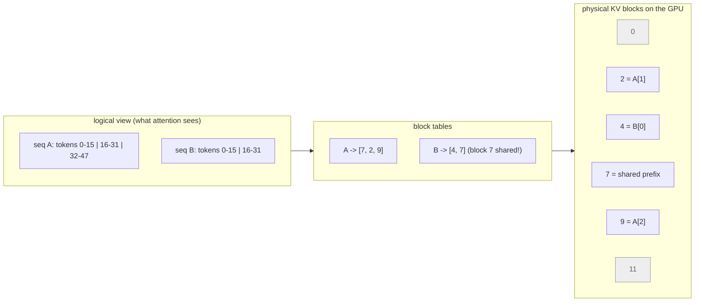

# 27.2 Batching, PagedAttention, chunked prefill

[Section 27.1](01-kv-cache.md) ended on a number that should have bothered
you: a single user decoding from a 7B model spends about 7 ms per step moving
weights across the memory bus and about 0.09 ms doing arithmetic. The
multipliers on a datacenter GPU — the part you are paying for — sit idle
roughly 99% of the time. This section is about filling that idle time, and it
is pure systems engineering: scheduling, memory allocation, and queueing.
Nothing here changes the model's output by a single token. Everything here
changes how many users one GPU can serve, and by how much. This is where
"vLLM is fast" stops being a slogan and becomes a set of three specific
ideas you can simulate.

## Why batching exists: the free lunch on the memory bus

The weights are read once per step *regardless of how many sequences are in
the step*. Sixteen users' token vectors can be stacked into one matrix and
multiplied by the same weight matrix in one pass.

So the memory cost of a step is **flat** in the batch size while the
arithmetic cost is **linear** in it. Since the memory cost dominates at batch
1, the first few dozen users are, near enough, free.

```python
PARAMS, W_BYTES = 7e9, 2         # 7B model, fp16 weights
BANDWIDTH, COMPUTE = 2.0e12, 150e12    # bytes/s and FLOP/s — illustrative
KV_PER_TOKEN = 2 * 32 * 8 * 128 * 2    # GQA-8 shape: 32 layers, 8 KV heads, 128
CTX = 2048                             # tokens per request, for the KV column

weights = PARAMS * W_BYTES
t_mem = 1e3 * weights / BANDWIDTH      # ms to stream the weights once

def step_ms(batch):
    """One decode step: read all weights (flat), do 2 FLOPs/param/token."""
    return max(t_mem, 1e3 * 2 * PARAMS * batch / COMPUTE)

hdr = (f"{'batch':>6} {'step ms':>8} {'total tok/s':>12} {'per-user tok/s':>15} "
       f"{'KV needed GB':>13}")
print(hdr)
print("-" * len(hdr))
for b in [1, 2, 8, 32, 64, 128, 256]:
    ms = step_ms(b)
    print(f"{b:>6} {ms:>8.2f} {1000 * b / ms:>12,.0f} {1000 / ms:>15.1f} "
          f"{b * CTX * KV_PER_TOKEN / 1e9:>13.1f}")

print(f"\nweight-read floor: {t_mem:.2f} ms per step, paid at every batch size")
print(f"batch 64 serves 64 users at {1000 / step_ms(64):.1f} tok/s each — "
      f"exactly the speed one user gets alone ({1000 / step_ms(1):.1f})")
```

Read the `per-user tok/s` column downwards. It has two regimes:

- **Batch 1 to 64: constant at 142.9.** Those 64 users each get exactly the
  speed a lone user would get, while total throughput climbs from 143 to
  9,143 tokens per second — a 64× improvement for free.
- **Past 64: the step becomes compute-bound** (Section 27.1's crossover was 75
  tokens per step). Total throughput flattens near 10,700 tok/s, and each
  additional user now *slows everybody down* — at batch 256 a user gets
  41.9 tok/s instead of 142.9.

Now read the last column, because it moves the ceiling before compute ever
does. Batch 256 at a 2048-token context needs **68.7 GB** of KV cache, and the
model's fp16 weights already claimed 14 GB of the same card: 82.7 GB in total,
which does not fit in 80 GB.

**Long before compute becomes the limit, *memory* is.** That is the whole
reason PagedAttention exists, and we come back to it below.

!!! note "What is illustrative here"
    `BANDWIDTH` and `COMPUTE` are round stand-ins in the range of a 2020s
    datacenter GPU, and the model ignores KV-cache reads (which grow with
    context and make large batches slightly worse than shown). Substitute your
    own card's numbers and rerun — the *shape* of the table, flat then
    linear, is what generalizes.

## Static batching and the head-of-line problem

The obvious way to batch is the way you would batch anything:

1. Collect $B$ requests.
2. Run them together.
3. Return all $B$ results.
4. Collect the next $B$.

This is **static batching**, and it has a fatal interaction with the fact that
different requests generate wildly different numbers of tokens. "What is 2+2?"
needs three tokens. "Write me a design document" needs eight hundred.

In a static batch the short request's slot is *held* until the longest member
of its batch finishes. The GPU keeps computing a padded, meaningless position
for it, and the user does not get their answer until then either. That is
**head-of-line blocking**, the same pathology a single-server queue has when a
big job arrives first.

Here is a discrete-event simulation. Eight requests all arrive at once, the
batch capacity is four, and one decode step takes the same time for everyone.

```python
STEP_MS = 25.0                                  # illustrative decode-step time
OUTPUT_LENS = [10, 3, 25, 5, 40, 8, 15, 4]      # tokens each request will emit
CAPACITY = 4                                    # sequences the GPU runs at once

def static_batching(lens, capacity):
    """Fill a batch, run it until the LONGEST member finishes, then refill."""
    n = len(lens)
    start, gen_end, done = [0] * n, [0] * n, [0] * n
    t = 0
    for b in range(0, n, capacity):
        group = list(range(b, min(b + capacity, n)))
        for i in group:
            start[i], gen_end[i] = t, t + lens[i]
        t = max(gen_end[i] for i in group)      # the batch ends together ...
        for i in group:
            done[i] = t                         # ... so nobody leaves early
    return start, gen_end, done, t

def timeline(label, lens, start, gen_end, done, makespan):
    print(f"{label}   ('.' waiting, '#' generating, '-' slot wasted)")
    for i, ln in enumerate(lens):
        row = ("." * start[i] + "#" * ln + "-" * (done[i] - gen_end[i]))
        print(f"  R{i} out={ln:>3} |{row:<{makespan}}| done at step {done[i]:>3}")
    useful = sum(lens)
    slots = CAPACITY * makespan
    print(f"  makespan {makespan} steps ({makespan * STEP_MS / 1000:.2f} s)   "
          f"slot utilisation {useful}/{slots} = {100 * useful / slots:.1f}%")
    print(f"  mean latency {STEP_MS * sum(done) / len(done):.0f} ms   "
          f"worst {STEP_MS * max(done):.0f} ms")

s, g, d, mk = static_batching(OUTPUT_LENS, CAPACITY)
timeline("STATIC BATCHING", OUTPUT_LENS, s, g, d, mk)
```

Two rows in that timeline tell the whole story:

- **`R1`** finishes generating after 3 steps, then holds a slot for 22 more,
  contributing nothing.
- **`R4` through `R7`** wait 25 steps in the queue before they are even
  *started*, because their batch cannot form until the previous one drains.

The totals follow: slot utilisation is **42.3%** — more than half the GPU's
batch slots are computing padding — and mean latency is **1125 ms** when the
average request only needs 14 steps of real work.

## Continuous batching: schedule per iteration, not per batch

The fix is to stop thinking in batches and start thinking in *steps*. Before
every single decode iteration, the scheduler:

1. Asks which sequences are still alive.
2. Refills any slot freed by a sequence that just emitted its end-of-sequence
   token, *immediately*, from the waiting queue.
3. Runs exactly one step for whatever is now in the batch.

Sequences join and leave a running batch continuously — hence **continuous
batching**, also called **iteration-level scheduling** (Yu et al., Orca, 2022;
it is what vLLM, TGI, TensorRT-LLM, and SGLang all do).

The change to the simulation is small, which is exactly the point:

```python
# continues
def continuous_batching(lens, capacity):
    """Refill any free slot before every step; finished sequences leave at once."""
    waiting, active = list(range(len(lens))), {}
    start, done = [0] * len(lens), [0] * len(lens)
    t = 0
    while waiting or active:
        while waiting and len(active) < capacity:      # admit before stepping
            i = waiting.pop(0)
            active[i], start[i] = lens[i], t
        t += 1                                         # one decode step
        for i in list(active):
            active[i] -= 1
            if active[i] == 0:                         # emitted <eos>: leave now
                done[i] = t
                del active[i]
    return start, done, t

s2, d2, mk2 = continuous_batching(OUTPUT_LENS, CAPACITY)
timeline("CONTINUOUS BATCHING", OUTPUT_LENS,
         s2, [s2[i] + OUTPUT_LENS[i] for i in range(len(OUTPUT_LENS))], d2, mk2)

print()
print(f"{'metric':<24}{'static':>10}{'continuous':>13}{'change':>12}")
for name, a, b, unit in [
        ("makespan (steps)", mk, mk2, ""),
        ("slot utilisation (%)", 100 * sum(OUTPUT_LENS) / (CAPACITY * mk),
         100 * sum(OUTPUT_LENS) / (CAPACITY * mk2), ""),
        ("mean latency (ms)", STEP_MS * sum(d) / len(d),
         STEP_MS * sum(d2) / len(d2), ""),
        ("worst latency (ms)", STEP_MS * max(d), STEP_MS * max(d2), "")]:
    print(f"{name:<24}{a:>10.1f}{b:>13.1f}{b / a:>11.2f}x")
```

Same eight requests, same GPU, same batch capacity of four:

| | Static | Continuous |
| --- | --- | --- |
| Scheduling decision | once per batch | once per **iteration** |
| A finished sequence | holds its slot until the batch drains | leaves immediately |
| A waiting request | waits for a whole batch to form | is admitted the step a slot frees |
| Makespan (8 requests) | 65 steps | **43 steps** |
| Slot utilisation | 42.3% | **64.0%** |
| Mean latency | 1125 ms | **441 ms** (2.55× better) |

Nothing was made faster. Work was simply not wasted.

Two details in the timeline repay a close look:

- **`R1`, the three-token request**, now completes at step 3 instead of step
  25 — an eight-fold latency win for the request static batching punished
  hardest.
- **`R4`, the 40-token request**, now starts at step 3 instead of step 25, so
  the long tail begins earlier and the whole workload ends sooner.

!!! note "What is simulated"
    Every number above comes from this simulator, not from a benchmark: a
    fixed per-step cost, no prefill, no memory limit, instant admission. Real
    schedulers also weigh KV-cache availability, preemption, and prefill
    interleaving. What the simulation captures faithfully is the *mechanism* —
    a slot held by a finished sequence is a wasted slot, and per-iteration
    admission is what stops that from happening.

## PagedAttention: virtual memory for the KV cache

Continuous batching creates a memory problem. If sequences come and go every
step, and each one needs a KV cache that grows unpredictably, how do you lay
that cache out?

The naive answer is to give every sequence one contiguous slab big enough for
the worst case — `max_model_len` tokens. That produces both classic
fragmentation problems at once:

- **Internal fragmentation.** A request that uses 300 of its 2048 reserved
  tokens has wasted 85% of its allocation, and that waste is memory no other
  request can touch.
- **External fragmentation.** As requests of different sizes come and go, the
  free memory left behind ends up scattered in holes that are individually too
  small to host a new request even when their total is plenty.

If this sounds familiar, it should: it is exactly the problem operating systems
solved decades ago. [Section 23.2](../ch23-os/02-memory-layout.md) described
how each process sees its own private, apparently contiguous address space.
The trick that makes that possible is **paging**:

1. Cut physical memory into fixed-size **pages**.
2. Cut the process's contiguous view into equally sized virtual pages.
3. Keep a **page table** mapping one to the other.

The process's memory looks like one unbroken run; physically it is scattered
wherever pages happened to be free. External fragmentation disappears
entirely, and internal fragmentation is capped at less than one page per
allocation.

**PagedAttention** (Kwon et al., 2023 — the paper that introduced vLLM) is
that idea applied to the KV cache. The cache is cut into fixed-size
**blocks** holding a fixed number of tokens each (16 is a common default).
Each sequence gets a **block table**: a list saying which physical block
holds its tokens 0–15, which holds 16–31, and so on. Blocks need not be
adjacent, so a sequence grows by grabbing any free block.



Two payoffs fall straight out of the diagram:

- **Waste per sequence collapses** from "whatever you reserved minus what you
  used" to "at most 15 unused token slots in the last block".
- **Prefixes can be shared.** Two sequences whose token prefixes are identical
  simply *point their block tables at the same physical block*, the way two
  processes share a read-only page of a library, with copy-on-write handling
  the moment they diverge. This is what makes the prefix caching of Section
  27.1 possible at all.

Let us measure both kinds of fragmentation. Twelve requests with realistic,
seeded sequence lengths, a `max_model_len` of 2048, and a 16-token block:

```python
import numpy as np

BLOCK, MAX_LEN = 16, 2048              # tokens per block; worst-case reservation
KV_PER_TOKEN = 2 * 32 * 8 * 128 * 2    # GQA-8 fp16: bytes of KV cache per token
POOL_GB = 8.0                          # KV memory left over after the weights

rng = np.random.default_rng(7)
lens = sorted(int(x) for x in rng.integers(60, 900, size=12))

blocks_needed = [-(-n // BLOCK) for n in lens]          # ceiling division
paged_tokens = [b * BLOCK for b in blocks_needed]
used = sum(lens)

print(f"{'req':>4}{'tokens':>8}{'contiguous':>12}{'paged':>8}{'paged waste':>13}")
for i, (n, p) in enumerate(zip(lens, paged_tokens)):
    print(f"{i:>4}{n:>8}{MAX_LEN:>12}{p:>8}{p - n:>13}")

contig = len(lens) * MAX_LEN
print(f"\ntokens actually used      : {used:>8,}")
print(f"tokens reserved, contiguous: {contig:>8,}  "
      f"wasted {100 * (1 - used / contig):>5.1f}%")
print(f"tokens reserved, paged     : {sum(paged_tokens):>8,}  "
      f"wasted {100 * (1 - used / sum(paged_tokens)):>5.1f}%")

pool_tokens = int(POOL_GB * 1e9 / KV_PER_TOKEN)
avg = sum(paged_tokens) / len(paged_tokens)
print(f"\nwith {POOL_GB:.0f} GB of KV pool = {pool_tokens:,} token slots:")
print(f"  contiguous, {MAX_LEN}-token reservations : "
      f"{pool_tokens // MAX_LEN:>4} concurrent requests")
print(f"  paged, average {avg:.0f} tokens per request : "
      f"{int(pool_tokens // avg):>4} concurrent requests")
```

Contiguous preallocation wastes **72.9%** of the memory it holds; paging
wastes **1.4%**, and never more than 15 tokens per request. In the same 8 GB
pool that is 29 concurrent requests versus 108 — a **3.7× larger batch** from
an allocator change alone. And a larger batch, per the first table on this
page, is directly more throughput.

External fragmentation is the second, sneakier win. A contiguous allocator
can fail to place a request while holding plenty of free memory:

```python
# continues
class ContiguousPool:
    """First-fit over one slab. Requests need one unbroken run of slots."""
    def __init__(self, size):
        self.free = [(0, size)]                     # (start, length) runs
    def alloc(self, n):
        for idx, (start, length) in enumerate(self.free):
            if length >= n:
                self.free[idx] = (start + n, length - n)
                return start
        return None                                 # fails: no run is big enough
    def free_total(self):
        return sum(length for _, length in self.free)

pool = ContiguousPool(1000)
a, b, c = pool.alloc(300), pool.alloc(200), pool.alloc(300)
pool.free.append((a, 300))                          # request A finishes ...
pool.free.append((c, 300))                          # ... and so does C
print("free slots in total :", pool.free_total())
print("free runs           :", sorted(pool.free))
print("can we place a 400-slot request?", pool.alloc(400) is not None)
print("largest single run  :", max(length for _, length in pool.free))
print("\npaged allocator: needs", -(-400 // BLOCK), "free blocks anywhere —",
      "placement never fails while enough total blocks exist")
```

800 slots free, and a 400-slot request cannot be placed, because the free
space is three runs of 300, 200 and 300. A paged allocator only needs 25 free
blocks *somewhere*, so it succeeds. Fixed-size blocks turn a hard packing
problem into simple counting — the same reason your OS uses pages.

## Chunked prefill: stop letting long prompts freeze everyone

One problem survives all of the above. Prefill and decode compete for the same
GPU, and they have wildly different sizes: a 4000-token prefill is a single
step that takes *hundreds* of milliseconds, while a decode step takes about 7.

If the scheduler runs that prefill as one indivisible step, every user
currently streaming tokens sees their stream freeze for the duration. Their
time-to-first-token was fine; their *inter-token latency* just spiked by half a
second, which readers notice immediately.

**Chunked prefill** splits the prompt into fixed-size pieces and processes one
piece per step, alongside the decode tokens of everyone else. The prompt takes
the same total work, spread over more steps; the decoders never stall for
longer than one chunk.

```python
PARAMS, BANDWIDTH, COMPUTE = 7e9, 2.0e12, 150e12    # illustrative, as before
PROMPT, DECODERS = 4000, 8         # one long prompt; 8 users already streaming
t_mem = 1e3 * PARAMS * 2 / BANDWIDTH

def step_ms(tokens):
    return max(t_mem, 1e3 * 2 * PARAMS * tokens / COMPUTE)

hdr = (f"{'chunk':>7} {'steps':>6} {'step ms':>9} {'TTFT ms':>9} "
       f"{'worst stall ms':>15} {'TTFT cost':>10}")
print(hdr)
print("-" * len(hdr))
base = None
for chunk in [PROMPT, 2048, 1024, 512, 256, 128, 64]:
    steps = -(-PROMPT // chunk)
    ms = step_ms(chunk + DECODERS)      # chunk of prefill + one token per decoder
    ttft = steps * ms
    base = base if base is not None else ttft
    label = "none" if chunk == PROMPT else str(chunk)
    print(f"{label:>7} {steps:>6} {ms:>9.1f} {ttft:>9.1f} {ms:>15.1f} "
          f"{ttft / base:>9.2f}x")
print(f"\nmemory-bound floor for any step: {t_mem:.1f} ms")
```

The tradeoff is laid out in two columns. Going from no chunking to 256-token
chunks:

- **costs the long prompt 5.4% more time-to-first-token** (374 ms → 394 ms);
- **cuts the worst stall every other user suffers by 15.2×** (374 ms →
  24.6 ms).

That is an outstanding trade, and it is why chunked prefill is on by default in
current serving stacks. Push the chunk down to 64 and the step time hits the
7.0 ms memory-bandwidth floor — below that, chunks are too small to use the GPU
at all and TTFT rises 18% for no further gain.

**The sweet spot is the smallest chunk that still keeps the step
compute-bound.**

## What this looks like on a real server

You cannot run any of this in the browser, so here is what invoking it
actually looks like. **vLLM** is the reference implementation of continuous
batching and PagedAttention; it exposes an HTTP server with an
OpenAI-compatible API.

```console
$ pip install vllm
$ vllm serve meta-llama/Llama-3.1-8B-Instruct \
      --max-model-len 8192 \
      --gpu-memory-utilization 0.90 \
      --max-num-seqs 64
INFO  Starting vLLM API server on http://0.0.0.0:8000
INFO  Loading model weights ... 16.1 GB
INFO  KV cache: 53.0 GiB -> 27,136 blocks of 16 tokens (434,176 tokens)
```

(The log lines are paraphrased and the sizes are for an 80 GB card; your
version will word them differently.)

Three flags map onto three things you have now computed by hand:

- **`--max-model-len`** — the largest prompt-plus-output a request may have.
  It caps the per-request term $n_{tokens}$ in the KV formula.
- **`--gpu-memory-utilization`** — the fraction of the card vLLM may claim.
  Whatever is left after the weights becomes the paged KV block pool, and the
  startup log reports how many blocks that bought.
- **`--max-num-seqs`** — the batch capacity, exactly `CAPACITY` in the
  simulation above.

Sending a request is ordinary HTTP:

```console
$ curl http://localhost:8000/v1/chat/completions \
      -H 'Content-Type: application/json' \
      -d '{"model": "meta-llama/Llama-3.1-8B-Instruct",
           "messages": [{"role": "user", "content": "Explain paging."}],
           "max_tokens": 128, "stream": true}'
```

The exact log lines and default settings move between releases — recent
versions turn prefix caching and chunked prefill on by default, and options
get renamed — so treat this as the shape of the thing and check
`vllm serve --help` for your version. The *concepts* are stable; the flag
names are not.

!!! warning "Common mistakes"

    - **Raising batch size to fix latency.** Batching improves *throughput*.
      Past the compute-bound crossover it makes every individual user slower,
      as the first table's `per-user tok/s` column shows dropping from 142.9
      to 41.9.
    - **Sizing the batch from compute and forgetting KV memory.** The batch
      you can afford is almost always set by cache capacity, not FLOPs — batch
      256 at 2k context needs 68.7 GB of KV on top of 14 GB of weights.
    - **Believing PagedAttention makes the model faster.** It changes memory
      *allocation*, so more sequences fit; the speedup is entirely a
      consequence of the bigger batch and of prefix sharing.
    - **Assuming continuous batching removes queueing.** It removes waiting on
      *unrelated finished* sequences. If every slot is busy with a long
      generation, new requests still wait — as `R4` does for three steps.
    - **Benchmarking with uniform output lengths.** Every advantage of
      continuous batching comes from *variance* in output length. Give every
      request the same `max_tokens` and the two strategies look identical,
      which is exactly the benchmark not to trust.

## Check your understanding

1. In the first table, per-user speed is identical at batch 1 and batch 64,
   then falls. What changes at that point, and where does the boundary come
   from?

    ??? success "Answer"
        Below the crossover, the step time is set by streaming the weights,
        which happens once no matter how many sequences share the step — so
        adding users is free. Above it, the arithmetic (2 FLOPs per parameter
        per token, linear in batch) takes longer than the memory traffic, and
        the step time starts to grow with the batch. The boundary is
        `bytes_per_weight × FLOP/s ÷ (2 × bytes/s)`, which in Section 27.1's
        illustrative numbers is 75 tokens per step.

2. Eight requests with output lengths 5, 5, 5, 5, 5, 5, 5, 400 run with
   capacity 4. Roughly what does static batching cost you compared with
   continuous batching, and why?

    ??? success "Answer"
        Run it and the answer is more interesting than "continuous wins".
        Under static batching the completion steps are
        `[5, 5, 5, 5, 405, 405, 405, 405]`; under continuous batching they are
        `[5, 5, 5, 5, 10, 10, 10, 405]`. The **makespan is 405 either way** —
        one request needs 400 sequential steps and nothing can shorten that.
        What changes is that three short requests stop being held hostage by
        the long one: their latency falls from 405 steps to 10, a 40× cut,
        while throughput is unchanged. Continuous batching redistributes
        waiting; it does not manufacture capacity. Modify `OUTPUT_LENS` in the
        simulation above to confirm.

3. Why can a paged KV allocator satisfy a request that a contiguous allocator
   refuses, even though both have the same total free memory?

    ??? success "Answer"
        The contiguous allocator needs one unbroken run of the required size;
        after a few allocate/free cycles the free space is split into holes
        that are individually too small — external fragmentation. The paged
        allocator needs the same *number* of fixed-size blocks but does not
        care where they are, because the block table restores a contiguous
        logical view. Placement therefore succeeds whenever enough blocks
        exist in total.

4. Your users complain that streamed answers "stutter" — smooth output that
   occasionally freezes for half a second. Nothing is wrong with your average
   throughput. What is the likely cause and the fix?

    ??? success "Answer"
        Long prompts from other users are being prefilled as single
        indivisible steps, and a step that processes thousands of tokens
        blocks the decode of everyone else for its whole duration. Chunked
        prefill splits those prompts into small pieces that are interleaved
        with decoding, which caps the stall at one chunk's step time — in the
        block above, 24.6 ms instead of 374 ms, at the cost of about 5% more
        TTFT for the long prompt.
