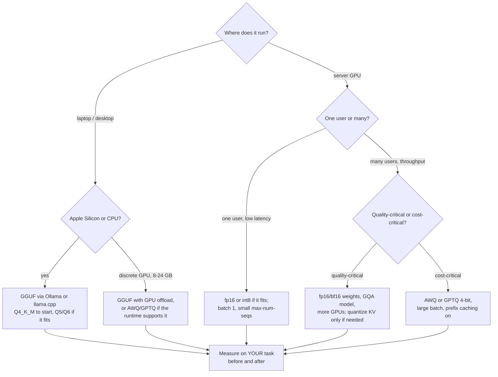

# 27.4 Quantization and deployment

Every section of this chapter has ended at the same wall: memory. The KV
cache does not fit, the batch cannot grow, the model does not load. Sections
27.1–27.3 attacked that wall by using memory more cleverly. This section
attacks the numbers themselves. A weight stored in 16 bits and the same
weight stored in 4 bits are the same weight to three significant figures —
and one of them is a quarter the size. **Quantization** is that trade, made
deliberately and measured honestly, and it is the single technique that puts
a 70-billion-parameter model on a machine you own. We will build a real
quantizer in numpy, measure exactly what it costs, and then map the format
landscape you will actually meet: GGUF, GPTQ, AWQ, NF4.

!!! abstract "In plain words"

    - **What it is.** Quantization stores each of the model's numbers using
      fewer bits — say 4 instead of 16 — accepting a little rounding error to
      make the model a fraction of its size.
    - **Picture it.** Writing every price on a menu as a whole dollar instead of
      dollars-and-cents: "$3" instead of "$2.99" takes less room and is close
      enough to shop with. You have thrown away the digits past the point where
      they changed your decision.
    - **Why it matters.** A model's size is how many numbers it has times how
      many bits each takes, so halving the bits halves the memory — and that is
      what moves a 70-billion-parameter model off a rack of datacenter GPUs and
      onto a machine you own. The price is precision, and the rest of this
      section measures exactly how much.

## Numbers have a price list

[Section 0.2](../ch00-machine/02-binary.md) established that everything in a
computer is bits, and [Section 5.1](../ch05-under-the-hood/01-numeric-pitfalls.md)
showed what happens when a number does not fit the bits allotted to it:
overflow at the top, silent underflow at the bottom, and rounding error
everywhere in between. A floating-point format spends its bits on three
things:

- one **sign** bit;
- some **exponent** bits, which set the *range*;
- some **mantissa** bits, which set the *precision*.

**How you split the budget matters more than the total.**

| Format | Bits | sign / exp / mantissa | Largest finite | Decimal digits | Where it is used |
| --- | --- | --- | --- | --- | --- |
| fp32 | 32 | 1 / 8 / 23 | $3.4 \times 10^{38}$ | ~7 | reference, master weights |
| fp16 | 16 | 1 / 5 / 10 | 65,504 | ~3 | inference; training needs loss scaling |
| bf16 | 16 | 1 / 8 / 7 | $3.4 \times 10^{38}$ | ~2 | the modern default for training |
| int8 | 8 | integer + a shared scale | $127 \times s$ | — | inference weights, sometimes activations |
| int4 | 4 | integer + a per-group scale | $7 \times s$ | — | laptop-scale inference |

The fp16-versus-bf16 row is the interesting one, and you can watch the
difference. Numpy has no bfloat16 type, but bf16 *is* an fp32 with 16 bits of
mantissa chopped off, so we can build it from bit operations:

```python
import numpy as np

def to_bf16(x):
    """Round float32 to bfloat16 precision: keep the top 16 bits, round to nearest."""
    x32 = np.asarray(x, dtype=np.float32)
    bits = x32.view(np.uint32)
    rounded = (bits + np.uint32(0x7FFF) + ((bits >> np.uint32(16)) & np.uint32(1)))
    return (rounded & np.uint32(0xFFFF0000)).view(np.float32)

values = np.array([1e-8, 3.14159265, 65000.0, 1e5, 1e38], dtype=np.float32)
print(f"{'value':>14}{'as fp16':>14}{'as bf16':>16}")
with np.errstate(over="ignore"):          # we WANT to see the overflows
    for v in values:
        f16 = np.float16(v)
        b16 = float(to_bf16(np.array([v], dtype=np.float32))[0])
        print(f"{float(v):>14.6g}{float(f16):>14.6g}{b16:>16.6g}")

print(f"\nfp16 range : {np.finfo(np.float16).tiny:.3g} .. {np.finfo(np.float16).max:.0f}")
print(f"bf16 range : same exponent field as fp32, so up to "
      f"{np.finfo(np.float32).max:.3g}")
print("\nfp16 keeps 10 mantissa bits (more precision), bf16 keeps 7 (more range).")
```

Three of those five values break fp16 outright, because fp16's five exponent
bits only reach 65,504:

- **$10^{-8}$** flushes to zero.
- **$10^{5}$** overflows to infinity.
- **$10^{38}$** overflows to infinity.

bf16 handles all three. The price is precision: $\pi$ comes back as 3.14062 in
both formats, but 65,000 returns as 64,992 in fp16 and 65,024 in bf16 — the
coarser 7-bit mantissa showing.

Gradients during training are frequently tiny, so *range* matters more than
precision there. That is why bf16 became the training default, and why fp16
training needs the extra machinery of loss scaling.

## Quantizing to int8: the whole idea in four lines

Integer quantization drops floating point entirely. Four steps:

1. Take a block of weights.
2. Find the largest magnitude in the block.
3. Pick a **scale** $s$ that maps that maximum onto the largest representable
   integer.
4. Round every weight to a small integer — and recover the original by
   multiplying back.

$$
s = \frac{\max_i |w_i|}{q_{\max}}, \qquad
q_i = \operatorname{round}\!\left(\frac{w_i}{s}\right), \qquad
\hat{w}_i = q_i \, s
$$

Read aloud: pick a scale $s$ so the block's largest-magnitude weight maps onto
the biggest storable integer $q_{\max}$; turn each weight $w_i$ into the nearest
integer $q_i$ by dividing by $s$ and rounding; and recover an approximate weight
$\hat{w}_i$ by multiplying that integer back by $s$.

With $q_{\max} = 127$ for signed 8-bit and $7$ for signed 4-bit. This is
**symmetric absmax** quantization — the simplest scheme that works, and the
core of every scheme that works better.

```python
import numpy as np

def quantize(w, bits, group):
    """Symmetric absmax quantization with one scale per `group` weights."""
    q_max = 2 ** (bits - 1) - 1                    # 127 for int8, 7 for int4
    g = w.reshape(-1, group)
    scales = np.abs(g).max(axis=1, keepdims=True) / q_max
    scales = np.where(scales == 0.0, 1e-12, scales)
    q = np.clip(np.round(g / scales), -q_max, q_max)
    return q, scales

def dequantize(q, scales, shape):
    return (q * scales).reshape(shape).astype(np.float32)

rng = np.random.default_rng(0)
W = rng.normal(0, 0.02, size=4096).astype(np.float32)     # a slice of one layer
W[[17, 900, 3111]] = [0.55, -0.61, 0.48]                  # three outlier weights

hdr = (f"{'scheme':<22}{'bits/weight':>12}{'bytes':>8}{'RMSE':>11}"
       f"{'rel. error':>12}{'vs fp32':>9}")
print(hdr)
print("-" * len(hdr))
fp32_bytes = W.nbytes
for label, bits, group in [("fp16 (no integers)", 16, 4096),
                           ("int8, one scale", 8, 4096),
                           ("int8, group 128", 8, 128),
                           ("int4, one scale", 4, 4096),
                           ("int4, group 128", 4, 128),
                           ("int4, group 32", 4, 32)]:
    if bits == 16:
        approx = W.astype(np.float16).astype(np.float32)
        eff_bits, nbytes = 16.0, W.size * 2
    else:
        q, scales = quantize(W, bits, group)
        approx = dequantize(q, scales, W.shape)
        eff_bits = bits + 16 / group               # the fp16 scales cost bits too
        nbytes = int(W.size * eff_bits / 8)
    rmse = float(np.sqrt(np.mean((W - approx) ** 2)))
    rel = float(np.linalg.norm(W - approx) / np.linalg.norm(W))
    print(f"{label:<22}{eff_bits:>12.2f}{nbytes:>8,}{rmse:>11.3e}"
          f"{100 * rel:>11.2f}%{fp32_bytes / nbytes:>8.1f}x")
```

Three lessons fall out of that table.

**Outliers are the enemy, and grouping is the answer.** Our three planted
outliers are about 25× a typical weight — a real phenomenon in transformer
layers, not a contrivance. With a single scale for the whole tensor they drag
the step size up until ordinary weights round to a handful of levels: int8
lands at 5.60% relative error and int4 at a hopeless **76.93%**. Give each
block of 128 weights its own scale and the damage is confined to the block
that contains the outlier — int8 falls to 1.58%, int4 to 24.06%, and groups
of 32 take int4 to 13.04%. That is the entire reason every real low-bit
format is a *block* format.

**Even done well, 4 bits is genuinely lossy.** Notice that no amount of
grouping gets int4 near int8. With 15 usable levels the rounding step is
large, and roughly 10% relative error in the weights is the floor for uniform
4-bit rounding — that is arithmetic, not a bad implementation. The remarkable
empirical fact of this field is that trained networks tolerate it anyway. Do
not confuse *weight-space* error with *task* error: they are related, but a
13% perturbation of the weights does not cost 13% of the accuracy.

**The scales are not free.** One fp16 scale per group of 32 adds 0.5 bits to
every weight, so "4-bit, group 32" is really 4.5 bits per weight — the
`bits/weight` column keeps that honest. Real formats add a zero-point too.
When you see a 4-bit file noticeably larger than $\text{params}/2$ bytes,
this is why.

Absmax rounding has one more property worth measuring, because it explains
why the scheme survives at all: the error is a *fixed absolute size*, so the
large weights that dominate every dot product are hurt proportionally far
less than the small ones.

```python
# continues
q, scales = quantize(W, 4, 128)
W_hat = dequantize(q, scales, W.shape)

order = np.argsort(-np.abs(W))
top, bottom = order[:410], order[2048:]          # largest 10%, smallest half

def rel(idx):
    return 100 * np.linalg.norm(W[idx] - W_hat[idx]) / np.linalg.norm(W[idx])

print(f"int4 group 128, relative error on ...")
print(f"  the 10% largest-magnitude weights : {rel(top):>6.2f}%")
print(f"  the smallest half of the weights  : {rel(bottom):>6.2f}%")
print(f"  every weight                      : {rel(np.arange(W.size)):>6.2f}%")
cos = float(W @ W_hat / (np.linalg.norm(W) * np.linalg.norm(W_hat)))
print(f"\ncosine similarity W vs W_hat: {cos:.4f} "
      f"(angle {np.degrees(np.arccos(cos)):.1f} degrees)")
```

The tensor's overall 24.06% error splits very unevenly: **15.62%** on the
10% largest weights and **42.47%** on the smallest half. The weights that
dominate every dot product are the ones reproduced most faithfully, and the
tensor as a whole still points within 13.8 degrees of its original direction
(cosine similarity 0.9711). Methods like **AWQ** and **GPTQ**, below, are
refinements of exactly this observation: spend your limited precision where
it changes the model's behaviour most.

Sweep the group size and the tradeoff becomes a curve:

```python
# continues
import matplotlib.pyplot as plt

groups = [4096, 1024, 256, 128, 64, 32, 16]
errors, bits_per_weight = [], []
for g in groups:
    q, scales = quantize(W, 4, g)
    approx = dequantize(q, scales, W.shape)
    errors.append(100 * float(np.linalg.norm(W - approx) / np.linalg.norm(W)))
    bits_per_weight.append(4 + 16 / g)

for g, e, b in zip(groups, errors, bits_per_weight):
    print(f"int4, group {g:>5}: {e:>6.2f}% relative error, {b:>5.2f} bits/weight")

fig, ax = plt.subplots(figsize=(6.5, 3.8))
ax.plot(bits_per_weight, errors, marker="o")
for g, e, b in zip(groups, errors, bits_per_weight):
    ax.annotate(f"g={g}", (b, e), textcoords="offset points", xytext=(6, 4),
                fontsize=8)
ax.set_xlabel("effective bits per weight (4 + 16/group)")
ax.set_ylabel("relative reconstruction error (%)")
ax.set_title("Smaller groups cost bits and buy accuracy")
fig.tight_layout()
```

Diminishing returns set in fast:

- **One scale → groups of 128** costs 0.12 bits per weight and removes 69% of
  the error (76.93% → 24.06%).
- **Groups of 128 → groups of 32** costs another 0.38 bits and removes another
  11 percentage points.
- **Groups of 32 → groups of 16** costs 0.5 bits more and buys under 3.

Group sizes of 32–128 are the industry choice for exactly this reason.

!!! note "What is toy, what is faithful"
    Toy: 4096 weights instead of billions, one tensor instead of a whole
    model, and outliers injected by hand. Faithful: the absmax formula, the
    grouping, the round-and-clip, the bit accounting, and the shape of the
    error curve. Production quantizers add calibration data, per-channel
    scales, and outlier handling — improvements *on top of* this code, not
    replacements for it.

## What fits on your machine

Now put weights and KV cache together and answer the practical question. The
weight footprint is simply parameters × bits ÷ 8; the KV cache is Section
27.1's formula; and you need roughly 1–2 GB of headroom for activations and
the runtime.

```python
GB = 1e9
OVERHEAD_GB = 1.5                       # activations, workspace, runtime

MODELS = [                              # (name, params, layers, KV heads, d_head)
    ("7B  (MHA)", 7.0e9, 32, 32, 128),
    ("13B (MHA)", 13.0e9, 40, 40, 128),
    ("70B (GQA-8)", 70.0e9, 80, 8, 128),
]
PRECISIONS = [("fp16", 16.0), ("int8", 8.125), ("int4", 4.5)]   # effective bits
CTX, BATCH = 4096, 1

def kv_gb(layers, kv_heads, d_head, tokens, batch=1, bytes_per=2):
    return 2 * layers * kv_heads * d_head * tokens * batch * bytes_per / GB

hdr = (f"{'model':<12}{'precision':>10}{'weights GB':>12}{'KV 4k GB':>10}"
       f"{'total GB':>10}   fits in ...")
print(hdr)
print("-" * len(hdr))
for name, params, L, H, dh in MODELS:
    kv = kv_gb(L, H, dh, CTX, BATCH)
    for prec, bits in PRECISIONS:
        w = params * bits / 8 / GB
        total = w + kv + OVERHEAD_GB
        fits = [c for c, cap in [("8GB", 8), ("16GB", 16), ("24GB", 24),
                                 ("48GB", 48), ("80GB", 80)] if total <= cap]
        print(f"{name:<12}{prec:>10}{w:>12.1f}{kv:>10.2f}{total:>10.1f}   "
              f"{(fits[0] + ' and up') if fits else 'nothing on this list':<20}")
    print()

print("Rules of thumb this table encodes:")
print(f"  fp16 GB  ~= params / 5e8   (7B -> {7e9 / 5e8:.0f} GB)")
print(f"  int4 GB  ~= params / 1.8e9 (70B -> {70e9 / 1.8e9:.0f} GB)")
print(f"  KV at 4k: {kv_gb(32, 32, 128, 4096):.2f} GB for a 7B MHA model, "
      f"{kv_gb(80, 8, 128, 4096):.2f} GB for a 70B GQA model")
```

This is the table to keep. Read the two extreme rows:

- **7B**: 14.0 GB of weights in fp16 and 17.6 GB all-in, which misses a 16 GB
  card. At int8 it is 10.8 GB all-in and fits comfortably; at int4 it fits in
  8 GB.
- **70B**: 142.8 GB in fp16, meaning several GPUs. At int4 it needs 42.2 GB —
  a single 48 GB card, or a well-specified laptop with unified memory.

That last line is why 4-bit quantization matters so much: **it moves a
frontier-class open model from *datacenter* to *desk*.**

Watch the KV column too. For the 7B MHA model it is 2.15 GB at a 4k context —
comparable to the entire int4 weight footprint — and it scales linearly with
context and batch. Quantizing weights without also planning KV memory is how
people fit a model and then immediately run out of room to use it.

## The format landscape

You will rarely quantize a model yourself. You will download one that someone
already quantized, in one of four ecosystems. They differ in *when* the
quantization happens and *what* it optimises:

| Format | Where it runs | How it works | Best for |
| --- | --- | --- | --- |
| **GGUF** | llama.cpp, Ollama, LM Studio | a single self-contained file; **k-quants** (`Q4_K_M`, `Q5_K_M`, …) mix block sizes and give more bits to the layers that need them; runs on CPU, GPU, or a split of both | laptops and desktops, CPU or Apple Silicon, offline single-user use |
| **GPTQ** | GPU runtimes incl. vLLM | post-training: quantize layer by layer against a small calibration set, adjusting remaining weights to compensate for each rounding decision | 3–4 bit GPU serving where you can afford a calibration pass |
| **AWQ** | GPU runtimes incl. vLLM | activation-aware: identify the small fraction of weight channels that matter most to the activations, and protect them from aggressive rounding | 4-bit GPU serving; often better instruction-following retention than plain rounding |
| **bitsandbytes (NF4)** | PyTorch, Transformers | quantize on the fly at load time; NF4 is a 4-bit format whose levels are spaced for normally distributed weights; the basis of **QLoRA** fine-tuning | quick experiments and fine-tuning quantized models, no offline step |

Two clarifications save a lot of confusion:

- **GGUF is a *container format* as well as a quantization family.** The same
  file holds the weights, the tokenizer, and the metadata, which is why
  `ollama run` needs nothing else.
- **GPTQ and AWQ are algorithms for *choosing* the quantized values, not new
  number formats.** Both still end up storing small integers with per-group
  scales, exactly like the code above.

## What quality does it actually cost?

Honestly: it depends, and anyone quoting you a single universal number is
selling something. What is reliably true, as *direction*:

- **int8 weight quantization is close to free.** Differences on standard
  benchmarks are usually within run-to-run noise.
- **4-bit with modern methods (k-quants, AWQ, GPTQ) is a small but real
  loss.** Fine for chat, summarisation, and drafting; measurable on tasks
  with a single exact answer, and most visible on long multi-step reasoning
  and code where one wrong token derails everything after it.
- **Below 4 bits, quality falls off a cliff** — 3-bit is usable for some
  models and unusable for others, 2-bit generally is not worth it.
- **Bigger models tolerate quantization better.** Given a fixed memory
  budget, the larger model quantized usually beats the smaller model at full
  precision. From the table above, a 13B at int4 needs 12.2 GB all-in against
  a 7B at fp16's 17.6 GB — less memory, and better answers on most tasks.
  That is the most useful practical fact in this section.
- **Perplexity is a weak proxy.** A quantized model can show almost no
  perplexity change while losing noticeably on instruction-following or tool
  use. Evaluate on *your* task.

The frontier here moves. Formats, k-quant recipes, and the accuracy gap
between methods change release to release, so treat the ranking above as a
snapshot of current practice, not a permanent fact — and measure on your own
evaluation set before committing.

## Running one: Ollama and vLLM

Two commands cover most of what people actually do. **Ollama** wraps
llama.cpp and defaults to a 4-bit k-quant, which is why an 8B model downloads
as roughly 4.7 GB rather than 16 GB:

```console
$ ollama pull llama3.1:8b
$ ollama list
NAME           ID              SIZE      MODIFIED
llama3.1:8b    42182419e950    4.7 GB    2 minutes ago

$ ollama run llama3.1:8b "Explain a KV cache in two sentences."
```

Ollama also serves an HTTP API on `localhost:11434`, so the same model backs
a script or an application. It is the right tool for one user on one machine.

**vLLM** is the right tool for many users on a server, and it reads the
quantization configuration out of the model directory, so the flag is usually
optional:

```console
$ vllm serve <org>/<model>-AWQ --quantization awq --max-model-len 8192
INFO  Using AWQ 4-bit weights
INFO  Starting vLLM API server on http://0.0.0.0:8000
```

Two things to know:

- **Quantized weights shrink the *weights*, not the cache.** The KV cache is
  still fp16 unless you separately enable KV-cache quantization (an fp8 KV
  cache is supported in current versions and roughly halves it).
- **4-bit weights are not automatically faster.** They must be dequantized
  before the matrix multiply, so the win is memory first, and speed only
  insofar as decode is memory-bandwidth-bound — which, per Section 27.1, it
  is.

## Choosing: a decision flowchart



The last box is not decoration. Every arrow above is a hypothesis about your
workload; the only way to know whether 4-bit costs you anything that matters
is to run your own evaluation set through both and compare.

!!! warning "Common mistakes"

    - **Quantizing the weights and forgetting the KV cache.** A 4-bit 7B model
      is 3.9 GB of weights and can still need several GB of fp16 cache; at a
      long context the cache becomes the larger number.
    - **Expecting 4-bit to be 4× faster.** It is 4× smaller. Speed improves
      only because decode is bandwidth-bound; the dequantization work is real
      and at small batch sizes some kernels are *slower* than fp16.
    - **Using a single scale for a whole tensor at 4 bits.** The table above
      shows 76.93% error instead of 13.04% — three outlier weights out of
      4096 are enough to wreck it. Always use grouped/block quantization.
    - **Trusting perplexity alone.** It is insensitive to exactly the failures
      quantization causes: derailed multi-step reasoning, broken formatting,
      dropped tool calls.
    - **Comparing formats across different base models.** `model-A-Q4_K_M`
      versus `model-B-AWQ` tells you nothing about the formats. Fix the base
      model, change one variable.

## Check your understanding

1. Why does a single scale per tensor work acceptably at int8 but fail badly
   at int4?

    ??? success "Answer"
        The scale is set by the largest magnitude in the block, so the
        ordinary weights are squeezed into whatever levels remain. int8 has
        255 levels, so an outlier 25× larger than typical still leaves about
        thirty distinct levels for ordinary weights — degraded (5.60% error) but
        workable. int4 has 15 levels in total; the same outlier consumes the
        range and everything else collapses onto 0 and ±1, giving 76.93%
        error. Grouping fixes it by giving each block of 32–128 weights its
        own scale, so an outlier can only damage its own block: 1.58% for
        int8 at group 128, 13.04% for int4 at group 32.

2. A 13B model in fp16 does not fit your 24 GB GPU. Compute what int8 and
   int4 would need, including a 4k KV cache, and say which you would choose.

    ??? success "Answer"
        From the table: fp16 is 26.0 GB of weights, int8 is 13.2 GB, int4 is
        7.3 GB; the 13B model's KV cache at 4k is 3.36 GB and overhead about
        1.5 GB. So int8 totals 18.1 GB — a comfortable fit in 24 GB with room
        to raise the context or the batch — and int4 totals 12.2 GB. Choose
        int8: it fits, and it costs essentially nothing in quality. Reach for
        int4 only when int8 does not fit or when you need the spare memory for
        a longer context.

3. Why did bf16 become the default for training while fp16 dominated
   inference earlier?

    ??? success "Answer"
        Both are 16 bits, but they split the budget differently. fp16 spends 5
        bits on the exponent, so its range stops at 65,504 and underflows
        below about $6 \times 10^{-5}$ — which is exactly where gradients
        live, hence loss scaling. bf16 keeps fp32's 8 exponent bits, so
        anything representable in fp32 is representable in bf16, at the cost
        of precision (7 mantissa bits). Training needs range; forward-pass
        inference, where activations are well-scaled, tolerates fp16's
        narrower range and benefits from its extra precision.

4. Someone reports that switching to 4-bit made their server "no faster" and
   concludes quantization is useless. What would you check?

    ??? success "Answer"
        Whether the batch size changed. Quantization buys *memory*, and memory
        buys a bigger batch or a longer context — but only if you then raise
        the limits (`--max-num-seqs`, `--max-model-len`) to use the freed
        memory. At an unchanged batch of 1, the step is still bound by reading
        weights, and dequantization overhead can cancel the smaller read.
        The win shows up as more concurrent users at the same latency, which
        is exactly the tradeoff curve of
        [Section 27.3](03-latency-streaming.md).
